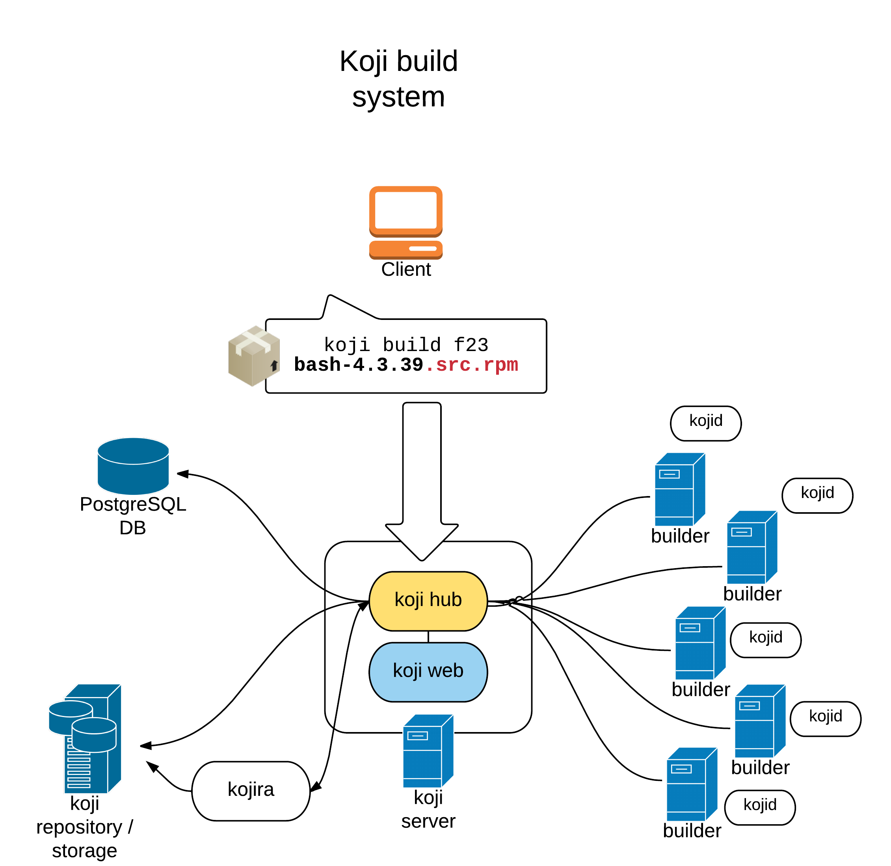

# koji学习


## 本仓库内容

1. koji学习笔记


```
Something I hope you know before go into the coding ~
First, please watch or star this repo, I'll be more happy if you follow me.
Bug report, questions and discussion are welcome, you can post an issue or pull a request.
```

## 相关站点

* 源码地址: <https://pagure.io/koji/>
* wiki: <https://fedoraproject.org/wiki/Infrastructure/Fedorahosted-retirement>

---

## 目录

* [koji使用](docs/koji使用.md)
    * [fedora官方koji编译平台](docs/fedora官方koji编译平台.md)
* [koji源码分析](docs/koji源码分析.md)
    * [目录结构](docs/koji源码分析/目录结构.md)

---


## 经典图示



---
