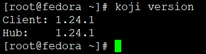
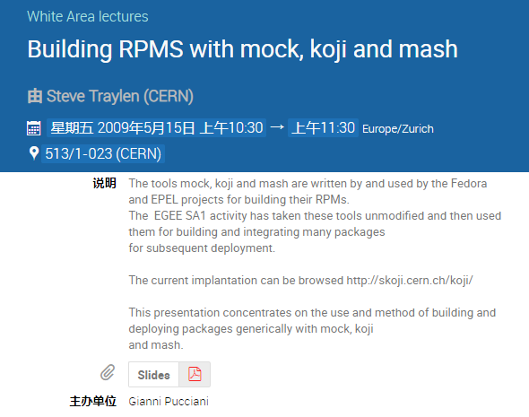
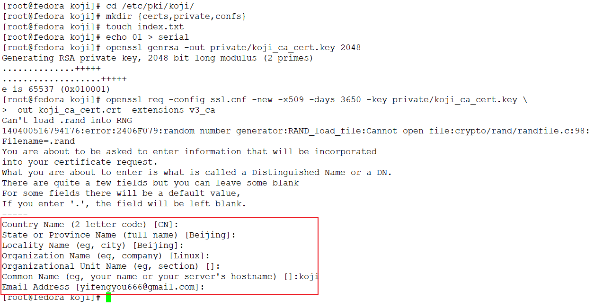
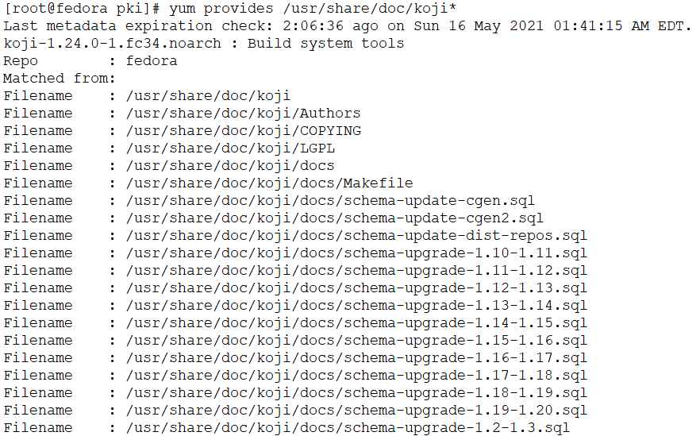
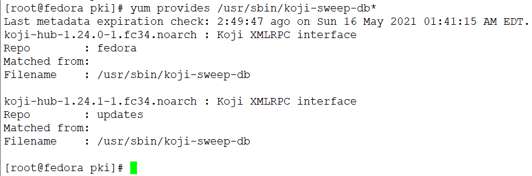
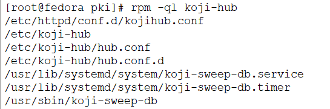
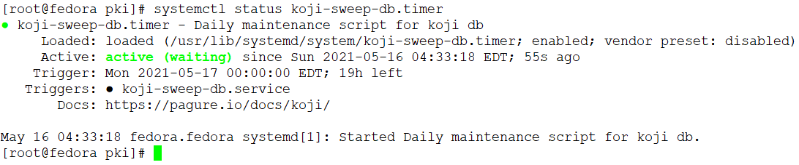
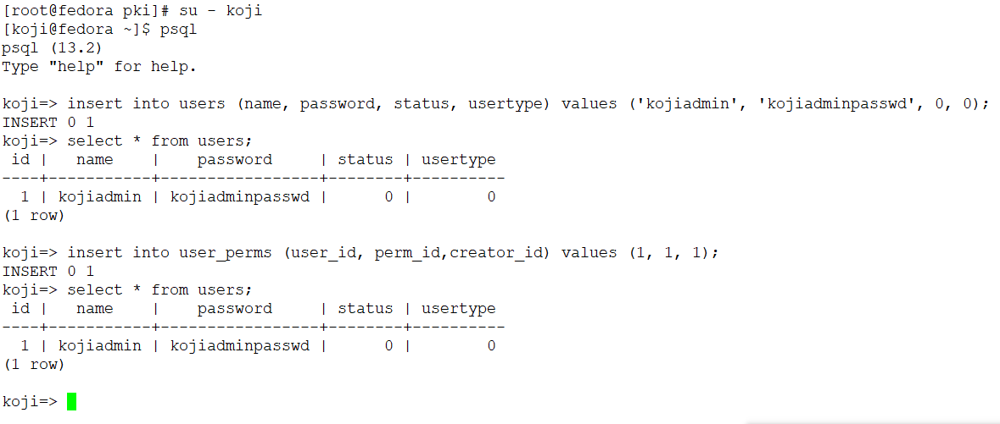
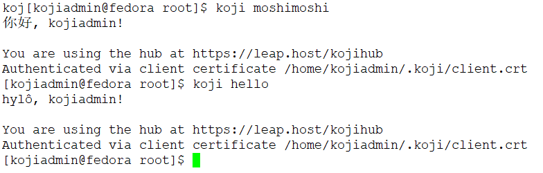

<!-- MDTOC maxdepth:6 firsth1:1 numbering:0 flatten:0 bullets:1 updateOnSave:1 -->

- [fedora 34 部署koji环境](#fedora-34-部署koji环境)   
   - [部署环境](#部署环境)   
- [Server How To 手把手教学koji服务端构建](#server-how-to-手把手教学koji服务端构建)   
   - [Setting Up a Koji Build System 说在前](#setting-up-a-koji-build-system-说在前)   
   - [Knowledge Prerequisites 基础知识要求](#knowledge-prerequisites-基础知识要求)   
   - [Package Prerequisites](#package-prerequisites)   
   - [On the server (koji-hub/koji-web)](#on-the-server-koji-hubkoji-web)   
   - [On the builder (koji-builder)](#on-the-builder-koji-builder)   
   - [A note on filesystem space 关于存储空间的注意事项](#a-note-on-filesystem-space-关于存储空间的注意事项)   
   - [Koji Authentication Selection Koji鉴权方式](#koji-authentication-selection-koji鉴权方式)   
   - [Setting up SSL Certificates for authentication 配置SSL鉴权证书](#setting-up-ssl-certificates-for-authentication-配置ssl鉴权证书)   
      - [Certificate generation - 创建ssl.cnf配置文件](#certificate-generation-创建sslcnf配置文件)   
      - [Generate CA 创建CA认证中心](#generate-ca-创建ca认证中心)   
      - [Generate the koji component certificates and the admin certificate 生成组件及管理员的证书](#generate-the-koji-component-certificates-and-the-admin-certificate-生成组件及管理员的证书)   
      - [Generate a PKCS12 user certificate (for web browser)](#generate-a-pkcs12-user-certificate-for-web-browser)   
      - [Copy certificates into ~/.koji for kojiadmin](#copy-certificates-into-koji-for-kojiadmin)   
   - [Setting up Kerberos for authentication](#setting-up-kerberos-for-authentication)   
   - [DNS](#dns)   
   - [Principals and Keytabs 主体和关键标签](#principals-and-keytabs-主体和关键标签)   
   - [PostgreSQL Server](#postgresql-server)   
      - [Configuration Files](#configuration-files)   
      - [Install PostgreSQL](#install-postgresql)   
      - [Initialize PostgreSQL DB](#initialize-postgresql-db)   
      - [Setup User Accounts](#setup-user-accounts)   
      - [Setup PostgreSQL and populate schema](#setup-postgresql-and-populate-schema)   
   - [Authorize Koji-hub to PostgreSQL](#authorize-koji-hub-to-postgresql)   
   - [Bootstrapping the initial koji admin user into the PostgreSQL database](#bootstrapping-the-initial-koji-admin-user-into-the-postgresql-database)   
   - [Maintaining database](#maintaining-database)   
- [Koji Hub](#koji-hub)   
   - [Configuration Files](#configuration-files)   
   - [Install koji-hub](#install-koji-hub)   
   - [Required Configuration](#required-configuration)   
   - [Authentication Configuration](#authentication-configuration)   
- [Koji cli - The standard client](#koji-cli-the-standard-client)   
- [Koji Web - Interface for the Masses](#koji-web-interface-for-the-masses)   
   - [Configuration Files](#configuration-files)   
   - [Install Koji-Web](#install-koji-web)   
   - [Required Configuration](#required-configuration)   
   - [Filesystem Configuration](#filesystem-configuration)   
   - [Web interface now operational](#web-interface-now-operational)   
- [Koji Daemon - Builder](#koji-daemon-builder)   
   - [Configuration Files](#configuration-files)   
   - [Install kojid](#install-kojid)   
   - [Required Configuration](#required-configuration)   
   - [Authentication Configuration (SSL certificates)](#authentication-configuration-ssl-certificates)   
   - [Authentication Configuration (Kerberos)](#authentication-configuration-kerberos)   
   - [Source Control Configuration](#source-control-configuration)   
   - [Add the host to the createrepo channel](#add-the-host-to-the-createrepo-channel)   
   - [A note on capacity](#a-note-on-capacity)   
   - [Start Kojid](#start-kojid)   
- [Kojira - Dnf|Yum repository creation and maintenance](#kojira-dnfyum-repository-creation-and-maintenance)   
   - [Configuration Files](#configuration-files)   
   - [Install kojira](#install-kojira)   
   - [Required Configuration](#required-configuration)   
   - [Authentication Configuration](#authentication-configuration)   
   - [Start Kojira](#start-kojira)   
- [Bootstrapping the Koji build environment](#bootstrapping-the-koji-build-environment)   
- [Minutia and Miscellany](#minutia-and-miscellany)   

<!-- /MDTOC -->
# fedora 34 部署koji环境

* <https://docs.pagure.org/koji/server_howto/#>

**本章节完全参考官方文档，也就，翻译了一下下**

## 部署环境

* VMware
* Fedora 34



```
[root@fedora ~]# yum search  koji
Last metadata expiration check: 2:14:22 ago on Sat 15 May 2021 01:08:33 PM CST.
===================================================================================================== Name Exactly Matched: koji =====================================================================================================
koji.noarch : Build system tools
==================================================================================================== Name & Summary Matched: koji ====================================================================================================
ghc-koji.x86_64 : Koji buildsystem XML-RPC API bindings
ghc-koji-devel.x86_64 : Haskell koji library development files
ghc-koji-doc.noarch : Haskell koji library documentation
ghc-koji-prof.x86_64 : Haskell koji profiling library
koji-builder.noarch : Koji RPM builder daemon
koji-builder-plugin-rpmautospec.noarch : Koji plugin for generating RPM releases and changelogs
koji-builder-plugins.noarch : Koji builder plugins
koji-containerbuild.noarch : Koji support for building layered container images
koji-containerbuild-builder.noarch : Builder plugin that extend Koji to build layered container images
koji-containerbuild-hub.noarch : Hub plugin that extend Koji to build layered container images
koji-hub.noarch : Koji XMLRPC interface
koji-hub-plugin-rpmautospec.noarch : Koji plugin for tagging successful builds in dist-git
koji-hub-plugins.noarch : Koji hub plugins
koji-osbuild.noarch : Koji integration for osbuild composer
koji-osbuild-builder.noarch : Koji hub plugin for osbuild composer integration
koji-osbuild-cli.noarch : Koji client plugin for osbuild composer integration
koji-osbuild-hub.noarch : Koji hub plugin for osbuild composer integration
koji-utils.noarch : Koji Utilities
koji-vm.noarch : Koji virtual machine management daemon
koji-web.noarch : Koji Web UI
python3-atomic-reactor-koji.noarch : Koji plugin for Atomic Reactor
python3-koji-cli-plugins.noarch : Koji client plugins
python3-koji-containerbuild-cli.noarch : CLI that communicates with Koji to control building layered container images
python3-koji-hub.noarch : Koji XMLRPC interface
python3-koji-hub-plugins.noarch : Koji hub plugins
python3-koji-web.noarch : Koji Web UI
========================================================================================================= Name Matched: koji =========================================================================================================
python3-koji.noarch : Build system tools python library
======================================================================================================= Summary Matched: koji ========================================================================================================
rpmgrill.noarch : A utility for catching problems in koji builds
ursa-major.noarch : A utility for working with module's koji tags in koji's tag inheritance.
ursa-major-stage.noarch : A utility for working with module's koji tags in koji's tag inheritance.
[root@fedora ~]#
```

# Server How To 手把手教学koji服务端构建


## Setting Up a Koji Build System 说在前

The Koji components may **live** on separate resources as long as all resources
are able to communicate. This document will cover how to setup each service
individually, however, all services may **live** on the same resource.

完整的Koji服务包含很多组件，各个组件可以独立部署，组件之间相互通信完成有机功能。除了集群部署，当然也支持单机部署玩耍。

## Knowledge Prerequisites 基础知识要求

* Basic understanding of SSL and authentication via certificates and/or
  Kerberos credentials
* Basic knowledge about creating a database in PostgreSQL and importing a schema
* Working with psql
* Basic knowledge about Apache configuration
* Basic knowledge about `dnf`_/`yum`_/`createrepo`_/`mock`_ - else you'll not
  be able to debug problems!
* Basic knowledge about using command line
* Basic knowledge about RPM building
* Simple usage of the Koji client

For an overview of yum, mock, Koji (and all its subcomponents), mash, and how
they all work together, see the excellent slides put together by
`Steve Traylen` at CERN  <http://indico.cern.ch/event/55091>

* 了解SSL以及通过证书、Kerberos凭证进行身份验证   
* 了解PostgreSQL数据库创建和数据导入
* 了解psql命令及操作
* 了解Apache Web服务配置
* 掌握dnf、yum、createrepo、mock命令使用及常见问题解决
* 精通命令行使用
* 了解Koji客户端常规使用

有关yum、mock、koji、mash的使用，有个2009年的讲座PPT供参考，
放在本仓库```reference/MockKojiMash.pdf```



## Package Prerequisites


On the server (koji-hub/koji-web)
---------------------------------

* httpd
* mod_ssl
* postgresql-server
* mod_wsgi

```
yum install -y httpd mod_ssl postgresql-server mod_wsgi
```

On the builder (koji-builder)
-----------------------------
* mock
* util-linux[need setarch] (for some archs you'll require a patched version)
* rpm-build
* createrepo

```
yum install -y mock util-linux rpm-build createrepo
```


## A note on filesystem space 关于存储空间的注意事项

```
Koji will consume copious amounts of disk space under the primary KojiDir
directory (as set in the kojihub.conf file - defaults to ``/mnt/koji``).
However, as koji makes use of mock on the backend to actually create build
roots and perform the builds in those build roots, it might come to a surprise
to users that a running koji server will consume large amounts of disk space
under ```/var/lib/mock``` and ```/var/cache/mock``` as well. Users should either
plan the disk and filesystem allocations for this, or plan to modify the
default mock build directory in the kojid.conf file. If you change the
location, ensure that the new directories are owned by the group "mock" and
have 02755 permission.
```

* Koji Hub 会占用较大的磁盘空间，主要占用是在KojiDir目录，在kojihub.conf配置，默认是/mnt/koji
* Koji builder会使用```/var/lib/mock```和```/var/cache/mock```创建mini rootfs基础构建环境，会有一定磁盘开销，尤其是并行执行构建时候将会存在多个构建环境，因此务必确保这两个目录容量足够。一方面可以使用软链到其他大容量磁盘，也可以修改kojid.conf配置直接指定其他路径。不管怎样都要保证目录属组为mock并且具备02755的目录权限。
* Koji编译依赖于mock，因此构建机mock也需要配置妥当，权限足够。

```
# $USER 为普通用户，一般为命名为mockbuild用户
sudo /usr/sbin/usermod -a -G mock $USER
```


## Koji Authentication Selection Koji鉴权方式

```
Koji primarily supports Kerberos and SSL Certificate authentication. For basic
koji command line access, plain user/pass combinations are possible.  However,
kojiweb does **not** support plain user/pass authentication and once either
Kerberos or SSL Certificate authentication is enabled for kojiweb, the plain
user/pass method will stop working entirely.  For this reason we encourage
skipping the plain user/pass method altogether and properly configuring either
Kerberos or SSL Certification authentication from the start.
```

Koji主要支持Kerberos和SSL鉴权，部分命令行可以通过账户密码访问，但是如果一旦配置了Kerberos或SSL，那么明文方式将无法使用。当然不鼓励使用明文，毕竟有安全问题。

```
The decision on how to authenticate users will affect all other actions you
take in setting up koji. For this reason it is a decision best made up front.
```

选取不同的鉴权方式，后续部署肯定配套

```
For Kerberos authentication
    a working Kerberos environment (the user is assumed to either already have
    this or know how to set it up themselves, instructions for it are not
    included here) and the Kerberos credentials of the initial admin user will
    be necessary to bootstrap the user database.
```

* Kerberos是对称秘钥体系，该认证过程的实现不依赖于主机操作系统的认证，无需基于主机地址的信任，不要求网络上所有主机的物理安全，并假定网络上传送的数据包可以被任意地读取、修改和插入数据。
* 需要配置管理员以方便后续操作数据库管理用户


```
For SSL authentication
    SSL certificates for the xmlrpc server, for the various koji components,
    and one for the admin user will need to be setup (the user need not know
    how to create certificate chains already, we include the instructions for
    this below).
```

* 用于xmlrpc服务之间通信
* 需要配置管理员

## Setting up SSL Certificates for authentication 配置SSL鉴权证书


### Certificate generation - 创建ssl.cnf配置文件

```
Create the ``/etc/pki/koji`` directory and copy-and-paste the ssl.cnf listed
here, and save it in the new directory. This configuration file is used along
with the ``openssl`` command to generate the SSL certificates for the various
koji components.
```

创建目录

```mkdir -p /etc/pki/koji && cd /etc/pki/koji```

然后拷贝下方内容写入ssl.cnf配置文件并保存，之后，执行openssl命令使用该配置文件生成SSL证书用于Koji各个组件之间通信鉴权。

/etc/pki/koji/ssl.cnf

```
HOME                    = .
RANDFILE                = .rand

[ca]
default_ca              = ca_default

[ca_default]
dir                     = .
certs                   = $dir/certs
crl_dir                 = $dir/crl
database                = $dir/index.txt
new_certs_dir           = $dir/newcerts
certificate             = $dir/%s_ca_cert.pem
private_key             = $dir/private/%s_ca_key.pem
serial                  = $dir/serial
crl                     = $dir/crl.pem
x509_extensions         = usr_cert
name_opt                = ca_default
cert_opt                = ca_default
default_days            = 3650
default_crl_days        = 30
default_md              = sha256
preserve                = no
policy                  = policy_match

[policy_match]
countryName             = match
stateOrProvinceName     = match
organizationName        = match
organizationalUnitName  = optional
commonName              = supplied
emailAddress            = optional

[req]
default_bits            = 2048
default_keyfile         = privkey.pem
default_md              = sha256
distinguished_name      = req_distinguished_name
attributes              = req_attributes
x509_extensions         = v3_ca # The extensions to add to the self signed cert
string_mask             = MASK:0x2002

[req_distinguished_name]
countryName                     = Country Name (2 letter code)
countryName_default             = CN
countryName_min                 = 2
countryName_max                 = 2
stateOrProvinceName             = State or Province Name (full name)
stateOrProvinceName_default     = Beijing
localityName                    = Locality Name (eg, city)
localityName_default            = Beijing
0.organizationName              = Organization Name (eg, company)
0.organizationName_default      = Linux
organizationalUnitName          = Organizational Unit Name (eg, section)
commonName                      = Common Name (eg, your name or your server\'s hostname)
commonName_max                  = 64
emailAddress                    = Email Address
emailAddress_default            = yifengyou666@gmail.com
emailAddress_max                = 64

[req_attributes]
challengePassword               = A challenge password
challengePassword_min           = 4
challengePassword_max           = 20
unstructuredName                = An optional company name

[usr_cert]
basicConstraints                = CA:FALSE
nsComment                       = "OpenSSL Generated Certificate"
subjectKeyIdentifier            = hash
authorityKeyIdentifier          = keyid,issuer:always

[v3_ca]
subjectKeyIdentifier            = hash
authorityKeyIdentifier          = keyid:always,issuer:always
basicConstraints                = CA:true
```

避坑：default_md千万不要配置成md5，不然后面会报下列错误，md5安全性太低！

```
SSL Library Error: error:140AB18E:SSL routines:SSL_CTX_use_certificate:ca md too weak
```

```
Although it is not required, it is recommended that you edit the default values
in the ``[req_distinguished_name]`` section of the configuration to match the
information for your own server. This will allow you to accept most of the
default values when generating certificates later. The other sections can be
left unedited.
```

不强制，但是还是建议调整一下```[req_distinguished_name]```节中部分字段，其中包含XXX_default的键值对其实就是XXX的默认值，配置后可以偷懒，以为后续可能要为不同角色生成签名，都会挨个问一遍这些问题，所以可以根据是需要修改一下。

### Generate CA 创建CA认证中心

```
The CA is the Certificate Authority.  It's the key/cert pair used to sign all
the other certificate requests.  When configuring the various koji components,
both the client CA and the server CA will be a copy of the CA generated here.
The CA certificate will be placed in the ``/etc/pki/koji`` directory and the
certificates for the other components will be placed in the
``/etc/pki/koji/certs`` directory. The ``index.txt`` file which is created is
a database of the certificates generated and can be used to view the
information for any of the certificates simply by viewing the contents of
``index.txt``.
```

* CA是证书颁发机构。这是用于对所有其他证书请求进行签名的密钥/证书对。
* 在配置各种koji组件时，客户端CA和服务器CA都是此处生成的CA的副本。
* CA证书将放置在/etc/pki/koji目录中，而其他组件的证书将放置在 /etc/pki/koji/certs目录中。
* index.txt创建的文件是所生成证书的数据库，可以通过简单地查看的内容来查看任何证书的信息 index.txt。

```
cd /etc/pki/koji/
mkdir {certs,private,confs}
touch index.txt
echo 01 > serial
openssl genrsa -out private/koji_ca_cert.key 2048
openssl rand -writerand .rand
openssl req -config ssl.cnf -new -x509 -days 3650 -key private/koji_ca_cert.key \
-out koji_ca_cert.crt -extensions v3_ca
```


可能会出现下列错误，所以在官网基础上增加一个命令```openssl rand -writerand .rand```就好了
```
Can't load .rand into RNG
140344156841792:error:2406F079:random number generator:RAND_load_file:Cannot open file:crypto/rand/randfile.c:98:Filename=.rand
```

```
The last command above will ask you to confirm a number of items about the
certificate you are generating. Presumably you already edited the defaults for
the country, state/province, locale, and organization in the ``ssl.cnf`` file
and you only needed to hit enter. It's the organizational unit and the common
name that we will be changing in the various certs we create. For the CA
itself, these fields don't have a hard requirement. One suggestion for this
certificate is to use the FQDN of the server.
```

* 最后一个命令会问你一些杂七杂八的问题，用户生成CA证书，如果配置了ssl.cnf，那么一些问题就有默认值，回车就好。这个证书必须妥善保管，完整路径：```/etc/pki/koji/private/koji_ca_cert.key```
* Organizational Unit Name 和 Common Name 这两个值还是需要根据目标不同做个调整为宜
* 对于CA本身，这些字段没有硬性要求。此证书的一个建议是使用服务器的域名(FQDN)。

```
If you are trying to automate this process via a configuration management
tool, you can create the cert in one command with a line like this:
```
如果你还想进一步偷懒，那么可以将参数放在命令行中作为参数，执行的时候就不会问那么多问题了。

```
cd /etc/pki/koji/
mkdir {certs,private,confs}
touch index.txt
echo 01 > serial
openssl genrsa -out private/koji_ca_cert.key 2048
openssl rand -writerand .rand
openssl req -config ssl.cnf -new -x509 -days 3650 -key private/koji_ca_cert.key \
	-subj "/C=CN/ST=Beijing/L=Beijing/O=koji/CN=koji.com" \
	-out koji_ca_cert.crt -extensions v3_ca
```


### Generate the koji component certificates and the admin certificate 生成组件及管理员的证书

```
Each koji component needs its own certificate to identify it. Two of the
certificates (kojihub and kojiweb) are used as server side certificates that
authenticate the server to the client. For this reason, you want the common
name on both of those certs to be the fully qualified domain name of the web
server they are running on so that clients don't complain about the common
name and the server not being the same. You can set the OU for these two
certificates to be kojihub and kojiweb for identification purposes.
```

* 每个独立组件都必须有证书，不然无法相互识别并通信
* 其中两个证书（kojihub和kojiweb）用作服务器端证书，用于向客户端验证服务器。
* 因此，您希望这两个证书上的公用名都是运行它们的Web服务器的完全限定域名(FQDN)，以便客户端不必抱怨公用名和服务器不相同。您可以将这两个证书的OU设置为kojihub和kojiweb以进行识别。
* 实验环境下，域名可以直接修改服务/客户端的```/etc/hosts```文件进行配置

```
For the other certificates (kojira, kojid, the initial admin account, and all
user certificates), the cert is used to authenticate the client to the server.
The common name for these certs should be set to the login name for that
specific component. For example the common name for the kojira cert should be
set to kojira so that it matches the username. The reason for this is that the
common name of the cert will be matched to the corresponding user name in the
koji database. If there is not a username in the database which matches the CN
of the cert the client will not be authenticated and access will be denied.
```

* 对于其他证书（kojira，kojid，初始admin帐户和所有用户证书），该证书用于向服务器验证客户端。
* 这些证书的通用名称应设置为该特定组件的登录名。例如，应将kojira证书的通用名称设置为kojira，以使其与用户名匹配。原因是证书的通用名称将与koji数据库中的相应用户名匹配。**如果数据库中没有与证书的CN匹配的用户名，则不会对客**户端进行身份验证，并且访问将被拒绝。

```
When you later use ``koji add-host`` to add a build machine into the koji
database, it creates a user account for that host even though the user account
doesn't appear in the user list.  The user account created must match the
common name of the certificate which that component uses to authenticate with
the server. When creating the kojiweb certificate, you'll want to remember
exactly what values you enter for each field as you'll have to regurgitate
those into the /etc/koji-hub/hub.conf file as the ProxyDNs entry.
```

* 后续执行```koji add-host ```向koji数据库添加构建机时，即使该用户帐户未出现在用户列表中，它也会为该主机创建一个用户帐户。
* 创建的用户帐户必须与该组件用来与服务器进行身份验证的证书的通用名称匹配。
* 创建kojiweb证书时，您将需要牢记为每个字段输入的值，因为必须将这些值重新输入到```/etc/koji-hub/hub.conf```文件中作为ProxyDNs条目。


```
When you need to create multiple certificates it may be convenient to create a
loop or a script like the on listed below and run the script to create the
certificates. You can simply adjust the number of kojibuilders and the name of
the admin account as you see fit. For much of this guide, the admin account is
called ``kojiadmin``.
```

* 当您需要创建多个证书时，可以用脚本来偷懒，脚本可以方便的批量创建证书（注意CN字段）
* 可以根据需要简单地调整kojibuilder的数量和管理员帐户的名称
* 后续管理员帐户将使用kojiadmin

```
#!/bin/bash
# if you change your certificate authority name to something else you will
# need to change the caname value to reflect the change.
caname=koji

# user is equal to parameter one or the first argument when you actually
# run the script
user=$1

openssl genrsa -out private/${user}.key 2048
cat ssl.cnf | sed 's/insert_hostname/'${user}'/'> ssl2.cnf
openssl req -config ssl2.cnf -new -nodes -out certs/${user}.csr -key private/${user}.key
openssl ca -config ssl2.cnf -keyfile private/${caname}_ca_cert.key -cert ${caname}_ca_cert.crt \
    -out certs/${user}.crt -outdir certs -infiles certs/${user}.csr
cat certs/${user}.crt private/${user}.key > ${user}.pem
mv ssl2.cnf confs/${user}-ssl.cnf
```

官方脚本其实也不够偷来，来个极致偷懒的脚本

```
export caname=koji
cat > /etc/pki/koji/confs/template << EOF
HOME                    = .
RANDFILE                = .rand

[ca]
default_ca              = ca_default

[ca_default]
dir                     = .
certs                   = \$dir/certs
crl_dir                 = \$dir/crl
database                = \$dir/index.txt
new_certs_dir           = \$dir/newcerts
certificate             = \$dir/%s_ca_cert.pem
private_key             = \$dir/private/%s_ca_key.pem
serial                  = \$dir/serial
crl                     = \$dir/crl.pem
x509_extensions         = usr_cert
name_opt                = ca_default
cert_opt                = ca_default
default_days            = 3650
default_crl_days        = 30
default_md              = sha256
preserve                = no
policy                  = policy_match

[policy_match]
countryName             = match
stateOrProvinceName     = match
organizationName        = match
organizationalUnitName  = optional
commonName              = supplied
emailAddress            = optional

[req]
default_bits            = 2048
default_keyfile         = privkey.pem
default_md              = sha256
distinguished_name      = req_distinguished_name
attributes              = req_attributes
x509_extensions         = v3_ca # The extensions to add to the self signed cert
string_mask             = MASK:0x2002

[req_distinguished_name]
countryName                     = Country Name (2 letter code)
countryName_default             = CN
countryName_min                 = 2
countryName_max                 = 2
stateOrProvinceName             = State or Province Name (full name)
stateOrProvinceName_default     = Beijing
localityName                    = Locality Name (eg, city)
localityName_default            = Beijing
organizationName                = Organization Name (eg, company)
organizationName_default        = Linux
organizationalUnitName          = Organizational Unit Name (eg, section)
organizationalUnitName_default  = insert_hostname
commonName                      = Common Name (eg, your name or your server\'s hostname)
commonName_max                  = 64
commonName_default              = insert_hostname
emailAddress                    = Email Address
emailAddress_default            = yifengyou666@gmail.com
emailAddress_max                = 64

[req_attributes]
challengePassword               = A challenge password
challengePassword_min           = 4
challengePassword_max           = 20
unstructuredName                = An optional company name

[usr_cert]
basicConstraints                = CA:FALSE
nsComment                       = "OpenSSL Generated Certificate"
subjectKeyIdentifier            = hash
authorityKeyIdentifier          = keyid,issuer:always

[v3_ca]
subjectKeyIdentifier            = hash
authorityKeyIdentifier          = keyid:always,issuer:always
basicConstraints                = CA:true
EOF

for user in kojira kojiweb kojihub kojibuilder{1..5};
do
    cat /etc/pki/koji/confs/template | sed 's/insert_hostname/'${user}'/'> ssl-${user}.cnf
    openssl genrsa -out certs/${user}.key 2048
    openssl req -config ssl-${user}.cnf -new -nodes \
	-subj "/C=CN/ST=Beijing/L=Beijing/O=koji/CN=${user}" \
	-out certs/${user}.csr \
	-key certs/${user}.key

    openssl ca -config ssl-${user}.cnf \
	-keyfile private/${caname}_ca_cert.key \
	-cert ${caname}_ca_cert.crt \
	-out certs/${user}.crt \
	-batch \
	-outdir certs -infiles certs/${user}.csr

    cat certs/${user}.crt certs/${user}.key > ${user}.pem
    mv ssl-${user}.cnf confs/
    echo "${user} certificate done!"
done
tree /etc/pki/koji

echo "All done!no error!"
```


### Generate a PKCS12 user certificate (for web browser)

This is only required for user certificates.

如果浏览器要登陆，那么这个证书不可获取

```
openssl pkcs12 -export -inkey private/${user}.key -in certs/${user}.crt \
    -CAfile ${caname}_ca_cert.crt -out certs/${user}_browser_cert.p12
```

紧接上面的脚本，当前阶段偷懒脚本可以这么写：

```
for user in kojiadmin kojiuser ;do
    cat /etc/pki/koji/confs/template | sed 's/insert_hostname/'${user}'/'> ssl-${user}.cnf
    openssl genrsa -out certs/${user}.key 2048
    openssl req -config ssl-${user}.cnf -new -nodes \
	-subj "/C=CN/ST=Beijing/L=Beijing/O=koji/CN=${user}" \
	-out certs/${user}.csr \
	-key certs/${user}.key

    openssl ca -config ssl-${user}.cnf \
	-keyfile private/${caname}_ca_cert.key \
	-cert ${caname}_ca_cert.crt \
	-out certs/${user}.crt \
	-batch \
	-outdir certs -infiles certs/${user}.csr
    cat certs/${user}.crt certs/${user}.key > ${user}.pem

    openssl pkcs12 -export \
	-inkey certs/${user}.key \
	-in certs/${user}.crt \
        -CAfile ${caname}_ca_cert.crt \
	-passout pass: \
	-out certs/${user}_browser_cert.p12

    mv ssl-${user}.cnf confs/
    echo "${user} certificate done!"
done
```

```
When generating certs for a user, the user will need the ``${user}.pem``, the
``${caname}_ca_cert.crt``, and the ``${user}_browser_cert.p12`` files which
were generated above.  The ${user}.pem file would normally be installed as
``~/.fedora.cert``, the ``${caname}_ca_cert.crt`` file would be installed as
both ``~/.fedora-upload-ca.cert`` and ``~/.fedora-server-ca.cert``, and the
user would import the ``${user}_brower_cert.p12`` into their web browser as a
personal certificate.
```

* 为用户生成证书时，用户将需要上面生成${user}.pem的 ${caname}_ca_cert.crt、${user}_browser_cert.p12文件。
* $ {user}.pem文件通常将安装为 ~/.fedora.cert，该${caname}_ca_cert.crt文件将同时安装为~/.fedora-upload-ca.cert和~/.fedora-server-ca.cert，并且用户会将${user}_brower_cert.p12其作为个人证书导入到其网络浏览器中。

### Copy certificates into ~/.koji for kojiadmin

```
You're going to want to be able to send admin commands to the kojihub. In order
to do so, you'll need to use the newly created certificates to authenticate
with the hub. Create the kojiadmin user then copy the certificates for the koji
CA and the kojiadmin user to ``~/.koji``:
```

* 为了实现对kojihub的远程控制，需要创建一个用户kojiadmin来作为管理员
* 创建kojiadmin用户，然后将koji CA和kojiadmin用户的证书复制到~/.koji

```
mkdir ~/.koji
cp /etc/pki/koji/kojiadmin.pem ~/.koji/client.crt   # NOTE: It is IMPORTANT you use the PEM and NOT the CRT
cp /etc/pki/koji/koji_ca_cert.crt ~/.koji/clientca.crt
cp /etc/pki/koji/koji_ca_cert.crt ~/.koji/serverca.crt
```

全自动偷懒脚本如下:

```
useradd kojiadmin || true
su - kojiadmin -c 'mkdir ~/.koji || true'
su - kojiadmin -c 'ls -alh ~/.koji'
su - kojiadmin -c 'cp -pv /etc/pki/koji/kojiadmin.pem ~/.koji/client.crt'
su - kojiadmin -c 'chown kojiadmin:kojiadmin ~/.koji/client.crt'
su - kojiadmin -c 'cp -pv /etc/pki/koji/koji_ca_cert.crt ~/.koji/clientca.crt'
su - kojiadmin -c 'chown kojiadmin:kojiadmin ~/.koji/clientca.crt'
su - kojiadmin -c 'cp -pv /etc/pki/koji/koji_ca_cert.crt ~/.koji/serverca.crt'
su - kojiadmin -c 'chown kojiadmin:kojiadmin ~/.koji/serverca.crt'
su - kojiadmin -c 'ls -alh ~/.koji'
```


```
note:
See /etc/koji.conf for the current system wide koji client configuration.
Copy /etc/koji.conf to ~/.koji/config if you wish to change the config on a
per user basis.
```

* 有关koji客户端配置，请参见/etc/koji.conf
* 如果您希望基于每个用户更改配置，请将/etc/koji.conf复制到~/.koji/config

## Setting up Kerberos for authentication

```
The initial configuration of a kerberos service is outside the scope of this
document, however there are a few specific things required by koji.
```

* kerberos服务的初始配置不在本文档的讨论范围之内
* 但是koji仍然用到，笔者偷懒？


## DNS

The koji builders (kojid) use DNS to find the kerberos servers for any given
realm.

```
_kerberos._udp    IN SRV  10 100 88 kerberos.EXAMPLE.COM.
```

```
The trailing dot denotes DNS root and is needed if FQDN is used.
```

* 没钱没资源要个锤子域名
* 直接修改/etc/hosts就好了


## Kerberos Principals and Keytabs 主体和关键标签

首先两个概念需要掌握

1. Kerberos下用户就是Principal
2. Keytab 就是一个包含了（若干）principals 和一个加密了的 principal key的文件，相当于保险箱

```
It should be noted that in general you will need to use the fully qualified
domain name of the hosts when generating the keytabs for services.

You will need the following principals extracted to a keytab for a fully
kerberized configuration, the requirement for a host key for the koji-hub is
currently hard coded into the koji client.
```

* 应该注意的是，通常在生成服务的密钥表时，需要使用主机的标准域名。
* 您需要将以下主体提取到keytab才能进行完全kerberized的配置，对于koji-hub的主机密钥的要求目前已硬编码到koji客户端中。
* 需要将下列角色添加到kerberos授权用户，koji服务组件之间通信使用的凭证是写死在组件中的，一般不会变动，所以前期就需要配置妥当。


**host/kojihub@EXAMPLE.COM**

```
Used by the koji-hub server when communicating with the koji client
```

* 用于koji-hub服务端，用于与客户端通信

**HTTP/kojiweb@EXAMPLE.COM**

```
Used by the koji-web server when performing a negotiated Kerberos
authentication with a web browser. This is a service principal for
Apache's mod_auth_gssapi.
```

* 用于kojiweb服务端，与浏览器打交道，同时还涉及到Apache web服务器mod_auth_gssapi模块


**koji/kojiweb@EXAMPLE.COM**

```
Used by the koji-web server during communications with the koji-hub. This
is a user principal that will authenticate koji-web to Kerberos as
"koji/kojiweb@EXAMPLE.COM". Koji-web will proxy the mod_auth_gssapi user
information to koji-hub (the ``ProxyPrincipals`` koji-hub config
option).
```

* 用于koji-web服务器与koji-hub通信，这个角色授权koji-web与Kerberos通信
* Koji-web作为代理，打通mod_auth_gssapi中的用户使用koji-hub
* 涉及到koji-hub配置选项ProxyPrincipals

**koji/kojira@EXAMPLE.COM**

```
Used by the kojira server during communications with the koji-hub
```

* kojira使用该角色与koji-hub通信


**compile/builder1.example.com@EXAMPLE.COM**

```
Used on builder1 to communicate with the koji-hub. This
is a user principal that will authenticate koji-builder to Kerberos as
"compile/builder1.example.com@EXAMPLE.COM". Each builder host will have
its own unique Kerberos user principal to authenticate to the hub.
```

* builder1用该角色与koji-hub通信
* 每个构建机都有自己特有的角色用于鉴权

## PostgreSQL Server

```
Once the authentication scheme has been setup your will need to install and
configure a PostgreSQL server and prime the database which will be used to hold
the koji users.
```

* 安装PostgreSQL数据库，导入默认数据库表
* 主数据库将用于存储koji用户等信息

### Configuration Files

相关配置文件有两个

* ``/var/lib/pgsql/data/pg_hba.conf``
* ``/var/lib/pgsql/data/postgresql.conf``

### Install PostgreSQL

安装postgresql-server软件包

```
yum install postgresql-server
```

### Initialize PostgreSQL DB

初始化数据库，不同版本操作有所差异

```
# On RHEL 7:
root@localhost$ postgresql-setup initdb

# Or RHEL 8 and Fedora:
root@localhost$ postgresql-setup --initdb --unit postgresql
```

启动并且使能开机默认启动

```
root@localhost$ systemctl enable postgresql --now
```

其中--now选项，有点绕，就是enable+start

```
--now
   When used with enable, the units will also be started. When used with disable or mask, the units
   will also be stopped. The start or stop operation is only carried out when the respective enable or
   disable operation has been successful.
```

### Setup User Accounts配置数据库账户

```
The following commands will setup the ``koji`` account and assign it a password
```

创建koji账户并且交互模式配置密码

```
root@localhost$ useradd koji
root@localhost$ passwd koji
```

急速偷懒版本，koji密码为kojipasswd

```
useradd koji
echo 'koji:kojipasswd' | chpasswd
```


### Setup PostgreSQL and populate schema配置数据库表

```
The following commands will:

* create the koji user within PostgreSQL
* create the koji database within PostgreSQL
* set a password for the koji user
* create the koji schema using the provided
```

下列命令作用：
1. 在PostgreSQL中创建koji角色
2. 在PostgreSQL中创建koji数据库
3. 配置koji用户密码
4. 创建koji表


```
/usr/share/doc/koji*/docs/schema.sql file from the ``koji`` package.
```

1. 数据库表在koji软件包中提供，不同版本的koji，sql会有所差异
2. 安装postgresql后默认会新增用户postgres




```
root@localhost$ su - postgres
postgres@localhost$ createuser --no-superuser --no-createrole --no-createdb koji
postgres@localhost$ createdb -O koji koji
postgres@localhost$ psql -c "alter user koji with encrypted password 'mypassword';"
postgres@localhost$ logout
root@localhost$ yum -y install koji
root@localhost$ su - koji
koji@localhost$ psql koji koji < /usr/share/doc/koji*/docs/schema.sql
koji@localhost$ exit
```

急速偷懒脚本

```
yum install postgresql-server -y

postgresql-setup --initdb --unit postgresql

systemctl enable postgresql --now

useradd koji
echo 'koji:kojipasswd' | chpasswd

su - postgres -c 'createuser --no-superuser --no-createrole --no-createdb koji'
su - postgres -c 'createdb -O koji koji'
su - postgres -c "psql -c \"alter user koji with encrypted password 'mypassword';\""

yum install -y koji
su - koji -c 'psql koji koji < /usr/share/doc/koji*/docs/schema.sql'

```

注意:
```
When issuing the command to import the psql schema into the new database it
is important to ensure that the directory path
/usr/share/doc/koji*/docs/schema.sql remains intact and is not resolved to
a specific version of koji. In test it was discovered that when the path is
resolved to a specific version of koji then not all of the tables were
created correctly.

When issuing the command to import the psql schema into the new database it
is important to ensure that you are logged in as the koji database owner.
This will ensure all objects are owned by the koji database user. Upgrades
may be difficult if this was not done correctly.
```

* 导入数据库表时，目录路径/usr/share/doc/koji*/docs/schema.sql并且不会解析为特定版本的koji。
* 当路径解析为特定版本的koji时，表可能创建有问题，所有不要指定完整版本
* 创建psql数据库管理员很重要，后续都将通过koji这个角色操作psql

### Authorize Koji-hub to PostgreSQL授权koji-hub访问PostgreSQL

```
Koji-hub is the only service that needs direct access to the database. Every
other Koji service talks with the koji-hub via the API calls.
```

* koji-hub是唯一需要直接访问postgresql数据库的角色
* 其他服务豆浆通过koji-hub接口间接访问


Example: Everything on localhost 单机部署

```
In this example, the koji-hub Apache server is running on the same system
as the PostgreSQL server, so we can use local-only connections over a Unix
domain socket.
```

* 本例中，kojihub 、 apache web站点 和 postgresql运行在同一台机器
* 需要配置pgsql授权kojihub访问sql权限

```
Edit ``/var/lib/pgsql/data/pg_hba.conf`` to have the following
```

修改```/var/lib/pgsql/data/pg_hba.conf```配置，增加两个授信用户

```
#TYPE   DATABASE    USER    CIDR-ADDRESS      METHOD
local   koji        koji                       trust
local   all         postgres                   peer
```

```
Explanation:

* The ``local`` connection type means the postgres connection uses a local
 Unix socket, so PostgreSQL is not exposed over TCP/IP at all.

* The local ``koji`` user should only have access to the ``koji`` database.
 The local ``postgres`` user will have access to everything (in order to
 create the ``koji`` database and user.)

* The ``CIDR-ADDRESS`` column is blank, because this example only uses
 local Unix sockets.

* The `trust <https://www.postgresql.org/docs/current/auth-trust.html>`_
 method means that PosgreSQL will permit any connections from any local
 user for this username. We set this for the ``koji`` user because Apache
 httpd runs as the ``apache`` system user rather than the ``koji`` user
 when it connects to the Unix socket. ``trust`` is not secure on a
 multi-user system, but it is fine for a single-purpose Koji system.

 The `peer <https://www.postgresql.org/docs/current/auth-peer.html>`_
 method means that PostgreSQL will obtain the client's operating system
 username and use that as the allowed username. This is safer than
 ``trust`` because only the local ``postgres`` system user will be able to
 access PostgreSQL with this level of access.
```

* local就是postgres使用本地Unix套机字通信
* 本地koji用户只能访问koji数据库，但是本地postgres用户可以访问所有数据库
* CIDR-ADDRESS限定网域，但是当前例子本地访问，没有限定
* trust是直接授信，不会校验其他。此处配置指授信本地用户koji访问koji数据库
* peer指的是有条件授信，访问目标为指定用户。相比于trust条件更为严苛些
* trust其实就是只要用户知道授信用户的psql账户密码都可以访问，但是peer就是要先登录到授信用户，才能访问


```
Edit ``/var/lib/pgsql/data/postgresql.conf`` and set ``listen_addresses``
   to prevent TCP/IP access entirely
```

编辑```/var/lib/pgsql/data/postgresql.conf```，配置监听地址为所有

```
listen_addresses = ''
```


Example: Separate PostgreSQL and Apache servers 多机部署方案

```
In this example, the PostgreSQL server "db.example.com" is running on one
host, and the koji-hub Apache server talks to this PostgreSQL server over the
network. The koji-hub Apache server has an IP address of 192.0.2.1 (IPv4) and
2001:db81 (IPv6), so we authorize connections from both addresses for the
``koji`` user account.
```

* 这个例子中，PostgreSQL域名为"db.example.com" 与 koji-hub、Apache Web运行在不同机器，但是网络互通
* koji-hub Apache server ip地址为 192.0.2.1 (IPv4) 2001:db81 (IPv6)
* 运行在不同机器，配置CIDR-ADDRESS限制访问网域

```
#. Edit ``/var/lib/pgsql/data/pg_hba.conf`` to have the following contents
```

修改```/var/lib/pgsql/data/pg_hba.conf```配置

```
#TYPE   DATABASE    USER    CIDR-ADDRESS      METHOD
host    koji        koji    192.0.2.1/32       md5
host    koji        koji    2001:db81/128    md5
local   all         postgres                   peer
```

```
 The ``md5`` authentication mechanism is available in PostgreSQL 9 (RHEL 7).
 On PostgreSQL 10 (RHEL 8+ and Fedora), use the stronger ``scram-sha-256``
 mechanism instead, and set ``password_encryption = scram-sha-256`` in
 ``postgresql.conf``.
```

```
#. Edit ``/var/lib/pgsql/data/postgresql.conf`` and set ``listen_addresses``
   so that PostgreSQL will listen on all network interfaces
```

编辑```/var/lib/pgsql/data/postgresql.conf```，配置监听地址为所有

```
listen_addresses = '*'
```

Activating changes 使能修改

```
You must reload the PostgreSQL daemon to activate changes to
``postgresql.conf`` or ``pg_hba.conf``
```

必须重启服务才能使能修改

```
sudo systemctl reload postgresql
sudo systemctl restart postgresql
```

### Bootstrapping the initial koji admin user into the PostgreSQL database 配置koji管理员访问数据库

```
You must add the initial admin user manually to the user database using sql
commands.  Once you have bootstrapped this initial admin user, you may add
additional users and change privileges of those users via the koji command
line tool.
```

* 必须使用sql命令将初始admin用户手动添加到用户数据库。
* 一旦创建初始管理员用户，后续就可以通过koji命令行工具添加其他用户并更改这些用户的特权。。

```
However, if you decided to use the simple user/pass method of authentication,
then any password setting/changing must be done manually via sql commands as
there is no password manipulation support exposed through the koji tools.

The sql commands you need to use vary by authentication mechanism.
```

* 但是，如果您决定使用普通用户进行身份验证方法，则任何密码设置/更改都必须通过sql命令手动完成，因为koji工具没有提供密码操作支持，且需要使用的sql命令因身份验证机制而异


### Maintaining database 操作数据库

```
For now, there is one table which needs periodical cleanup. As postgres doesn't
have any mechanism for this, we need to do it via some other mechanism. Default
handling is done by cron, but can be substituted by anything else (Ansible
tower, etc.)
```

* 目前，只有一张表需要定期清理。由于postgres没有任何机制，因此我们需要通过其他机制来实现。
* 默认处理是由cron完成的，但可以用其他任何东西（Ansible等）代替

```
Script is by default installed on hub as `/usr/sbin/koji-sweep-db`.  It has also
corresponding `koji-sweep-db` service and timer. Note, that timer is not enabled
by default, so you need to run usual `systemctl` commands:
```

* 默认情况下，脚本以/usr/sbin/koji-sweep-db的形式安装。它还具有相应的koji-sweep-db服务和计时器。
* 请注意，默认情况下未启用计时器，因此需要运行常规的systemctl命令




```
yum install koji-hub -y
rpm -ql koji-hub
systemctl enable --now koji-sweep-db.timer
```





```
If you don't want to use this script, be sure to run following SQL with
appropriate age setting. Default value of one day should be ok for most
deployments. As there will be tons of freed records, additional VACUUM can be
handy.
```

* 如果不想用这个机制清理SQL，也可以通过配置SQL超时来实现
* 一般是配置1天会话过期

```
DELETE FROM sessions WHERE update_time < NOW() - '1 day'interval;
VACUUM ANALYZE sessions;
```

```
Optionally (if you're using :ref:`reservation API <cg_api>` for
content generators), you could want to run also reservation cleanup:
```

（可选）（如果您为内容生成器使用保留API），则可能还需要运行保留清理：

```
DELETE FROM build_reservations WHERE update_time < NOW() - '1 day'interval;
VACUUM ANALYZE build_reservations;
```

Set User/Password Authentication 配置用户密码


在 PostgreSQL 数据库中添加系统管理员信息，然后 kojiadmin 用户才可以调用 koji add-host 等命令

```
root@localhost$ su - koji
koji@localhost$ psql
koji=> insert into users (name, password, status, usertype) values ('kojiadmin', 'kojiadminpasswd', 0, 0);
select * from users;
insert into user_perms (user_id, perm_id,creator_id) values (1, 1, 1);
```




## Kerberos authentication授权Kerberos访问PostgreSQL

```
The process is very similar to user/pass except you would replace the first
insert above with this:
```

* 简单的用户密码配置

```
root@localhost$ su - koji
koji@localhost$ psql <<EOF
with user_id as (
insert into users (name, status, usertype) values ('kojiadmin', 0, 0) returning id)
insert into user_krb_principals (user_id, krb_principal) values (1,'kojiadmin@EXAMPLE');
EOF
```


### SSL Certificate authentication

```
There is no need for either a password or a Kerberos principal, so this will
suffice:
```

不需要密码或Kerberos角色，这样操作足够了：

```
root@localhost$ su - koji
koji@localhost$ psql
koji=> insert into users (name, password, status, usertype) values ('kojiadmin', 'kojiadminpasswd', 0, 0);
koji=> insert into users (name, password, status, usertype) values ('kerberos', 'kerberospasswd', 0, 0);
```


Give yourself admin permissions授予管理员权限

```
The following command will give the user admin permissions. In order to do
this you will need to know the ID of the user.
```

下列命令用于给用户配置管理员权限

```
koji=> insert into user_perms (user_id, perm_id, creator_id) values (<id of user inserted above>, 1, <id of user inserted above>);
```

注意:

```
If you do not know the ID of the admin user, you can get the ID by running the query
```

如果不知道用户id，先select列出

```
koji=> select * from users;
```

```
You can't actually log in and perform any actions until kojihub is up and
running in your web server.  In order to get to that point you still need to
complete the authentication setup and the kojihub configuration. If you wish
to access koji via a web browser, you will also need to get kojiweb up and
running.
```

* koji web没有运行，实际无法进行任何登陆操作
* 还需要完成身份验证、kojihub配置


## Koji Hub

```
Koji-hub is the center of all Koji operations. It is an XML-RPC server running
under mod_wsgi in the Apache httpd. koji-hub is passive in that it only
receives XML-RPC calls and relies upon the build daemons and other components
to initiate communication. Koji-hub is the only component that has direct
access to the database and is one of the two components that have write access
to the file system.
```

* koji-hub就是控制中心
* 在Apache httpd的mod_wsgi下运行的XML-RPC服务器
* koji-hub是被动的，因为它仅接收XML-RPC调用，并依赖于构建守护进程和其他组件来发起通信。
* Koji-hub是唯一可以直接访问数据库的组件，并且是可以对文件系统进行写访问的两个组件之一。


### Configuration Files配置文件列表


* ``/etc/koji-hub/hub.conf``
* ``/etc/koji-hub/hub.conf.d/*``
* ``/etc/httpd/conf/httpd.conf``
* ``/etc/httpd/conf.d/kojihub.conf``
* ``/etc/httpd/conf.d/ssl.conf`` (when using ssl auth)

### Install koji-hub 安装koji-hub

```
Install the ``koji-hub`` package along with mod_ssl
```

```
yum install koji-hub mod_ssl
```

## Required Configuration必要配置

```
We provide example configs for all services, so look for ``httpd.conf``, ``hub.conf``,
``kojiweb.conf`` and ``web.conf`` in source repo or related rpms.
```


/etc/httpd/conf/httpd.conf

```
The apache web server has two places that it sets maximum requests a server
will handle before the server restarts. The xmlrpc interface in kojihub is a
python application, and processes can sometimes grow outrageously large when it
doesn't reap memory often enough. As a result, it is strongly recommended that
you set both instances of ``MaxConnectionsPerChild`` in ``httpd.conf`` to
something reasonable in order to prevent the server from becoming overloaded
and crashing (at 100 the httpd processes will grow to about 75MB resident set
size before respawning).
```

```
<IfModule prefork.c>
...
MaxConnectionsPerChild  100
</IfModule>
<IfModule worker.c>
...
MaxConnectionsPerChild  100
</IfModule>
<IfModule event.c>
...
MaxRequestsPerChild  100
</IfModule>
```

/etc/httpd/conf.d/kojihub.conf

```
The koji-hub package provides this configuration file. You will need to modify
it based on your authentication type. Instructions are contained within the
file and should be simple to follow.
```

```
For example, if you are using SSL authentication, you will want to uncomment
the section that looks like this:
```


```
# uncomment this to enable authentication via SSL client certificates
# <Location /kojihub/ssllogin>
#         SSLVerifyClient require
#         SSLVerifyDepth  10
#         SSLOptions +StdEnvVars
# </Location>
```

/etc/httpd/conf.d/ssl.conf

```
If you are configuring your server for httpd (and you really should), then your
``SSLCertificate*`` directives will generally live in the main ``ssl.conf`` file.
This part is mostly independent of Koji.
It's something you would do for any httpd instance.
```

```
The part that matters to Koji is this --
if you are using SSL authentication, then the CA certificate you configure
in ``SSLCACertificateFile`` here should be the same one that you use to issue
user certificates.
```

```
SSLCertificateFile /etc/pki/koji/certs/kojihub.crt
SSLCertificateKeyFile /etc/pki/koji/private/kojihub.key
SSLCertificateChainFile /etc/pki/koji/koji_ca_cert.crt
SSLCACertificateFile /etc/pki/koji/koji_ca_cert.crt
```

/etc/koji-hub/hub.conf


```
This file contains the configuration information for the hub. You will need to
edit this configuration to point Koji Hub to the database you are using and to
setup Koji Hub to utilize the authentication scheme you selected in the
beginning.
```

```
DBName = koji
DBUser = koji

# If PostgreSQL is on another host, set that here:
#DBHost = db.example.com
#DBPass = mypassword

KojiDir = /mnt/koji
LoginCreatesUser = On
KojiWebURL = http://kojiweb.example.com/koji
```

```
If koji-hub is running on the same server as PostgreSQL and you are using Unix
sockets to query the database, omit the ``DBHost``, ``DBPort``, and ``DBPass``
variables. Do not set ``DBHost`` to ``localhost``, or else PostgreSQL will
attempt to connect with TCP through ``127.0.0.1`` instead of using the Unix
socket.
```
```
If koji-hub is running on a separate server from PostgreSQL, you must set the
``DBHost`` and ``DBPass`` options. You must also configure SELinux to allow
Apache to connect to the remote PostgreSQL server
```

```
root@localhost$ setsebool -P httpd_can_network_connect_db=1
```

```
Note, that database connection parameters (password) are sensitive values.
Config is installed by default with 0640 root/apache file permissions. If you're
not installing hub from rpm double-check these permissions.
```

```
Furthermore, you can install any config file in ``/etc/koji-hub/hub.conf.d``
directory. These files are read *at first* and main config is allowed to
override all these values. So, you can use e.g.
``/etc/koji-hub/hub.conf.d/secret.conf`` for sensitive values. Typical usecase
for separate config is :doc:`policy <defining_hub_policies>` configuration file.
```

Authentication Configuration鉴权配置

/etc/koji-hub/hub.conf

```
If using Kerberos, these settings need to be valid and inline with other
services configurations.
```

```
    AuthPrincipal host/kojihub@EXAMPLE.COM
    AuthKeytab /etc/koji.keytab
    ProxyPrincipals koji/kojiweb@EXAMPLE.COM
    HostPrincipalFormat compile/%s@EXAMPLE.COM
```


```
If using SSL auth, these settings need to be valid and inline with other
services configurations for kojiweb to allow logins.
```

```
ProxyDNs should be set to the DN of the kojiweb certificate.  The exact format
depends on your mod_ssl version.
```


For mod_ssl < 2.3.11 use:

```
DNUsernameComponent = CN
ProxyDNs = /C=US/ST=Massachusetts/O=Example Org/OU=kojiweb/CN=example/emailAddress=example@example.com
```


However, for mod_ssl >= 2.3.11 use:

```    
DNUsernameComponent = CN
ProxyDNs = CN=example.com,OU=kojiweb,O=Example Org,ST=Massachusetts,C=US
```

注意：
```
    More details on this format change, including handling of special
    characters, can be found in the `Apache mod_ssl documentation`_.  See
    LegacyDNStringFormat there.
```

Koji filesystem skeleton

```
Above in the ``kojihub.conf`` file we set KojiDir to ``/mnt/koji``.  For
certain reasons, if you change this, you should make a symlink from
``/mnt/koji`` to the new location (note: this is a bug and should be fixed
eventually).  However, before other parts of koji will operate properly, we
need to create a skeleton filesystem structure for koji as well as make the
file area owned by apache so that the xmlrpc interface can write to it as
needed.
```

```
cd /mnt
mkdir koji
cd koji
mkdir {packages,repos,work,scratch,repos-dist}
chown apache.apache *
```

## SELinux Configuration SELinux配置

Configure SELinux to allow Apache write access to ``/mnt/koji``

如果启用了SELinux，则需要配置Apache访问/mnt/koji目录的权限，命令如下：

```
root@localhost$ setsebool -P allow_httpd_anon_write=1
root@localhost$ semanage fcontext -a -t public_content_rw_t "/mnt/koji(/.*)?"
root@localhost$ restorecon -r -v /mnt/koji
```

```
If you've placed ``/mnt/koji`` on an NFS share, enable a separate boolean to
allow Apache access to NFS
```

如果使用NFS，同样需要使能Apache访问NFS权限

```
root@localhost$ setsebool -P httpd_use_nfs=1
```


## Check Your Configuration

```
At this point, you can now restart apache and you should have at least minimal
operation.  The admin user should be able to connect via the command line
client, add new users, etc.  It's possible at this time to undertake initial
administrative steps such as adding users and hosts to the koji database.

So we will need a working client to test with.
```

* 现在可以重新启动apache，进行必要测试
* 管理员用户应该能够通过命令行客户端进行连接，添加新用户等。可以执行初始管理步骤，例如将用户和主机添加到koji数据库。

因此，我们需要一个可以工作的客户进行测试。

## Koji cli - The standard client

```
The koji cli is the standard client. It can perform most tasks and is essential
to the successful use of any koji environment.
```

默认koji就是指代koji cli，属于标准终端型客户端，可以执行大多数任务，学习和掌握koji不可获取、必备技能。

```
Ensure that your client is configured to work with your server. The system-wide
koji client configuration file is ``/etc/koji.conf``, and the user-specific one
is in ``~/.koji/config``. You may also use the ``-c`` option when using the
Koji client to specify an alternative configuration file.
```

* 必须确保客户端和服务端拥有匹配的配置，至少证书啥的都匹配，不然鉴权就会报错
* 系统范围的koji客户端配置文件为/etc/koji.conf，
* 用户特有的配置文件位于中~/.koji/config
* -c参数用于指定特定配置文件


```
If you are using SSL for authentication, you will need to edit the Koji client
configuration to tell it which URLs to use for the various Koji components and
where their SSL certificates can be found.

For a simple test, all we need is the ``server`` and authentication sections.
```


* 如果您使用SSL进行身份验证，则需要编辑Koji客户端配置，以告知其用于各种Koji组件的URL以及在何处可以找到其SSL证书。
* 如果是Kerberos鉴权方式，则需要 kinit 登陆获取凭证


下列是koji cli ssl鉴权的样例配置文件

```
[koji]

;url of XMLRPC server
server = http://koji-hub.example.com/kojihub

;url of web interface
weburl = http://koji-web.example.com/koji

;url of package download site
topurl = http://koji-filesystem.example.com/kojifiles

;path to the koji top directory
topdir = /mnt/koji

; configuration for SSL athentication

;client certificate
cert = ~/.koji/client.crt

;certificate of the CA that issued the HTTP server certificate
serverca = ~/.koji/serverca.crt
```

* 其中koji-hub.example.com，就是FQDN，koji-hub的域名
* 这里配置将kojihub kojiweb放到一起， kojira分开部署

```
The following command will test your login to the hub:
```

校验鉴权通过，最好的例子就是moshimoshi一下，当然hello也是可以的

```
root@localhost$ koji moshimoshi

root@localhost$ koji hello
```



## Koji Web - Interface for the Masses

```
Koji-web is a set of scripts that run in mod_wsgi and use the Cheetah
templating engine to provide an web interface to Koji. koji-web exposes a lot
of information and also provides a means for certain operations, such as
cancelling builds.
```

### Configuration Files

* ``/etc/httpd/conf.d/kojiweb.conf``
* ``/etc/httpd/conf.d/ssl.conf``
* ``/etc/kojiweb/web.conf``
* ``/etc/kojiweb/web.conf.d/*``

### Install Koji-Web

Install the ``koji-web`` package along with mod_ssl

```
yum install koji-web mod_ssl
```

### Required Configuration

/etc/httpd/conf.d/kojiweb.conf

```
The koji-web package provides this configuration file. You will need to modify
it based on your authentication type. Instructions are contained within the
file and should be simple to follow.
```

```
For example, if you are using SSL authentication, you would want to uncomment
the section that looks like this:
```


```
# uncomment this to enable authentication via SSL client certificates
# <Location /koji/login>
#     SSLVerifyClient require
#     SSLVerifyDepth  10
#     SSLOptions +StdEnvVars
# </Location>
```

/etc/httpd/conf.d/ssl.conf

``
Similarly to the hub configuration, if you are using https (as you should),
then you will need to configure your certificates.
This is something you might do for any httpd instance and is mostly independent
of Koji
```

```
If you are using SSL authentication, then the CA certificate you configure
in ``SSLCACertificateFile`` here should be the same one that you use to issue
user certificates.
```


```
SSLCertificateFile /etc/pki/koji/certs/kojihub.crt
SSLCertificateKeyFile /etc/pki/koji/private/kojihub.key
SSLCertificateChainFile /etc/pki/koji/koji_ca_cert.crt
SSLCACertificateFile /etc/pki/koji/koji_ca_cert.crt
```


/etc/kojiweb/web.conf

```
You will need to edit the kojiweb configuration file to tell kojiweb which URLs
it should use to access the hub, the koji packages and its own web interface.
You will also need to tell kojiweb where it can find the SSL certificates for
each of these components. If you are using SSL authentication, the "WebCert"
line below must contain both the public **and** private key. You will also want
to change the last line in the example below to a unique password. Also check
the file permissions (due to Secret value) if you're not installing koji web
from rpm (0640, root/apache by default).
```

```
Furthermore, you can install any config file in ``/etc/kojiweb/web.conf.d``
directory. These files are read *at first* and main config is allowed to
override all these values. So, you can use e.g.
``/etc/kojiweb/web.conf.d/secret.conf`` for sensitive values.
```

```
[web]
SiteName = koji
# KojiTheme =

# Necessary urls
KojiHubURL = https://koji-hub.example.com/kojihub
KojiFilesURL = http://koji-filesystem.example.com/kojifiles

## Kerberos authentication options
; WebPrincipal = koji/web@EXAMPLE.COM
; WebKeytab = /etc/httpd.keytab
; WebCCache = /var/tmp/kojiweb.ccache

## SSL authentication options
; WebCert = /etc/pki/koji/koji-web.pem
; ClientCA = /etc/pki/koji/ca_cert.crt
; KojiHubCA = /etc/pki/koji/ca_cert.crt

LoginTimeout = 72

# This must be set before deployment
#Secret = CHANGE_ME

LibPath = /usr/share/koji-web/lib
```

### Filesystem Configuration


You'll need to make ``/mnt/koji/`` web-accessible, either here, on the hub, or
on another web server altogether.

This URL will go into various clients such as:
* ``/etc/kojiweb/web.conf`` as KojiFilesURL
* ``/etc/kojid/kojid.conf`` as topurl
* ``/etc/koji.conf`` as topurl

```
Alias /kojifiles/ /mnt/koji/
<Directory "/mnt/koji/">
    Options Indexes
    AllowOverride None
    # Apache < 2.4
    #   Order allow,deny
    #   Allow from all
    # Apache >= 2.4
    Require all granted
</Directory>
```

```
Wherever you configure this, please go back and set it correctly in
``/etc/kojiweb/web.conf`` now.
```

### Web interface now operational

At this point you should be able to point your web browser at the kojiweb URL
and be presented with the koji interface.  Many operations should work in read
only mode at this point, and any configured users should be able to log in.

## Koji Daemon - Builder

```
Kojid is the build daemon that runs on each of the build machines. Its primary
responsibility is polling for incoming build requests and handling them
accordingly. Koji also has support for tasks other than building such as
creating livecd images or raw disk images, and kojid is responsible for
handling these tasks as well. The kojid service uses mock for creating pristine
build environments and creates a fresh one for every build, ensuring that
artifacts of build processes cannot contaminate each other. All of kojid is
written in Python and communicates with koji-hub via XML-RPC.
```


### Configuration Files

* ``/etc/kojid/kojid.conf`` - Koji Daemon Configuration
* ``/etc/sysconfig/kojid`` - Koji Daemon Switches

All options for `kojid.conf` are described :doc:`here <kojid_conf>`.

### Install kojid


Install the ``koji-builder`` package

```
yum install koji-builder
```


### Required Configuration

Add the host entry for the koji builder to the database

You will now need to add the koji builder to the database so that they can be
utilized by koji hub. Make sure you do this before you start kojid for the
first time, or you'll need to manually remove entries from the sessions and
users table before it can be run successfully.


```
kojiadmin@localhost$ koji add-host kojibuilder1.example.com i386 x86_64
```

The first argument used after the ``add-host`` command should the hostname of
the builder. The second argument is used to specify the architecture which the
builder uses.


/etc/kojid/kojid.conf

Edit each koji builder's ``kojid.conf`` file to point at the Koji hub

```
; The URL for the xmlrpc server
server=http://hub.example.com/kojihub
```


Set the "user" value to the FQDN of the builder host. For example, if you
added the host with ``koji add-host kojibuilder1.example.com``, set "user" to
kojibuilder1.example.com

```
user = kojibuilder1.example.com
``

The builder must reach the filesystem over HTTP. Set "topurl" to the same
value that you've configured for Koji clients (above)

```
# The URL for the file access
topurl=http://koji-filesystem.example.com/kojifiles
```

If the "topurl" setting uses an HTTPS URL with a cert signed by a custom CA,
the Koji builder must trust the CA system-wide.

You may change "workdir", but it may not be the same as KojiDir on the
``kojihub.conf`` file. It can be something under KojiDir, just not the same as
KojiDir.

```
; The directory root for temporary storage
workdir=/tmp/koji
``

The root of the koji build directory (i.e., ``/mnt/koji``) must be mounted on
the builder and configured as "topdir". A Read-Only NFS mount is the easiest
way to handle this.


    # The directory root where work data can be found from the koji hub
    topdir=/mnt/koji

Authentication Configuration (SSL certificates)
-----------------------------------------------

/etc/kojid/kojid.conf

If you are using SSL, edit these settings to point to the
certificates you generated at the beginning of the setup process.


    ;client certificate
    ; This should reference the builder certificate we created on the kojihub CA, for kojibuilder1.example.com
    ; ALSO NOTE: This is the PEM file, NOT the crt
    cert = /etc/kojid/kojid.pem

    ;certificate of the CA that issued the HTTP server certificate
    serverca = /etc/kojid/koji_ca_cert.crt

Every unique builder host must have its own unique keypair (PEM file) in
``/etc/kojid/``. If you generated the certificates on another host, move them
to each builder.

Authentication Configuration (Kerberos)
---------------------------------------

/etc/kojid/kojid.conf

If using Kerberos, these settings need to be valid and inline with other
services configurations.


    ; the username has to be the same as what you used with add-host
    ;user =

    host_principal_format=compile/%s@EXAMPLE.COM

By default it will look for the Kerberos keytab in ``/etc/kojid/kojid.keytab``

.. note
    Kojid will not attempt kerberos authentication to the koji-hub unless the
    username field is commented out

.. _scm-config:

Source Control Configuration

/etc/kojid/kojid.conf

The *allowed_scms* setting controls which source control systems the builder
will accept. It is a space-separated list of entries in one of the following
forms:


    hostname:path[:use_common[:source_cmd]]
    !hostname:path

where

    *hostname* is a glob pattern matched against SCM hosts.

    *path* is a glob pattern matched against the SCM path.

    *use_common* is boolean setting (yes/no, on/off, true/false) that indicates
    whether koji should also check out /common from the SCM host. The default
    is on.

    *source_cmd* is a shell command to be run before building the
    srpm, with commas instead of spaces. It defaults to ``make,sources``.

The second form (``!hostname:path``) is used to explicitly block a host:path
pattern. In particular, it provides the option to block specific subtrees of
a host, but allow from it otherwise


```
allowed_scms=
    !scm-server.example.com:/blocked/path/*
    scm-server.example.com:/repo/base/repos*/:no
    alt-server.example.com:/repo/dist/repos*/:no:fedpkg,sources
```

The explicit block syntax was added in version 1.13.0.

```
SCM checkout can contain multiple spec files (checkouted or created by
``source_cmd``). In such case spec file named same as a checkout directory will
be selected.
```

Add the host to the createrepo channel

```
Channels are a way to control which builders process which tasks.  By default
hosts are added to the ''default'' channel.  At least some build hosts also
needs to be added to the ''createrepo'' channel so there will be someone to
process repo creation tasks initiated by kojira.
```

```
kojiadmin@localhost$ koji add-host-to-channel kojibuilder1.example.com createrepo
```


A note on capacity

```
The default capacity of a host added to the host database is 2. This means that
once the load average on that machine exceeds 2, kojid will not accept any
additional tasks. This is separate from the maxjobs item in the configuration
file. Before kojid will accept a job, it must pass both the test to ensure the
load average is below capacity and that the current number of jobs it is
already processing is less than maxjobs. However, in today's modern age of quad
core and higher CPUs, a load average of 2 is generally insufficient to fully
utilize hardware.
```

```
koji edit-host --capacity=16 kojibuilder1.example.com
```

```
The koji-web interface also offers the ability to edit this value to admin
accounts.
```


### Start Kojid

```
Once the builder has been added to the database you must start kojid
```

```
root@localhost$ systemctl enable kojid --now
```

```
Check ``/var/log/kojid.log`` to verify that kojid has started successfully. If
the log does not show any errors then the koji builder should be up and ready.
You can check this by pointing your web browser to the web interface and
clicking on the hosts tab. This will show you a list of builders in the
database and the status of each builder.
```

## Kojira - Dnf|Yum repository creation and maintenance


### Configuration Files

* ``/etc/kojira/kojira.conf`` - Kojira Daemon Configuration

### Install kojira

Install the ``koji-utils`` package
```
# yum install koji-utils
```

### Required Configuration

```
Add the user entry for the kojira user
The kojira user requires the ``repo`` permission to function.
```

```
kojiadmin@localhost$ koji add-user kojira
kojiadmin@localhost$ koji grant-permission repo kojira
```


/etc/kojira/kojira.conf

This needs to point at your koji-hub.

```
; The URL for the xmlrpc server
server=http://koji-hub.example.com/kojihub
```

Additional Notes

* Kojira needs read-write access to ``/mnt/koji``.
* There should only be one instance of kojira running at any given time.
* It is not recommended that kojira run on the builders, as builders only
  should require read-only access to ``/mnt/koji``.


_auth-config:

## Authentication Configuration
----------------------------

/etc/kojira/kojira.conf

**If using SSL,** these settings need to be valid.


```
;client certificate
; This should reference the kojira certificate we created above
cert = /etc/pki/koji/kojira.pem

;certificate of the CA that issued the HTTP server certificate
serverca = /etc/pki/koji/koji_ca_cert.crt
```

**If using Kerberos,** these settings need to be valid.


```
;configuration for Kerberos authentication

;the kerberos principal to use
;principal = kojira@EXAMPLE.COM

;location of the keytab
;keytab = /etc/kojira/kojira.keytab
```


``/etc/sysconfig/kojira``
    The local user kojira runs as needs to be able to read and write to
    ``/mnt/koji/repos/``. If the volume that directory resides on is
    root-squashed or otherwise unmodifiable by root, you can set ``RUNAS=`` to
    a user that has the required privileges.

### Start Kojira

```
root@localhost$ service kojira start
```

```
Check ``/var/log/kojira/kojira.log`` to verify that kojira has started
successfully.
```

## Bootstrapping the Koji build environment

```
For instructions on importing packages and preparing Koji to run builds, see
:doc:`Server Bootstrap <server_bootstrap>`.
```

```
For instructions on using External Repos and preparing Koji to run builds, see
:doc:`External Repo Server Bootstrap <external_repo_server_bootstrap>`.
```

```
Useful scripts and config files for setting up a Koji instance are available
`here <http://fedora.danny.cz/koji/>`_.
```

## Minutia and Miscellany

```
Please see :doc:`KojiMisc <misc>` for additional details and notes about
operating a koji server.
```

* dnf: <https://fedoraproject.org/wiki/Dnf>
* yum: <https://fedoraproject.org/wiki/Yum>
* createrepo: <http://createrepo.baseurl.org/>
* mock: <https://fedoraproject.org/wiki/Mock>
* Apache mod_ssl: <https://httpd.apache.org/docs/trunk/mod/mod_ssl.html#ssloptions>


---
