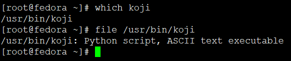

<!-- MDTOC maxdepth:6 firsth1:1 numbering:0 flatten:0 bullets:1 updateOnSave:1 -->

- [fedora 34 部署koji环境](#fedora-34-部署koji环境)   
   - [yum安装koji](#yum安装koji)   
   - [koji登陆问候moshimoshi](#koji登陆问候moshimoshi)   

<!-- /MDTOC -->

# fedora 34 部署koji环境

## yum安装koji

```
dnf install -y koji
```


```
[root@fedora ~]# rpm -ql koji
/etc/koji.conf
/etc/koji.conf.d
/usr/bin/koji
/usr/share/doc/koji
/usr/share/doc/koji/Authors
/usr/share/doc/koji/COPYING
/usr/share/doc/koji/LGPL
/usr/share/doc/koji/docs
/usr/share/doc/koji/docs/Makefile
/usr/share/doc/koji/docs/schema-update-cgen.sql
/usr/share/doc/koji/docs/schema.sql
/usr/share/doc/koji/docs/source
/usr/share/doc/koji/docs/source/CVEs  # 省略
/usr/share/doc/koji/docs/source/CVEs/CVE-2017-1002153.rst
/usr/share/doc/koji/docs/source/CVEs/CVEs.rst
/usr/share/doc/koji/docs/source/HOWTO.rst

```

熟悉的python



```
[root@fedora ~]# koji --help
Usage: koji [global-options] command [command-options-and-arguments]

Common commands: build, download-build, help, latest-build, list-targets, search

Options:
  -h, --help            show this help message and exit
  -c FILE, --config=FILE
                        use alternate configuration file
  -p PROFILE, --profile=PROFILE
                        specify a configuration profile
  --keytab=FILE         specify a Kerberos keytab to use
  --principal=PRINCIPAL
                        specify a Kerberos principal to use
  --cert=FILE           specify a SSL cert to use
  --runas=RUNAS         run as the specified user (requires special
                        privileges)
  --user=USER           specify user
  --password=PASSWORD   specify password
  --noauth              do not authenticate
  --force-auth          authenticate even for read-only operations
  --authtype=AUTHTYPE   force use of a type of authentication, options:
                        noauth, ssl, password, or kerberos
  -d, --debug           show debug output
  --debug-xmlrpc        show xmlrpc debug output
  -q, --quiet           run quietly
  --skip-main           don't actually run main
  -s SERVER, --server=SERVER
                        url of XMLRPC server
  --topdir=TOPDIR       specify topdir
  --weburl=WEBURL       url of the Koji web interface
  --topurl=TOPURL       url for Koji file access
  --plugin-paths=PATHS  specify additional plugin paths (colon separated)
  --help-commands       list commands

Try "koji --help" for help about global options
Try "koji help" to get all available commands
Try "koji <command> --help" for help about the options of a particular command
Try "koji help <category>" to get commands under a particular category
Available categories are: admin, all, bind, build, download, info, misc, monitor, search
```

直接执行koji命令

```
[root@fedora ~]# koji
Available commands:

admin commands:
        add-external-repo         Create an external repo and/or add one to a tag
        add-group                 Add a group to a tag
        add-group-pkg             Add a package to a group's package listing
        add-group-req             Add a group to a group's required list
        add-host                  Add a host
        add-host-to-channel       Add a host to a channel
        add-pkg                   Add a package to the listing for tag
        add-tag                   Add a new tag to the database
        add-tag-inheritance       Add to a tag's inheritance
        add-target                Create a new build target
        add-user                  Add a user
        add-volume                Add a new storage volume
        assign-task               Assign a task to a host
        block-group               Block group in tag
        block-group-pkg           Block a package from a group's package listing
        block-group-req           Block a group's requirement listing
        block-pkg                 Block a package in the listing for tag
        clone-tag                 Duplicate the contents of one tag onto another tag
        disable-host              Mark one or more hosts as disabled
        disable-user              Disable logins by a user
        edit-external-repo        Edit data for an external repo
        edit-host                 Edit a host
        edit-tag                  Alter tag information
        edit-tag-inheritance      Edit tag inheritance
        edit-target               Set the name, build_tag, and/or dest_tag of an existing build target to new values
        edit-user                 Alter user information
        enable-host               Mark one or more hosts as enabled
        enable-user               Enable logins by a user
        free-task                 Free a task
        grant-cg-access           Add a user to a content generator
        grant-permission          Grant a permission to a user
        import                    Import externally built RPMs into the database
        import-archive            Import an archive file and associate it with a build
        import-cg                 Import external builds with rich metadata
        import-sig                Import signatures into the database and write signed RPMs
        list-signed               List signed copies of rpms
        lock-tag                  Lock a tag
        make-task                 Create an arbitrary task
        prune-signed-copies       Prune signed copies
        regen-repo                Force a repo to be regenerated
        remove-channel            Remove a channel entirely
        remove-external-repo      Remove an external repo from a tag or tags, or remove entirely
        remove-group              Remove group from tag
        remove-host-from-channel  Remove a host from a channel
        remove-pkg                Remove a package from the listing for tag
        remove-tag                Remove a tag
        remove-tag-inheritance    Remove a tag inheritance link
        remove-target             Remove a build target
        rename-channel            Rename a channel
        restart-hosts             Restart enabled hosts
        revoke-cg-access          Remove a user from a content generator
        revoke-permission         Revoke a permission from a user
        set-build-volume          Move a build to a different volume
        set-pkg-arches            Set the list of extra arches for a package
        set-pkg-owner             Set the owner for a package
        set-pkg-owner-global      Set the owner for a package globally
        set-task-priority         Set task priority
        unblock-group-pkg         Unblock a package from a group's package listing
        unblock-group-req         Unblock a group's requirement listing
        unblock-pkg               Unblock a package in the listing for tag
        unlock-tag                Unlock a tag
        write-signed-rpm          Write signed RPMs to disk

bind commands:
        move-build                'Move' one or more builds between tags
        tag-build                 Apply a tag to one or more builds
        untag-build               Remove a tag from one or more builds

build commands:
        build                     Build a package from source
        cancel                    Cancel tasks and/or builds
        chain-build               Build one or more packages from source
        image-build               Create a disk image given an install tree
        image-build-indirection   Create a disk image using other disk images via the Indirection plugin
        maven-build               Build a Maven package from source
        maven-chain               Run a set of Maven builds in dependency order
        resubmit                  Retry a canceled or failed task, using the same parameter as the original task.
        spin-appliance            Create an appliance given a kickstart file
        spin-livecd               Create a live CD image given a kickstart file
        spin-livemedia            Create a livemedia image given a kickstart file
        win-build                 Build a Windows package from source
        wrapper-rpm               Build wrapper rpms for any archives associated with a build.

download commands:
        download-build            Download a built package
        download-logs             Download a logs for package
        download-task             Download the output of a build task

info commands:
        buildinfo                 Print basic information about a build
        help                      List available commands
        hostinfo                  Print basic information about a host
        latest-build              Print the latest builds for a tag
        list-api                  Print the list of XML-RPC APIs
        list-buildroot            List the rpms used in or built in a buildroot
        list-builds               Print the build listing
        list-channels             Print channels listing
        list-external-repos       List external repos
        list-groups               Print the group listings
        list-history              Display historical data
        list-hosts                Print the host listing
        list-permissions          List user permissions
        list-pkgs                 Print the package listing for tag or for owner
        list-tag-inheritance      Print the inheritance information for a tag
        list-tagged               List the builds or rpms in a tag
        list-tags                 Print the list of tags
        list-targets              List the build targets
        list-tasks                Print the list of tasks
        list-untagged             List untagged builds
        list-volumes              List storage volumes
        mock-config               Create a mock config
        rpminfo                   Print basic information about an RPM
        show-groups               Show groups data for a tag
        taginfo                   Print basic information about a tag
        taskinfo                  Show information about a task

miscellaneous commands:
        call                      Execute an arbitrary XML-RPC call
        dist-repo                 Create a yum repo with distribution options
        import-comps              Import group/package information from a comps file
        moshimoshi                Introduce yourself
        version                   Report client and hub versions

monitor commands:
        add-notification          Add user's notification
        block-notification        Block user's notifications
        edit-notification         Edit user's notification
        list-notifications        List user's notifications and blocks
        remove-notification       Remove user's notifications
        unblock-notification      Unblock user's notification
        wait-repo                 Wait for a repo to be regenerated
        watch-logs                Watch logs in realtime
        watch-task                Track progress of particular tasks

search commands:
        search                    Search the system

Try "koji --help" for help about global options
Try "koji help" to get all available commands
Try "koji <command> --help" for help about the options of a particular command
Try "koji help <category>" to get commands under a particular category
Available categories are: admin, all, bind, build, download, info, misc, monitor, search
```

## koji登陆问候moshimoshi


当前koji其实只是充当客户端，那么服务端在哪里？毫无以为，去找配置文件

```
[root@fedora ~]# cat /etc/koji.conf
[koji]

;configuration for koji cli tool

;url of XMLRPC server
;server = http://hub.example.com/kojihub
server = https://koji.fedoraproject.org/kojihub

;url of web interface
;weburl = http://www.example.com/koji
weburl = https://koji.fedoraproject.org/koji

;url of package download site
;pkgurl = http://www.example.com/packages

;path to the koji top directory
;topdir = /mnt/koji
topurl = https://kojipkgs.fedoraproject.org/

;configuration for Kerberos authentication
authtype = kerberos
krb_rdns = false

;the principal to auth as for automated clients
;principal = client@EXAMPLE.COM

;the keytab to auth as for automated clients
;keytab = /etc/krb5.keytab


;configuration for SSL authentication

;client certificate
;cert = ~/.koji/client.crt

;certificate of the CA that issued the HTTP server certificate
;serverca = ~/.koji/serverca.crt

;plugin paths, separated by ':' as the same as the shell's PATH
;koji_cli_plugins module and ~/.koji/plugins are always loaded in advance,
;and then be overridden by this option
;plugin_paths = ~/.koji/plugins

;[not_implemented_yet]
;enabled plugins for CLI, runroot and save_failed_tree are available
;plugins =
; runroot plugin is enabled by default in fedora
plugins = runroot

;timeout of XMLRPC requests by seconds, default: 60 * 60 * 12 = 43200
;timeout = 43200

;timeout of GSSAPI/SSL authentication by seconds, default: 60
;auth_timeout = 60

; use the fast upload feature of koji by default
use_fast_upload = yes
```


---


耍起来

1. 触发构建

```
[root@fedora rpmbuild]# koji build  --scratch f34-rebuild ./openssh-8.5p1-2.fc34.src.rpm
Uploading srpm: ./openssh-8.5p1-2.fc34.src.rpm
[====================================] 100% 00:00:03   2.19 MiB 578.18 KiB/sec
Created task: 67950888
Task info: https://koji.fedoraproject.org/koji/taskinfo?taskID=67950888
Watching tasks (this may be safely interrupted)...
67950888 build (f34-rebuild, openssh-8.5p1-2.fc34.src.rpm): free
67950888 build (f34-rebuild, openssh-8.5p1-2.fc34.src.rpm): free -> open (buildvm-ppc64le-17.iad2.fedoraproject.org)
  67950891 rebuildSRPM (noarch): open (buildvm-ppc64le-31.iad2.fedoraproject.org)
  67950891 rebuildSRPM (noarch): open (buildvm-ppc64le-31.iad2.fedoraproject.org) -> closed
  0 free  1 open  1 done  0 failed
  67950959 buildArch (openssh-8.5p1-2.fc34.src.rpm, aarch64): free
  67950961 buildArch (openssh-8.5p1-2.fc34.src.rpm, s390x): free
  67950957 buildArch (openssh-8.5p1-2.fc34.src.rpm, i686): open (buildvm-x86-08.iad2.fedoraproject.org)
  67950960 buildArch (openssh-8.5p1-2.fc34.src.rpm, ppc64le): open (buildvm-ppc64le-31.iad2.fedoraproject.org)
  67950956 buildArch (openssh-8.5p1-2.fc34.src.rpm, armv7hl): open (buildvm-a32-15.iad2.fedoraproject.org)
  67950958 buildArch (openssh-8.5p1-2.fc34.src.rpm, x86_64): open (buildvm-x86-18.iad2.fedoraproject.org)
  67950961 buildArch (openssh-8.5p1-2.fc34.src.rpm, s390x): free -> open (buildvm-s390x-18.s390.fedoraproject.org)
  67950959 buildArch (openssh-8.5p1-2.fc34.src.rpm, aarch64): free -> open (buildvm-a64-19.iad2.fedoraproject.org)
  67950958 buildArch (openssh-8.5p1-2.fc34.src.rpm, x86_64): open (buildvm-x86-18.iad2.fedoraproject.org) -> closed
  0 free  6 open  2 done  0 failed
  67950957 buildArch (openssh-8.5p1-2.fc34.src.rpm, i686): open (buildvm-x86-08.iad2.fedoraproject.org) -> closed
  0 free  5 open  3 done  0 failed
  67950961 buildArch (openssh-8.5p1-2.fc34.src.rpm, s390x): open (buildvm-s390x-18.s390.fedoraproject.org) -> closed
  0 free  4 open  4 done  0 failed
  67950960 buildArch (openssh-8.5p1-2.fc34.src.rpm, ppc64le): open (buildvm-ppc64le-31.iad2.fedoraproject.org) -> closed
  0 free  3 open  5 done  0 failed
  67950959 buildArch (openssh-8.5p1-2.fc34.src.rpm, aarch64): open (buildvm-a64-19.iad2.fedoraproject.org) -> closed
  0 free  2 open  6 done  0 failed
  67950956 buildArch (openssh-8.5p1-2.fc34.src.rpm, armv7hl): open (buildvm-a32-15.iad2.fedoraproject.org) -> closed
  0 free  1 open  7 done  0 failed
67950888 build (f34-rebuild, openssh-8.5p1-2.fc34.src.rpm): open (buildvm-ppc64le-17.iad2.fedoraproject.org) -> closed
  0 free  0 open  8 done  0 failed

67950888 build (f34-rebuild, openssh-8.5p1-2.fc34.src.rpm) completed successfully
```

3. Web页面查看构建状态


2. 下载构建

使用koji download-task 命令，任务id其实就是上面触发时候生成的那个```Created task: 67950888```

```
[root@fedora download]# koji  download-task --help
Usage: koji download-task <task_id>
(Specify the --help global option for a list of other help options)

Options:
  -h, --help    show this help message and exit
  --arch=ARCH   Only download packages for this arch (may be used multiple
                times)
  --logs        Also download build logs
  --topurl=URL  URL under which Koji files are accessible
  --noprogress  Do not display progress meter
  --wait        Wait for running tasks to finish
  -q, --quiet   Suppress output
[root@fedora download]# koji  download-task --arch=x86_64 67950888
Downloading [1/13]: openssh-clients-debuginfo-8.5p1-2.fc34.x86_64.rpm
[====================================] 100%   1.50 MiB
Downloading [2/13]: openssh-clients-8.5p1-2.fc34.x86_64.rpm
[====================================] 100% 687.32 KiB
Downloading [3/13]: openssh-server-debuginfo-8.5p1-2.fc34.x86_64.rpm
[====================================] 100% 859.72 KiB
Downloading [4/13]: openssh-debugsource-8.5p1-2.fc34.x86_64.rpm
[====================================] 100% 640.80 KiB
Downloading [5/13]: openssh-debuginfo-8.5p1-2.fc34.x86_64.rpm
[====================================] 100% 652.05 KiB
Downloading [6/13]: openssh-8.5p1-2.fc34.x86_64.rpm
[====================================] 100% 440.63 KiB
Downloading [7/13]: openssh-server-8.5p1-2.fc34.x86_64.rpm
[====================================] 100% 457.04 KiB
Downloading [8/13]: pam_ssh_agent_auth-debuginfo-0.10.4-2.2.fc34.x86_64.rpm
[====================================] 100% 126.14 KiB
Downloading [9/13]: pam_ssh_agent_auth-0.10.4-2.2.fc34.x86_64.rpm
[====================================] 100%  67.88 KiB
Downloading [10/13]: openssh-keycat-debuginfo-8.5p1-2.fc34.x86_64.rpm
[====================================] 100%  35.94 KiB
Downloading [11/13]: openssh-askpass-debuginfo-8.5p1-2.fc34.x86_64.rpm
[====================================] 100%  34.27 KiB
Downloading [12/13]: openssh-keycat-8.5p1-2.fc34.x86_64.rpm
[====================================] 100%  22.14 KiB
Downloading [13/13]: openssh-askpass-8.5p1-2.fc34.x86_64.rpm
[====================================] 100%  20.77 KiB
[root@fedora download]# ls -alh
total 5.5M
drwxr-xr-x. 2 root root 4.0K May 15 15:10 .
drwxr-xr-x. 8 root root 4.0K May 15 15:04 ..
-rw-r--r--. 1 root root 441K May 15 15:10 openssh-8.5p1-2.fc34.x86_64.rpm
-rw-r--r--. 1 root root  21K May 15 15:10 openssh-askpass-8.5p1-2.fc34.x86_64.rpm
-rw-r--r--. 1 root root  35K May 15 15:10 openssh-askpass-debuginfo-8.5p1-2.fc34.x86_64.rpm
-rw-r--r--. 1 root root 688K May 15 15:10 openssh-clients-8.5p1-2.fc34.x86_64.rpm
-rw-r--r--. 1 root root 1.6M May 15 15:10 openssh-clients-debuginfo-8.5p1-2.fc34.x86_64.rpm
-rw-r--r--. 1 root root 653K May 15 15:10 openssh-debuginfo-8.5p1-2.fc34.x86_64.rpm
-rw-r--r--. 1 root root 641K May 15 15:10 openssh-debugsource-8.5p1-2.fc34.x86_64.rpm
-rw-r--r--. 1 root root  23K May 15 15:10 openssh-keycat-8.5p1-2.fc34.x86_64.rpm
-rw-r--r--. 1 root root  36K May 15 15:10 openssh-keycat-debuginfo-8.5p1-2.fc34.x86_64.rpm
-rw-r--r--. 1 root root 458K May 15 15:10 openssh-server-8.5p1-2.fc34.x86_64.rpm
-rw-r--r--. 1 root root 860K May 15 15:10 openssh-server-debuginfo-8.5p1-2.fc34.x86_64.rpm
-rw-r--r--. 1 root root  68K May 15 15:10 pam_ssh_agent_auth-0.10.4-2.2.fc34.x86_64.rpm
-rw-r--r--. 1 root root 127K May 15 15:10 pam_ssh_agent_auth-debuginfo-0.10.4-2.2.fc34.x86_64.rpm

```

用起来挺香


---
