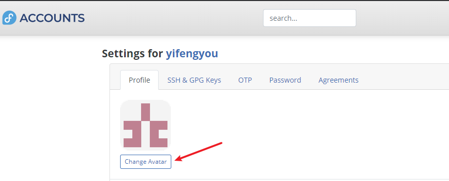

# fedora官方koji编译平台

* 官方平台免费注册，免费编译（多架构支持），当然肯定有量的限制，毕竟都是资源开销
* 不过，需要了解一下怎么玩，页面缺少说明，新手容易懵逼

## 1. 创建fedora账户

* <https://accounts.fedoraproject.org/>

注册，绑定账户，登陆

## 2. 修改账户配置（可选）

fedora这里一直登陆不上，麻烦

但是这里能登陆，这什么鬼操作？

但是，果然如帖子所说，fedora登陆有问题，换个浏览器就好了

换成火狐浏览器，测试，一路顺风

* 试了好牛，总算安排上了

## 官方源码托管站点pagure

* <https://pagure.io>
* pagure也是fedora一个项目，git+jekins，作为源码托管，版本控制平台

* 可以随意创建group

* 创建仓库

<https://pagure.io/yifengyou/helloworld>

## 官方koji站点

* <https://koji.fedoraproject.org/koji/>

这里有个骚操作，就是没有给出登陆地址，那么怎么搞，自己改url加login，有用？

* <https://koji.fedoraproject.org/koji/login>

其实，这玩意儿得用那啥来登陆

---
