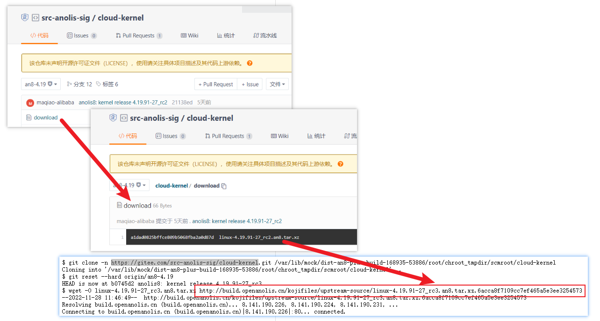

# koji编译anolis


## anolis源码托管

根据koji任务 <https://build.openanolis.cn/taskinfo?taskID=456149>

<http://build.openanolis.cn/kojifiles/work/tasks/6149/456149/checkout.log>

```
$ git clone -n https://gitee.com/src-anolis-sig/cloud-kernel.git /var/lib/mock/dist-an8-plus-build-168935-53886/root/chroot_tmpdir/scmroot/cloud-kernel
Cloning into '/var/lib/mock/dist-an8-plus-build-168935-53886/root/chroot_tmpdir/scmroot/cloud-kernel'...
$ git reset --hard origin/an8-4.19
HEAD is now at b0745d2 anolis8: kernel release 4.19.91-27_rc3
$ wget -O linux-4.19.91-27_rc3.an8.tar.xz http://build.openanolis.cn/kojifiles/upstream-source/linux-4.19.91-27_rc3.an8.tar.xz.6acca8f7109cc7ef465a5e3ee3254573
--2022-11-28 11:46:49--  http://build.openanolis.cn/kojifiles/upstream-source/linux-4.19.91-27_rc3.an8.tar.xz.6acca8f7109cc7ef465a5e3ee3254573
Resolving build.openanolis.cn (build.openanolis.cn)... 8.141.190.226, 8.141.190.224, 8.141.190.231, ...
Connecting to build.openanolis.cn (build.openanolis.cn)|8.141.190.226|:80... connected.
HTTP request sent, awaiting response... 200 OK
Length: 108467212 (103M) [application/x-xz]
Saving to: ‘linux-4.19.91-27_rc3.an8.tar.xz’

```

提一嘴，这里如果wget retry一下，会不会更鲁棒

```
-t,  --tries=NUMBER              set number of retries to NUMBER (0 unlimits)
```

```
http://build.openanolis.cn/kojifiles/upstream-source/
```





wget -O linux-4.19.91-27_rc3.an8.tar.xz http://build.openanolis.cn/kojifiles/upstream-source/linux-4.19.91-27_rc3.an8.tar.xz.6acca8f7109cc7ef465a5e3ee3254573


curl  -o linux-4.19.91-27_rc3.an8.tar.xz http://build.openanolis.cn/kojifiles/upstream-source/linux-4.19.91-27_rc3.an8.tar.xz.6acca8f7109cc7ef465a5e3ee3254573


---
