# koji编译centos7


## 源码获取脚本get_sources.sh

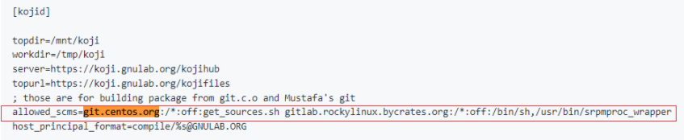

kojid需要get_sources.sh脚本放到mock里面，git检出仓库后获取源码包

因此，kojid创建的mock环境，还需要get_sources.sh脚本及其依赖，那么怎样将宿主机的文件传递到mock环境中？

```
[root@db41eb8663dd /data/acpid]# get_sources.sh
+ set -eux
+ SURL=https://git.centos.org/sources
+ QUIET=0
+ BRANCH=
+ CHECK=0
+ '[' -f /etc/centos-git-common ']'
++ getopt -o hcqb: -l surl: --
+ args=' --'
+ eval set -- ' --'
++ set -- --
+ [[ 0 -eq 0 ]]
+ case $1 in
+ shift
+ break
+ [[ 0 -eq 1 ]]
+ QUIET=
+ command -v git
+ [[ 0 -ne 0 ]]
+ command -v curl
+ [[ 0 -ne 0 ]]
+ '[' '!' -d .git ']'
+ '[' -n '' ']'
+ branches=()
++ git branch -r --contains HEAD
++ sed s#origin/##g
+ IFS=
+ read -r line
+ branch=c8
+ [[ c8 =~ detached from ]]
+ '[' '. ' = '.*' ']'
+ branches=(${branches[@]+"${branches[@]}"} "${branch}")
+ IFS=
+ read -r line
+ [[ -f sources ]]
+ echo 'Exploded SRPM layout style'
Exploded SRPM layout style
+ mkdir -p SOURCES
+ shopt -s nullglob
+ set -- .acpid.metadata
+ ((  1 == 0  ))
+ ((  1 > 1  ))
+ meta=.acpid.metadata
+ pn=.acpid
+ pn=acpid
+ read -r fsha fname
+ '[' .680bbb3fa9cdabb78fb19c6d24bb57224fbbbaed = .da39a3ee5e6b4b0d3255bfef95601890afd80709 ']'
++ weakHashDetection 680bbb3fa9cdabb78fb19c6d24bb57224fbbbaed
++ strHash=680bbb3fa9cdabb78fb19c6d24bb57224fbbbaed
++ case $((`echo ${strHash}|wc -m` - 1 )) in
+++ echo 680bbb3fa9cdabb78fb19c6d24bb57224fbbbaed
+++ wc -m
++ hashBin=sha1sum
++ echo sha1sum
+ hashType=sha1sum
+ '[' sha1sum == unknown ']'
++ echo sha1sum
++ sed -e 's|sum||'
+ hashName=sha1
+ '[' 0 -eq 1 ']'
+ '[' -e SOURCES/acpid-2.0.30.tar.xz -a 0 -eq 1 ']'
+ '[' '!' -e SOURCES/acpid-2.0.30.tar.xz ']'
+ for br in "${branches[@]}"
++ echo c8
++ sed -e 's|remotes/origin/||'
+ br=c8
+ url=https://git.centos.org/sources/acpid/c8/680bbb3fa9cdabb78fb19c6d24bb57224fbbbaed
+ echo 'Retrieving https://git.centos.org/sources/acpid/c8/680bbb3fa9cdabb78fb19c6d24bb57224fbbbaed'
Retrieving https://git.centos.org/sources/acpid/c8/680bbb3fa9cdabb78fb19c6d24bb57224fbbbaed
++ curl -L -H Pragma: -o SOURCES/acpid-2.0.30.tar.xz -R -S --fail --retry 5 https://git.centos.org/sources/acpid/c8/680bbb3fa9cdabb78fb19c6d24bb57224fbbbaed --write-out '%{http_code}'
  % Total    % Received % Xferd  Average Speed   Time    Time     Time  Current
                                 Dload  Upload   Total   Spent    Left  Speed
100  151k  100  151k    0     0   5746      0  0:00:27  0:00:27 --:--:--  6383
+ HTTP_CODE=200
+ echo 'Returned 200'
Returned 200
+ [[ 200 -gt 199 ]]
+ [[ 200 -lt 300 ]]
+ echo bailing
bailing
+ break
+ '[' 0 -eq 1 ']'
+ read -r fsha fname

```

get_sources.sh大致逻辑如上


mock的拷贝拷出可以？奇怪这个脚本没有rpm包，有的话就方便多了

* <https://linux.die.net/man/1/mock>

```
--copyin
Copies the source paths (files or directory trees) into the chroot at the specified destination path.
--copyout
Copies the source paths (files or directory trees) from the chroot to the specified destination path.
```

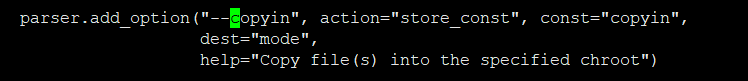

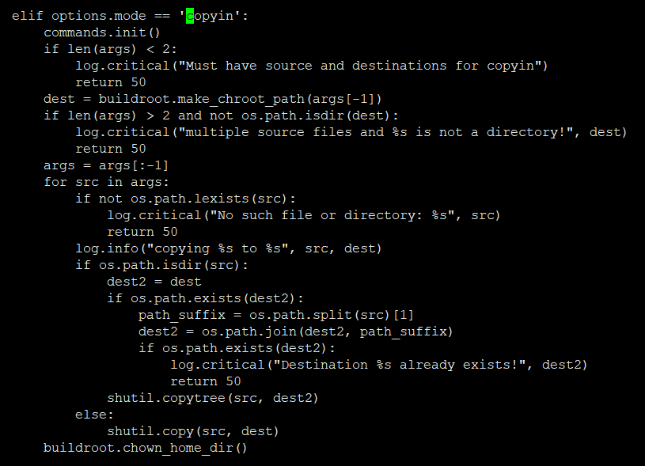

代码里很清晰，用到了shutil.copy递归拷贝


还有一个思路，绑定目录

mock提供了一配置将宿主机目录绑定到chroot中

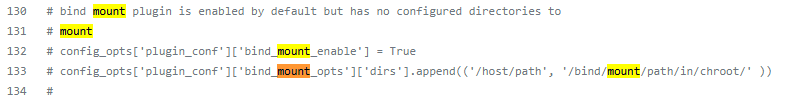


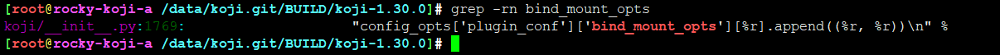

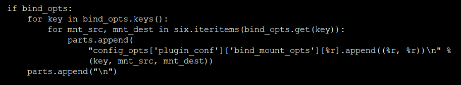

```
parts.append("config_opts['plugin_conf']['bind_mount_opts']['dirs'].append(('/yyf', '/yyf'))\n")
```

这里确实可以这么改，大实际上，已经在mock环境执行，需要安装git、svn等工具才行


当然，第三种做法，在git reset命令之后多执行一条

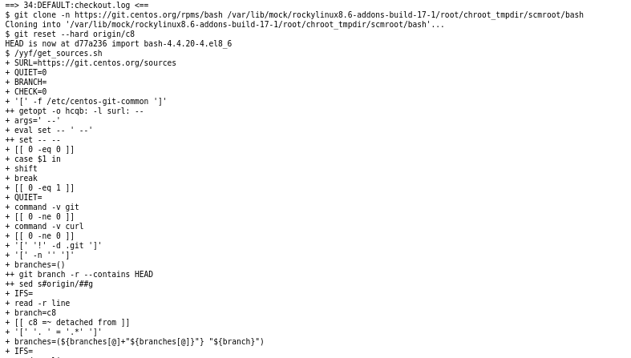

这个办法不错，

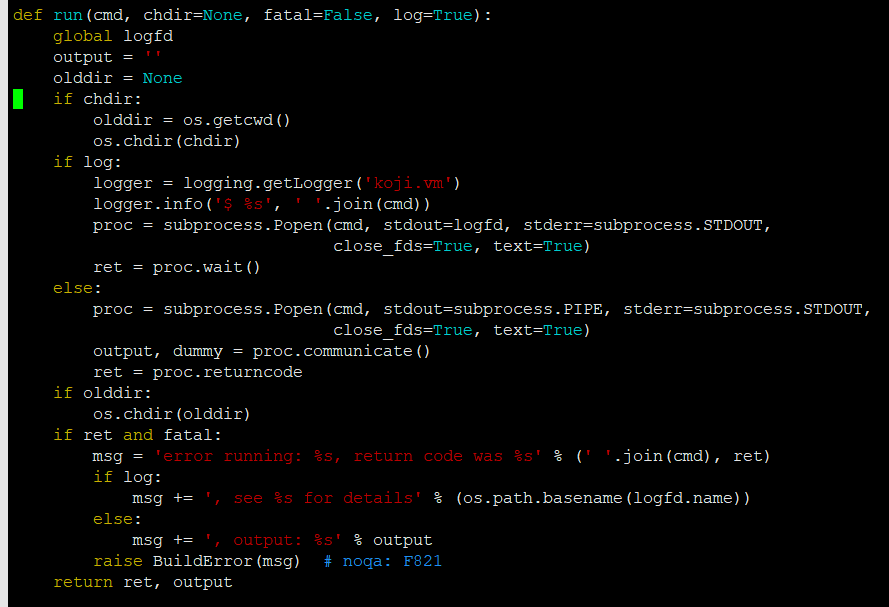

实操有个超时问题，

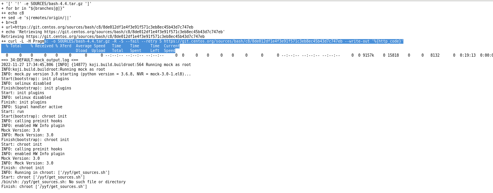

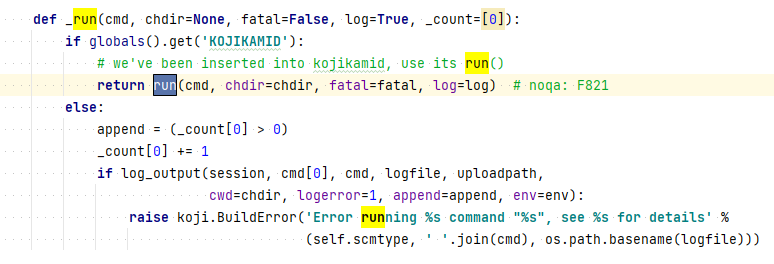


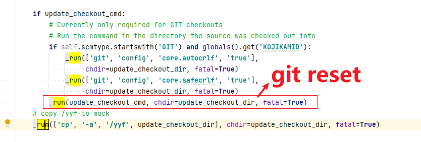

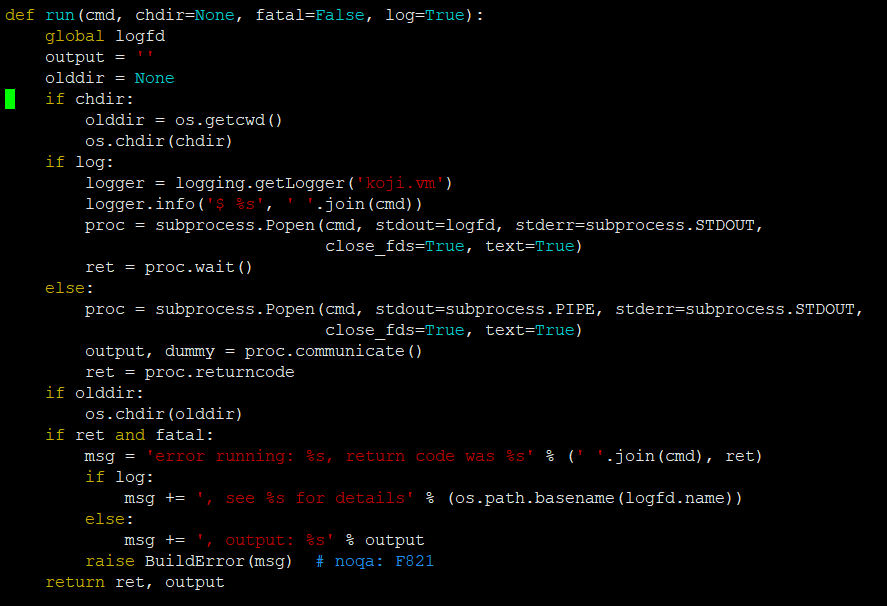


## mock rootfs下yum源配置问题


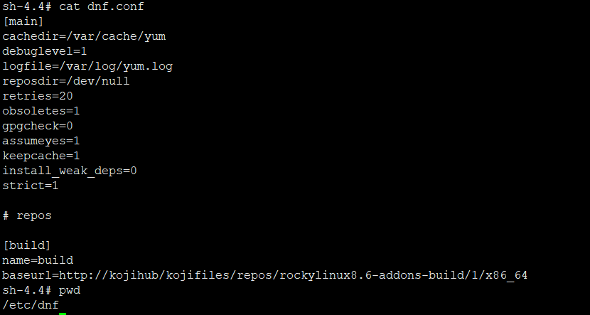


---
