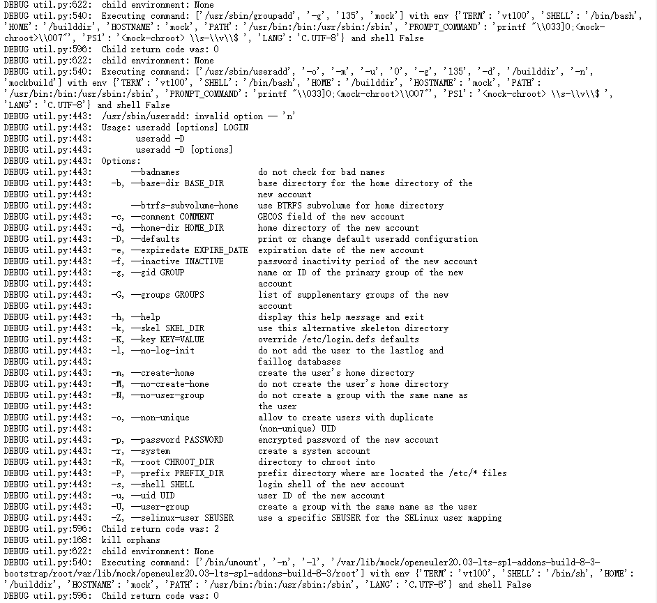
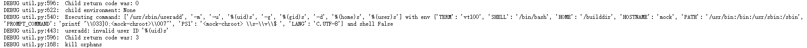
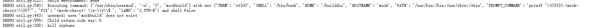
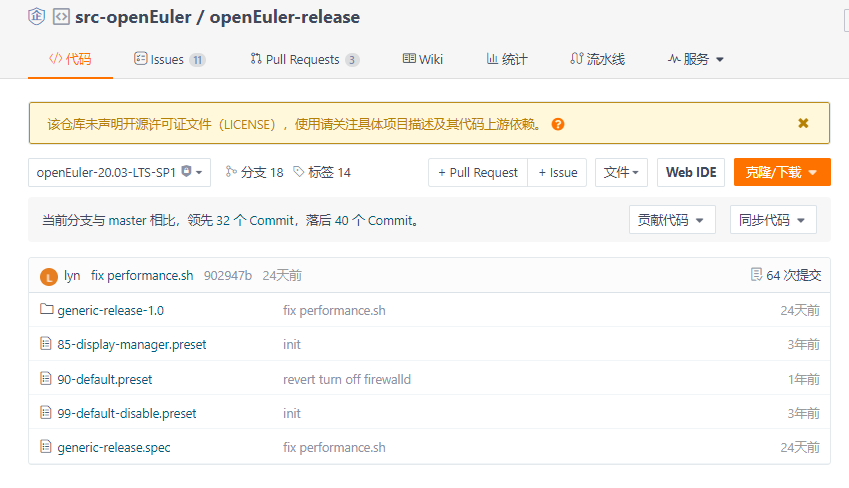
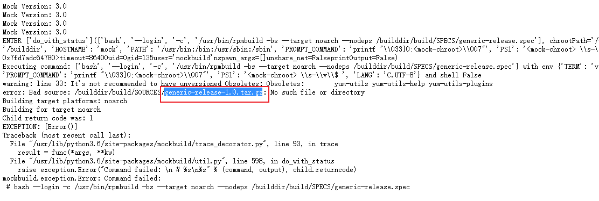

# koji编译openeuler20.03-LTS-SP1




openeuler有点流氓，useradd命令都不支持'-n'


```
koji mock-config --target  openeuler20.03-lts-sp1-addons -a x86_64
# Auto-generated by the Koji build system

config_opts['basedir'] = '/var/lib/mock'
config_opts['chroot_setup_cmd'] = 'groupinstall build'
config_opts['chroothome'] = '/builddir'
config_opts['dnf_warning'] = False
config_opts['root'] = 'openeuler20.03-lts-sp1-addons-build-repo_3'
config_opts['rpmbuild_networking'] = False
config_opts['rpmbuild_timeout'] = 86400
config_opts['target_arch'] = 'x86_64'
config_opts['use_host_resolv'] = False
config_opts['yum.conf'] = '[main]\ncachedir=/var/cache/yum\ndebuglevel=1\nlogfile=/var/log/yum.log\nreposdir=/dev/null\nretries=20\nobsoletes=1\ngpgcheck=0\nassumeyes=1\nkeepcache=1\ninstall_weak_deps=0\nstrict=1\n\n# repos\n\n[build]\nname=build\nbaseurl=http://kojihub/kojifiles/repos/openeuler20.03-lts-sp1-addons-build/3/x86_64\n'

config_opts['plugin_conf']['ccache_enable'] = False
config_opts['plugin_conf']['root_cache_enable'] = False
config_opts['plugin_conf']['yum_cache_enable'] = False

config_opts['macros']['%_host'] = 'x86_64-koji-linux-gnu'
config_opts['macros']['%_host_cpu'] = 'x86_64'
config_opts['macros']['%_rpmfilename'] = '%%{NAME}-%%{VERSION}-%%{RELEASE}.%%{ARCH}.rpm'
config_opts['macros']['%_topdir'] = '/builddir/build'
config_opts['macros']['%distribution'] = 'Koji Testing'
config_opts['macros']['%packager'] = 'Koji'
config_opts['macros']['%vendor'] = 'Koji'

config_opts['rpmbuild_opts'] = '--nocheck'

```


需要在mock配置中增加对useradd的修改

* <https://buildlogs.centos.org/c7-fasttrack.x86_64/exiv2/20190106113327/0.26-3.el7.0.1.x86_64/site-defaults.cfg>

```
# config_opts['useradd'] = '/usr/sbin/useradd -m -u %(uid)s -g %(gid)s -d %(home)s  %(user)s' # Fedora/RedHat
```

```
vim /usr/lib/python3.6/site-packages/koji/__init__.py


    parts.append("config_opts['rpmbuild_opts'] = '--nocheck'")
    parts.append("\n")
    parts.append("config_opts['useradd'] = '/usr/sbin/useradd mockbuild'")

koji mock-config --target  openeuler20.03-lts-sp1-addons -a x86_64


```





新增一个mockbuild用户


rocky linux编译的话，参数如下：

```
'/usr/sbin/useradd', '-o', '-m', '-u', '0', '-g', '135', '-d', '/builddir', '-n', 'mockbuild'
```


## 吐槽

特么华为欧拉的仓库是真特么乱七八糟。。



有些仓库压根就没有压缩包，放的是解压后的。。有些压缩包甩哪去不晓得，有些直接甩一个瞎逼命名的压缩包。。

天天瞎逼制定规则，倒是把仓库规则一下？





---
