# koji编译rockylinux8.6


```
koji add-tag rockylinux8.6-base
koji add-tag rockylinux8.6-base-addon
koji add-tag rockylinux8.6-base-addon-testing --parent=rockylinux8.6-base-addon
koji add-tag rockylinux8.6-addons-build --parent=rockylinux8.6-base-addon --arches="x86_64"
koji add-tag-inheritance --priority=1 rockylinux8.6-addons-build rockylinux8.6-base

koji add-external-repo -t rockylinux8.6-base rockylinux8.6-baseos http://mirror.nju.edu.cn/rocky/8.6/BaseOS/\$arch/os/
koji add-external-repo -t rockylinux8.6-base rockylinux8.6-devel http://mirror.nju.edu.cn/rocky/8.6/Devel/\$arch/os/
koji add-external-repo -t rockylinux8.6-base rockylinux8.6-powertools http://mirror.nju.edu.cn/rocky/8.6/PowerTools/\$arch/os/
koji add-external-repo -t rockylinux8.6-base rockylinux8.6-appsteam http://mirror.nju.edu.cn/rocky/8.6/AppStream/\$arch/os/

koji add-group rockylinux8.6-addons-build build
koji add-group rockylinux8.6-addons-build srpm-build

koji add-group-pkg rockylinux8.6-addons-build   build    bash bzip2 coreutils cpio diffutils findutils gawk gcc gcc-c++ grep gzip info make patch redhat-rpm-config rocky-release rpm-build sed shadow-utils tar unzip util-linux which xz rpmdevtools  which xz ruby curl passwd
koji add-group-pkg rockylinux8.6-addons-build   srpm-build    bash bzip2 coreutils cpio diffutils findutils gawk gcc gcc-c++ grep gzip info make patch redhat-rpm-config rocky-release rpm-build sed shadow-utils tar unzip util-linux which xz rpmdevtools  which xz ruby curl passwd

koji add-target rockylinux8.6-addons rockylinux8.6-addons-build rockylinux8.6-base-addon-testing


koji build rockylinux8.6-addons curl-7.61.1-25.el8.src.rpm
```


koji add-group rockylinux8.6-addons-build build
koji add-group-pkg rockylinux8.6-addons-build build bash tar gcc-c++ redhat-rpm-config which xz sed make bzip2 gzip gcc coreutils unzip shadow-utils diffutils cpio bash gawk rpm-build info patch util-linux findutils grep  rocky-release rpm-build
koji list-groups rockylinux8.6-addons-build


koji add-external-repo -t rockylinux8.6-base rockylinux8.6-devel http://mirror.nju.edu.cn/rocky/8.6/Devel/\$arch/os/
koji add-external-repo -t rockylinux8.6-base rockylinux8.6-powertools http://mirror.nju.edu.cn/rocky/8.6/PowerTools/\$arch/os/
koji add-external-repo -t rockylinux8.6-base rockylinux8.6-appsteam http://mirror.nju.edu.cn/rocky/8.6/AppStream/\$arch/os/

```
koji add-pkg --owner=kojiadmin rockylinux8.6-addons bash binutils
```

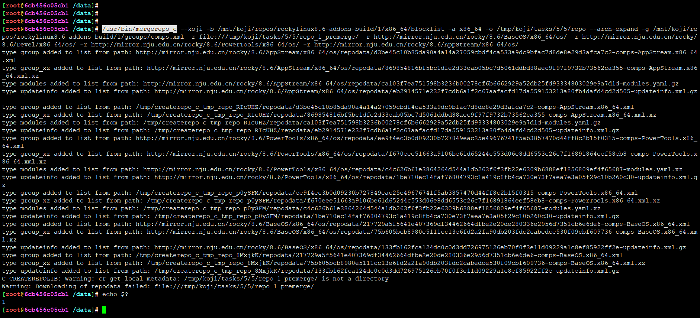

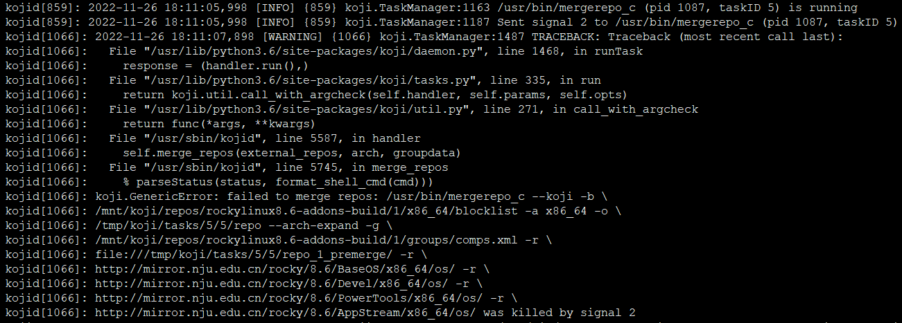


koji add-group-pkg rockylinux8.6-addons-build build bash bzip2 coreutils cpio diffutils fedora-release findutils gawk gcc gcc-c++ grep gzip info make patch redhat-rpm-config rpm-build sed shadow-utils tar unzip util-linux-ng which xz


koji add-group-pkg rockylinux8.6-addons-build build bash tar gcc-c++ redhat-rpm-config redhat-release which xz sed make bzip2 gzip gcc coreutils unzip shadow-utils diffutils cpio bash gawk rpm-build info patch util-linux findutils grep  rocky-release rpm-build


## rocky linux源码仓库结构

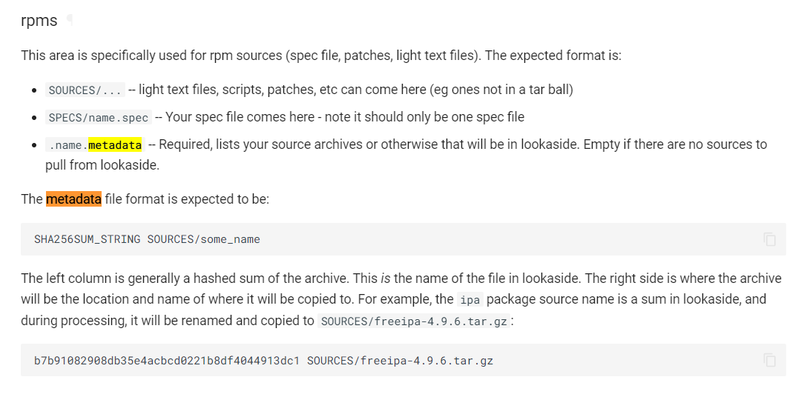

* <https://wiki.rockylinux.org/special_interest_groups/sig_guide/content/#importing-to-the-rocky-linux-gitlab>


* <https://docs.rockylinux.org/guides/package_management/developer_start2/#4-use-rocky-devtools-rockybuild-to-build-a-new-package-for-the-rocky-os>


## rockylinux源码结构


## rockylinux源码包获取方式

像这类错误，就是git仓库缺失源码tar包的缘故

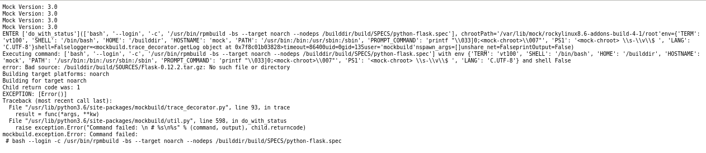

* <https://git.rockylinux.org/staging/rpms/python-flask>

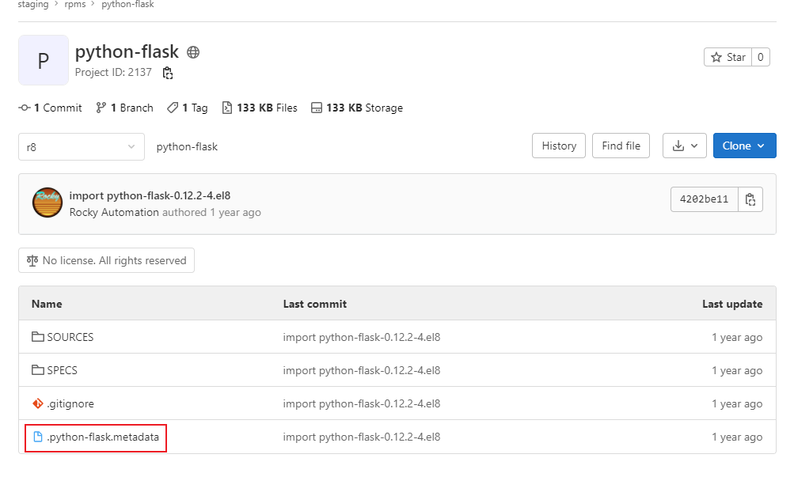

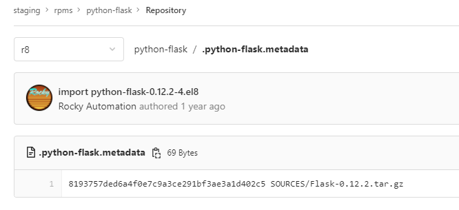

去rocky社区检索，发现社区的koji build组里面是包含一个srpmproc包	**srpmproc-0.1.0-2.x86_64.rpm**，专门用来获取源码

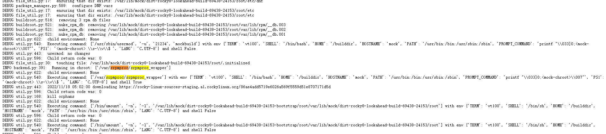

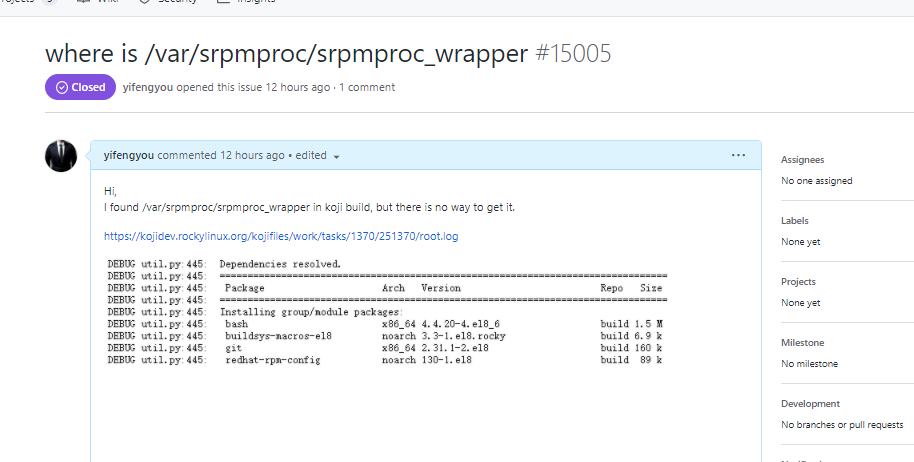

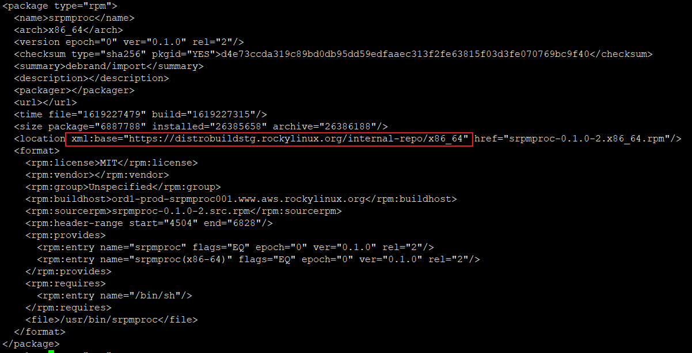

但是其源码仓库，暂时无法访问，特地贴了issue问询社区大佬，<https://github.com/rocky-linux/infrastructure/issues/15005>

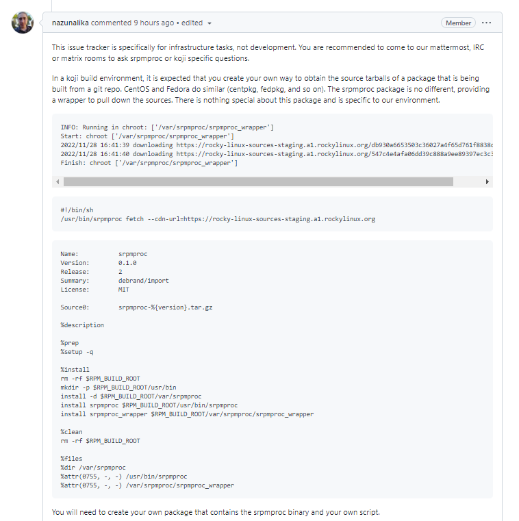

对方是建议创建适合自己环境的srpmproc_wrapper程序，srpmproc-0.1.0-2.x86_64.rpm 是社区内部封装，专门用来访问私有资源的，不具备通用性

```
#!/bin/sh
/usr/bin/srpmproc fetch --cdn-url=https://rocky-linux-sources-staging.a1.rockylinux.org
```

测试发现，这个脚本确实有效，可以搞事情

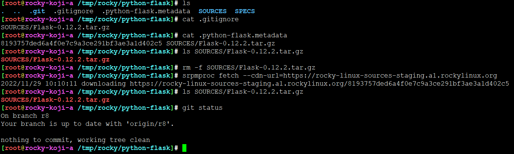


实测，可以用！完美


# koji编译依赖找不到

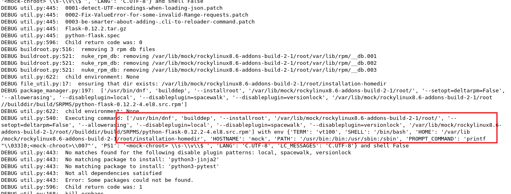

可以把命令提取出来，在宿主机环境直接执行


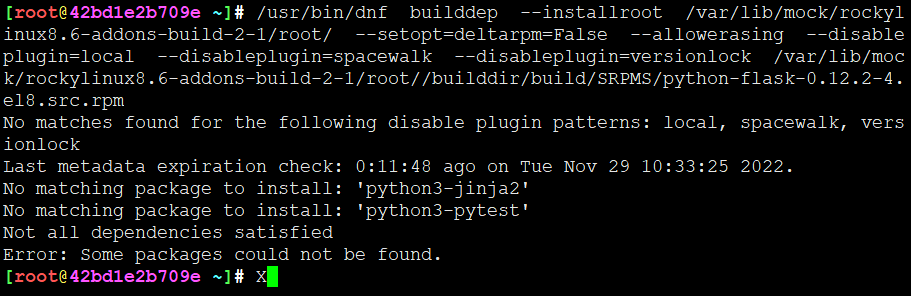

```


==> 2:DEFAULT:createrepo.log <==
$ /usr/bin/createrepo_c --error-exit-val -vd -o /tmp/koji/tasks/2/2/repo -g /mnt/koji/repos/rockylinux8.6-addons-build/1/groups/comps.xml /tmp/koji/tasks/2/2/repo
11:23:17: Version: 0.17.7 (Features: DeltaRPM LegacyWeakdeps )
11:23:17: Signal handler setup
11:23:17: Thread pool ready
11:23:17: Dir to scan: /tmp/koji/tasks/2/2/repo/.repodata
11:23:17: Package count: 0
11:23:17: Copy metadatum /mnt/koji/repos/rockylinux8.6-addons-build/1/groups/comps.xml -> /tmp/koji/tasks/2/2/repo/.repodata/comps.xml
11:23:17: Creating .xml.gz files
11:23:17: Setting number of packages
11:23:17: Creating databases
11:23:17: Thread pool user data ready
11:23:17: Generating repomd.xml
11:23:17: Old repodata doesn't exists: Cannot rename /tmp/koji/tasks/2/2/repo/repodata/ -> /tmp/koji/tasks/2/2/repo/repodata.old.971.20221129112317.907479: No such file or directory
11:23:17: Renamed /tmp/koji/tasks/2/2/repo/.repodata/ -> /tmp/koji/tasks/2/2/repo/repodata/
11:23:17: Memory cleanup
11:23:17: All done
Directory walk started
Directory walk done - 0 packages
Using comps.xml from target repo
Temporary output repo path: /tmp/koji/tasks/2/2/repo/.repodata/
Preparing sqlite DBs
Pool started (with 5 workers)
Pool finished

==> 2:DEFAULT:mergerepos.log <==
$ /usr/bin/mergerepo_c --koji -b /mnt/koji/repos/rockylinux8.6-addons-build/1/x86_64/blocklist -a x86_64 -o /tmp/koji/tasks/2/2/repo --arch-expand -g /mnt/koji/repos/rockylinux8.6-addons-build/1/groups/comps.xml -r file:///tmp/koji/tasks/2/2/repo_1_premerge/ -r http://mirror.nju.edu.cn/rocky/8.7/AppStream/x86_64/os/ -r http://mirror.nju.edu.cn/rocky/8.7/BaseOS/x86_64/os/ -r http://mirror.nju.edu.cn/rocky/8.7/extras/x86_64/os/
```


经诊断，是因为这里mergerepo模式用了--koji，精简了很多，所以会出现包找不到问题，调整为bare就行


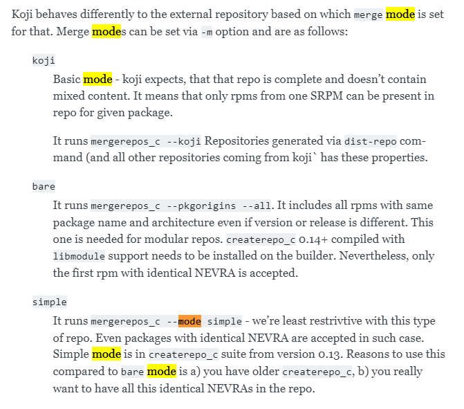

* <https://docs.pagure.org/koji/external_repo_server_bootstrap/>


```
koji add-external-repo -t rockylinux8.6-base -m bare rockylinux8.6-AppSteam   http://mirror.nju.edu.cn/rocky/8.6/AppStream/\$arch/os/
koji add-external-repo -t rockylinux8.6-base -m bare rockylinux8.6-BaseOs     http://mirror.nju.edu.cn/rocky/8.6/BaseOS/\$arch/os/
koji add-external-repo -t rockylinux8.6-base -m bare rockylinux8.6-extras     http://mirror.nju.edu.cn/rocky/8.6/extras/\$arch/os/
koji add-external-repo -t rockylinux8.6-base -m bare rockylinux8.6-PowerTools http://mirror.nju.edu.cn/rocky/8.6/PowerTools/\$arch/os/
koji add-external-repo -t rockylinux8.6-base -m bare rockylinux8.6-Devel      http://mirror.nju.edu.cn/rocky/8.6/Devel/\$arch/os/
```

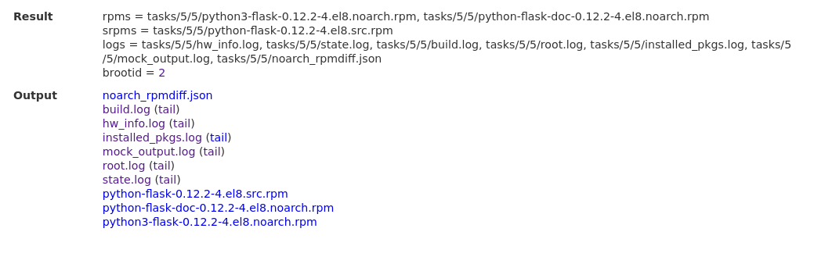

完美解决，成功编译


---
