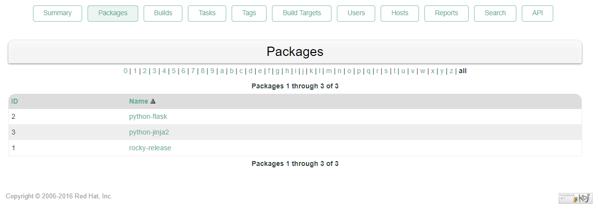
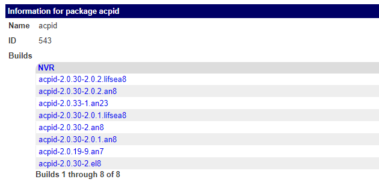
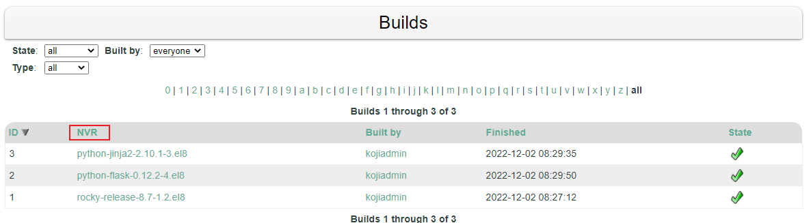
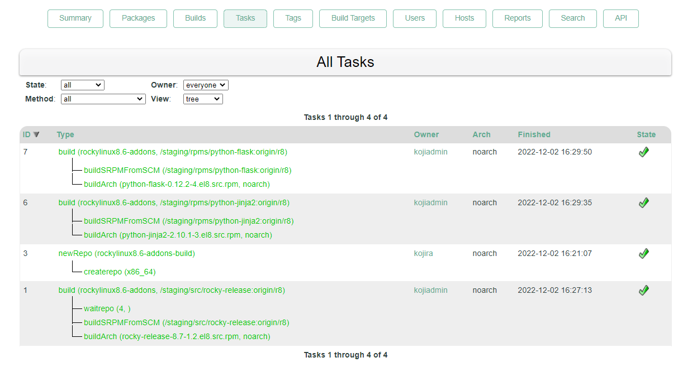
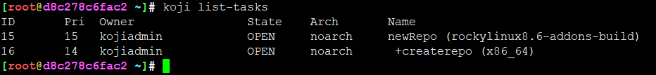
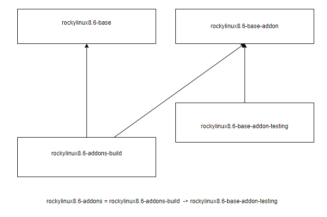
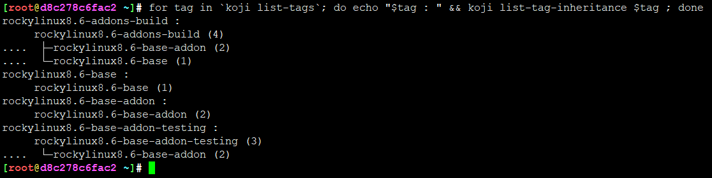
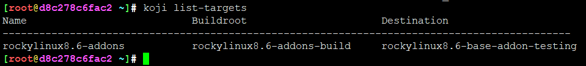
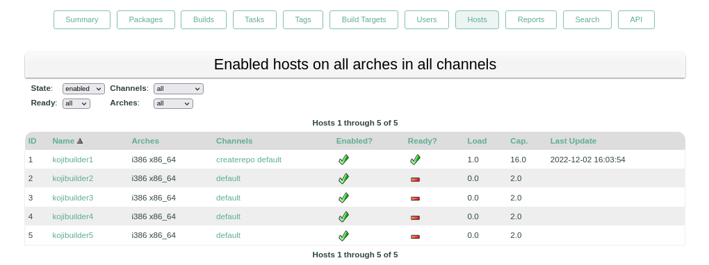
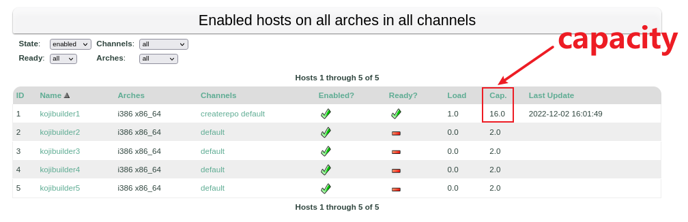

<!-- MDTOC maxdepth:6 firsth1:1 numbering:0 flatten:0 bullets:1 updateOnSave:1 -->

- [koji核心概念](#koji核心概念)   
   - [概念](#概念)   
      - [package](#package)   
      - [build](#build)   
      - [task](#task)   
      - [tag](#tag)   
      - [external-repo](#external-repo)   
      - [target](#target)   
      - [group](#group)   
      - [host](#host)   
      - [channel](#channel)   
      - [capacity](#capacity)   
   - [参考(不分先后)](#参考不分先后)   

<!-- /MDTOC -->
# koji核心概念

## 概念


### package



* package其实就是rpm包名也就是N字段
* koji在packages页面默认显示NVR
* rpm包完整点 nvra  ```name-version-release-arch```
* koji默认，nvr不能重复哟，重复会编译爆炸





### build



* builds页面显示nvr，默认不能重复，重复编译爆炸
* task中包含的build会默认在这里显示，毕竟任务、子任务都是有标记的
* 对一个软件包的构建，指所有的不同体系架构下的构建产物，因此build是体系架构无关信息


### task



* 任务，是可以拆分的，一个任务可以包含N个细小任务。
* 不同任务会有自己的'标签'，譬如build放在builds页面




### tag

* tag是理解koji的关键概念
* tag是组织包的形式，每个tag拥有一系列可用的包，而且tag可以继承，target是在构建时使用，类似与mock里边指定的配置文件
* target和tag的关系是，target关联一个build的tag和最终的tag，build的tag其实就是我们所说指定配置，而最终的tag是用来组织包（不同tag位于不同repo等）


```
Each tag has this set of data:

tag data
architectures - here is the set of architectures which will be used in the moment, when given tag is used as a buildroot (in other words, when it is used in target definition)

comps groups - similar to architectures, this data are used as installation groups, when tag is used as a buildroot. Generally, srpm-build and build groups are required in almost all cases. There could be also some additional groups like maven-build or livemedia-build for other operations, than just building rpms. Groups can be created and edited via *-group-* koji commands.

maven options - If maven builds are enabled in koji environment (needs setup on hub’s side), maven_support and include_all are options related to it. First says, that maven repositories should be generated and second one limits if all tagged versions of some artifact should be present in such repository.

package list
Every tag carries a list of allowed packages, which can be tagged there and also owner of such package/tag combination. Note, that owner doesn’t mean much in respect to who can do what. It is just a default recipients of notifications and can be changed in any time. Ownership doesn’t limit anybody in un/tagging builds for that tag/package. This is on the other hand driven by hub policies. Package list simply says, what is allowed in tag (even if there is no build for given package).

tagged builds list
This is the last component of tag. Obviously it is a list of builds for packages from previous point. It will never happen, that you’ll see some builds for which is not package listed above.

All these three groups of data can be inherited and propagated through inheritance chains.
```


### external-repo

* 外部仓库其实就是yum repo，可以引入多个，BaseOS、Appstream等，甚至epel，其实就是yum源配置
* 给tag标签添加多个repo，实际使用createrepo中的mergerepo工具，这里涉及到mode，建议直接用bare，默认模式会有很多包找不到，其实就是要不要剔除重复包等问题
* bare 使用此合并模式，就会将所有的包合并到一处，但是当如果相同包名，需要他的EVRA(epoch-version-release-arch)（其实主要是relase或者version）不一样才可以合并。这样的话仓库就会出现很多有着相同名字，但是版本（version）或者发行（release）不同的包。这很适合用在centos8引入的module的概念。即: 使用一个仓库，可以切换不同的version/release的软件
* 如果你希望你的仓库有相同包名但是不同版本（version）或者发行（release）就使用bare，基本不会用到simple，要么用来到bare的功能，要么就是希望仓库中有的包有相同的NEVRA(name-epoch-version-release-arch)
* **koji模式包名不会重复，bare模式下包名可能会重复，只要NEVRA其中一个不一样就可以，simple模式下就是把所有的包简单的混合一下，不做什么处理**


```
koji add-external-repo -t rockylinux8.6-base -m bare rockylinux8.6-AppSteam   http://mirror.nju.edu.cn/rocky/8.6/AppStream/\$arch/os/
koji add-external-repo -t test-merge-mode-build-tag -p 5 -m koji -a "x86_64 aarch64" test_merge_mode_rocky_base http://mirrors.sjtug.sjtu.edu.cn/rocky/8/BaseOS/\$arch/os/
koji edit-external-repo -m bare test_merge_mode_fedora --tag test-merge-mode-build-tag
```

### target

```
# 创建标签
koji add-tag rockylinux8.6-base    # 祖先tag rockylinux8.6-base
koji add-tag rockylinux8.6-base-addon   # 祖先tag rockylinux8.6-base-addon
koji add-tag rockylinux8.6-base-addon-testing --parent=rockylinux8.6-base-addon   # 祖先tag rockylinux8.6-base-addon 创建了个直系 rockylinux8.6-base-addon-testing
koji add-tag rockylinux8.6-addons-build --parent=rockylinux8.6-base-addon --arches="x86_64"  # 祖先tag rockylinux8.6-base-addon 创建了第二个直系 rockylinux8.6-base-addon-build
koji add-tag-inheritance --priority=1 rockylinux8.6-addons-build rockylinux8.6-base  # 给tag  rockylinux8.6-addons-build 又认了一个祖先 rockylinux8.6-base
# 给目标添加外部源external repos
# tag都是指向祖先 rockylinux8.6-base ， 那么所有子孙都'继承'，包含这些外部仓库，相当于配置了yum源
koji add-external-repo -t rockylinux8.6-base -m bare rockylinux8.6-AppSteam   http://mirror.nju.edu.cn/rocky/8.6/AppStream/\$arch/os/
koji add-external-repo -t rockylinux8.6-base -m bare rockylinux8.6-BaseOs     http://mirror.nju.edu.cn/rocky/8.6/BaseOS/\$arch/os/
koji add-external-repo -t rockylinux8.6-base -m bare rockylinux8.6-extras     http://mirror.nju.edu.cn/rocky/8.6/extras/\$arch/os/
koji add-external-repo -t rockylinux8.6-base -m bare rockylinux8.6-PowerTools http://mirror.nju.edu.cn/rocky/8.6/PowerTools/\$arch/os/
koji add-external-repo -t rockylinux8.6-base -m bare rockylinux8.6-Devel      http://mirror.nju.edu.cn/rocky/8.6/Devel/\$arch/os/
# 创建用于编译源码包、二进制包用的 srpm-build   build 虚拟yum group
# 是给tag加group
koji add-group rockylinux8.6-addons-build build
koji add-group rockylinux8.6-addons-build srpm-build
# 添加包到虚机yum group
koji add-group-pkg rockylinux8.6-addons-build   build    bash bzip2 coreutils cpio diffutils findutils gawk gcc gcc-c++ grep gzip info make patch redhat-rpm-config rocky-release rpm-build sed shadow-utils tar unzip util-linux which xz rpmdevtools  which xz ruby fedpkg
koji add-group-pkg rockylinux8.6-addons-build   srpm-build    bash bzip2 coreutils cpio diffutils findutils gawk gcc gcc-c++ grep gzip info make patch redhat-rpm-config rocky-release rpm-build sed shadow-utils tar unzip util-linux which xz rpmdevtools  which xz ruby fedpkg

# 执行该命令，自动创建  rockylinux8.6-addons-build buildroot
koji add-target rockylinux8.6-addons rockylinux8.6-addons-build rockylinux8.6-base-addon-testing
koji regen-repo rockylinux8.6-addons-build
```

继承关系:






 


### group


* group用于构建mock环境，可以分为build srpm-build
* srpm-build 这个group是构建源码包srcrpm的时候创建，本质也是个rootfs（安装srpm group里面指定的包），为了编源码包而创建的rootfs
* build 是用来编译二进制包所创建的rootfs（安装build group里面指定的包），为了编译二进制包
* 本质是用了 yum groupinstall 创建了虚拟group

### host

* host就是koji构建机器，真正的底层打工人
* host支持多架构，用于不同体系结构软件包的编译。koji可以叫分布式系统？




### channel

* builder运行的时候需要知道从那个channel里边去获取task并运行。
* 默认的channel是default，但需要一些builder添加到createrepo的channel，即会有builder处理来自kojira发起的创建仓库的task。


### capacity

capacity是builder的处理能力，根据builder负载情况，一般可以设定为nproc

```capacity是指builder可以接受的最大数量的task``` 并不严谨

```
koji hostinfo kojibuilder1
koji edit-host --capacity=16 kojibuilder1
koji hostinfo kojibuilder1
```




## 参考(不分先后)

* <https://blog.csdn.net/leapmotion/article/details/115433407>
* <https://blog.csdn.net/leapmotion/article/details/123441092>
* <http://www.devops-blog.net/koji/koji-rpm-build-system-configuration-and-usage>
* <https://docs.pagure.org/koji/tag_inheritance/>
* <https://www.saltbaek.dk/dokuwiki/doku.php?id=koji:installation:07:start>
* <https://blog.csdn.net/leapmotion/article/details/123441092>


---

