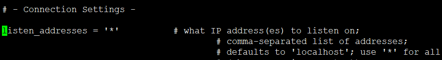
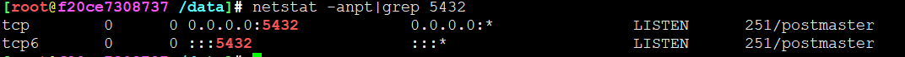
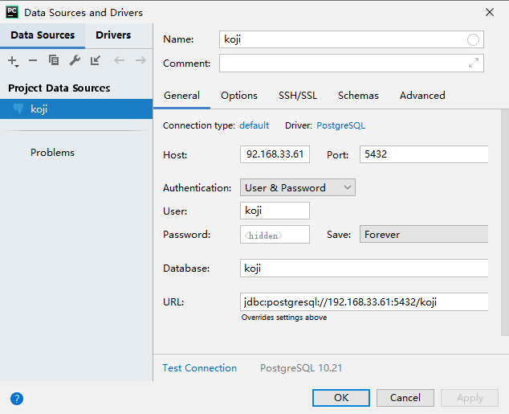
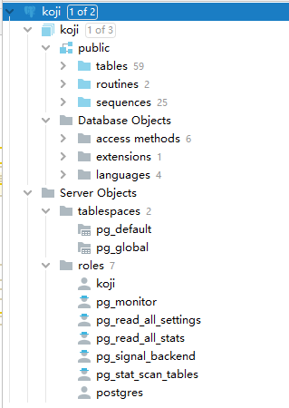
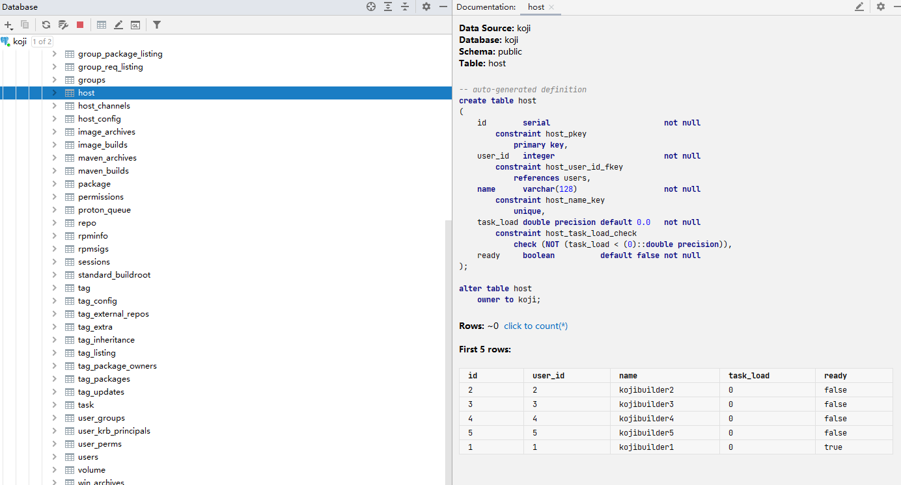
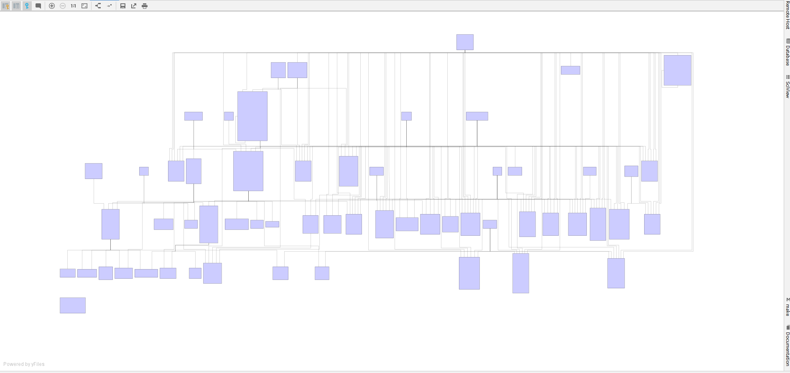
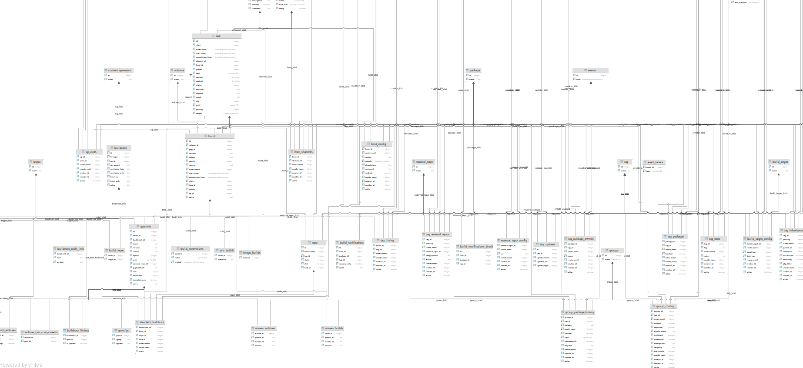
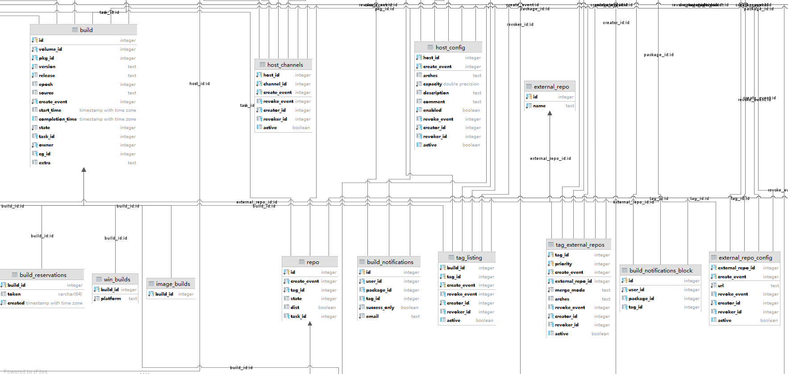
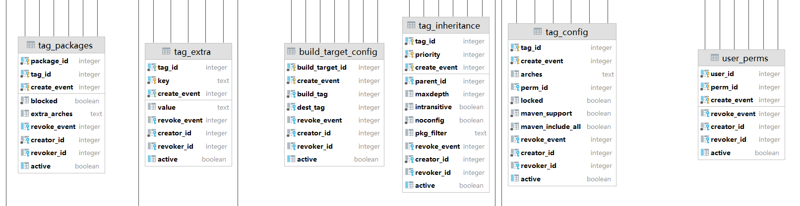

# koji-hub SQL表拆解

## 基本信息

* 显示所有数据库

```
su - koji -c "psql koji koji -c '\l'"
                              List of databases
   Name    |  Owner   | Encoding | Collate |  Ctype  |   Access privileges   
-----------+----------+----------+---------+---------+-----------------------
 koji      | koji     | UTF8     | C.UTF-8 | C.UTF-8 |
 postgres  | postgres | UTF8     | C.UTF-8 | C.UTF-8 |
 template0 | postgres | UTF8     | C.UTF-8 | C.UTF-8 | =c/postgres          +
           |          |          |         |         | postgres=CTc/postgres
 template1 | postgres | UTF8     | C.UTF-8 | C.UTF-8 | =c/postgres          +
           |          |          |         |         | postgres=CTc/postgres
(4 rows)
```

* 显示koji用户所有数据库表

```
su - koji -c "psql koji koji -c '\dt'"
                 List of relations
 Schema |           Name            | Type  | Owner
--------+---------------------------+-------+-------
 public | archive_components        | table | koji
 public | archive_rpm_components    | table | koji
 public | archiveinfo               | table | koji
 public | archivetypes              | table | koji
 public | btype                     | table | koji
 public | build                     | table | koji
 public | build_notifications       | table | koji
 public | build_notifications_block | table | koji
 public | build_reservations        | table | koji
 public | build_target              | table | koji
 public | build_target_config       | table | koji
 public | build_types               | table | koji
 public | buildroot                 | table | koji
 public | buildroot_archives        | table | koji
 public | buildroot_listing         | table | koji
 public | buildroot_tools_info      | table | koji
 public | cg_users                  | table | koji
 public | channels                  | table | koji
 public | content_generator         | table | koji
 public | event_labels              | table | koji
 public | events                    | table | koji
 public | external_repo             | table | koji
 public | external_repo_config      | table | koji
 public | group_config              | table | koji
 public | group_package_listing     | table | koji
 public | group_req_listing         | table | koji
 public | groups                    | table | koji
 public | host                      | table | koji
 public | host_channels             | table | koji
 public | host_config               | table | koji
 public | image_archives            | table | koji
 public | image_builds              | table | koji
 public | maven_archives            | table | koji
 public | maven_builds              | table | koji
 public | package                   | table | koji
 public | permissions               | table | koji
 public | proton_queue              | table | koji
 public | repo                      | table | koji
 public | rpminfo                   | table | koji
 public | rpmsigs                   | table | koji
 public | sessions                  | table | koji
 public | standard_buildroot        | table | koji
 public | tag                       | table | koji
 public | tag_config                | table | koji
 public | tag_external_repos        | table | koji
 public | tag_extra                 | table | koji
 public | tag_inheritance           | table | koji
 public | tag_listing               | table | koji
 public | tag_package_owners        | table | koji
 public | tag_packages              | table | koji
 public | tag_updates               | table | koji
 public | task                      | table | koji
 public | user_groups               | table | koji
 public | user_krb_principals       | table | koji
 public | user_perms                | table | koji
 public | users                     | table | koji
 public | volume                    | table | koji
 public | win_archives              | table | koji
 public | win_builds                | table | koji
(59 rows)

```

## 外部访问POSTGRESQL

















 


---
