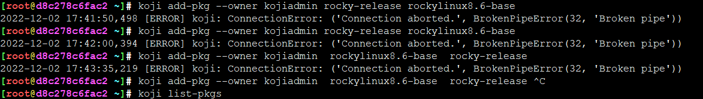
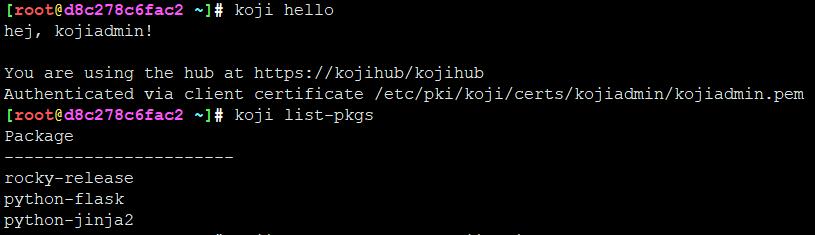
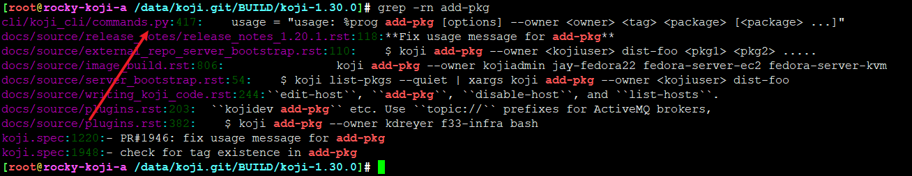
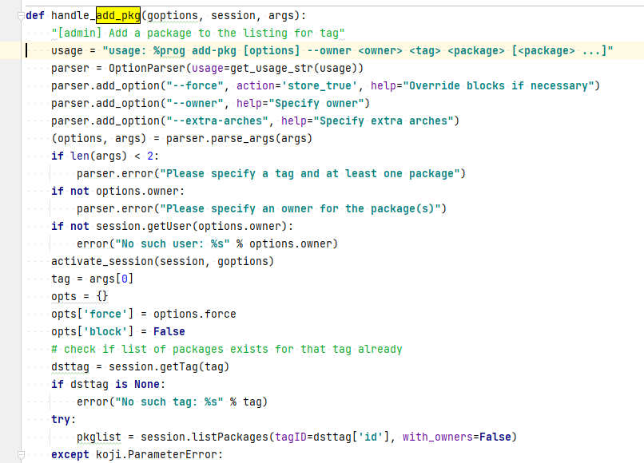
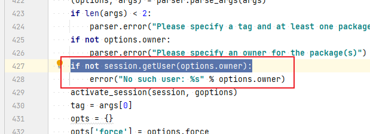
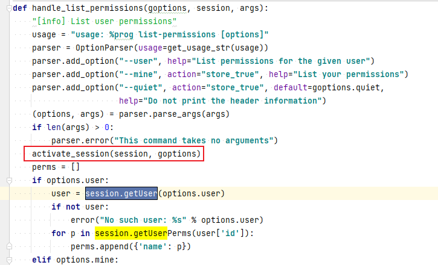
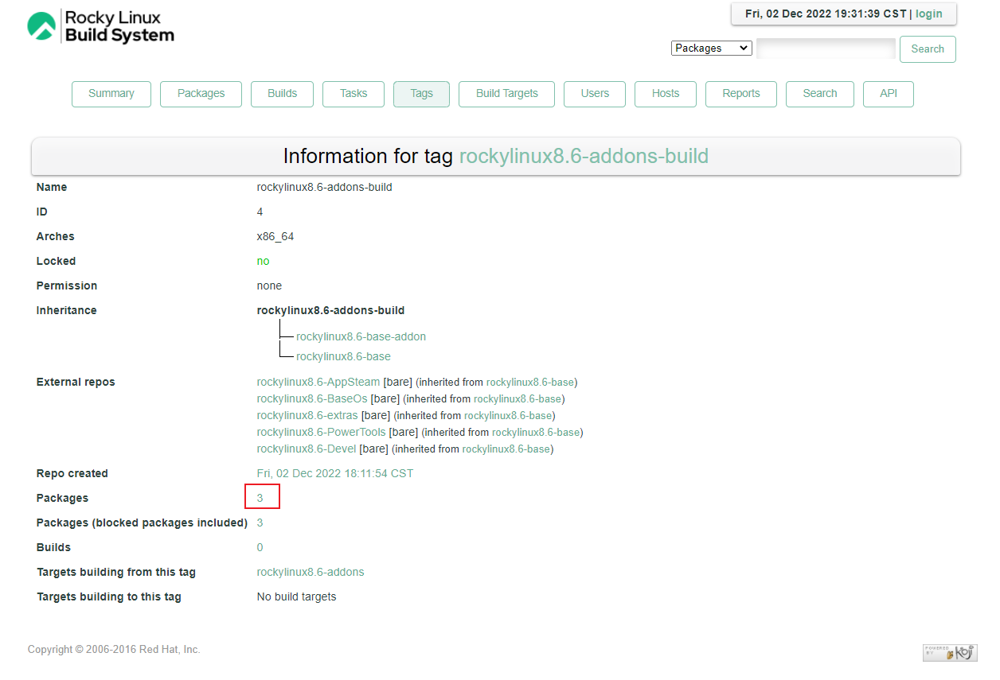
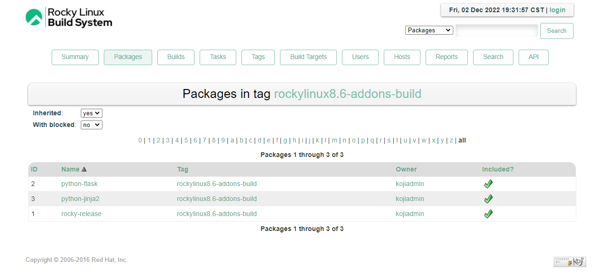

# koji-cli addpkg奔溃

## 题




爪子执行add-pkg直接奔溃？

其他命令都正常



## 解







毫无疑问，多半这里出问题，从这里开始要rpc了



对比一下，发现，类似操作都正常

正常的前提是有一个activate_session, handle_add_pkg咋没有？看来测试不过关呐，锤。。。

```
activate_session(session, goptions)
```






---
