<!-- MDTOC maxdepth:6 firsth1:1 numbering:0 flatten:0 bullets:1 updateOnSave:1 -->

- [kojid 编译git仓库](#kojid-编译git仓库)   
   - [错误处理: Could not find the fragment element](#错误处理-could-not-find-the-fragment-element)   
   - [错误: No rule to make target 'sources'.  Stop.](#错误-no-rule-to-make-target-sources-stop)   

<!-- /MDTOC -->

# kojid 编译git仓库


## 错误处理: Could not find the fragment element

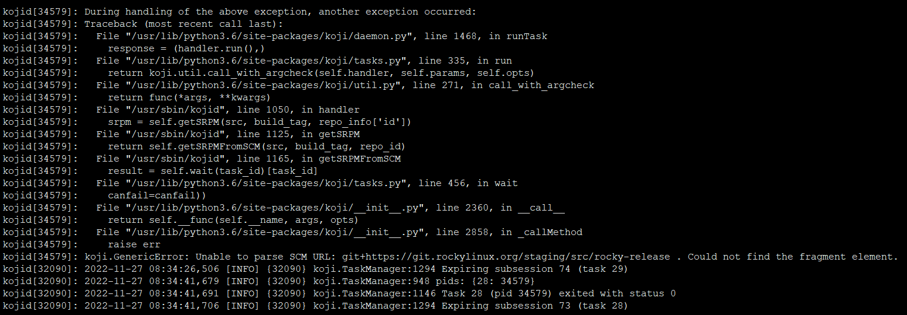

位置很明确

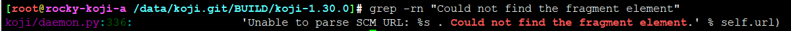

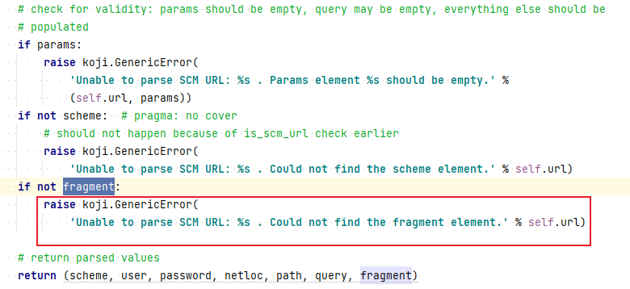


这里urllib.parse.urlparse

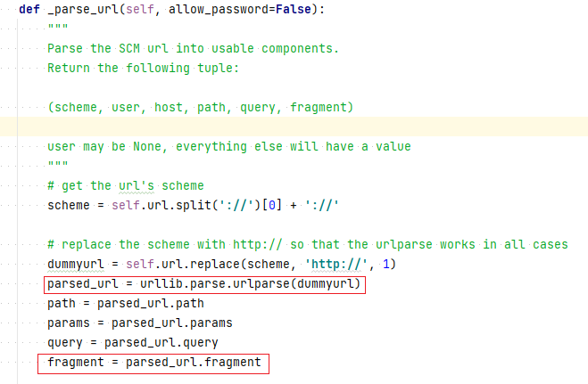


git+https://git.rockylinux.org/staging/src/rocky-release

```
scheme://netloc/path;parameters?query#fragment
```

* <https://www.bilibili.com/read/cv15032641>

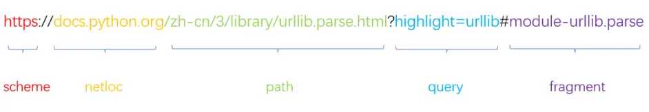


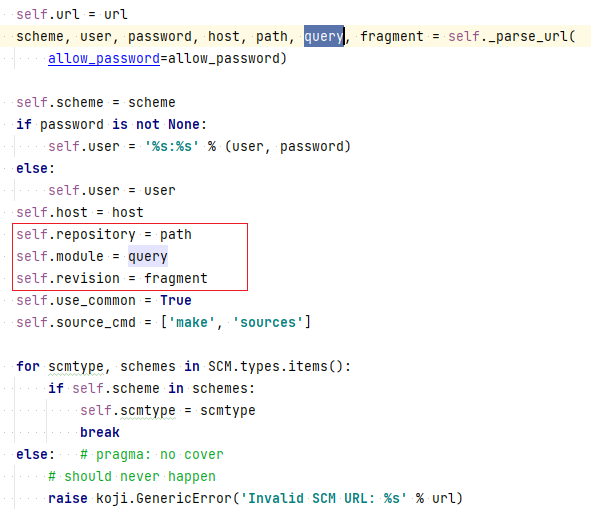

```
#koji build [tag] [scheme]://[user]@[hostname]/[path/to/repository]?[path/to/project]#[revision]
```

* <https://fedoraproject.org/wiki/Koji/KojiMisc>

```
git+https://git.rockylinux.org/staging/src/rocky-release?staging/src/rocky-release#r8
```

支持这几种scm同步

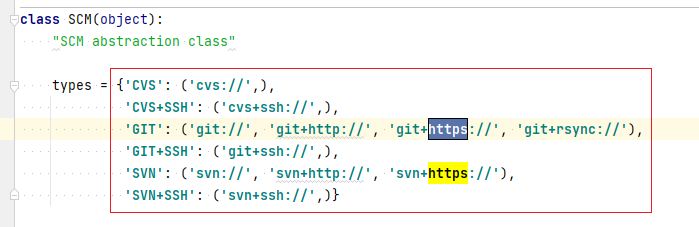


哪里来的common ?
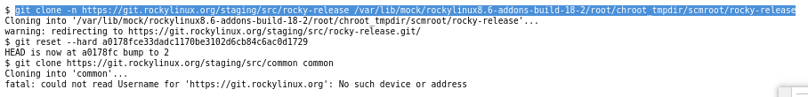

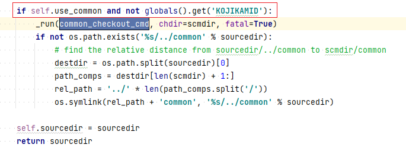


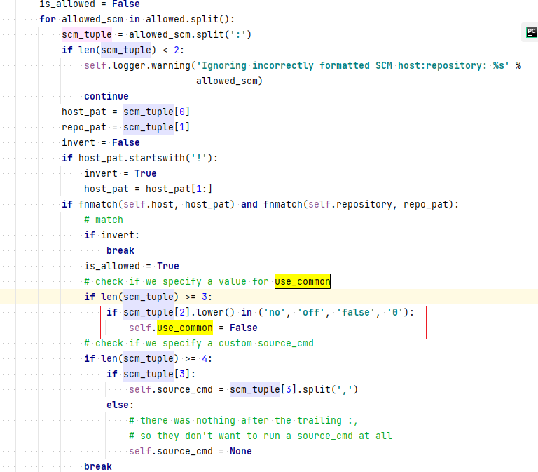

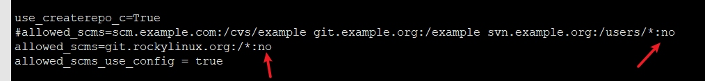

修改配置，添加":no" 即可


checkout就正常了

总结：git链接参数不对


## 错误: No rule to make target 'sources'.  Stop.

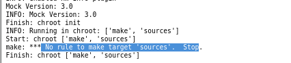

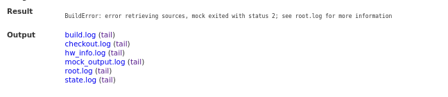

定位源码

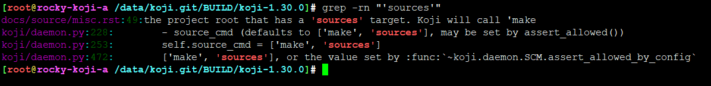

难道一定要有Makefile文件，一定要有sources目标？

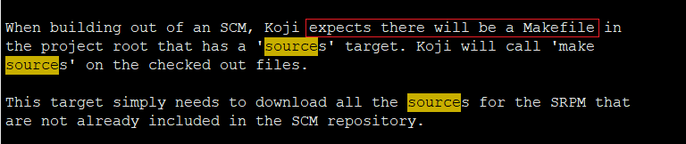

应该可以设置

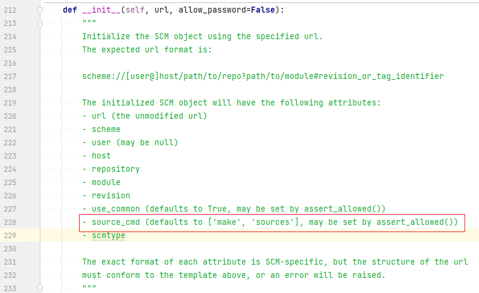


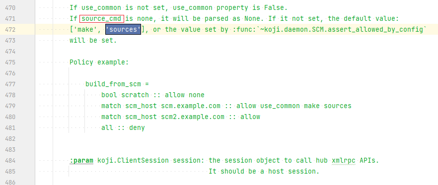

* <https://docs.pagure.org/koji/kojid_conf/>


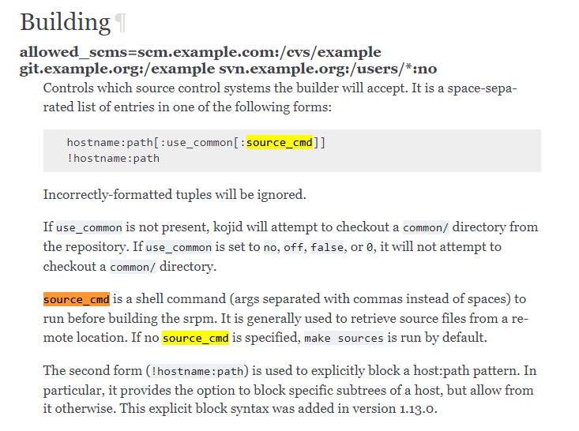

这里文档很明确

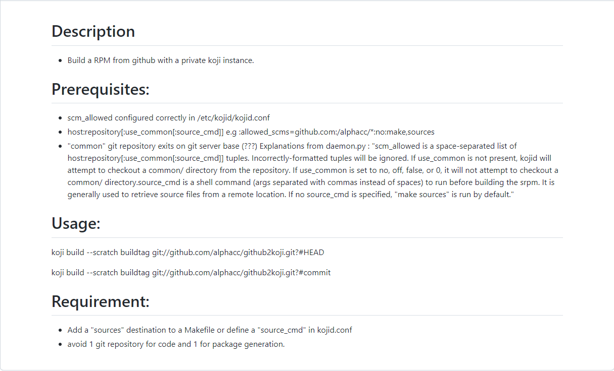


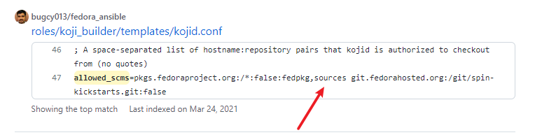

可以用fedpkg sources

```
allowed_scms=git.rockylinux.org:/*:no:fedpkg,sources


allowed_scms=git.rockylinux.org:/*:no:fedpkg,sources git.centos.org:/*:no git.rockylinux.org:/*:no gitee.com:/*:no github.com:/*:no

```

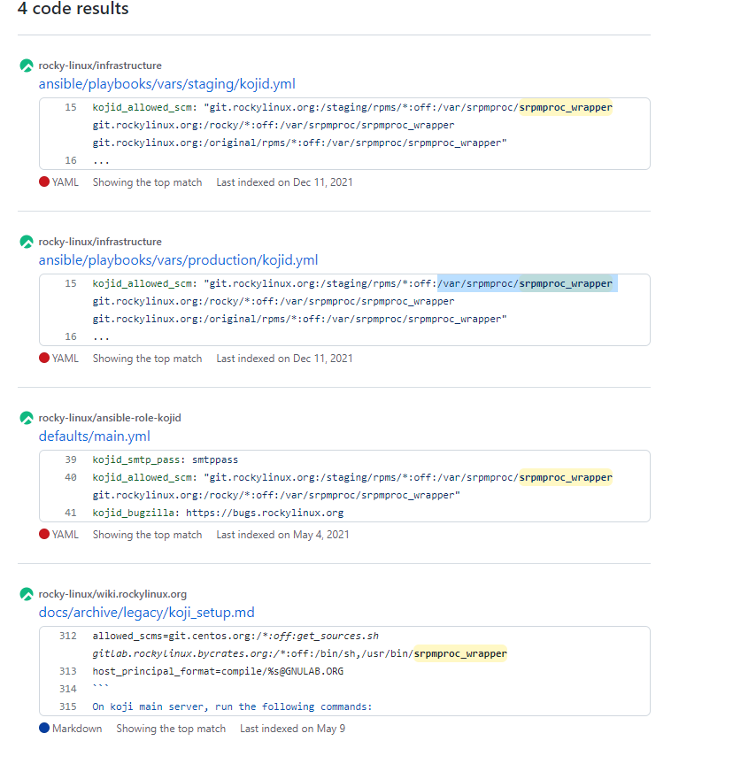

rocky用的是 ```/var/srpmproc/srpmproc_wrapper```

看起来像 ```https://github.com/rocky-linux/srpmproc```

```
---
# vars for kojid

kojid_vendor: Rocky
kojid_packager: infrastructure@rockylinux.org
kojid_distribution: Rocky
# These three should probably be specified by special vars
# kojid_web_url: https://koji.rockylinux.org/koji
# kojid_hub_url: https://koji.rockylinux.org/kojihub
# kojid_files_url: https://koji.rockylinux.org/kojifiles

kojid_ca_bundle: /etc/pki/tls/certs/ca-bundle.crt
kojid_keytab: /etc/kojid.keytab
kojid_smtp_host: smtp.rockylinux.org
kojid_allowed_scm: "git.rockylinux.org:/staging/rpms/*:off:/var/srpmproc/srpmproc_wrapper git.rockylinux.org:/rocky/*:off:/var/srpmproc/srpmproc_wrapper git.rockylinux.org:/original/rpms/*:off:/var/srpmproc/srpmproc_wrapper"
...
```

* <https://github.com/rocky-linux/wiki.rockylinux.org/blob/d9577615315996e588379123018a2b03b5a53ee4/docs/archive/legacy/koji_setup.md>

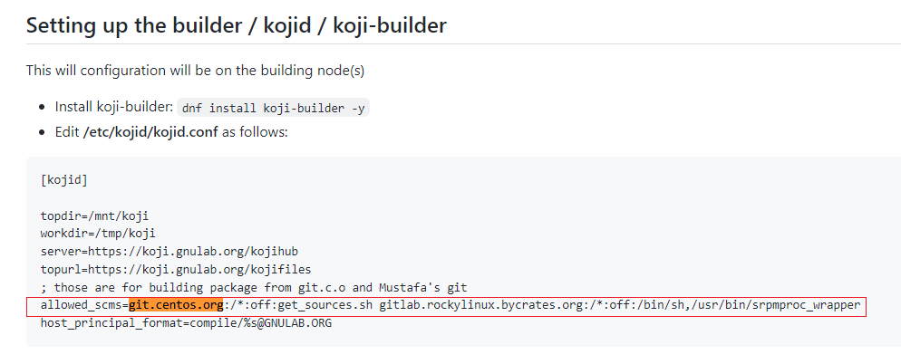


总结：

源码包->srcrpm的过程

对于centos，scm-> srpm有工具	```get_sources.sh```

<https://git.centos.org/centos-git-common/tree/master>

```
git clone https://git.centos.org/centos-git-common
cp centos-git-common/* /bin/ -a
chmod +x /bin/get_sources.sh

git clone https://git.centos.org/rpms/acpid
cd acpid
git checkout c8
get_sources.sh
```

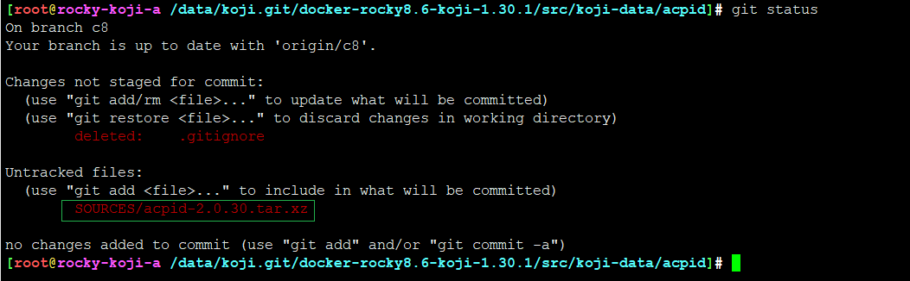

这个操作，其实是获取源代码而已，不是构建srcrpm包


对于rockylinux,


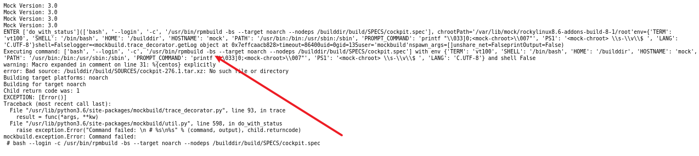 


---
