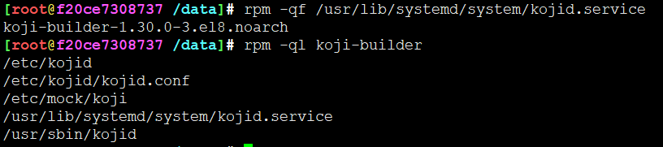
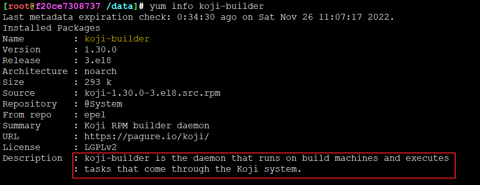
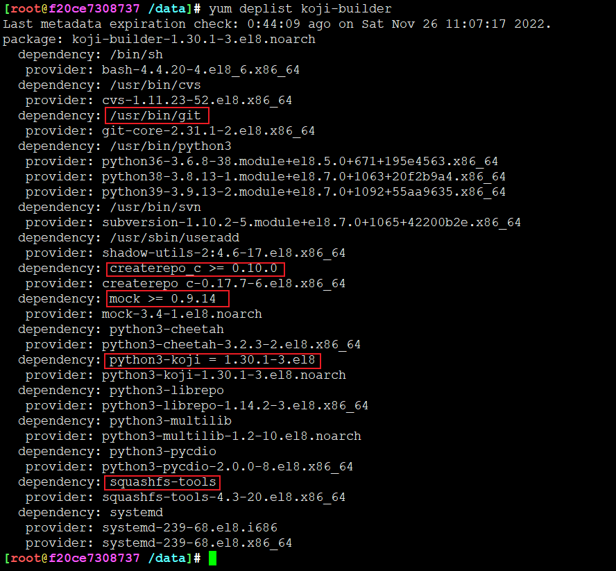
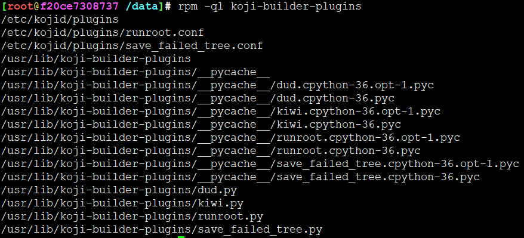
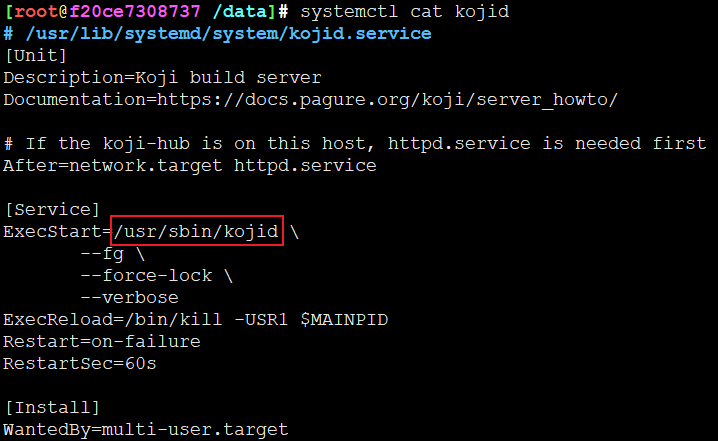
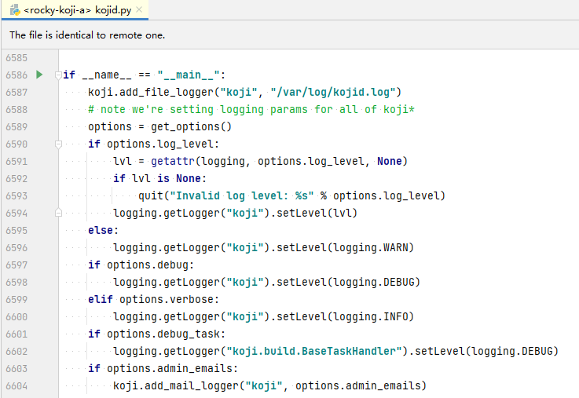
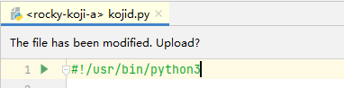
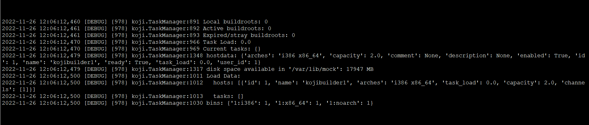

<!-- MDTOC maxdepth:6 firsth1:1 numbering:0 flatten:0 bullets:1 updateOnSave:1 -->

- [kojid builder入口解析](#kojid-builder入口解析)   
   - [kojid相关包](#kojid相关包)   
   - [配置/etc/kojid/kojid.conf](#配置etckojidkojidconf)   
   - [kojid基本玩法](#kojid基本玩法)   

<!-- /MDTOC -->

# kojid builder入口解析


## kojid相关包









三个关键文件

1. 配置文件 /etc/kojid/kojid.conf
2. systemd服务 kojid /usr/lib/systemd/system/kojid.service
3. kojid服务入口 /usr/sbin/kojid



入口就在这里



有shebang，直接用python3执行即可




## 配置/etc/kojid/kojid.conf

```
kojid.conf
[kojid]
sleeptime=15
maxjobs=10
topdir=/mnt/koji
workdir=/tmp/koji
chroot_tmpdir = /chroot_tmpdir

mockdir=/var/lib/mock
mockuser=kojibuilder


vendor=Koji
packager=Koji
distribution=Koji
mockhost=koji-linux-gnu
rpmbuild_timeout=86400
; user=kojid
; password=kojid

cert = /etc/pki/koji/certs/kojibuilder1/kojibuilder1.pem
serverca = /etc/pki/koji/koji_ca_cert.crt

server=http://kojihub/kojihub
topurl=http://kojihub/kojifiles

use_createrepo_c=True
allowed_scms=scm.example.com:/cvs/example git.example.org:/example svn.example.org:/users/*:no
allowed_scms_use_config = true
smtphost=example.com
from_addr=Koji Build System <buildsys@example.com>
```

## kojid基本玩法



周期性的访问kojihub，拉取编译信息，包括

```
Local buildroots: 0
Active buildroots: 0
Expired/stray buildroots: 0
Task Load: 0.0
Current tasks: {}
hostdata: {'arches': 'i386 x86_64', 'capacity': 2.0, 'comment': None, 'description': None, 'enabled': True, 'id': 1, 'name': 'kojibuilder1', 'ready': True, 'task_load': 0.0, 'user_id': 1}
disk space available in '/var/lib/mock': 17949 MB
Load Data:
hosts: [{'id': 1, 'name': 'kojibuilder1', 'arches': 'i386 x86_64', 'task_load': 0.0, 'capacity': 2.0, 'channels': [1]}]
tasks: []
bins: {'1:i386': 1, '1:x86_64': 1, '1:noarch': 1}
```


---
