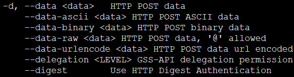
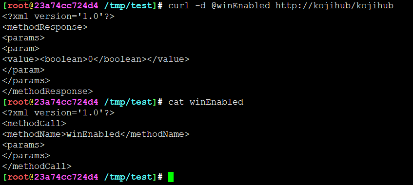
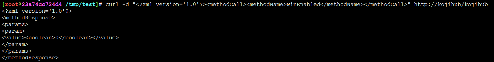
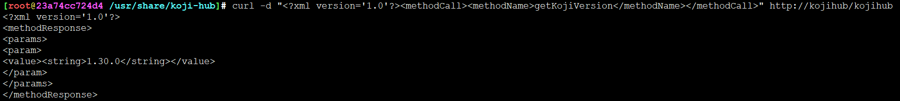
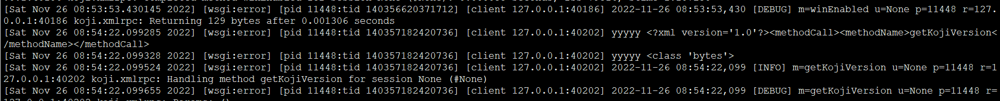
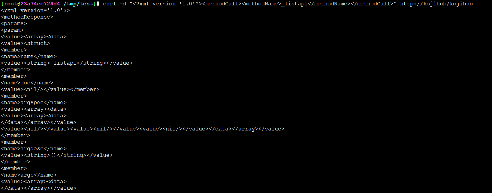
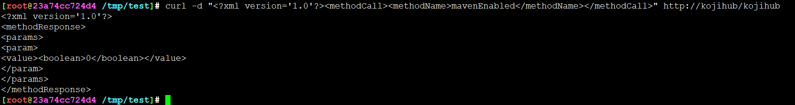

<!-- MDTOC maxdepth:6 firsth1:1 numbering:0 flatten:0 bullets:1 updateOnSave:1 -->

- [curl发送调试请求](#curl发送调试请求)   
   - [基本格式](#基本格式)   
   - [实例](#实例)   
      - [winEnabled](#winenabled)   
      - [koji版本](#koji版本)   
      - [获取API列表](#获取api列表)   
      - [mavenEnabled列表](#mavenenabled列表)   
      - [listChannels](#listchannels)   
      - [listHosts](#listhosts)   
      - [listUsers](#listusers)   
      - [getBuildTargets](#getbuildtargets)   
      - [listTags](#listtags)   

<!-- /MDTOC -->

# curl发送调试请求

## 基本格式

1. 直接将xml放到data参数

```
curl -d "<?xml version='1.0'?><methodCall><methodName>XXXXX</methodName><params></params></methodCall>" http://kojihub/kojihub
```

2. xml放在FILENAME中，‘@’符号不可省略

```
curl -d @FILENAME http://kojihub/kojihub
```




## 实例


### winEnabled

```
curl -d "<?xml version='1.0'?><methodCall><methodName>winEnabled</methodName></methodCall>" http://kojihub/kojihub
```






### koji版本

```
curl -d "<?xml version='1.0'?><methodCall><methodName>getKojiVersion</methodName></methodCall>" http://kojihub/kojihub
```





### 获取API列表

```
curl -d "<?xml version='1.0'?><methodCall><methodName>_listapi</methodName></methodCall>" http://kojihub/kojihub
```



### mavenEnabled列表

```
curl -d "<?xml version='1.0'?><methodCall><methodName>mavenEnabled</methodName></methodCall>" http://kojihub/kojihub
```




### listChannels

```
curl -d "<?xml version='1.0'?><methodCall><methodName>listChannels</methodName></methodCall>" http://kojihub/kojihub
```

### listHosts

```
curl -d "<?xml version='1.0'?><methodCall><methodName>listHosts</methodName></methodCall>" http://kojihub/kojihub
```


### listUsers

```
curl -d "<?xml version='1.0'?><methodCall><methodName>listUsers</methodName></methodCall>" http://kojihub/kojihub
```


### getBuildTargets

```
curl -d "<?xml version='1.0'?><methodCall><methodName>getBuildTargets</methodName></methodCall>" http://kojihub/kojihub
```


### listTags

```
curl -d "<?xml version='1.0'?><methodCall><methodName>listTags</methodName></methodCall>" http://kojihub/kojihub
```


---
