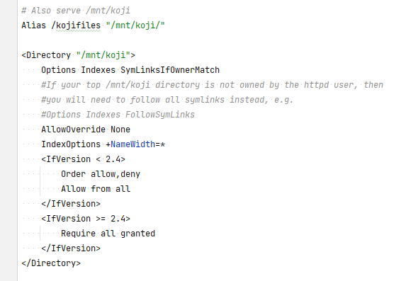
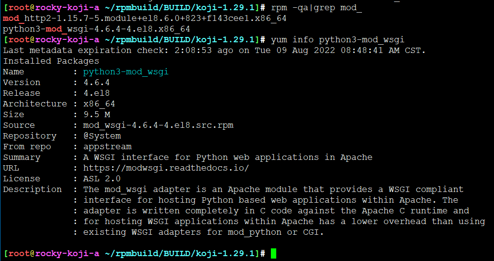
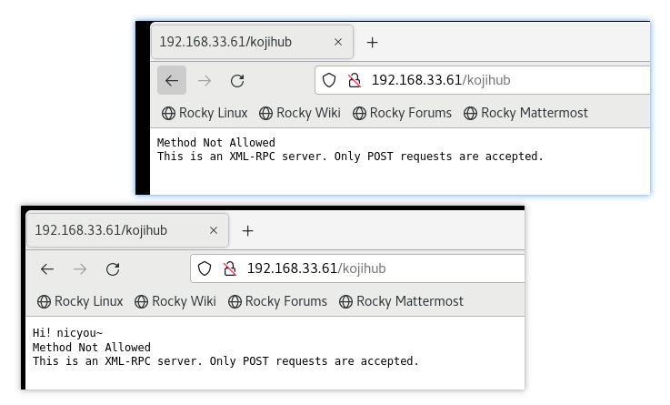
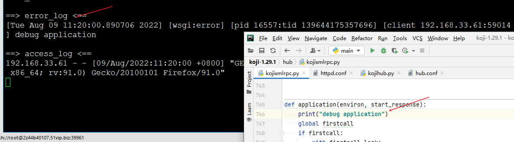

<!-- MDTOC maxdepth:6 firsth1:1 numbering:0 flatten:0 bullets:1 updateOnSave:1 -->

- [httpd如何运行koji-hub](#httpd如何运行koji-hub)   
   - [httpd配置](#httpd配置)   
   - [application入口](#application入口)   

<!-- /MDTOC -->
# httpd如何运行koji-hub


## httpd配置




入口包含两个路径，一个是kojihub的rpc server，另一个是存储仓库，其实就是个文件服务器

重点在rpc server


没有main，httpd怎么运行python的？

有个模块，叫 python3-mod_wsgi , 相当于网关，把web请求转为python




好的，入口是application


修改py代码需要重启服务，哈哈，很python



把这里on了就能自动更新


细看application，开头，加载初始化，内容很多呀


怎么打调试信息？



添加print可以出现在```/var/log/httpd/error_log```


## application入口

```
def application(environ, start_response):  
  status = '200 OK'   
  output = 'Hello World!'  
  response_headers = [('Content-type', 'text/plain'),  
                      ('Content-Length', str(len(output)))]  
  start_response(status, response_headers)  
  return [output]  
```

```
def application(environ,start_response):
  start_response( " 200 OK " ,[( ' content-type ' , " text/html " )])
  return [ ' <html><body>Hello world!</body></html> ' ]
```


* <https://www.liaoxuefeng.com/wiki/1016959663602400/1017805733037760>

environ是什么？

```
The environ dictionary is required to contain these CGI environment variables, as defined by the Common Gateway Interface specification [2]. The following variables must be present, unless their value would be an empty string, in which case they may be omitted, except as otherwise noted below.
```


start_response是什么？

```
The start_response() Callable
The second parameter passed to the application object is a callable of the form start_response(status, response_headers, exc_info=None). (As with all WSGI callables, the arguments must be supplied positionally, not by keyword.) The start_response callable is used to begin the HTTP response, and it must return a write(body_data) callable (see the Buffering and Streaming section, below).
```


* application()函数必须由WSGI服务器来调用。有很多符合WSGI规范的服务器，我们可以挑选一个来用。但是现在，我们只想尽快测试一下我们编写的application()函数真的可以把HTML输出到浏览器，所以，要赶紧找一个最简单的WSGI服务器，把我们的Web应用程序跑起来。
* 整个application()函数本身没有涉及到任何解析HTTP的部分，也就是说，底层代码不需要我们自己编写，我们只负责在更高层次上考虑如何响应请求就可以了。
* 从environ这个dict对象拿到HTTP请求信息，然后构造HTML，通过start_response()发送Header，最后返回Body


---
