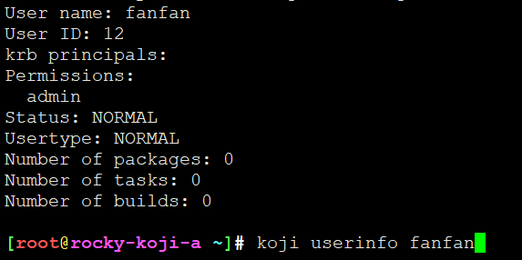

# koji身份认证


```
insert into users (name, status, usertype) values ('admin-user-name', 0, 0);
```

下面的命令将为一个用户分配系统管理员权限。为了完成权限分配工作您需要知道这个用户的 ID 。

```
insert into user_perms (user_id, perm_id, creator_id) values (5, 1, 5);

insert into user_perms (user_id, perm_id, creator_id) values (5, 1, 5);


```

koji add-host kojibuilder1 x86_64 i386

koji add-host kojibuilder2 x86_64 i386
koji add-host kojibuilder3 x86_64 i386
koji add-host kojibuilder4 x86_64 i386
koji add-host kojibuilder5 x86_64 i386
koji=> select * from users;


## 权限


```
koji add-user XXX
koji grant-permission admin XXX
koji userinfo XXX

koji disable-user XXX
koji enable-user XXX
```




没有list-user、list-users


---
