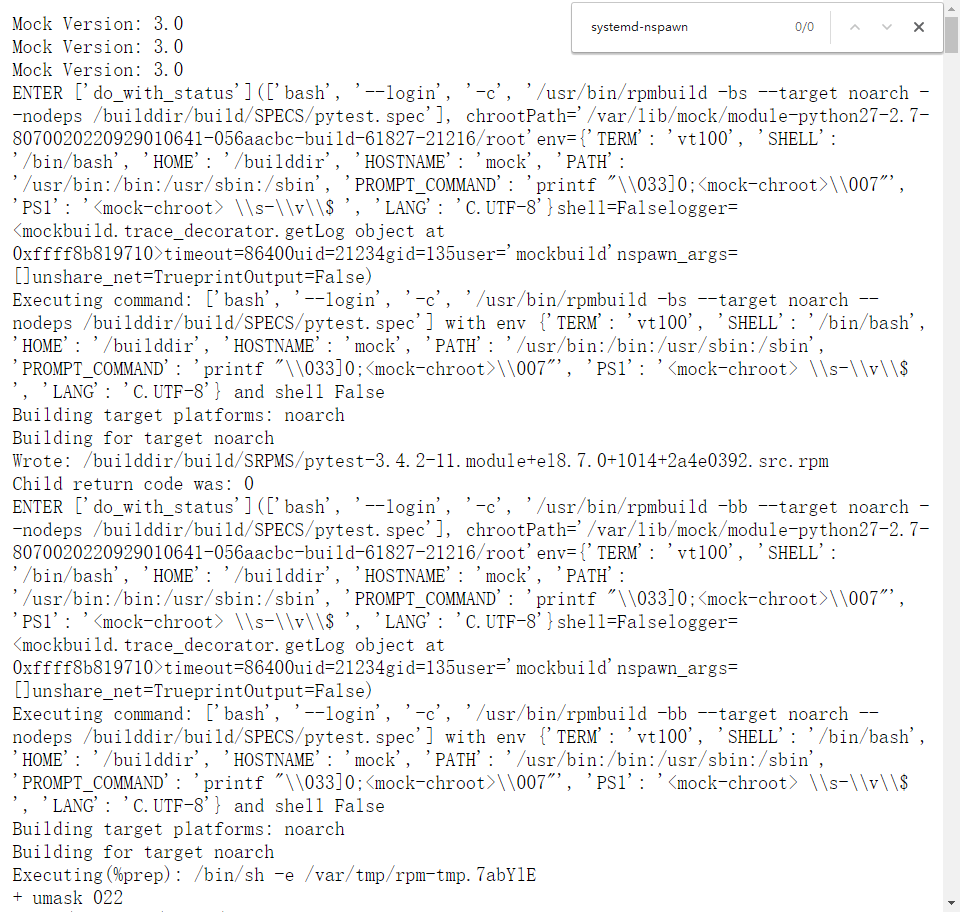

# mock中使用systemd-nspawn

## 题

mock中默认使用chroot切换到目标rootfs进行编译

当前最新最骚玩法是用systemd-nspawn，其运行高度类似docker，区别在于可以直接基于一个rootfs目录启动，容器不得搞成镜像

举栗子：

rockylinux koji编译环境，有些就是用的nspwan，但有些不是

<https://kojidev.rockylinux.org/kojifiles/packages/pytest/3.4.2/11.el8/data/logs/noarch/build.log>

<https://kojidev.rockylinux.org/kojifiles/packages/pytest/3.4.2/11.module+el8.7.0+1014+2a4e0392/data/logs/noarch/build.log>

那么，问题来了，koji如何配置，让builder在mock编译阶段使用 systemd-nspawn 方式， 把控开关在哪？是否有配置？

## 解

待解

---
