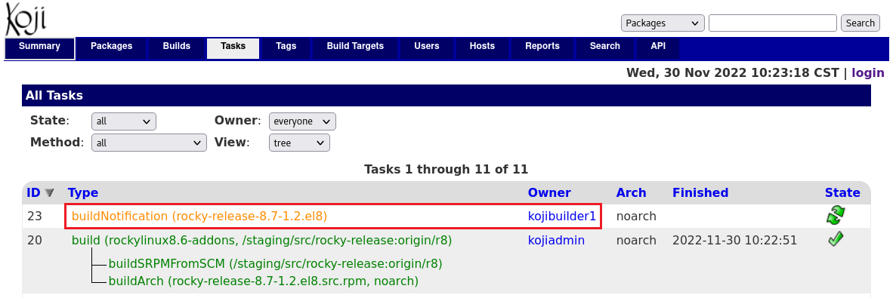
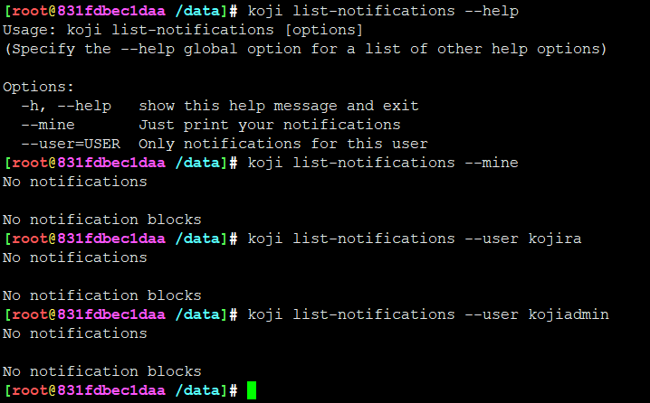
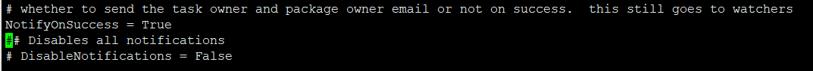
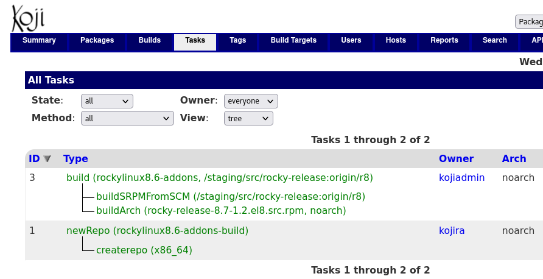

# task执行后notification使用及解析

## 题

每次编译过后，builder会发送buildNotification，当然，没配置肯定总是失败

首先，怎么打通这个buildNotification

其次，怎么关闭buildNotification

再者，怎么修改为钉钉、企业微信来buildNotification ？

最后，koji cli也有相关notification命令，有啥关联，什么原理，怎么玩？

## 解

kojihub控制，可以关闭所有notification

实测，很安静

---
