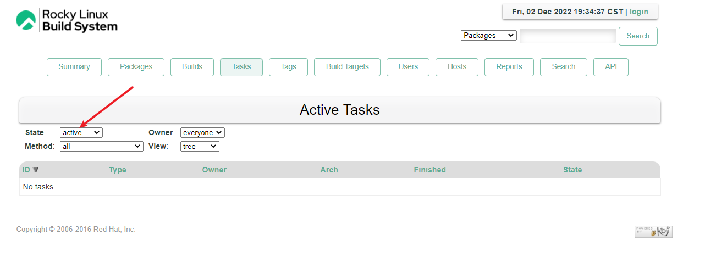
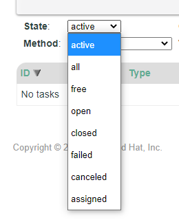
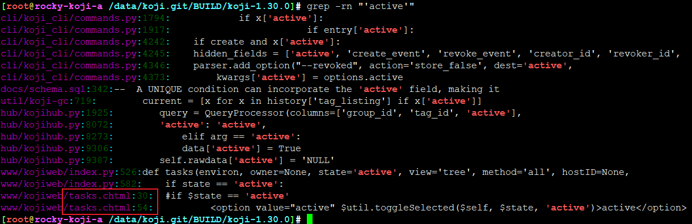
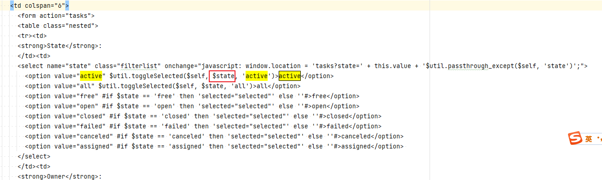
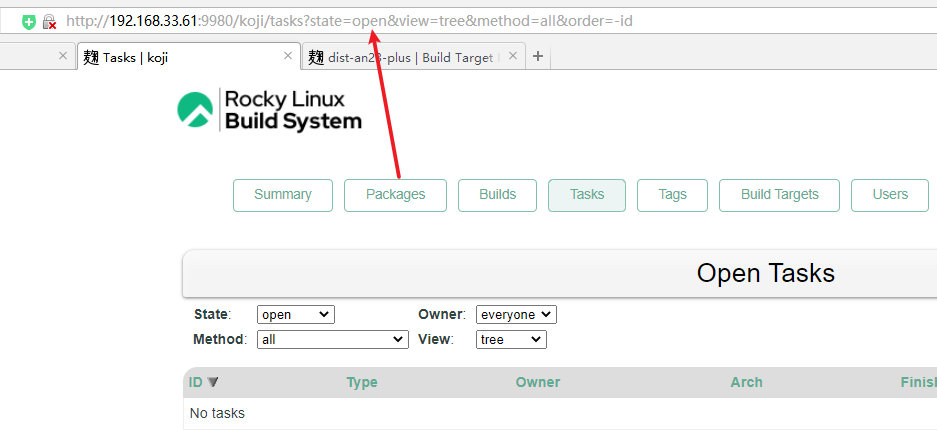
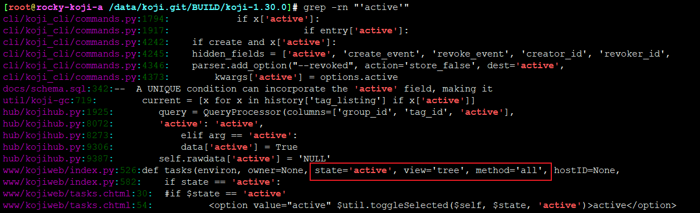
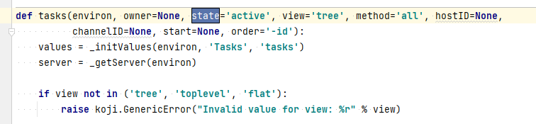
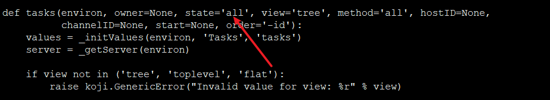
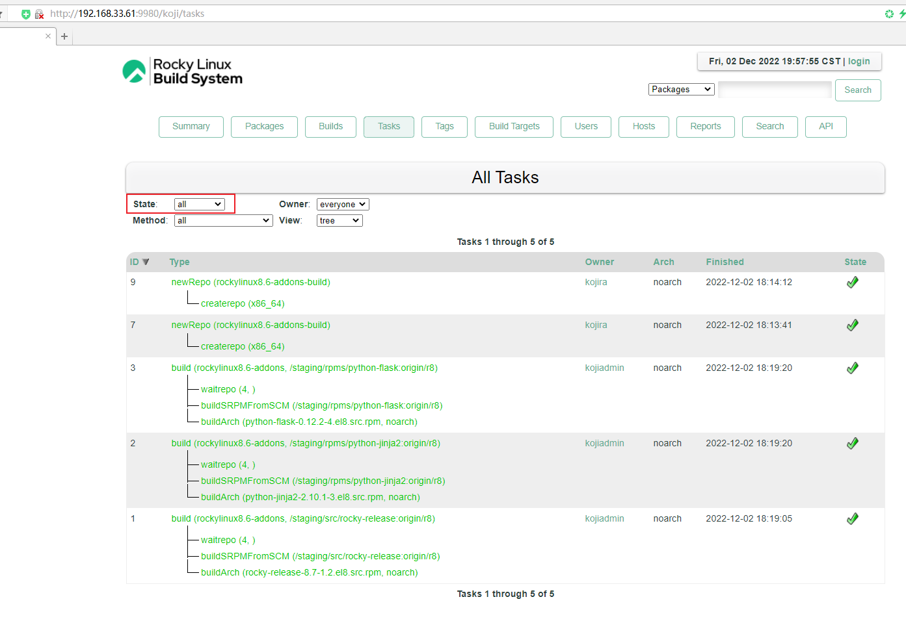

# koji-web 修改默认显示全部task

## 题

默认tasks栏，显示的近active的任务，如何让他默认显示全部呢？

## 解

关键字定位，前端是chtml渲染一下

state值是传递进去的，

根据请求参数传递，那么默认肯定也有一个值在代码里

定位到tasks函数

改成all , 重启httpd服务

好了，默认tasks栏就是显示all，完美

---
