<!-- MDTOC maxdepth:6 firsth1:1 numbering:0 flatten:0 bullets:1 updateOnSave:1 -->

- [koji-hub 入口程序application](#koji-hub-入口程序application)   
   - [入口application](#入口application)   
   - [线程锁](#线程锁)   
   - [初始化server_setup](#初始化server_setup)   
   - [判断是否为POST请求](#判断是否为post请求)   
   - [判断服务状态](#判断服务状态)   
   - [rpc处理](#rpc处理)   
      - [统计内存开销](#统计内存开销)   
      - [将数据塞到线程](#将数据塞到线程)   
      - [路由处理](#路由处理)   
   - [善后动作](#善后动作)   
   - [查看用户请求body](#查看用户请求body)   

<!-- /MDTOC -->

# koji-hub 入口程序application

## 入口application

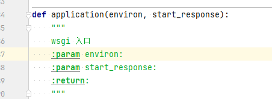

根据前序分析，入口写法固定，wsgi会去调用该py文件的application入口

## 线程锁

线程初始化需要串行，使用了线程锁，得不到就等待，但是不能同时进入临界区

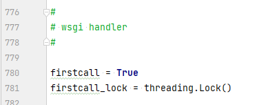

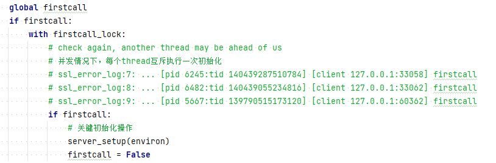

简单粗暴增加一个调试输出语句，

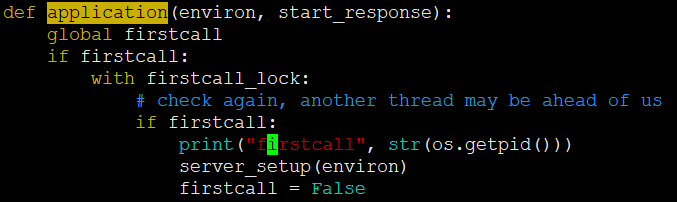

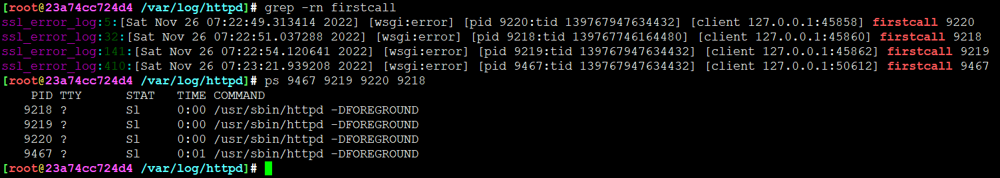

如果每次请求都初始化线程处理，那绝对尴尬，此处是多进程多线程方式

在一个进程中，每个线程的id唯一，不同的进程可能有tid相同的线程。

每个httpd进程，如果有处理application，只会做一次初始化。firstcall是所有线程共享的全局变量。


## 初始化server_setup

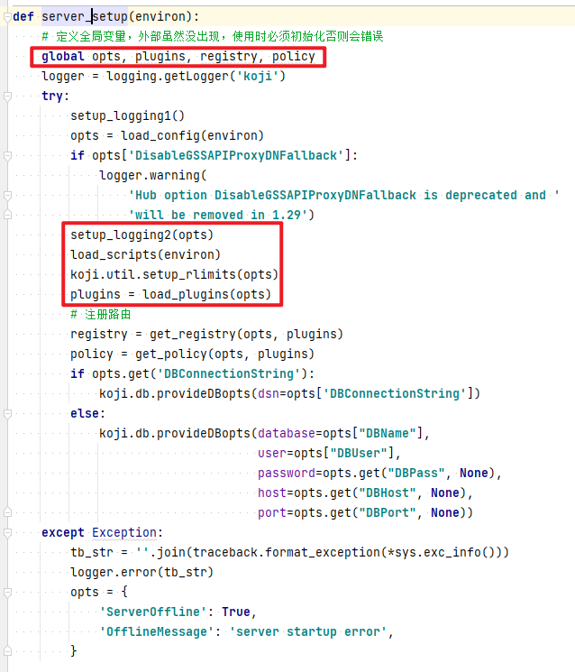

函数内部定义了全局变量，但是代码外，没见，不过执行流之后的代码都可以用这些全局变量

初始化很关键，各种路由注册

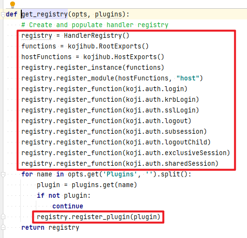

这些就是在其他py文件中，基本都是在隔壁那个kojihub.py文件，这个文件贼大，行数1.5W

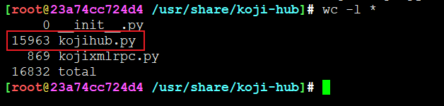

该文件定义了各种路由方法及对应操作。

一个rpc请求 = 方法+参数，方法说白了就是路由函数，参数就是传递给路由函数的参数。

## 判断是否为POST请求

为什么这个判断不是在初始化之前操作呢？

每个进程初始化只有一次，放在之后比较合理


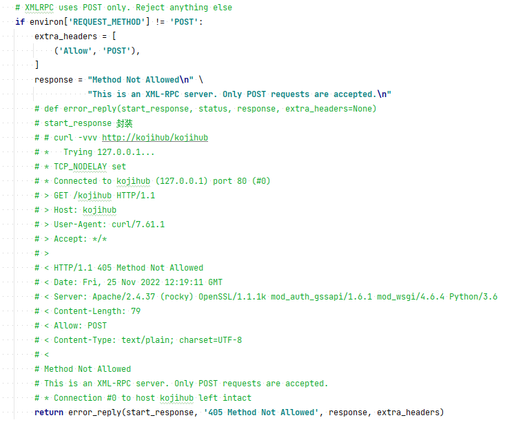

这里明显判断请求是否为POST，只支持POST请求，其他均返回错误

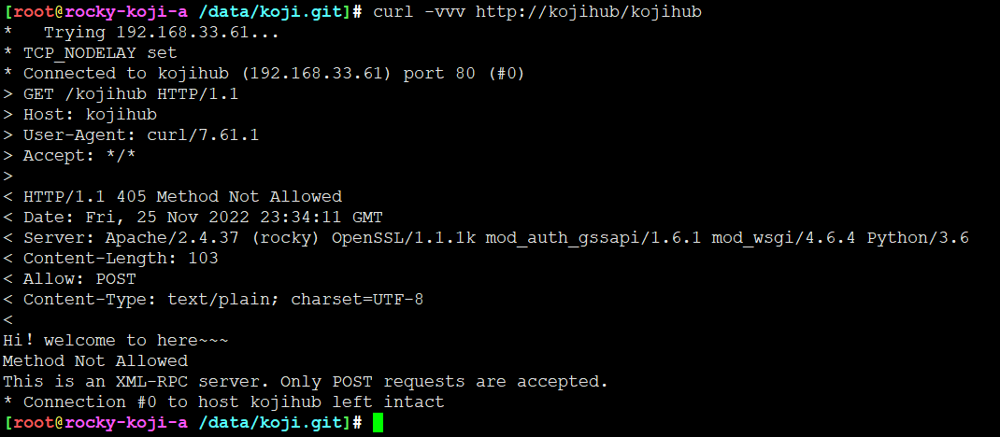


## 判断服务状态

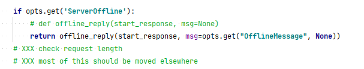

如果其他线程在遇到致命错误，可以将服务状态置为不可用，此时再有请求来，直接返回不可用


## rpc处理


接下来的一个 ```if 1```,有啥用？？

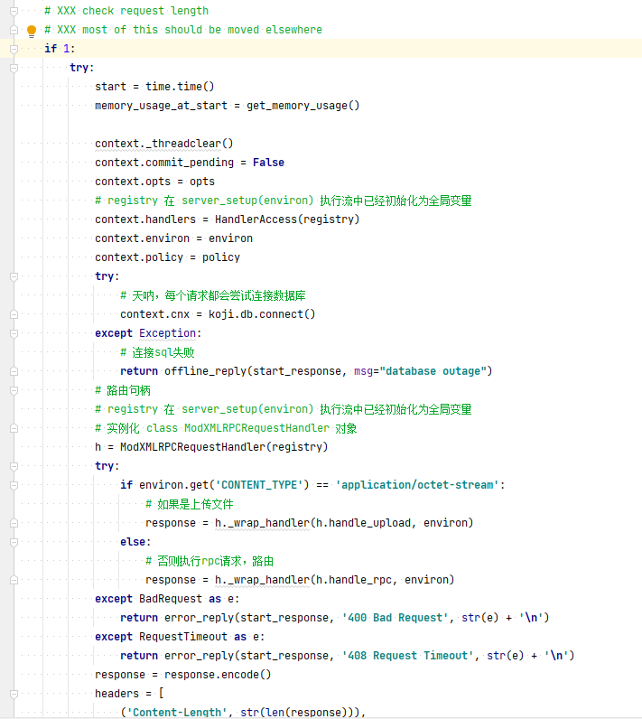

rpc处理任何环节都可能吐核，直接放到一个异常捕获笼子里

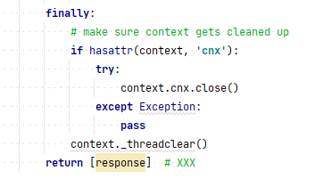

无论何种情况，都会释放上下文，返回response。

不能做到100%请求都正常处理，但是一旦不正常和正常跳变情况下，总有机会执行正常

### 统计内存开销


记录执行rpc方法前的内存开销，执行后的内存开销，统计方法处理是否超过阈值

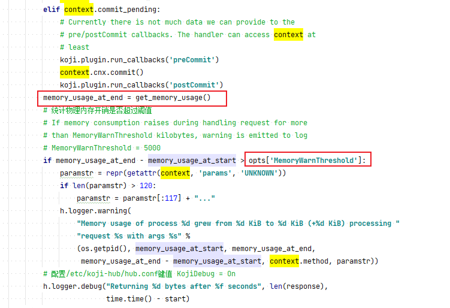

阈值记录在 opts['MemoryWarnThreshold']

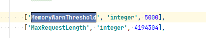

默认是5000B，配置在/etc/koji-hub/hub.conf

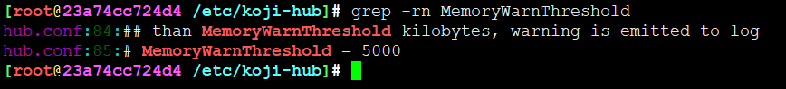


### 将数据塞到线程

每个请求，毫无疑问，最终肯定是某个线程处理。但是线程要共享，A请求X线程，B请求也可以X线程，只是并发时序的问题。但是线程处理过程中会有数据交互，总得带点请求特有的信息，比如说请求方法、参数等，真正进入到路由执行阶段仍然可以根据线程获取到这些基本信息。

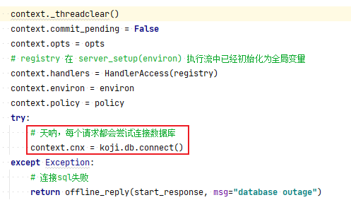

对，每次请求都会访问SQL

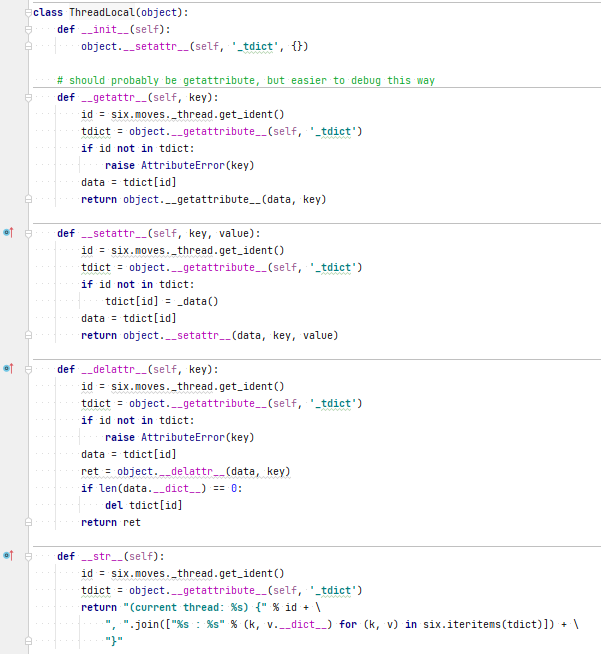

如何描述线程嘞？毫无疑问，定义一个线程元数据全局变量

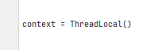

每个线程都会实例化，往里面塞数据，但是为了复用，信息需要在请求处理结束后清空，没错，这个就是session

线程复用，session不复用，每次都会创建session、清空session

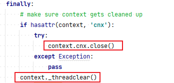

SQL句柄会释放，信息字典清空

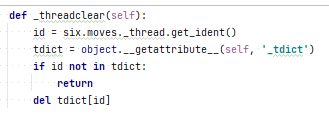


### 路由处理

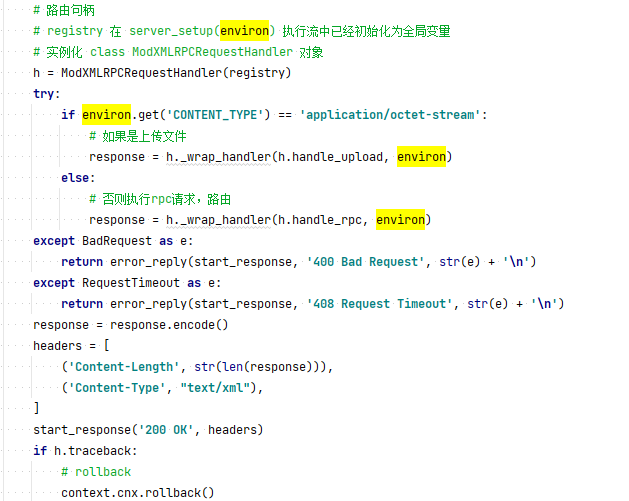

关键处，这里首先从全局变量registry获取路由句柄，根据请求内容调用不同方法处理。

实际操作句柄还可以分类，根据实际功能，分为上传文件的请求、常规RPC请求两大类

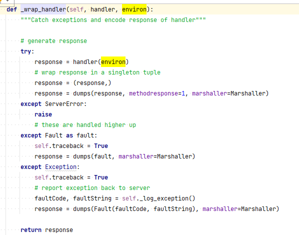


如果是rpc请求

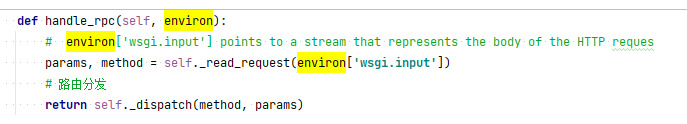

这里很重要，rpc请求说白了就是常规的POST请求，但是里面数据有个标准，规范的POST请求数据

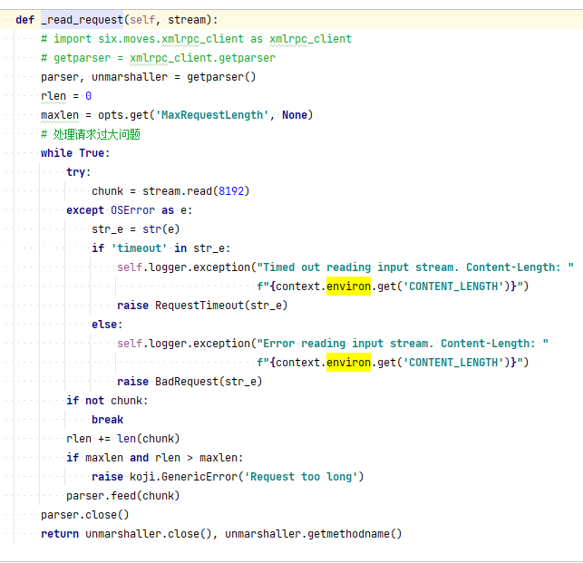

规则定义了，数据规范了，解析的时候根据规则提取对应字段赋值交付给使用者就行，这样使用者就不用去care中间数据传递问题，只关注业务逻辑即可，简单说，偷懒

environ['wsgi.input'] 里存放了用户请求body的信息，参数解析就是数据处理，处理的就是body

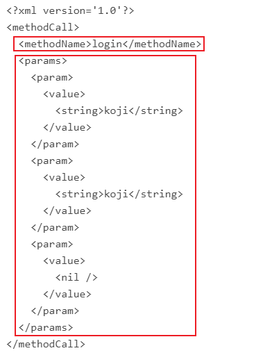

格式其实可以很简单，符合xml规则的文本，有个methodName请求方法，一堆参数

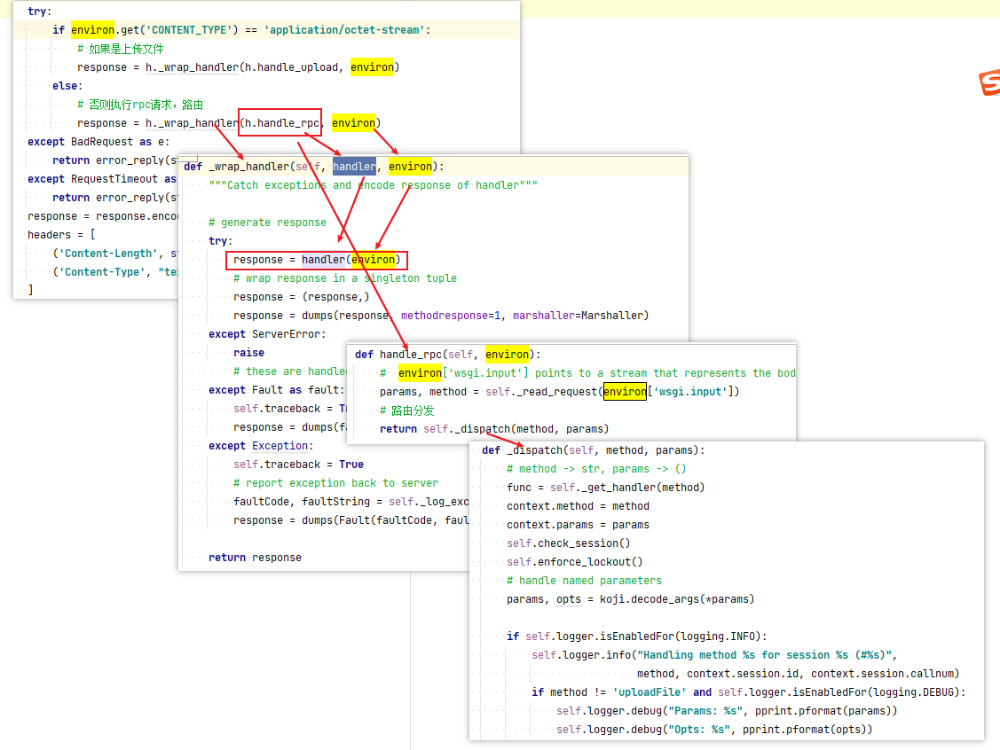

调来调去，其实就是找到methodName对应的路由函数，参数传递，路由函数跑一遍，返回，完事儿。

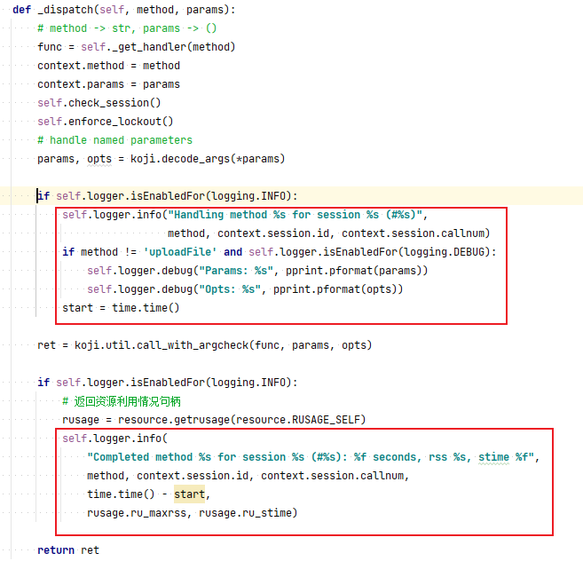

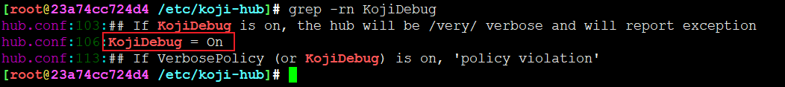

配置文件里面打开调试，可以看到函数执行详情

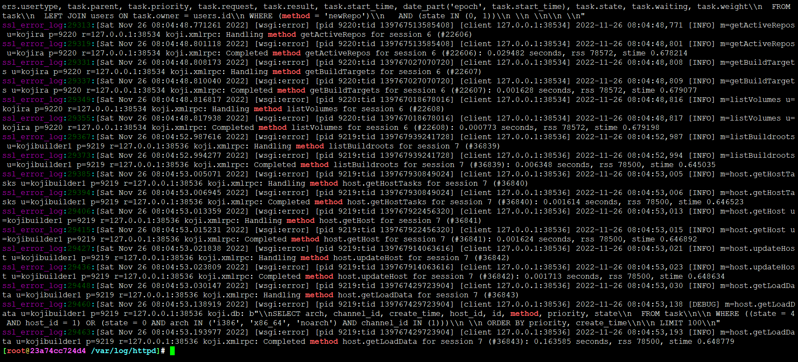


## 善后动作

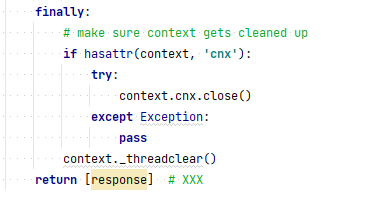


清空SQL连接，清楚session信息


## 查看用户请求body

上面说过，所有内容都封装environ，body信息在哪？

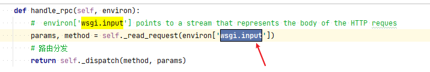

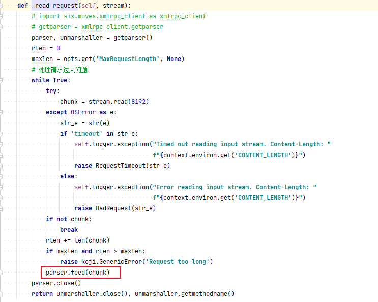

没错，就是这里的chunk


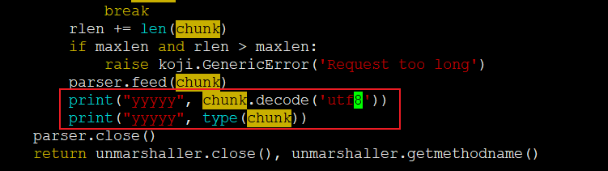

加点调试

web页面点击Hosts测试一下，一次请求发了很多rpc请求，同一个pid不同tid处理

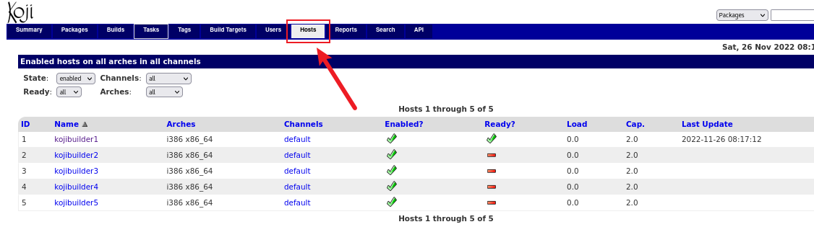

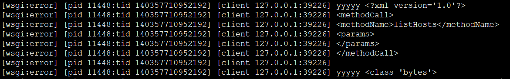

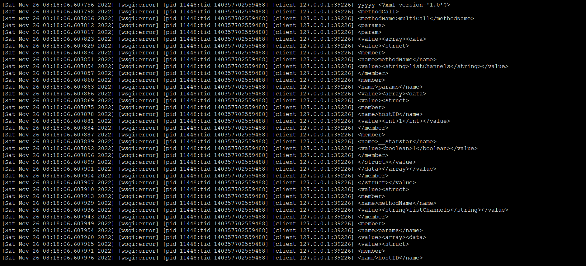

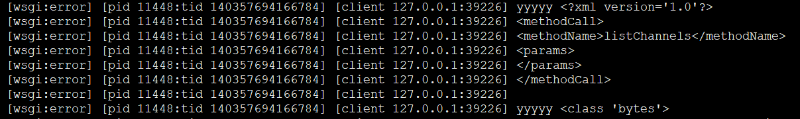

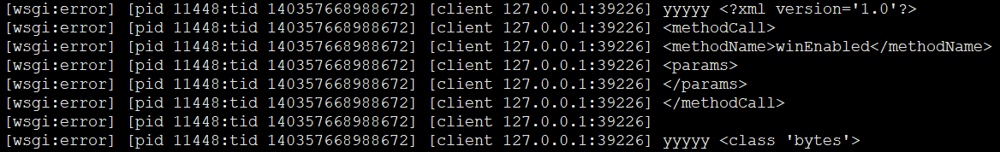

格式参考

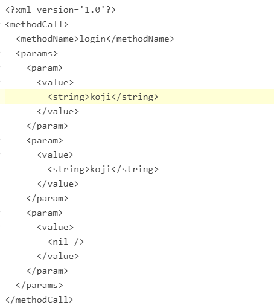


---
