# 如何给koji web换个皮肤

## 题

有不少发行版用koji 都会换个皮肤，是怎么玩的？怎么也给PS一套玩玩？

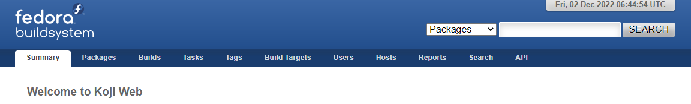

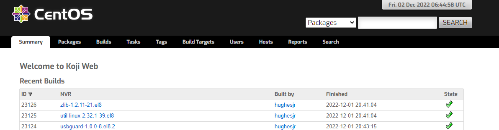

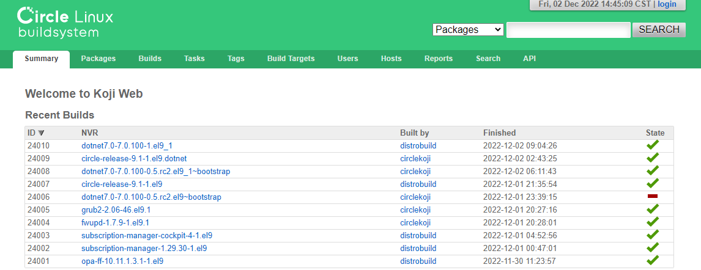

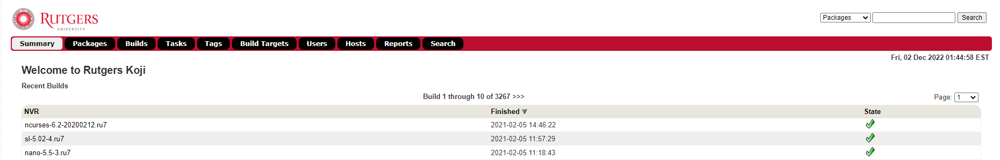


## 解


检出 <https://github.com/rocky-linux/koji-rocky-theme> 仓库内容
放到 /usr/share/koji-web/static/themes 目录下，新建rocky目录（这个名字在/etc/kojiweb/web.conf中配置上）

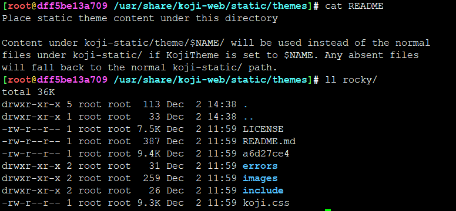

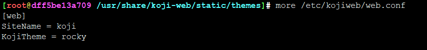

重启httpd服务，再次访问koji，就生效了

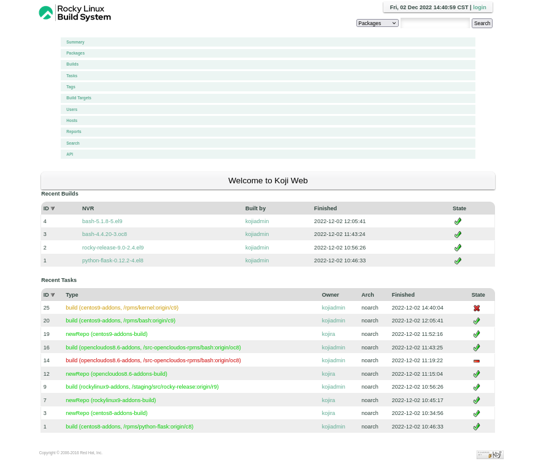

但是跟官方的优点不大一样呀，菜单栏出问题了

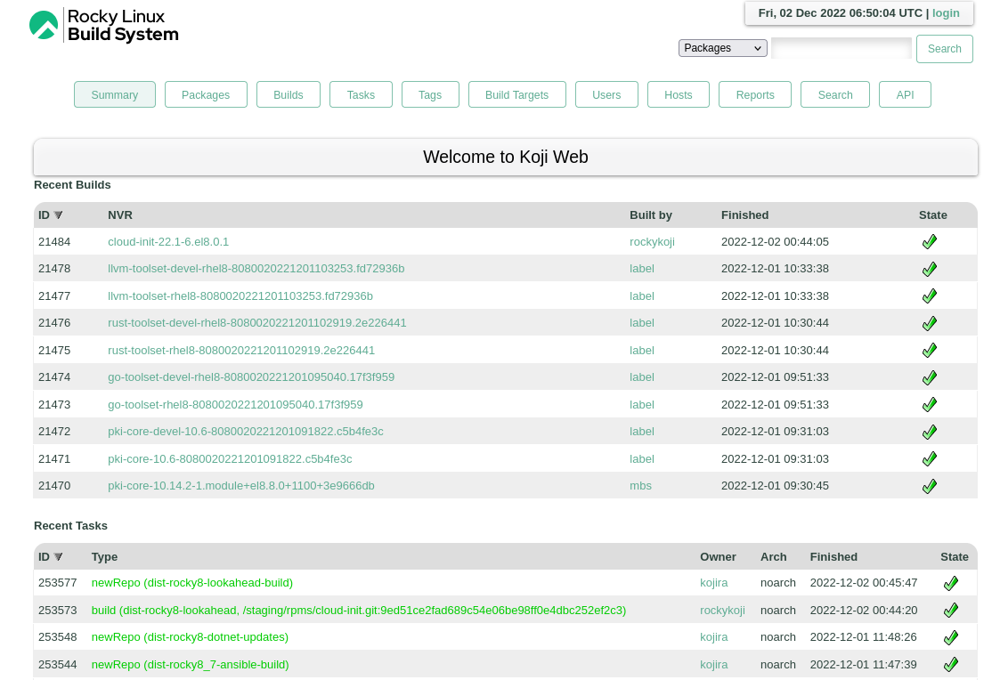

最后发现有个文件需要调整下

```
cp include/header.chtml /usr/share/koji-web/scripts/includes/header.chtml
```


成功换皮

再用fedora的试试 <https://koji.fedoraproject.org/koji/buildinfo?buildID=1996890>

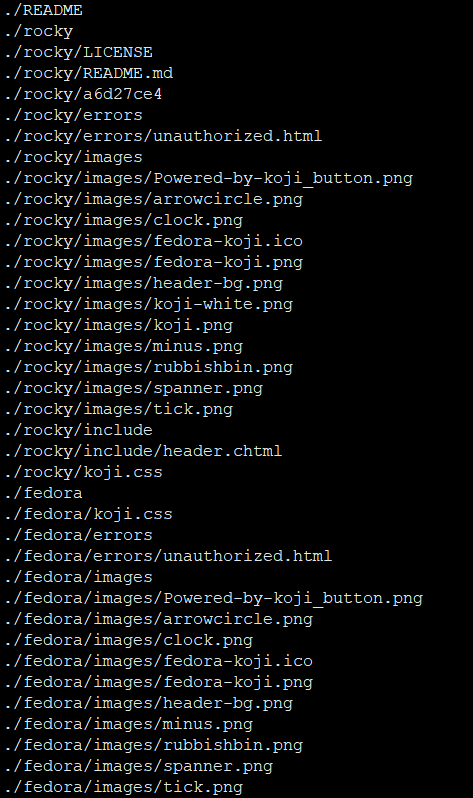

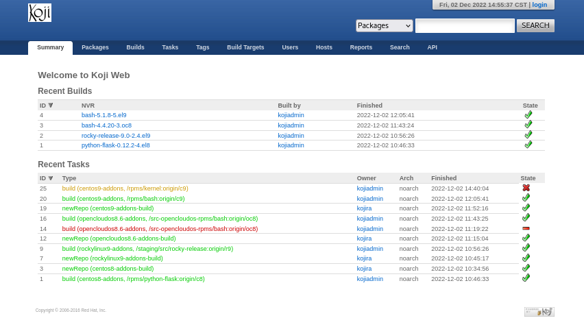

完美使用


代码跟踪：

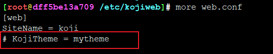

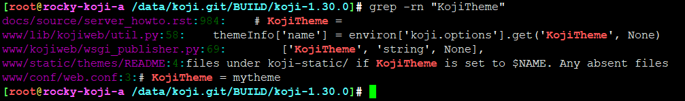

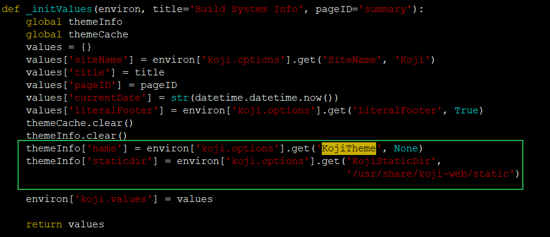


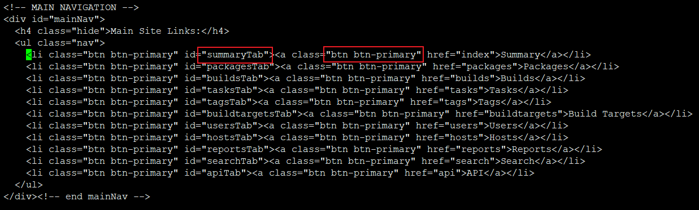


未完待续。。。


---
