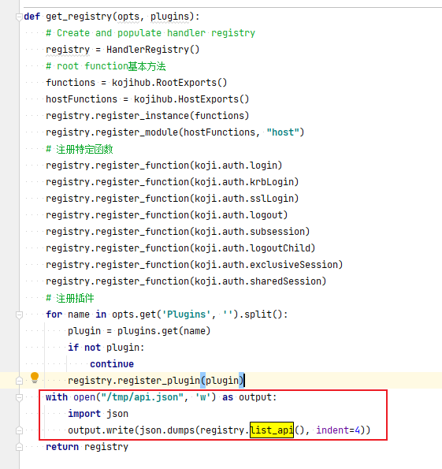
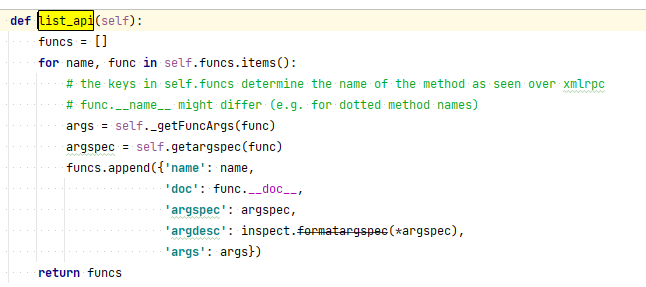
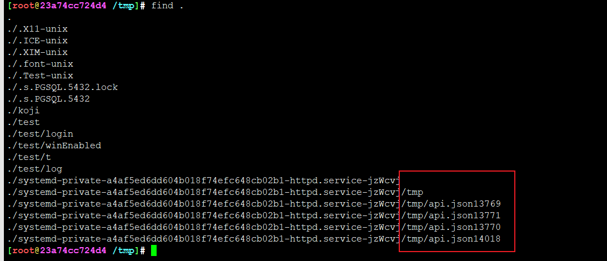

# koji-hub 获取路由列表

1. 调用rpc接口获取


```
curl -d "<?xml version='1.0'?><methodCall><methodName>_listapi</methodName></methodCall>" http://kojihub/kojihub
```


2. 代码中输出






路由表其实就是函数地址+函数描述信息，内存中存放的数据接口是字典数组

遍历字典数组所有信息，打印到json文件中



为啥不是直接写到/tmp目录？systemd机制


## 路由表字典数组完整信息

```
[
    {
        "name": "_listapi",
        "doc": null,
        "argspec": [
            [],
            null,
            null,
            null
        ],
        "argdesc": "()",
        "args": []
    },
    {
        "name": "system.listMethods",
        "doc": null,
        "argspec": [
            [],
            null,
            null,
            null
        ],
        "argdesc": "()",
        "args": []
    },
    {
        "name": "system.methodSignature",
        "doc": null,
        "argspec": [
            [
                "method"
            ],
            null,
            null,
            null
        ],
        "argdesc": "(method)",
        "args": [
            "method"
        ]
    },
    {
        "name": "system.methodHelp",
        "doc": null,
        "argspec": [
            [
                "method"
            ],
            null,
            null,
            null
        ],
        "argdesc": "(method)",
        "args": [
            "method"
        ]
    },
    {
        "name": "CGImport",
        "doc": "Import build from a content generator\n\n    metadata can be one of the following\n    - json encoded string representing the metadata\n    - a dictionary (parsed metadata)\n    - a filename containing the metadata\n\n    :param metadata: describes the content for this build.\n    :param str directory: directory on the hub where files are located\n    :param str token: (optional) a reservation token for this build.\n                      You obtain a token from the CGInitBuild method.\n                      If you specify a token, you must also specify a build_id\n                      in the metadata.\n    :returns: buildinfo dict\n    ",
        "argspec": [
            [
                "metadata",
                "directory",
                "token"
            ],
            null,
            null,
            [
                null
            ]
        ],
        "argdesc": "(metadata, directory, token=None)",
        "args": [
            "metadata",
            "directory",
            [
                "token",
                null
            ]
        ]
    },
    {
        "name": "CGInitBuild",
        "doc": "Create (reserve) a build_id for given data.\n\n    If build or reservation already exists, init_build will raise GenericError\n\n    :param str cg: content generator name\n    :param dict data: build data same as for new_build, for given usecase\n                      only name,version,release,epoch keys make sense. Some\n                      other values will be ignored anyway (owner, state, ...)\n    :return: dict with build_id and token\n    ",
        "argspec": [
            [
                "cg",
                "data"
            ],
            null,
            null,
            null
        ],
        "argdesc": "(cg, data)",
        "args": [
            "cg",
            "data"
        ]
    },
    {
        "name": "CGRefundBuild",
        "doc": "If build is reserved and not finished yet, there is an option\n    to release reservation and mark build either FAILED or CANCELED.\n    For this calling CG needs to know build_id and reservation token.\n\n    Refunded build behaves like any other failed/canceled build. So,\n    its nvr can be reclaimed again and get_next_release can return\n    this nvr.\n\n    :param str cg: content generator name\n    :param int build_id: build id\n    :param str token: token from CGInitBuild\n    :param int state: new state (koji.BUILD_STATES)\n\n    :return: None, on error raises exception\n    ",
        "argspec": [
            [
                "cg",
                "build_id",
                "token",
                "state"
            ],
            null,
            null,
            [
                3
            ]
        ],
        "argdesc": "(cg, build_id, token, state=3)",
        "args": [
            "cg",
            "build_id",
            "token",
            [
                "state",
                3
            ]
        ]
    },
    {
        "name": "addArchiveType",
        "doc": "\n    Add new archive type.\n\n    Use this to tell Koji about new builds' files' extensions before\n    importing the files.\n\n    :param str name: archive type name, eg. \"yaml\"\n    :param str description: eg. \"YAML Ain't Markup Language\"\n    :param str extensions: space-separated list of descriptions, eg. \"yaml yml\"\n    ",
        "argspec": [
            [
                "name",
                "description",
                "extensions",
                "compression_type"
            ],
            null,
            null,
            [
                null
            ]
        ],
        "argdesc": "(name, description, extensions, compression_type=None)",
        "args": [
            "name",
            "description",
            "extensions",
            [
                "compression_type",
                null
            ]
        ]
    },
    {
        "name": "addBType",
        "doc": "Add a new btype with the given name",
        "argspec": [
            [
                "name"
            ],
            null,
            null,
            null
        ],
        "argdesc": "(name)",
        "args": [
            "name"
        ]
    },
    {
        "name": "addChannel",
        "doc": "Add a channel.\n\n    :param str channel_name: channel name\n    :param str description: description of channel\n    ",
        "argspec": [
            [
                "channel_name",
                "description"
            ],
            null,
            null,
            [
                null
            ]
        ],
        "argdesc": "(channel_name, description=None)",
        "args": [
            "channel_name",
            [
                "description",
                null
            ]
        ]
    },
    {
        "name": "addExternalRPM",
        "doc": "Import an external RPM\n\n        This call is mainly for testing. Normal access will be through\n        a host call",
        "argspec": [
            [
                "rpminfo",
                "external_repo",
                "strict"
            ],
            null,
            null,
            [
                true
            ]
        ],
        "argdesc": "(rpminfo, external_repo, strict=True)",
        "args": [
            "rpminfo",
            "external_repo",
            [
                "strict",
                true
            ]
        ]
    },
    {
        "name": "addExternalRepoToTag",
        "doc": "Add an external repo to a tag.\n\n        :param tag_info: Tag name or ID number\n        :param repo_info: External repository name or ID number\n        :param int priority: Priority of this repository for this tag\n        :param str merge_mode: This must be one of the values of the\n                               koji.REPO_MERGE_MODES set. If unspecified,\n                               the default is \"koji\".\n        :param str arches: space-separated list of arches handled by the repo.\n        ",
        "argspec": [
            [
                "tag_info",
                "repo_info",
                "priority",
                "merge_mode",
                "arches"
            ],
            null,
            null,
            [
                "koji",
                null
            ]
        ],
        "argdesc": "(tag_info, repo_info, priority, merge_mode='koji', arches=None)",
        "args": [
            "tag_info",
            "repo_info",
            "priority",
            [
                "merge_mode",
                "koji"
            ],
            [
                "arches",
                null
            ]
        ]
    },
    {
        "name": "addGroupMember",
        "doc": "Add user to group",
        "argspec": [
            [
                "group",
                "user",
                "strict"
            ],
            null,
            null,
            [
                true
            ]
        ],
        "argdesc": "(group, user, strict=True)",
        "args": [
            "group",
            "user",
            [
                "strict",
                true
            ]
        ]
    },
    {
        "name": "addHost",
        "doc": "\n        Add a builder host to the database.\n\n        :param str hostname: name for the host entry (fqdn recommended).\n        :param list arches: list of architectures this builder supports.\n        :param str krb_principal: (optional) a non-default kerberos principal\n                                  for the host.\n        :param bool force: override user type\n        :returns: new host id\n\n        If krb_principal is not given then that field will be generated\n        from the HostPrincipalFormat setting (if available).\n        ",
        "argspec": [
            [
                "hostname",
                "arches",
                "krb_principal",
                "force"
            ],
            null,
            null,
            [
                null,
                false
            ]
        ],
        "argdesc": "(hostname, arches, krb_principal=None, force=False)",
        "args": [
            "hostname",
            "arches",
            [
                "krb_principal",
                null
            ],
            [
                "force",
                false
            ]
        ]
    },
    {
        "name": "addHostToChannel",
        "doc": "Add the host to the specified channel\n\n    Channel must already exist unless create option is specified\n    ",
        "argspec": [
            [
                "hostname",
                "channel_name",
                "create",
                "force"
            ],
            null,
            null,
            [
                false,
                false
            ]
        ],
        "argdesc": "(hostname, channel_name, create=False, force=False)",
        "args": [
            "hostname",
            "channel_name",
            [
                "create",
                false
            ],
            [
                "force",
                false
            ]
        ]
    },
    {
        "name": "addRPMSig",
        "doc": "Store a signature header for an rpm\n\n        data: the signature header encoded as base64\n        ",
        "argspec": [
            [
                "an_rpm",
                "data"
            ],
            null,
            null,
            null
        ],
        "argdesc": "(an_rpm, data)",
        "args": [
            "an_rpm",
            "data"
        ]
    },
    {
        "name": "addUserKrbPrincipal",
        "doc": "Add a Kerberos principal for user",
        "argspec": [
            [
                "user",
                "krb_principal"
            ],
            null,
            null,
            null
        ],
        "argdesc": "(user, krb_principal)",
        "args": [
            "user",
            "krb_principal"
        ]
    },
    {
        "name": "addVolume",
        "doc": "Add a new storage volume in the database",
        "argspec": [
            [
                "name",
                "strict"
            ],
            null,
            null,
            [
                true
            ]
        ],
        "argdesc": "(name, strict=True)",
        "args": [
            "name",
            [
                "strict",
                true
            ]
        ]
    },
    {
        "name": "applyVolumePolicy",
        "doc": "Apply the volume policy to a given build\n\n        The volume policy is normally applied at import time, but it can\n        also be applied with this call.\n\n        Parameters:\n            build: the build to apply the policy to\n            strict: if True, raises on exception on policy issues\n        ",
        "argspec": [
            [
                "build",
                "strict"
            ],
            null,
            null,
            [
                false
            ]
        ],
        "argdesc": "(build, strict=False)",
        "args": [
            "build",
            [
                "strict",
                false
            ]
        ]
    },
    {
        "name": "assignTask",
        "doc": "Assign a task to a host\n\n        Specify force=True to assign a non-free task\n        ",
        "argspec": [
            [
                "task_id",
                "host",
                "force"
            ],
            null,
            null,
            [
                false
            ]
        ],
        "argdesc": "(task_id, host, force=False)",
        "args": [
            "task_id",
            "host",
            [
                "force",
                false
            ]
        ]
    },
    {
        "name": "build",
        "doc": "Create a build task\n\n        priority: the amount to increase (or decrease) the task priority, relative\n                  to the default priority; higher values mean lower priority; only\n                  admins have the right to specify a negative priority here\n        channel: the channel to allocate the task to\n        Returns the task id\n        ",
        "argspec": [
            [
                "src",
                "target",
                "opts",
                "priority",
                "channel"
            ],
            null,
            null,
            [
                null,
                null,
                null
            ]
        ],
        "argdesc": "(src, target, opts=None, priority=None, channel=None)",
        "args": [
            "src",
            "target",
            [
                "opts",
                null
            ],
            [
                "priority",
                null
            ],
            [
                "channel",
                null
            ]
        ]
    },
    {
        "name": "buildImage",
        "doc": "\n        Create an image using a kickstart file and group package list.\n        ",
        "argspec": [
            [
                "name",
                "version",
                "arch",
                "target",
                "ksfile",
                "img_type",
                "opts",
                "priority"
            ],
            null,
            null,
            [
                null,
                null
            ]
        ],
        "argdesc": "(name, version, arch, target, ksfile, img_type, opts=None, priority=None)",
        "args": [
            "name",
            "version",
            "arch",
            "target",
            "ksfile",
            "img_type",
            [
                "opts",
                null
            ],
            [
                "priority",
                null
            ]
        ]
    },
    {
        "name": "buildImageIndirection",
        "doc": "\n        Create an image using two other images and an indirection template\n        ",
        "argspec": [
            [
                "opts",
                "priority"
            ],
            null,
            null,
            [
                null,
                null
            ]
        ],
        "argdesc": "(opts=None, priority=None)",
        "args": [
            [
                "opts",
                null
            ],
            [
                "priority",
                null
            ]
        ]
    },
    {
        "name": "buildImageOz",
        "doc": "\n        Create an image using a kickstart file and group package list.\n        ",
        "argspec": [
            [
                "name",
                "version",
                "arches",
                "target",
                "inst_tree",
                "opts",
                "priority"
            ],
            null,
            null,
            [
                null,
                null
            ]
        ],
        "argdesc": "(name, version, arches, target, inst_tree, opts=None, priority=None)",
        "args": [
            "name",
            "version",
            "arches",
            "target",
            "inst_tree",
            [
                "opts",
                null
            ],
            [
                "priority",
                null
            ]
        ]
    },
    {
        "name": "buildReferences",
        "doc": "Returns references to a build\n\n    This call is used to determine whether a build can be deleted\n\n    :param int build_id: numeric build id\n    :param int limit: If given, only return up to N results of each ref type\n    :param bool lazy: If true, stop when any reference is found\n\n    :returns: dict of reference results for each reference type\n    ",
        "argspec": [
            [
                "build",
                "limit",
                "lazy"
            ],
            null,
            null,
            [
                null,
                false
            ]
        ],
        "argdesc": "(build, limit=None, lazy=False)",
        "args": [
            "build",
            [
                "limit",
                null
            ],
            [
                "lazy",
                false
            ]
        ]
    },
    {
        "name": "cancelBuild",
        "doc": "Cancel the build with the given buildID\n\n        If the build is associated with a task, cancel the task as well.\n        Return True if the build was successfully canceled, False if not.",
        "argspec": [
            [
                "buildID"
            ],
            null,
            null,
            null
        ],
        "argdesc": "(buildID)",
        "args": [
            "buildID"
        ]
    },
    {
        "name": "cancelTask",
        "doc": "Cancel a task",
        "argspec": [
            [
                "task_id",
                "recurse"
            ],
            null,
            null,
            [
                true
            ]
        ],
        "argdesc": "(task_id, recurse=True)",
        "args": [
            "task_id",
            [
                "recurse",
                true
            ]
        ]
    },
    {
        "name": "cancelTaskChildren",
        "doc": "Cancel a task's children, but not the task itself",
        "argspec": [
            [
                "task_id"
            ],
            null,
            null,
            null
        ],
        "argdesc": "(task_id)",
        "args": [
            "task_id"
        ]
    },
    {
        "name": "cancelTaskFull",
        "doc": "Cancel a task and all tasks in its group",
        "argspec": [
            [
                "task_id",
                "strict"
            ],
            null,
            null,
            [
                true
            ]
        ],
        "argdesc": "(task_id, strict=True)",
        "args": [
            "task_id",
            [
                "strict",
                true
            ]
        ]
    },
    {
        "name": "chainBuild",
        "doc": "Create a chained build task for building sets of packages in order\n\n        srcs: list of pkg lists, ie [[src00, src01, src03],[src20],[src30,src31],...]\n              where each of the top-level lists gets built and a new repo is created\n              before the next list is built.\n        target: build target\n        priority: the amount to increase (or decrease) the task priority, relative\n                  to the default priority; higher values mean lower priority; only\n                  admins have the right to specify a negative priority here\n        channel: the channel to allocate the task to\n        Returns a list of all the dependent task ids\n        ",
        "argspec": [
            [
                "srcs",
                "target",
                "opts",
                "priority",
                "channel"
            ],
            null,
            null,
            [
                null,
                null,
                null
            ]
        ],
        "argdesc": "(srcs, target, opts=None, priority=None, channel=None)",
        "args": [
            "srcs",
            "target",
            [
                "opts",
                null
            ],
            [
                "priority",
                null
            ],
            [
                "channel",
                null
            ]
        ]
    },
    {
        "name": "chainMaven",
        "doc": "Create a Maven chain-build task\n\n        builds: a list of maps defining the parameters for the sequence of builds\n        target: the build target\n        priority: the amount to increase (or decrease) the task priority, relative\n                  to the default priority; higher values mean lower priority; only\n                  admins have the right to specify a negative priority here\n        channel: the channel to allocate the task to (defaults to the \"maven\" channel)\n\n        Returns the task ID\n        ",
        "argspec": [
            [
                "builds",
                "target",
                "opts",
                "priority",
                "channel"
            ],
            null,
            null,
            [
                null,
                null,
                "maven"
            ]
        ],
        "argdesc": "(builds, target, opts=None, priority=None, channel='maven')",
        "args": [
            "builds",
            "target",
            [
                "opts",
                null
            ],
            [
                "priority",
                null
            ],
            [
                "channel",
                "maven"
            ]
        ]
    },
    {
        "name": "changeBuildVolume",
        "doc": "Move a build to a different storage volume",
        "argspec": [
            [
                "build",
                "volume",
                "strict"
            ],
            null,
            null,
            [
                true
            ]
        ],
        "argdesc": "(build, volume, strict=True)",
        "args": [
            "build",
            "volume",
            [
                "strict",
                true
            ]
        ]
    },
    {
        "name": "checkTagAccess",
        "doc": "Determine if user has access to tag package with tag.\n\n    Returns a tuple (access, override, reason)\n        access: a boolean indicating whether access is allowed\n        override: a boolean indicating whether access may be forced\n        reason: the reason access is blocked\n    ",
        "argspec": [
            [
                "tag_id",
                "user_id"
            ],
            null,
            null,
            [
                null
            ]
        ],
        "argdesc": "(tag_id, user_id=None)",
        "args": [
            "tag_id",
            [
                "user_id",
                null
            ]
        ]
    },
    {
        "name": "checkTagPackage",
        "doc": "Check that pkg is in the list for tag. Returns true/false",
        "argspec": [
            [
                "tag",
                "pkg"
            ],
            null,
            null,
            null
        ],
        "argdesc": "(tag, pkg)",
        "args": [
            "tag",
            "pkg"
        ]
    },
    {
        "name": "checkUpload",
        "doc": "Return basic information about an uploaded file",
        "argspec": [
            [
                "path",
                "name",
                "verify",
                "tail",
                "volume"
            ],
            null,
            null,
            [
                null,
                null,
                null
            ]
        ],
        "argdesc": "(path, name, verify=None, tail=None, volume=None)",
        "args": [
            "path",
            "name",
            [
                "verify",
                null
            ],
            [
                "tail",
                null
            ],
            [
                "volume",
                null
            ]
        ]
    },
    {
        "name": "count",
        "doc": "Execute the XML-RPC method with the given name and count the results.\n        A method return value of None will return O, a return value of type \"list\", \"tuple\", or\n        \"dict\" will return len(value), and a return value of any other type will return 1. An\n        invalid methodName will raise GenericError.",
        "argspec": [
            [
                "methodName"
            ],
            "args",
            "kw",
            null
        ],
        "argdesc": "(methodName, *args, **kw)",
        "args": [
            "methodName"
        ]
    },
    {
        "name": "countAndFilterResults",
        "doc": "Filter results by a given name and count total results account.\n\n        Execute the XML-RPC method with the given name and filter the results\n        based on the options specified in the keywork option \"filterOpts\".\n        The method must return a list of maps.  Any other return type will\n        result in a GenericError.\n\n        Args:\n        offset: the number of elements to trim off the front of the list\n        limit: the maximum number of results to return\n        order: the map key to use to sort the list; the list will be sorted\n            before offset or limit are applied\n        noneGreatest: when sorting, consider 'None' to be greater than all\n            other values; python considers None less than all other values,\n            but Postgres sorts NULL higher than all other values; default\n            to True for consistency with database sorts\n\n        Returns:\n            Tuple of total results amount and the filtered results.\n        ",
        "argspec": [
            [
                "methodName"
            ],
            "args",
            "kw",
            null
        ],
        "argdesc": "(methodName, *args, **kw)",
        "args": [
            "methodName"
        ]
    },
    {
        "name": "createBuildTarget",
        "doc": "Create a new build target",
        "argspec": [
            [
                "name",
                "build_tag",
                "dest_tag"
            ],
            null,
            null,
            null
        ],
        "argdesc": "(name, build_tag, dest_tag)",
        "args": [
            "name",
            "build_tag",
            "dest_tag"
        ]
    },
    {
        "name": "createEmptyBuild",
        "doc": "Creates empty build entry\n\n        :param str name: build name\n        :param str version: build version\n        :param str release: release version\n        :param str epoch: epoch version\n        :param userInfo: a str (Kerberos principal or name) or an int (user id)\n                         or a dict:\n                             - id: User's ID\n                             - name: User's name\n                             - krb_principal: Kerberos principal\n        :return: int build ID\n        ",
        "argspec": [
            [
                "name",
                "version",
                "release",
                "epoch",
                "owner"
            ],
            null,
            null,
            [
                null
            ]
        ],
        "argdesc": "(name, version, release, epoch, owner=None)",
        "args": [
            "name",
            "version",
            "release",
            "epoch",
            [
                "owner",
                null
            ]
        ]
    },
    {
        "name": "createExternalRepo",
        "doc": "Create a new external repo with the given name and url.\n    Return a map containing the id, name, and url\n    of the new repo.",
        "argspec": [
            [
                "name",
                "url"
            ],
            null,
            null,
            null
        ],
        "argdesc": "(name, url)",
        "args": [
            "name",
            "url"
        ]
    },
    {
        "name": "createImageBuild",
        "doc": "\n        Associate image metadata with an existing build. When build isn`t existing, creates a\n        build. The build must not already have associated image metadata.\n\n        :param build_info: a str (build name) if build is existing\n                           or a dict:\n                               - name: build name\n                               - version: build version\n                               - release: build release\n                               - epoch: build epoch\n        :raises: GenericError if type for build_info is not dict, when build isn`t existing.\n        :raises: GenericError if build info doesn't have mandatory keys.\n        ",
        "argspec": [
            [
                "build_info"
            ],
            null,
            null,
            null
        ],
        "argdesc": "(build_info)",
        "args": [
            "build_info"
        ]
    },
    {
        "name": "createMavenBuild",
        "doc": "\n        Associate Maven metadata with an existing build. When build isn`t existing, creates a\n        build. The build must not already have associated Maven metadata.  maven_info must be\n        a dict containing group_id, artifact_id, and version entries.\n\n        :param build_info: a str (build name) if build is existing\n                           or a dict:\n                               - name: build name\n                               - version: build version\n                               - release: build release\n                               - epoch: build epoch\n        :param dict maven_info:\n                               - group_id: Group's ID\n                               - artifact_id: Artifact's ID\n                               - version: version\n        :raises: GenericError if type for build_info is not dict, when build isn`t existing.\n        :raises: GenericError if build info doesn't have mandatory keys.\n        ",
        "argspec": [
            [
                "build_info",
                "maven_info"
            ],
            null,
            null,
            null
        ],
        "argdesc": "(build_info, maven_info)",
        "args": [
            "build_info",
            "maven_info"
        ]
    },
    {
        "name": "createNotification",
        "doc": "Create a new notification.  If the user_id does not match the currently logged-in user\n        and the currently logged-in user is not an admin, raise a GenericError.",
        "argspec": [
            [
                "user_id",
                "package_id",
                "tag_id",
                "success_only"
            ],
            null,
            null,
            null
        ],
        "argdesc": "(user_id, package_id, tag_id, success_only)",
        "args": [
            "user_id",
            "package_id",
            "tag_id",
            "success_only"
        ]
    },
    {
        "name": "createNotificationBlock",
        "doc": "Create notification block. If the user_id does not match the\n        currently logged-in user and the currently logged-in user is not an\n        admin, raise a GenericError.",
        "argspec": [
            [
                "user_id",
                "package_id",
                "tag_id"
            ],
            null,
            null,
            [
                null,
                null
            ]
        ],
        "argdesc": "(user_id, package_id=None, tag_id=None)",
        "args": [
            "user_id",
            [
                "package_id",
                null
            ],
            [
                "tag_id",
                null
            ]
        ]
    },
    {
        "name": "createTag",
        "doc": "Create a new tag",
        "argspec": [
            [
                "name",
                "parent",
                "arches",
                "perm",
                "locked",
                "maven_support",
                "maven_include_all",
                "extra"
            ],
            null,
            null,
            [
                null,
                null,
                null,
                false,
                false,
                false,
                null
            ]
        ],
        "argdesc": "(name, parent=None, arches=None, perm=None, locked=False, maven_support=False, maven_include_all=False, extra=None)",
        "args": [
            "name",
            [
                "parent",
                null
            ],
            [
                "arches",
                null
            ],
            [
                "perm",
                null
            ],
            [
                "locked",
                false
            ],
            [
                "maven_support",
                false
            ],
            [
                "maven_include_all",
                false
            ],
            [
                "extra",
                null
            ]
        ]
    },
    {
        "name": "createUser",
        "doc": "Add a user to the database\n\n        :param str username: The username for this Koji user.\n        :param int status: This must be one of the values of the\n                           koji.USER_STATUS enum. If unspecified,\n                           the default is koji.USER_STATUS['NORMAL'].\n        :param str krb_principal: a custom Kerberos principal, or None.\n        :raises: GenericError if the user or Kerberos principal already\n                 exists.\n        ",
        "argspec": [
            [
                "username",
                "status",
                "krb_principal"
            ],
            null,
            null,
            [
                null,
                null
            ]
        ],
        "argdesc": "(username, status=None, krb_principal=None)",
        "args": [
            "username",
            [
                "status",
                null
            ],
            [
                "krb_principal",
                null
            ]
        ]
    },
    {
        "name": "createWinBuild",
        "doc": "\n        Associate Windows metadata with an existing build. When build isn`t existing, creates\n        a build. The build must not already have associated Windows metadata.  win_info must be\n        a dict containing a platform entry.\n        :param build_info: a str (build name) if build is existing\n                           or a dict:\n                               - name: build name\n                               - version: build version\n                               - release: build release\n                               - epoch: build epoch\n        :param dict win_info:\n                               - platform: build platform\n        :raises: GenericError if type for build_info is not dict, when build isn`t existing.\n        :raises: GenericError if build info doesn't have mandatory keys.\n        ",
        "argspec": [
            [
                "build_info",
                "win_info"
            ],
            null,
            null,
            null
        ],
        "argdesc": "(build_info, win_info)",
        "args": [
            "build_info",
            "win_info"
        ]
    },
    {
        "name": "deleteBuild",
        "doc": "delete a build, if possible\n\n    Attempts to delete a build. A build can only be deleted if it is\n    unreferenced.\n\n    If strict is true (default), an exception is raised if the build cannot\n    be deleted.\n\n    Note that a deleted build is not completely gone. It is marked deleted and some\n    data remains in the database.  Mainly, the rpms are removed.\n\n    Note in particular that deleting a build DOES NOT free any NVRs (or NVRAs) for\n    reuse.\n\n    Returns True if successful, False otherwise\n    ",
        "argspec": [
            [
                "build",
                "strict",
                "min_ref_age"
            ],
            null,
            null,
            [
                true,
                604800
            ]
        ],
        "argdesc": "(build, strict=True, min_ref_age=604800)",
        "args": [
            "build",
            [
                "strict",
                true
            ],
            [
                "min_ref_age",
                604800
            ]
        ]
    },
    {
        "name": "deleteBuildTarget",
        "doc": "Delete the build target with the given name.  If no build target\n    exists, raise a GenericError.",
        "argspec": [
            [
                "buildTargetInfo"
            ],
            null,
            null,
            null
        ],
        "argdesc": "(buildTargetInfo)",
        "args": [
            "buildTargetInfo"
        ]
    },
    {
        "name": "deleteExternalRepo",
        "doc": "\n    Remove an external repository for any tags and delete it.\n\n    :param info: external repository name or ID number\n    :raises: GenericError if the repository does not exist.\n    ",
        "argspec": [
            [
                "info"
            ],
            null,
            null,
            null
        ],
        "argdesc": "(info)",
        "args": [
            "info"
        ]
    },
    {
        "name": "deleteNotification",
        "doc": "Delete the notification with the given ID.  If the currently logged-in\n        user is not the owner of the notification or an admin, raise a GenericError.",
        "argspec": [
            [
                "id"
            ],
            null,
            null,
            null
        ],
        "argdesc": "(id)",
        "args": [
            "id"
        ]
    },
    {
        "name": "deleteNotificationBlock",
        "doc": "Delete the notification block with the given ID.  If the currently logged-in\n        user is not the owner of the notification or an admin, raise a GenericError.",
        "argspec": [
            [
                "id"
            ],
            null,
            null,
            null
        ],
        "argdesc": "(id)",
        "args": [
            "id"
        ]
    },
    {
        "name": "deleteRPMSig",
        "doc": "Delete rpm signature\n\n        Only use this method in extreme situations, because it goes against\n        Koji's design of immutable, auditable data.\n\n        This call requires ``admin`` permission (``sign`` is not sufficient).\n\n        :param dict/str/id rpm: map containing 'name', 'version', 'release', and 'arch'\n                                string N-V-R.A\n                                int ID\n        :param str sigkey: Signature key.\n        :param bool all_sigs: Delete all signed copies for specified RPM.\n        ",
        "argspec": [
            [
                "rpminfo",
                "sigkey",
                "all_sigs"
            ],
            null,
            null,
            [
                null,
                false
            ]
        ],
        "argdesc": "(rpminfo, sigkey=None, all_sigs=False)",
        "args": [
            "rpminfo",
            [
                "sigkey",
                null
            ],
            [
                "all_sigs",
                false
            ]
        ]
    },
    {
        "name": "deleteTag",
        "doc": "Delete the specified tag.",
        "argspec": [
            [
                "tagInfo"
            ],
            null,
            null,
            null
        ],
        "argdesc": "(tagInfo)",
        "args": [
            "tagInfo"
        ]
    },
    {
        "name": "disableChannel",
        "doc": "Mark a channel as disabled",
        "argspec": [
            [
                "channelname",
                "comment"
            ],
            null,
            null,
            [
                null
            ]
        ],
        "argdesc": "(channelname, comment=None)",
        "args": [
            "channelname",
            [
                "comment",
                null
            ]
        ]
    },
    {
        "name": "disableHost",
        "doc": "Mark a host as disabled",
        "argspec": [
            [
                "hostname"
            ],
            null,
            null,
            null
        ],
        "argdesc": "(hostname)",
        "args": [
            "hostname"
        ]
    },
    {
        "name": "disableUser",
        "doc": "Disable logins by the specified user",
        "argspec": [
            [
                "username"
            ],
            null,
            null,
            null
        ],
        "argdesc": "(username)",
        "args": [
            "username"
        ]
    },
    {
        "name": "distRepo",
        "doc": "Create a dist-repo task. returns task id",
        "argspec": [
            [
                "tag",
                "keys"
            ],
            null,
            "task_opts",
            null
        ],
        "argdesc": "(tag, keys, **task_opts)",
        "args": [
            "tag",
            "keys"
        ]
    },
    {
        "name": "downloadTaskOutput",
        "doc": "Download the file with the given name, generated by the task with the\n        given ID.",
        "argspec": [
            [
                "taskID",
                "fileName",
                "offset",
                "size",
                "volume"
            ],
            null,
            null,
            [
                0,
                -1,
                null
            ]
        ],
        "argdesc": "(taskID, fileName, offset=0, size=-1, volume=None)",
        "args": [
            "taskID",
            "fileName",
            [
                "offset",
                0
            ],
            [
                "size",
                -1
            ],
            [
                "volume",
                null
            ]
        ]
    },
    {
        "name": "dropGroupMember",
        "doc": "Drop user from group",
        "argspec": [
            [
                "group",
                "user"
            ],
            null,
            null,
            null
        ],
        "argdesc": "(group, user)",
        "args": [
            "group",
            "user"
        ]
    },
    {
        "name": "echo",
        "doc": null,
        "argspec": [
            [],
            "args",
            null,
            null
        ],
        "argdesc": "(*args)",
        "args": []
    },
    {
        "name": "editBuildTarget",
        "doc": "Set the build_tag and dest_tag of an existing build_target to new values",
        "argspec": [
            [
                "buildTargetInfo",
                "name",
                "build_tag",
                "dest_tag"
            ],
            null,
            null,
            null
        ],
        "argdesc": "(buildTargetInfo, name, build_tag, dest_tag)",
        "args": [
            "buildTargetInfo",
            "name",
            "build_tag",
            "dest_tag"
        ]
    },
    {
        "name": "editChannel",
        "doc": "Edit information for an existing channel.\n\n    :param str/int channelInfo: channel name or ID\n    :param str name: new channel name\n    :param str description: description of channel\n    :param str comment: comment about channel\n    ",
        "argspec": [
            [
                "channelInfo"
            ],
            null,
            "kw",
            null
        ],
        "argdesc": "(channelInfo, **kw)",
        "args": [
            "channelInfo"
        ]
    },
    {
        "name": "editExternalRepo",
        "doc": "Edit an existing external repo",
        "argspec": [
            [
                "info",
                "name",
                "url"
            ],
            null,
            null,
            [
                null,
                null
            ]
        ],
        "argdesc": "(info, name=None, url=None)",
        "args": [
            "info",
            [
                "name",
                null
            ],
            [
                "url",
                null
            ]
        ]
    },
    {
        "name": "editHost",
        "doc": "Edit information for an existing host.\n    hostInfo specifies the host to edit, either as an integer (id)\n    or a string (name).\n    fields to be changed are specified as keyword parameters:\n    - arches (a space-separated string)\n    - capacity (float or int)\n    - description (string)\n    - comment (string)\n\n    Returns True if changes are made to the database, False otherwise.\n    ",
        "argspec": [
            [
                "hostInfo"
            ],
            null,
            "kw",
            null
        ],
        "argdesc": "(hostInfo, **kw)",
        "args": [
            "hostInfo"
        ]
    },
    {
        "name": "editPermission",
        "doc": "Edit a permission description",
        "argspec": [
            [
                "permission",
                "description"
            ],
            null,
            null,
            null
        ],
        "argdesc": "(permission, description)",
        "args": [
            "permission",
            "description"
        ]
    },
    {
        "name": "editTag",
        "doc": "Edit information for an existing tag.",
        "argspec": [
            [
                "tagInfo",
                "name",
                "arches",
                "locked",
                "permissionID",
                "extra"
            ],
            null,
            null,
            [
                null
            ]
        ],
        "argdesc": "(tagInfo, name, arches, locked, permissionID, extra=None)",
        "args": [
            "tagInfo",
            "name",
            "arches",
            "locked",
            "permissionID",
            [
                "extra",
                null
            ]
        ]
    },
    {
        "name": "editTag2",
        "doc": "Edit information for an existing tag.\n\n    The tagInfo argument is the only required argument. After the tagInfo\n    argument, specify any tag changes with additional keyword arguments.\n\n    :param tagInfo: koji tag ID or name to edit (required).\n    :type tagInfo: int or str\n\n    :param str name: rename the tag.\n    :param str arches: a space-separated list of arches for this tag.\n    :param bool locked: whether this tag is locked or not.\n    :param perm: the permission ID or name for this tag.\n    :type perm: int, str, or None\n    :param bool maven_support: whether Maven repos should be generated for the\n                               tag.\n    :param bool maven_include_all: include every build in this tag (including\n                                   multiple versions of the same package) in\n                                   the Maven repo.\n    :param dict extra: add or update extra tag parameters.\n    :param list remove_extra: remove extra tag parameters.\n    :param list block_extra: block inherited extra tag parameters.\n    ",
        "argspec": [
            [
                "tagInfo"
            ],
            null,
            "kwargs",
            null
        ],
        "argdesc": "(tagInfo, **kwargs)",
        "args": [
            "tagInfo"
        ]
    },
    {
        "name": "editTagExternalRepo",
        "doc": "Edit a tag<->external repo association\n    This allows you to update the priority and merge_mode without removing/adding the repo.\n\n    Note that None value of priority and merge_mode means no change on it\n    ",
        "argspec": [
            [
                "tag_info",
                "repo_info",
                "priority",
                "merge_mode",
                "arches"
            ],
            null,
            null,
            [
                null,
                null,
                null
            ]
        ],
        "argdesc": "(tag_info, repo_info, priority=None, merge_mode=None, arches=None)",
        "args": [
            "tag_info",
            "repo_info",
            [
                "priority",
                null
            ],
            [
                "merge_mode",
                null
            ],
            [
                "arches",
                null
            ]
        ]
    },
    {
        "name": "editUser",
        "doc": "Edit information for an existing user.\n\n    Use this method to rename a user, or to add/remove/modify Kerberos\n    principal(s) for this account.\n\n    Example krb_principal_mappings values:\n\n    To add a new Kerberos principal to a user account:\n      [{'old': None, 'new': 'myuser@NEW.EXAMPLE.COM'}]\n\n    To remove an old Kerberos principal from a user account:\n      [{'old': 'myuser@OLD.EXAMPLE.COM', 'new': None}]\n\n    To modify a user's old Kerberos principal to a new one:\n      [{'old': 'myuser@OLD.EXAMPLE.NET', 'new': 'myuser@NEW.EXAMPLE.NET'}]\n\n    :param userInfo: username (str) or ID (int)\n    :param str name: new name for this user account\n    :param list krb_principal_mappings: List of changes to make for this\n                                        user's Kerberos principal. Each change\n                                        is a dict of \"old\" and \"new\"\n                                        Kerberos principals.\n    :raises: GenericError if the user does not exist, or if there were\n             problems in the krb_principal_mappings.\n    ",
        "argspec": [
            [
                "userInfo",
                "name",
                "krb_principal_mappings"
            ],
            null,
            null,
            [
                null,
                null
            ]
        ],
        "argdesc": "(userInfo, name=None, krb_principal_mappings=None)",
        "args": [
            "userInfo",
            [
                "name",
                null
            ],
            [
                "krb_principal_mappings",
                null
            ]
        ]
    },
    {
        "name": "enableChannel",
        "doc": "Mark a channel as enabled",
        "argspec": [
            [
                "channelname",
                "comment"
            ],
            null,
            null,
            [
                null
            ]
        ],
        "argdesc": "(channelname, comment=None)",
        "args": [
            "channelname",
            [
                "comment",
                null
            ]
        ]
    },
    {
        "name": "enableHost",
        "doc": "Mark a host as enabled",
        "argspec": [
            [
                "hostname"
            ],
            null,
            null,
            null
        ],
        "argdesc": "(hostname)",
        "args": [
            "hostname"
        ]
    },
    {
        "name": "enableUser",
        "doc": "Enable logins by the specified user",
        "argspec": [
            [
                "username"
            ],
            null,
            null,
            null
        ],
        "argdesc": "(username)",
        "args": [
            "username"
        ]
    },
    {
        "name": "error",
        "doc": "debugging. raise an error",
        "argspec": [
            [],
            null,
            null,
            null
        ],
        "argdesc": "()",
        "args": []
    },
    {
        "name": "evalPolicy",
        "doc": "Evaluate named policy with given data and return the result\n\n    :param str name: the policy name\n    :param dict data: the policy data\n    :returns the action as a string\n    :raises koji.GenericError if the policy is empty or not found\n    ",
        "argspec": [
            [
                "name",
                "data"
            ],
            null,
            null,
            null
        ],
        "argdesc": "(name, data)",
        "args": [
            "name",
            "data"
        ]
    },
    {
        "name": "fault",
        "doc": "debugging. raise an error",
        "argspec": [
            [],
            null,
            null,
            null
        ],
        "argdesc": "()",
        "args": []
    },
    {
        "name": "filterResults",
        "doc": "Execute the XML-RPC method with the given name and filter the results\n        based on the options specified in the keywork option \"filterOpts\".  The method\n        must return a list of maps.  Any other return type will result in a GenericError.\n        Currently supported options are:\n        - offset: the number of elements to trim off the front of the list\n        - limit: the maximum number of results to return\n        - order: the map key to use to sort the list; the list will be sorted before\n                 offset or limit are applied\n        - noneGreatest: when sorting, consider 'None' to be greater than all other values;\n                        python considers None less than all other values, but Postgres sorts\n                        NULL higher than all other values; default to True for consistency\n                        with database sorts\n        ",
        "argspec": [
            [
                "methodName"
            ],
            "args",
            "kw",
            null
        ],
        "argdesc": "(methodName, *args, **kw)",
        "args": [
            "methodName"
        ]
    },
    {
        "name": "findBuildID",
        "doc": "gets build ID for various inputs\n\n    :param int|str|dict X: build ID | NVR | dict with name, version and release values\n\n    :returns int: build ID\n    ",
        "argspec": [
            [
                "X",
                "strict"
            ],
            null,
            null,
            [
                false
            ]
        ],
        "argdesc": "(X, strict=False)",
        "args": [
            "X",
            [
                "strict",
                false
            ]
        ]
    },
    {
        "name": "freeTask",
        "doc": "Free a task",
        "argspec": [
            [
                "task_id"
            ],
            null,
            null,
            null
        ],
        "argdesc": "(task_id)",
        "args": [
            "task_id"
        ]
    },
    {
        "name": "getAPIVersion",
        "doc": null,
        "argspec": [
            [],
            null,
            null,
            null
        ],
        "argdesc": "()",
        "args": []
    },
    {
        "name": "getActiveRepos",
        "doc": "Get data on all active repos\n\n    This is a list of all the repos that the repo daemon needs to worry about.\n    ",
        "argspec": [
            [],
            null,
            null,
            null
        ],
        "argdesc": "()",
        "args": []
    },
    {
        "name": "getAllArches",
        "doc": "Return a list of all (canonical) arches available from hosts",
        "argspec": [
            [],
            null,
            null,
            null
        ],
        "argdesc": "()",
        "args": []
    },
    {
        "name": "getAllPerms",
        "doc": "Get a list of all permissions in the system.  Returns a list of maps.  Each\n        map contains the following keys:\n\n        - id\n        - name\n        - description\n        ",
        "argspec": [
            [],
            null,
            null,
            null
        ],
        "argdesc": "()",
        "args": []
    },
    {
        "name": "getArchive",
        "doc": "\n    Get information about the archive with the given ID.  Returns a map\n    containing the following keys:\n\n    id: unique id of the archive file (integer)\n    type_id: id of the archive type (Java jar, Solaris pkg, Windows exe, etc.) (integer)\n    build_id: id of the build that generated this archive (integer)\n    buildroot_id: id of the buildroot where this archive was built (integer)\n    filename: name of the archive (string)\n    size: size of the archive (integer)\n    checksum: checksum of the archive (string)\n    checksum_type: type of the checksum (integer)\n\n    If the archive is part of a Maven build, the following keys will be included:\n      group_id\n      artifact_id\n      version\n    If the archive is part of a Windows builds, the following keys will be included:\n      relpath\n      platforms\n      flags\n\n    If the archive is part of an image build, and it is the image file that\n    contains the root partitioning ('/'), there will be a additional fields:\n      rootid\n      arch\n    ",
        "argspec": [
            [
                "archive_id",
                "strict"
            ],
            null,
            null,
            [
                false
            ]
        ],
        "argdesc": "(archive_id, strict=False)",
        "args": [
            "archive_id",
            [
                "strict",
                false
            ]
        ]
    },
    {
        "name": "getArchiveFile",
        "doc": "\n    Get information about a file with the given filename\n    contained in the archive with the given ID.\n    Returns a map with with following keys:\n\n    archive_id: id of the archive the file is contained in (integer)\n    name: name of the file (string)\n    size: uncompressed size of the file (integer)\n\n    If strict is True, raise GenericError if:\n      - this file is not found in the archive\n      - build btype of this archive belong to is not maven, win or image\n      - archive_type is not that we are able to expand\n\n    Regardless of strict, an error will be raised if the archive_id is invalid\n    ",
        "argspec": [
            [
                "archive_id",
                "filename",
                "strict"
            ],
            null,
            null,
            [
                false
            ]
        ],
        "argdesc": "(archive_id, filename, strict=False)",
        "args": [
            "archive_id",
            "filename",
            [
                "strict",
                false
            ]
        ]
    },
    {
        "name": "getArchiveType",
        "doc": "\n    Get the archive type for the given filename, type_name, or type_id.\n    ",
        "argspec": [
            [
                "filename",
                "type_name",
                "type_id",
                "strict"
            ],
            null,
            null,
            [
                null,
                null,
                null,
                false
            ]
        ],
        "argdesc": "(filename=None, type_name=None, type_id=None, strict=False)",
        "args": [
            [
                "filename",
                null
            ],
            [
                "type_name",
                null
            ],
            [
                "type_id",
                null
            ],
            [
                "strict",
                false
            ]
        ]
    },
    {
        "name": "getArchiveTypes",
        "doc": "Return a list of all supported archive types.",
        "argspec": [
            [],
            null,
            null,
            null
        ],
        "argdesc": "()",
        "args": []
    },
    {
        "name": "getAverageBuildDuration",
        "doc": "Get the average duration of a build of the given package.\n\n        :param int|str package: Package name or id\n        :param int age: length of history in months\n\n        :return float|None: average number of seconds - If package wasn't built\n                            during past age months (or never), None is returned\n        ",
        "argspec": [
            [
                "package",
                "age"
            ],
            null,
            null,
            [
                null
            ]
        ],
        "argdesc": "(package, age=None)",
        "args": [
            "package",
            [
                "age",
                null
            ]
        ]
    },
    {
        "name": "getBuild",
        "doc": "Return information about a build.\n\n    buildInfo may be either a int ID, a string NVR, or a map containing\n    'name', 'version' and 'release'.\n\n    A map will be returned containing the following keys*:\n      id: build ID\n      package_id: ID of the package built\n      package_name: name of the package built\n      name: same as package_name\n      version\n      release\n      epoch\n      nvr\n      state\n      task_id: ID of the task that kicked off the build\n      owner_id: ID of the user who kicked off the build\n      owner_name: name of the user who kicked off the build\n      volume_id: ID of the storage volume\n      volume_name: name of the storage volume\n      creation_event_id: id of the create_event\n      creation_time: time the build was created (text)\n      creation_ts: time the build was created (epoch)\n      start_time: time the build was started (may be null)\n      start_ts: time the build was started (epoch, may be null)\n      completion_time: time the build was completed (may be null)\n      completion_ts: time the build was completed (epoch, may be null)\n      source: the SCM URL of the sources used in the build -\n              dereferenced git hash is stored here\n      extra: dictionary with extra data about the build\n          - source:\n              - original_url: while build.source contains concrete\n                SCM hash, this field can contain SCM url which was\n                used when launching build (e.g. git_url#master)\n      cg_id: ID of CG which reserved or imported this build\n      cg_name: name of CG which reserved or imported this build\n\n    If there is no build matching the buildInfo given, and strict is specified,\n    raise an error.  Otherwise return None.\n\n    [*] Not every build will have data for all keys. E.g. not all builds will\n        associated task ids, and not all import methods provide source info.\n    ",
        "argspec": [
            [
                "buildInfo",
                "strict"
            ],
            null,
            null,
            [
                false
            ]
        ],
        "argdesc": "(buildInfo, strict=False)",
        "args": [
            "buildInfo",
            [
                "strict",
                false
            ]
        ]
    },
    {
        "name": "getBuildConfig",
        "doc": "Return build configuration associated with a tag",
        "argspec": [
            [
                "tag",
                "event"
            ],
            null,
            null,
            [
                null
            ]
        ],
        "argdesc": "(tag, event=None)",
        "args": [
            "tag",
            [
                "event",
                null
            ]
        ]
    },
    {
        "name": "getBuildLogs",
        "doc": "Return a list of log files for the given build\n\n    This method will only return logs for builds that are complete.\n    If a build is in progress, failed, or canceled, you must look at the\n    build's task logs instead (see listTaskOutput).\n\n    :param build: A build ID (int), a NVR (string), or a dict containing\n                  \"name\", \"version\" and \"release\".\n    :returns: a possibly-empty list of log file entries. Each entry is a dict\n              with three keys:\n                \"name\" (log file name)\n                \"dir\" (immediate parent subdirectory)\n                \"path\" (the full path under koji's topdir)\n    ",
        "argspec": [
            [
                "build"
            ],
            null,
            null,
            null
        ],
        "argdesc": "(build)",
        "args": [
            "build"
        ]
    },
    {
        "name": "getBuildNotification",
        "doc": "Get the build notification with the given ID.\n        If there is no notification with the given ID, when strict is True,\n        raise GenericError, else return None.\n        ",
        "argspec": [
            [
                "id",
                "strict"
            ],
            null,
            null,
            [
                false
            ]
        ],
        "argdesc": "(id, strict=False)",
        "args": [
            "id",
            [
                "strict",
                false
            ]
        ]
    },
    {
        "name": "getBuildNotificationBlock",
        "doc": "Get the build notification with the given ID.\n        If there is no notification with the given ID, when strict is True,\n        raise GenericError, else return None.\n        ",
        "argspec": [
            [
                "id",
                "strict"
            ],
            null,
            null,
            [
                false
            ]
        ],
        "argdesc": "(id, strict=False)",
        "args": [
            "id",
            [
                "strict",
                false
            ]
        ]
    },
    {
        "name": "getBuildNotificationBlocks",
        "doc": "Get build notifications for the user with the given ID, name or\n        Kerberos principal. If no user is specified, get the notifications for\n        the currently logged-in user. If there is no currently logged-in user,\n        raise a GenericError.",
        "argspec": [
            [
                "userID"
            ],
            null,
            null,
            [
                null
            ]
        ],
        "argdesc": "(userID=None)",
        "args": [
            [
                "userID",
                null
            ]
        ]
    },
    {
        "name": "getBuildNotifications",
        "doc": "Get build notifications for the user with the given ID, name or\n        Kerberos principal. If no user is specified, get the notifications for\n        the currently logged-in user. If there is no currently logged-in user,\n        raise a GenericError.",
        "argspec": [
            [
                "userID"
            ],
            null,
            null,
            [
                null
            ]
        ],
        "argdesc": "(userID=None)",
        "args": [
            [
                "userID",
                null
            ]
        ]
    },
    {
        "name": "getBuildTarget",
        "doc": "Return the build target with the given name or ID.\n    If there is no matching build target, return None.",
        "argspec": [
            [
                "info",
                "event",
                "strict"
            ],
            null,
            null,
            [
                null,
                false
            ]
        ],
        "argdesc": "(info, event=None, strict=False)",
        "args": [
            "info",
            [
                "event",
                null
            ],
            [
                "strict",
                false
            ]
        ]
    },
    {
        "name": "getBuildTargets",
        "doc": "Return data on all the build targets\n\n    provide event to query at a different time",
        "argspec": [
            [
                "info",
                "event",
                "buildTagID",
                "destTagID",
                "queryOpts"
            ],
            null,
            null,
            [
                null,
                null,
                null,
                null,
                null
            ]
        ],
        "argdesc": "(info=None, event=None, buildTagID=None, destTagID=None, queryOpts=None)",
        "args": [
            [
                "info",
                null
            ],
            [
                "event",
                null
            ],
            [
                "buildTagID",
                null
            ],
            [
                "destTagID",
                null
            ],
            [
                "queryOpts",
                null
            ]
        ]
    },
    {
        "name": "getBuildType",
        "doc": "Return type info about the build\n\n    buildInfo should be a valid build specification\n\n    Returns a dictionary whose keys are type names and whose values are\n    the type info corresponding to that type\n    ",
        "argspec": [
            [
                "buildInfo",
                "strict"
            ],
            null,
            null,
            [
                false
            ]
        ],
        "argdesc": "(buildInfo, strict=False)",
        "args": [
            "buildInfo",
            [
                "strict",
                false
            ]
        ]
    },
    {
        "name": "getBuildroot",
        "doc": "Return information about a buildroot.  buildrootID must be an int ID.",
        "argspec": [
            [
                "buildrootID",
                "strict"
            ],
            null,
            null,
            [
                false
            ]
        ],
        "argdesc": "(buildrootID, strict=False)",
        "args": [
            "buildrootID",
            [
                "strict",
                false
            ]
        ]
    },
    {
        "name": "getBuildrootListing",
        "doc": "Return a list of packages in the buildroot",
        "argspec": [
            [
                "id"
            ],
            null,
            null,
            null
        ],
        "argdesc": "(id)",
        "args": [
            "id"
        ]
    },
    {
        "name": "getChangelogEntries",
        "doc": "Get changelog entries for the build with the given ID,\n           or for the rpm generated by the given task at the given path\n\n        - author: only return changelogs with a matching author\n        - before: only return changelogs from before the given date (in UTC)\n                  (a datetime object, a string in the 'YYYY-MM-DD HH24:MI:SS format, or integer\n                  seconds since the epoch)\n        - after: only return changelogs from after the given date (in UTC)\n                 (a datetime object, a string in the 'YYYY-MM-DD HH24:MI:SS format, or integer\n                 seconds since the epoch)\n        - queryOpts: query options used by the QueryProcessor\n        - strict: if srpm doesn't exist raise an error, otherwise return empty list\n\n        If \"order\" is not specified in queryOpts, results will be returned in reverse chronological\n        order.\n\n        Results will be returned as a list of maps with 'date', 'author', and 'text' keys.\n        If there are no results, an empty list will be returned.\n        ",
        "argspec": [
            [
                "buildID",
                "taskID",
                "filepath",
                "author",
                "before",
                "after",
                "queryOpts",
                "strict"
            ],
            null,
            null,
            [
                null,
                null,
                null,
                null,
                null,
                null,
                null,
                false
            ]
        ],
        "argdesc": "(buildID=None, taskID=None, filepath=None, author=None, before=None, after=None, queryOpts=None, strict=False)",
        "args": [
            [
                "buildID",
                null
            ],
            [
                "taskID",
                null
            ],
            [
                "filepath",
                null
            ],
            [
                "author",
                null
            ],
            [
                "before",
                null
            ],
            [
                "after",
                null
            ],
            [
                "queryOpts",
                null
            ],
            [
                "strict",
                false
            ]
        ]
    },
    {
        "name": "getChannel",
        "doc": "\n    Look up the ID number and name for a channel.\n\n    :param channelInfo: channel ID or name\n    :type channelInfo: int or str\n    :param bool strict: If True, raise an error if we found no matching\n                        channel. If False, simply return None if we found no\n                        matching channel. If unspecified, the default value is\n                        False.\n    :returns: dict of the channel ID and name, or None.\n              For example, {'id': 20, 'name': 'container'}\n    ",
        "argspec": [
            [
                "channelInfo",
                "strict"
            ],
            null,
            null,
            [
                false
            ]
        ],
        "argdesc": "(channelInfo, strict=False)",
        "args": [
            "channelInfo",
            [
                "strict",
                false
            ]
        ]
    },
    {
        "name": "getEvent",
        "doc": "\n        Get information about the event with the given id.\n\n        A map will be returned with the following keys:\n          - id (integer): id of the event\n          - ts (float): timestamp the event was created, in\n                        seconds since the epoch\n\n        If no event with the given id exists, an error will be raised.\n        ",
        "argspec": [
            [
                "id"
            ],
            null,
            null,
            null
        ],
        "argdesc": "(id)",
        "args": [
            "id"
        ]
    },
    {
        "name": "getExternalRepo",
        "doc": "\n    Get information about a single external repository.\n\n    :param info: a string (name) or an integer (id).\n    :param bool strict: If True, raise an error if we found no matching\n                        repository. If False, simply return None if we found\n                        no matching repository. If unspecified, the default\n                        value is False.\n    :param int event: The event ID at which to search. If unspecified, the\n                      default behavior is to search for the \"active\" repo\n                      settings.\n    :returns: a map containing the id, name, and url of the repository.\n    ",
        "argspec": [
            [
                "info",
                "strict",
                "event"
            ],
            null,
            null,
            [
                false,
                null
            ]
        ],
        "argdesc": "(info, strict=False, event=None)",
        "args": [
            "info",
            [
                "strict",
                false
            ],
            [
                "event",
                null
            ]
        ]
    },
    {
        "name": "getExternalRepoList",
        "doc": "\n    Get an ordered list of all external repos associated with the tags in the\n    hierarchy rooted at the specified tag.  External repos will be returned\n    depth-first, and ordered by priority for each tag.  Duplicates will be\n    removed.  Returns a list of maps containing the following fields:\n\n    tag_id\n    tag_name\n    external_repo_id\n    external_repo_name\n    url\n    merge_mode\n    priority\n    ",
        "argspec": [
            [
                "tag_info",
                "event"
            ],
            null,
            null,
            [
                null
            ]
        ],
        "argdesc": "(tag_info, event=None)",
        "args": [
            "tag_info",
            [
                "event",
                null
            ]
        ]
    },
    {
        "name": "getFullInheritance",
        "doc": "\n        :param int|str tag: tag ID | name\n        :param int event: event ID\n        :param bool reverse: return reversed tree (descendants instead of\n                             parents)\n        :param dict stops: SHOULD NOT BE USED, BACKWARDS COMPATIBLE ONLY\n        :param dict jumps: SHOULD NOT BE USED, BACKWARDS COMPATIBLE ONLY\n\n        :returns: list of node dicts\n        ",
        "argspec": [
            [
                "tag",
                "event",
                "reverse"
            ],
            null,
            "kwargs",
            [
                null,
                false
            ]
        ],
        "argdesc": "(tag, event=None, reverse=False, **kwargs)",
        "args": [
            "tag",
            [
                "event",
                null
            ],
            [
                "reverse",
                false
            ]
        ]
    },
    {
        "name": "getGroupMembers",
        "doc": "Get the members of a group",
        "argspec": [
            [
                "group"
            ],
            null,
            null,
            null
        ],
        "argdesc": "(group)",
        "args": [
            "group"
        ]
    },
    {
        "name": "getHost",
        "doc": "Get information about the given host.  hostInfo may be\n    either a string (hostname) or int (host id).  A map will be returned\n    containing the following data:\n\n    - id\n    - user_id\n    - name\n    - arches\n    - task_load\n    - capacity\n    - description\n    - comment\n    - ready\n    - enabled\n    ",
        "argspec": [
            [
                "hostInfo",
                "strict",
                "event"
            ],
            null,
            null,
            [
                false,
                null
            ]
        ],
        "argdesc": "(hostInfo, strict=False, event=None)",
        "args": [
            "hostInfo",
            [
                "strict",
                false
            ],
            [
                "event",
                null
            ]
        ]
    },
    {
        "name": "getImageArchive",
        "doc": "\n    Retrieve image-specific information about an archive.\n    Returns a map containing the following keys:\n\n    archive_id: id of the build (integer)\n    arch: the architecture of the image\n    rootid: True if this image has the root '/' partition\n    ",
        "argspec": [
            [
                "archive_id",
                "strict"
            ],
            null,
            null,
            [
                false
            ]
        ],
        "argdesc": "(archive_id, strict=False)",
        "args": [
            "archive_id",
            [
                "strict",
                false
            ]
        ]
    },
    {
        "name": "getImageBuild",
        "doc": "\n    Retrieve image-specific information about a build.\n    buildInfo can be either a string (n-v-r) or an integer\n    (build ID). This function really only exists to verify a build\n    is an image build; there is no additional data.\n\n    Returns a map containing the following keys:\n    build_id: id of the build\n    ",
        "argspec": [
            [
                "buildInfo",
                "strict"
            ],
            null,
            null,
            [
                false
            ]
        ],
        "argdesc": "(buildInfo, strict=False)",
        "args": [
            "buildInfo",
            [
                "strict",
                false
            ]
        ]
    },
    {
        "name": "getInheritanceData",
        "doc": "Return inheritance data for tag",
        "argspec": [
            [
                "tag",
                "event"
            ],
            null,
            null,
            [
                null
            ]
        ],
        "argdesc": "(tag, event=None)",
        "args": [
            "tag",
            [
                "event",
                null
            ]
        ]
    },
    {
        "name": "getKojiVersion",
        "doc": null,
        "argspec": [
            [],
            null,
            null,
            null
        ],
        "argdesc": "()",
        "args": []
    },
    {
        "name": "getLastEvent",
        "doc": "\n        Get the id and timestamp of the last event recorded in the system.\n        Events are usually created as the result of a configuration change\n        in the database.\n\n        If \"before\" (int or float) is specified, return the last event\n        that occurred before that time (in seconds since the epoch).\n        If there is no event before the given time, an error will be raised.\n\n        Note that due to differences in precision between the database and python,\n        this method can return an event with a timestamp the same or slightly higher\n        (by a few microseconds) than the value of \"before\" provided.  Code using this\n        method should check that the timestamp returned is in fact lower than the parameter.\n        When trying to find information about a specific event, the getEvent() method\n        should be used.\n        ",
        "argspec": [
            [
                "before"
            ],
            null,
            null,
            [
                null
            ]
        ],
        "argdesc": "(before=None)",
        "args": [
            [
                "before",
                null
            ]
        ]
    },
    {
        "name": "getLastHostUpdate",
        "doc": "Return the latest update timestamp for the host\n\n        The timestamp represents the last time the host with the given\n        ID contacted the hub. Returns None if the host has never contacted\n         the hub.",
        "argspec": [
            [
                "hostID",
                "ts"
            ],
            null,
            null,
            [
                false
            ]
        ],
        "argdesc": "(hostID, ts=False)",
        "args": [
            "hostID",
            [
                "ts",
                false
            ]
        ]
    },
    {
        "name": "getLatestBuilds",
        "doc": "List latest builds for tag (inheritance enabled)",
        "argspec": [
            [
                "tag",
                "event",
                "package",
                "type"
            ],
            null,
            null,
            [
                null,
                null,
                null
            ]
        ],
        "argdesc": "(tag, event=None, package=None, type=None)",
        "args": [
            "tag",
            [
                "event",
                null
            ],
            [
                "package",
                null
            ],
            [
                "type",
                null
            ]
        ]
    },
    {
        "name": "getLatestMavenArchives",
        "doc": "Return a list of the latest Maven archives in the tag, as of the given event\n           (or now if event is None).  If inherit is True, follow the tag hierarchy\n           and return a list of the latest archives for all tags in the tree.",
        "argspec": [
            [
                "tag",
                "event",
                "inherit"
            ],
            null,
            null,
            [
                null,
                true
            ]
        ],
        "argdesc": "(tag, event=None, inherit=True)",
        "args": [
            "tag",
            [
                "event",
                null
            ],
            [
                "inherit",
                true
            ]
        ]
    },
    {
        "name": "getLatestRPMS",
        "doc": "List latest RPMS for tag (inheritance enabled)",
        "argspec": [
            [
                "tag",
                "package",
                "arch",
                "event",
                "rpmsigs",
                "type"
            ],
            null,
            null,
            [
                null,
                null,
                null,
                false,
                null
            ]
        ],
        "argdesc": "(tag, package=None, arch=None, event=None, rpmsigs=False, type=None)",
        "args": [
            "tag",
            [
                "package",
                null
            ],
            [
                "arch",
                null
            ],
            [
                "event",
                null
            ],
            [
                "rpmsigs",
                false
            ],
            [
                "type",
                null
            ]
        ]
    },
    {
        "name": "getLoggedInUser",
        "doc": "Return information about the currently logged-in user.  Returns data\n        in the same format as getUser(), plus the authtype.  If there is no\n        currently logged-in user, return None.",
        "argspec": [
            [],
            null,
            null,
            null
        ],
        "argdesc": "()",
        "args": []
    },
    {
        "name": "getMavenArchive",
        "doc": "\n    Retrieve Maven-specific information about an archive.\n    Returns a map containing the following keys:\n\n    archive_id: id of the build (integer)\n    group_id: Maven groupId (string)\n    artifact_id: Maven artifact_Id (string)\n    version: Maven version (string)\n    ",
        "argspec": [
            [
                "archive_id",
                "strict"
            ],
            null,
            null,
            [
                false
            ]
        ],
        "argdesc": "(archive_id, strict=False)",
        "args": [
            "archive_id",
            [
                "strict",
                false
            ]
        ]
    },
    {
        "name": "getMavenBuild",
        "doc": "\n    Retrieve Maven-specific information about a build.\n    buildInfo can be either a string (n-v-r) or an integer\n    (build ID).\n    Returns a map containing the following keys:\n\n    build_id: id of the build (integer)\n    group_id: Maven groupId (string)\n    artifact_id: Maven artifact_Id (string)\n    version: Maven version (string)\n    ",
        "argspec": [
            [
                "buildInfo",
                "strict"
            ],
            null,
            null,
            [
                false
            ]
        ],
        "argdesc": "(buildInfo, strict=False)",
        "args": [
            "buildInfo",
            [
                "strict",
                false
            ]
        ]
    },
    {
        "name": "getNextRelease",
        "doc": "\n    Find the next release for a package's version.\n\n    This method searches the latest building, successful, or deleted build and\n    returns the \"next\" release value for that version.\n\n    Examples:\n\n      None becomes \"1\"\n      \"123\" becomes \"124\"\n      \"123.el8\" becomes \"124.el8\"\n      \"123.snapshot.456\" becomes \"123.snapshot.457\"\n\n    All other formats will raise koji.BuildError.\n\n    :param dict build_info: a dict with two keys: a package \"name\" and\n                            \"version\" of the builds to search. For example,\n                            {\"name\": \"bash\", \"version\": \"4.4.19\"}\n    :param int incr: value which should be added to latest found release\n                     (it is used for solving race-condition conflicts)\n    :returns: a release string for this package, for example \"15.el8\".\n    :raises: BuildError if the latest build uses a release value that Koji\n             does not know how to increment.\n    ",
        "argspec": [
            [
                "build_info",
                "incr"
            ],
            null,
            null,
            [
                1
            ]
        ],
        "argdesc": "(build_info, incr=1)",
        "args": [
            "build_info",
            [
                "incr",
                1
            ]
        ]
    },
    {
        "name": "getPackage",
        "doc": "Get the id,name for package",
        "argspec": [
            [
                "info",
                "strict",
                "create"
            ],
            null,
            null,
            [
                false,
                false
            ]
        ],
        "argdesc": "(info, strict=False, create=False)",
        "args": [
            "info",
            [
                "strict",
                false
            ],
            [
                "create",
                false
            ]
        ]
    },
    {
        "name": "getPackageConfig",
        "doc": "Get config for package in tag",
        "argspec": [
            [
                "tag",
                "pkg",
                "event"
            ],
            null,
            null,
            [
                null
            ]
        ],
        "argdesc": "(tag, pkg, event=None)",
        "args": [
            "tag",
            "pkg",
            [
                "event",
                null
            ]
        ]
    },
    {
        "name": "getPackageID",
        "doc": "Get package ID by name.\n        If package doesn't exist, return None, unless strict is True in which\n        case an exception is raised.",
        "argspec": [
            [
                "name",
                "strict"
            ],
            null,
            null,
            [
                false
            ]
        ],
        "argdesc": "(name, strict=False)",
        "args": [
            "name",
            [
                "strict",
                false
            ]
        ]
    },
    {
        "name": "getPerms",
        "doc": "Get a list of the permissions granted to the currently logged-in user.",
        "argspec": [
            [],
            null,
            null,
            null
        ],
        "argdesc": "()",
        "args": []
    },
    {
        "name": "getRPM",
        "doc": "Get information about the specified RPM\n\n    rpminfo may be any one of the following:\n    - a int ID\n    - a string N-V-R.A\n    - a string N-V-R.A@location\n    - a map containing 'name', 'version', 'release', and 'arch'\n      (and optionally 'location')\n\n    If specified, location should match the name of an external repo\n\n    A map will be returned, with the following keys:\n    - id\n    - name\n    - version\n    - release\n    - arch\n    - epoch\n    - payloadhash\n    - size\n    - buildtime\n    - build_id\n    - buildroot_id\n    - external_repo_id\n    - external_repo_name\n    - metadata_only\n    - extra\n\n    If there is no RPM with the given ID, None is returned, unless strict\n    is True in which case an exception is raised\n\n    If more than one RPM matches, and multi is True, then a list of results is\n    returned. If multi is False, a single match is returned (an internal one if\n    possible).\n    ",
        "argspec": [
            [
                "rpminfo",
                "strict",
                "multi"
            ],
            null,
            null,
            [
                false,
                false
            ]
        ],
        "argdesc": "(rpminfo, strict=False, multi=False)",
        "args": [
            "rpminfo",
            [
                "strict",
                false
            ],
            [
                "multi",
                false
            ]
        ]
    },
    {
        "name": "getRPMDeps",
        "doc": "Return dependency information about the RPM with the given ID.\n        If depType is specified, restrict results to dependencies of the given type.\n        Otherwise, return all dependency information.  A list of maps will be returned,\n        each with the following keys:\n        - name\n        - version\n        - flags\n        - type\n\n        If there is no *internal* RPM with the given ID, or no RPM file found,\n        an empty list will be returned, unless strict is True in which case a\n        GenericError is raised.\n        If the RPM has no dependency information, an empty list will be returned.\n        ",
        "argspec": [
            [
                "rpmID",
                "depType",
                "queryOpts",
                "strict"
            ],
            null,
            null,
            [
                null,
                null,
                false
            ]
        ],
        "argdesc": "(rpmID, depType=None, queryOpts=None, strict=False)",
        "args": [
            "rpmID",
            [
                "depType",
                null
            ],
            [
                "queryOpts",
                null
            ],
            [
                "strict",
                false
            ]
        ]
    },
    {
        "name": "getRPMFile",
        "doc": "\n        Get info about the file in the given RPM with the given filename.\n        A map will be returned with the following keys:\n        - rpm_id\n        - name\n        - digest\n        - md5 (alias for digest)\n        - digest_algo\n        - size\n        - flags\n        - user\n        - group\n        - mtime\n        - mode\n\n        If there is no *internal* RPM with the given ID, or no RPM file found,\n        an empty map will be returned, unless strict is True in which case a\n        GenericError is raised.\n        If no such file exists, an empty map will be returned, unless strict is\n        True in which case a GenericError is raised.\n        ",
        "argspec": [
            [
                "rpmID",
                "filename",
                "strict"
            ],
            null,
            null,
            [
                false
            ]
        ],
        "argdesc": "(rpmID, filename, strict=False)",
        "args": [
            "rpmID",
            "filename",
            [
                "strict",
                false
            ]
        ]
    },
    {
        "name": "getRPMHeaders",
        "doc": "\n        Get the requested headers from the rpm, specified either by rpmID or taskID + filepath\n\n        If the specified ID is not valid or the rpm does not exist on the file system an empty\n        map will be returned, unless strict=True is given.\n\n        Header names are case-insensitive. If a header is requested that does not exist an\n        exception will be raised (regardless of strict option).\n\n        :param int|str rpmID: query the specified rpm\n        :param int taskID: query a file from the specified task (filepath must also be passed)\n        :param str filepath: the rpm path relative to the task directory\n        :param list headers: a list of rpm header names (as strings)\n        :param bool strict: raise an exception for invalid or missing rpms/paths\n        :returns dict: a map of header names to values\n        ",
        "argspec": [
            [
                "rpmID",
                "taskID",
                "filepath",
                "headers",
                "strict"
            ],
            null,
            null,
            [
                null,
                null,
                null,
                null,
                false
            ]
        ],
        "argdesc": "(rpmID=None, taskID=None, filepath=None, headers=None, strict=False)",
        "args": [
            [
                "rpmID",
                null
            ],
            [
                "taskID",
                null
            ],
            [
                "filepath",
                null
            ],
            [
                "headers",
                null
            ],
            [
                "strict",
                false
            ]
        ]
    },
    {
        "name": "getRepo",
        "doc": "Get individual repository data based on tag and additional filters.\n        If more repos fits, most recent is returned.\n\n        :param int|str tag: tag ID or name\n        :param int state: value from koji.REPO_STATES\n        :param int event: event ID\n        :param bool dist: True = dist repo, False = regular repo\n\n        :returns: dict with repo data (id, state, create_event, time, dist)\n        ",
        "argspec": [
            [
                "tag",
                "state",
                "event",
                "dist"
            ],
            null,
            null,
            [
                null,
                null,
                false
            ]
        ],
        "argdesc": "(tag, state=None, event=None, dist=False)",
        "args": [
            "tag",
            [
                "state",
                null
            ],
            [
                "event",
                null
            ],
            [
                "dist",
                false
            ]
        ]
    },
    {
        "name": "getSessionInfo",
        "doc": "Return session info for current user",
        "argspec": [
            [],
            null,
            null,
            null
        ],
        "argdesc": "()",
        "args": []
    },
    {
        "name": "getTag",
        "doc": "Get tag information based on the tagInfo.  tagInfo may be either\n    a string (the tag name) or an int (the tag ID).\n    Returns a map containing the following keys:\n\n    - id :      unique id for the tag\n    - name :    name of the tag\n    - perm_id : permission id (may be null)\n    - perm :    permission name (may be null)\n    - arches :  tag arches (string, may be null)\n    - locked :  lock setting (boolean)\n    - maven_support :           maven support flag (boolean)\n    - maven_include_all :       maven include all flag (boolean)\n    - extra :   extra tag parameters (dictionary)\n    - query_event : return \"event\" parameter for current call\n                    if something was passed in\n\n    If there is no tag matching the given tagInfo, and strict is False,\n    return None.  If strict is True, raise a GenericError.\n\n    Note that in order for a tag to 'exist', it must have an active entry\n    in tag_config. A tag whose name appears in the tag table but has no\n    active tag_config entry is considered deleted.\n\n    event option can be either event_id or \"auto\" which will pick last\n    recorded create_event (option for getting deleted tags)\n    ",
        "argspec": [
            [
                "tagInfo",
                "strict",
                "event",
                "blocked"
            ],
            null,
            null,
            [
                false,
                null,
                false
            ]
        ],
        "argdesc": "(tagInfo, strict=False, event=None, blocked=False)",
        "args": [
            "tagInfo",
            [
                "strict",
                false
            ],
            [
                "event",
                null
            ],
            [
                "blocked",
                false
            ]
        ]
    },
    {
        "name": "getTagExternalRepos",
        "doc": "\n    Get a list of tag<->external repo associations.\n\n    The list of associations is ordered by the priority field.\n\n    Each map containing the following fields:\n      tag_id\n      tag_name\n      external_repo_id\n      external_repo_name\n      url\n      merge_mode\n      priority\n\n    :param tag_info: Tag name or ID number. This field is optional. If you\n                     specify a value here, Koji will only return\n                     repo association information for this single tag.\n    :param repo_info: External repository name or ID number. This field is\n                      optional. If you specify a value here, Koji will only\n                      return tag association information for this single\n                      repository.\n    :param int event: The event ID at which to search. If unspecified, the\n                      default behavior is to search for the \"active\" tag and\n                      repo settings.\n    ",
        "argspec": [
            [
                "tag_info",
                "repo_info",
                "event"
            ],
            null,
            null,
            [
                null,
                null,
                null
            ]
        ],
        "argdesc": "(tag_info=None, repo_info=None, event=None)",
        "args": [
            [
                "tag_info",
                null
            ],
            [
                "repo_info",
                null
            ],
            [
                "event",
                null
            ]
        ]
    },
    {
        "name": "getTagGroups",
        "doc": "Return group data for the tag with blocked entries removed\n\n    Also scrubs data into an xmlrpc-safe format (no integer keys)\n\n    Blocked packages/groups can alternatively also be listed if incl_blocked is set to True\n    ",
        "argspec": [
            [
                "tag",
                "event",
                "inherit",
                "incl_pkgs",
                "incl_reqs",
                "incl_blocked"
            ],
            null,
            null,
            [
                null,
                true,
                true,
                true,
                false
            ]
        ],
        "argdesc": "(tag, event=None, inherit=True, incl_pkgs=True, incl_reqs=True, incl_blocked=False)",
        "args": [
            "tag",
            [
                "event",
                null
            ],
            [
                "inherit",
                true
            ],
            [
                "incl_pkgs",
                true
            ],
            [
                "incl_reqs",
                true
            ],
            [
                "incl_blocked",
                false
            ]
        ]
    },
    {
        "name": "getTagID",
        "doc": "Get the id for tag",
        "argspec": [
            [
                "info",
                "strict",
                "create"
            ],
            null,
            null,
            [
                false,
                false
            ]
        ],
        "argdesc": "(info, strict=False, create=False)",
        "args": [
            "info",
            [
                "strict",
                false
            ],
            [
                "create",
                false
            ]
        ]
    },
    {
        "name": "getTaskChildren",
        "doc": "Return a list of the children\n        of the Task with the given ID.",
        "argspec": [
            [
                "task_id",
                "request",
                "strict"
            ],
            null,
            null,
            [
                false,
                false
            ]
        ],
        "argdesc": "(task_id, request=False, strict=False)",
        "args": [
            "task_id",
            [
                "request",
                false
            ],
            [
                "strict",
                false
            ]
        ]
    },
    {
        "name": "getTaskDescendents",
        "doc": "Get all descendents of the task with the given ID.\n        Return a map of task_id -> list of child tasks.  If the given\n        task has no descendents, the map will contain a single elements\n        mapping the given task ID to an empty list.  Map keys will be strings\n        representing integers, due to limitations in xmlrpclib.  If \"request\"\n        is true, the parameters sent with the xmlrpc request will be decoded and\n        included in the map.",
        "argspec": [
            [
                "task_id",
                "request"
            ],
            null,
            null,
            [
                false
            ]
        ],
        "argdesc": "(task_id, request=False)",
        "args": [
            "task_id",
            [
                "request",
                false
            ]
        ]
    },
    {
        "name": "getTaskInfo",
        "doc": "Get information about a task\n\n        :param int task_id: Task id\n        :param bool request: if True, return also task's request\n        :param bool strict: raise exception, if task is not found\n\n        :returns dict: task info",
        "argspec": [
            [
                "task_id",
                "request",
                "strict"
            ],
            null,
            null,
            [
                false,
                false
            ]
        ],
        "argdesc": "(task_id, request=False, strict=False)",
        "args": [
            "task_id",
            [
                "request",
                false
            ],
            [
                "strict",
                false
            ]
        ]
    },
    {
        "name": "getTaskRequest",
        "doc": "Return original task request as a list. Content depends on task type\n\n        :param int taskId: id of task queried\n\n        :returns list: request\n        ",
        "argspec": [
            [
                "taskId"
            ],
            null,
            null,
            null
        ],
        "argdesc": "(taskId)",
        "args": [
            "taskId"
        ]
    },
    {
        "name": "getTaskResult",
        "doc": "Returns task results depending on task type. For buildArch it is a dict with build info,\n        for newRepo list with two items, etc.\n\n        :param int taskId: id of task queried\n        :param bool raise_fault: if task's result is a fault, raise it also here, otherwise\n                                just get dict with error code/message\n\n        :returns any: dict/list/etc. with task result",
        "argspec": [
            [
                "taskId",
                "raise_fault"
            ],
            null,
            null,
            [
                true
            ]
        ],
        "argdesc": "(taskId, raise_fault=True)",
        "args": [
            "taskId",
            [
                "raise_fault",
                true
            ]
        ]
    },
    {
        "name": "getUser",
        "doc": "Return information about a user.\n\n    :param userInfo: a str (Kerberos principal or name) or an int (user id)\n                     or a dict:\n                         - id: User's ID\n                         - name: User's name\n                         - krb_principal: Kerberos principal\n    :param bool strict: whether raising Error when no user found\n    :param bool krb_princs: whether show krb_principals in result\n    :return: a dict as user's information:\n        id: user id\n        name: user name\n        status: user status (int), may be null\n        usertype: user type (int), 0 person, 1 for host, may be null\n        krb_principals: the user's Kerberos principals (list)\n    ",
        "argspec": [
            [
                "userInfo",
                "strict",
                "krb_princs"
            ],
            null,
            null,
            [
                null,
                false,
                true
            ]
        ],
        "argdesc": "(userInfo=None, strict=False, krb_princs=True)",
        "args": [
            [
                "userInfo",
                null
            ],
            [
                "strict",
                false
            ],
            [
                "krb_princs",
                true
            ]
        ]
    },
    {
        "name": "getUserPerms",
        "doc": "Get a list of the permissions granted to the user with the given ID/name.\n        Options:\n        - userID: User ID or username. If no userID provided, current login user's\n                  permissions will be listed.",
        "argspec": [
            [
                "userID"
            ],
            null,
            null,
            [
                null
            ]
        ],
        "argdesc": "(userID=None)",
        "args": [
            [
                "userID",
                null
            ]
        ]
    },
    {
        "name": "getVolume",
        "doc": "Lookup the given volume\n\n        Returns a dictionary containing the name and id of the matching\n        volume, or None if no match.\n        If strict is true, raises an error if no match.\n        ",
        "argspec": [
            [
                "volume",
                "strict"
            ],
            null,
            null,
            [
                false
            ]
        ],
        "argdesc": "(volume, strict=False)",
        "args": [
            "volume",
            [
                "strict",
                false
            ]
        ]
    },
    {
        "name": "getWinArchive",
        "doc": "\n    Retrieve Windows-specific information about an archive.\n    Returns a map containing the following keys:\n\n    archive_id: id of the build (integer)\n    relpath: the relative path where the file is located (string)\n    platforms: space-separated list of platforms the file is suitable for use on (string)\n    flags: space-separated list of flags used when building the file (fre, chk) (string)\n    ",
        "argspec": [
            [
                "archive_id",
                "strict"
            ],
            null,
            null,
            [
                false
            ]
        ],
        "argdesc": "(archive_id, strict=False)",
        "args": [
            "archive_id",
            [
                "strict",
                false
            ]
        ]
    },
    {
        "name": "getWinBuild",
        "doc": "\n    Retrieve Windows-specific information about a build.\n    buildInfo can be either a string (n-v-r) or an integer\n    (build ID).\n    Returns a map containing the following keys:\n\n    build_id: id of the build (integer)\n    platform: the platform the build was performed on (string)\n    ",
        "argspec": [
            [
                "buildInfo",
                "strict"
            ],
            null,
            null,
            [
                false
            ]
        ],
        "argdesc": "(buildInfo, strict=False)",
        "args": [
            "buildInfo",
            [
                "strict",
                false
            ]
        ]
    },
    {
        "name": "grantCGAccess",
        "doc": "\n    Grant user access to act as the given content generator\n\n    :param user: koji userid or username\n    :type user: int or str\n    :param cg: content generator id or name\n    :type cg: int or str\n    :param bool create: If True, and the requested cg name entry does not\n                        already exist, then Koji will create the content\n                        generator entry. In such a case, the cg parameter\n                        must be a string. The default is False.\n    ",
        "argspec": [
            [
                "user",
                "cg",
                "create"
            ],
            null,
            null,
            [
                false
            ]
        ],
        "argdesc": "(user, cg, create=False)",
        "args": [
            "user",
            "cg",
            [
                "create",
                false
            ]
        ]
    },
    {
        "name": "grantPermission",
        "doc": "Grant a permission to a user",
        "argspec": [
            [
                "userinfo",
                "permission",
                "create",
                "description"
            ],
            null,
            null,
            [
                false,
                null
            ]
        ],
        "argdesc": "(userinfo, permission, create=False, description=None)",
        "args": [
            "userinfo",
            "permission",
            [
                "create",
                false
            ],
            [
                "description",
                null
            ]
        ]
    },
    {
        "name": "groupListAdd",
        "doc": "Add to (or update) group list for tag",
        "argspec": [
            [
                "taginfo",
                "grpinfo",
                "block",
                "force"
            ],
            null,
            "opts",
            [
                false,
                false
            ]
        ],
        "argdesc": "(taginfo, grpinfo, block=False, force=False, **opts)",
        "args": [
            "taginfo",
            "grpinfo",
            [
                "block",
                false
            ],
            [
                "force",
                false
            ]
        ]
    },
    {
        "name": "groupListBlock",
        "doc": "Block the group in tag",
        "argspec": [
            [
                "taginfo",
                "grpinfo"
            ],
            null,
            null,
            null
        ],
        "argdesc": "(taginfo, grpinfo)",
        "args": [
            "taginfo",
            "grpinfo"
        ]
    },
    {
        "name": "groupListRemove",
        "doc": "Remove group from the list for tag\n    Permission required: admin\n\n    :param taginfo: tag id or name which group is removed from\n    :type taginfo: int or str\n    :param grpinfo: group id or name which is removed\n    :type grpinfo: int or str\n    :param bool force: If False(default), GenericException will be raised when\n                       no group found in the list for tag. If True, revoking\n                       will be force to execute, no matter if the relationship\n                       exists.\n\n    Really this shouldn't be used except in special cases\n    Most of the time you really want to use the block or unblock functions\n    ",
        "argspec": [
            [
                "taginfo",
                "grpinfo",
                "force"
            ],
            null,
            null,
            [
                false
            ]
        ],
        "argdesc": "(taginfo, grpinfo, force=False)",
        "args": [
            "taginfo",
            "grpinfo",
            [
                "force",
                false
            ]
        ]
    },
    {
        "name": "groupListUnblock",
        "doc": "Unblock the group in tag\n\n    If the group is blocked in this tag, then simply remove the block.\n    Otherwise, raise an error\n    ",
        "argspec": [
            [
                "taginfo",
                "grpinfo"
            ],
            null,
            null,
            null
        ],
        "argdesc": "(taginfo, grpinfo)",
        "args": [
            "taginfo",
            "grpinfo"
        ]
    },
    {
        "name": "groupPackageListAdd",
        "doc": "Add package to group for tag",
        "argspec": [
            [
                "taginfo",
                "grpinfo",
                "pkg_name",
                "block",
                "force"
            ],
            null,
            "opts",
            [
                false,
                false
            ]
        ],
        "argdesc": "(taginfo, grpinfo, pkg_name, block=False, force=False, **opts)",
        "args": [
            "taginfo",
            "grpinfo",
            "pkg_name",
            [
                "block",
                false
            ],
            [
                "force",
                false
            ]
        ]
    },
    {
        "name": "groupPackageListBlock",
        "doc": "Block the package in group-tag",
        "argspec": [
            [
                "taginfo",
                "grpinfo",
                "pkg_name"
            ],
            null,
            null,
            null
        ],
        "argdesc": "(taginfo, grpinfo, pkg_name)",
        "args": [
            "taginfo",
            "grpinfo",
            "pkg_name"
        ]
    },
    {
        "name": "groupPackageListRemove",
        "doc": "Remove package from the list for group-tag\n\n    Really this shouldn't be used except in special cases\n    Most of the time you really want to use the block or unblock functions\n    ",
        "argspec": [
            [
                "taginfo",
                "grpinfo",
                "pkg_name"
            ],
            null,
            null,
            null
        ],
        "argdesc": "(taginfo, grpinfo, pkg_name)",
        "args": [
            "taginfo",
            "grpinfo",
            "pkg_name"
        ]
    },
    {
        "name": "groupPackageListUnblock",
        "doc": "Unblock the package in group-tag\n\n    If blocked (directly) in this tag, then simply remove the block.\n    Otherwise, raise an error\n    ",
        "argspec": [
            [
                "taginfo",
                "grpinfo",
                "pkg_name"
            ],
            null,
            null,
            null
        ],
        "argdesc": "(taginfo, grpinfo, pkg_name)",
        "args": [
            "taginfo",
            "grpinfo",
            "pkg_name"
        ]
    },
    {
        "name": "groupReqListAdd",
        "doc": "Add group requirement to group for tag",
        "argspec": [
            [
                "taginfo",
                "grpinfo",
                "reqinfo",
                "block",
                "force"
            ],
            null,
            "opts",
            [
                false,
                false
            ]
        ],
        "argdesc": "(taginfo, grpinfo, reqinfo, block=False, force=False, **opts)",
        "args": [
            "taginfo",
            "grpinfo",
            "reqinfo",
            [
                "block",
                false
            ],
            [
                "force",
                false
            ]
        ]
    },
    {
        "name": "groupReqListBlock",
        "doc": "Block the group requirement in group-tag",
        "argspec": [
            [
                "taginfo",
                "grpinfo",
                "reqinfo"
            ],
            null,
            null,
            null
        ],
        "argdesc": "(taginfo, grpinfo, reqinfo)",
        "args": [
            "taginfo",
            "grpinfo",
            "reqinfo"
        ]
    },
    {
        "name": "groupReqListRemove",
        "doc": "Remove group requirement from the list for group-tag\n\n    Really this shouldn't be used except in special cases\n    Most of the time you really want to use the block or unblock functions\n    ",
        "argspec": [
            [
                "taginfo",
                "grpinfo",
                "reqinfo",
                "force"
            ],
            null,
            null,
            [
                null
            ]
        ],
        "argdesc": "(taginfo, grpinfo, reqinfo, force=None)",
        "args": [
            "taginfo",
            "grpinfo",
            "reqinfo",
            [
                "force",
                null
            ]
        ]
    },
    {
        "name": "groupReqListUnblock",
        "doc": "Unblock the group requirement in group-tag\n\n    If blocked (directly) in this tag, then simply remove the block.\n    Otherwise, raise an error\n    ",
        "argspec": [
            [
                "taginfo",
                "grpinfo",
                "reqinfo"
            ],
            null,
            null,
            null
        ],
        "argdesc": "(taginfo, grpinfo, reqinfo)",
        "args": [
            "taginfo",
            "grpinfo",
            "reqinfo"
        ]
    },
    {
        "name": "hasPerm",
        "doc": "Check if the logged-in user has the given permission.  Return False if\n        they do not have the permission, or if they are not logged-in.",
        "argspec": [
            [
                "perm",
                "strict"
            ],
            null,
            null,
            [
                false
            ]
        ],
        "argdesc": "(perm, strict=False)",
        "args": [
            "perm",
            [
                "strict",
                false
            ]
        ]
    },
    {
        "name": "hello",
        "doc": "Simple testing call returning a string",
        "argspec": [
            [],
            "args",
            null,
            null
        ],
        "argdesc": "(*args)",
        "args": []
    },
    {
        "name": "importArchive",
        "doc": "\n        Import an archive file and associate it with a build.  The archive can\n        be any non-rpm filetype supported by Koji.\n\n        filepath: path to the archive file (relative to the Koji workdir)\n        buildinfo: information about the build to associate the archive with\n                   May be a string (NVR), integer (buildID), or dict (containing keys: name,\n                   version, release)\n        type: type of the archive being imported.  Currently supported archive types: maven, win\n        typeInfo: dict of type-specific information\n        ",
        "argspec": [
            [
                "filepath",
                "buildinfo",
                "type",
                "typeInfo"
            ],
            null,
            null,
            null
        ],
        "argdesc": "(filepath, buildinfo, type, typeInfo)",
        "args": [
            "filepath",
            "buildinfo",
            "type",
            "typeInfo"
        ]
    },
    {
        "name": "importRPM",
        "doc": "Import an RPM into the database.\n\n        The file must be uploaded first.\n        ",
        "argspec": [
            [
                "path",
                "basename"
            ],
            null,
            null,
            null
        ],
        "argdesc": "(path, basename)",
        "args": [
            "path",
            "basename"
        ]
    },
    {
        "name": "listArchiveFiles",
        "doc": "\n    Get information about the files contained in the archive with the given ID.\n    Returns a list of maps with with following keys:\n\n    archive_id: id of the archive the file is contained in (integer)\n    name: name of the file (string)\n    size: uncompressed size of the file (integer)\n\n    If strict is True, raise GenericError if archive_type is not one that we\n    are able to expand\n\n    Regardless of strict, an error will be raised if the archive_id is invalid\n    ",
        "argspec": [
            [
                "archive_id",
                "queryOpts",
                "strict"
            ],
            null,
            null,
            [
                null,
                false
            ]
        ],
        "argdesc": "(archive_id, queryOpts=None, strict=False)",
        "args": [
            "archive_id",
            [
                "queryOpts",
                null
            ],
            [
                "strict",
                false
            ]
        ]
    },
    {
        "name": "listArchives",
        "doc": "\n    Retrieve information about archives.\n    If buildID is not null it will restrict the list to archives built by the build with that ID.\n    If buildrootID is not null it will restrict the list to archives built in the buildroot with\n    that ID.\n    If componentBuildrootID is not null it will restrict the list to archives that were present in\n    the buildroot with that ID.\n    If hostID is not null it will restrict the list to archives built on the host with that ID.\n    If filename, size, checksum and/or checksum_type are not null it will filter\n    the results to entries matching the provided values.\n\n    Returns a list of maps containing the following keys:\n\n    id: unique id of the archive file (integer)\n    type_id: id of the archive type (Java jar, Solaris pkg, Windows exe, etc.) (integer)\n    type_name: name of the archive type\n    type_description: description of the archive\n    type_extensions: valid extensions for the type\n    build_id: id of the build that generated this archive (integer)\n    buildroot_id: id of the buildroot where this archive was built (integer)\n    filename: name of the archive (string)\n    size: size of the archive (integer)\n    checksum: checksum of the archive (string)\n    checksum_type: the checksum type (integer)\n\n    Koji only stores one checksum type per archive. Some content generators\n    store md5 checksums in Koji, and others store sha256 checksums, and this may\n    change for older and newer archives as different content generators upgrade\n    to sha256.\n\n    If you search for an archive by its sha256 checksum, and Koji has only\n    stored an md5 checksum record for that archive, then Koji will not return a\n    result for that archive. You may need to call listArchives multiple times,\n    once for each checksum_type you want to search.\n\n    If componentBuildrootID is specified, then the map will also contain the following key:\n    project: whether the archive was pulled in as a project dependency, or as part of the\n             build environment setup (boolean)\n\n    If 'type' is specified, then the archives listed will be limited\n    those associated with additional metadata of the given type.\n    Supported types are \"maven\", \"win\", \"image\", or the btype name of any\n    other content generator (eg. \"remote-sources\").\n\n    If 'maven' is specified as a type, each returned map will contain\n    these additional keys:\n\n    group_id: Maven groupId (string)\n    artifact_id: Maven artifactId (string)\n    version: Maven version (string)\n\n    if 'win' is specified as a type, each returned map will contain\n    these additional keys:\n\n    relpath: the relative path where the file is located (string)\n    platforms: space-separated list of platforms the file is suitable for use on (string)\n    flags: space-separated list of flags used when building the file (fre, chk) (string)\n\n    if 'image' is specified as a type, each returned map will contain an\n    additional key:\n\n    arch: The architecture if the image itself, which may be different from the\n          task that generated it\n\n    typeInfo is a dict that can be used to filter the output by type-specific info.\n    For the 'maven' type, this dict may contain one or more of group_id, artifact_id, or version,\n      and the output will be restricted to archives with matching attributes.\n\n    If there are no archives matching the selection criteria, if strict is False,\n    an empty list is returned, otherwise GenericError is raised.\n    ",
        "argspec": [
            [
                "buildID",
                "buildrootID",
                "componentBuildrootID",
                "hostID",
                "type",
                "filename",
                "size",
                "checksum",
                "checksum_type",
                "typeInfo",
                "queryOpts",
                "imageID",
                "archiveID",
                "strict"
            ],
            null,
            null,
            [
                null,
                null,
                null,
                null,
                null,
                null,
                null,
                null,
                null,
                null,
                null,
                null,
                null,
                false
            ]
        ],
        "argdesc": "(buildID=None, buildrootID=None, componentBuildrootID=None, hostID=None, type=None, filename=None, size=None, checksum=None, checksum_type=None, typeInfo=None, queryOpts=None, imageID=None, archiveID=None, strict=False)",
        "args": [
            [
                "buildID",
                null
            ],
            [
                "buildrootID",
                null
            ],
            [
                "componentBuildrootID",
                null
            ],
            [
                "hostID",
                null
            ],
            [
                "type",
                null
            ],
            [
                "filename",
                null
            ],
            [
                "size",
                null
            ],
            [
                "checksum",
                null
            ],
            [
                "checksum_type",
                null
            ],
            [
                "typeInfo",
                null
            ],
            [
                "queryOpts",
                null
            ],
            [
                "imageID",
                null
            ],
            [
                "archiveID",
                null
            ],
            [
                "strict",
                false
            ]
        ]
    },
    {
        "name": "listBTypes",
        "doc": "List btypes matching query\n\n    :param dict query: Select a particular btype by \"name\" or \"id\".\n                       Example: {\"name\": \"image\"}.\n                       If this parameter is None (default), Koji returns all\n                       btypes.\n    :param dict queryOpts: additional options for this query.\n    :returns: a list of btype dicts. If you specify a query parameter for a\n              btype name or id that does not exist, Koji will return an empty\n              list.\n    ",
        "argspec": [
            [
                "query",
                "queryOpts"
            ],
            null,
            null,
            [
                null,
                null
            ]
        ],
        "argdesc": "(query=None, queryOpts=None)",
        "args": [
            [
                "query",
                null
            ],
            [
                "queryOpts",
                null
            ]
        ]
    },
    {
        "name": "listBuildRPMs",
        "doc": "Get information about all the RPMs generated by the build with the given\n        ID.  A list of maps is returned, each map containing the following keys:\n\n        - id\n        - name\n        - version\n        - release\n        - arch\n        - epoch\n        - payloadhash\n        - size\n        - buildtime\n        - build_id\n        - buildroot_id\n\n        If no build has the given ID, or the build generated no RPMs, an empty list is returned.",
        "argspec": [
            [
                "build"
            ],
            null,
            null,
            null
        ],
        "argdesc": "(build)",
        "args": [
            "build"
        ]
    },
    {
        "name": "listBuildroots",
        "doc": "Return a list of matching buildroots\n\n    Optional args:\n        hostID - only buildroots on host.\n        tagID - only buildroots for tag.\n        state - only buildroots in state (may be a list)\n        rpmID - only buildroots the specified rpm was used in\n        archiveID - only buildroots the specified archive was used in\n        taskID - only buildroots associated with task.\n        buildrootID - only the specified buildroot\n        queryOpts - query options\n    ",
        "argspec": [
            [
                "hostID",
                "tagID",
                "state",
                "rpmID",
                "archiveID",
                "taskID",
                "buildrootID",
                "queryOpts"
            ],
            null,
            null,
            [
                null,
                null,
                null,
                null,
                null,
                null,
                null,
                null
            ]
        ],
        "argdesc": "(hostID=None, tagID=None, state=None, rpmID=None, archiveID=None, taskID=None, buildrootID=None, queryOpts=None)",
        "args": [
            [
                "hostID",
                null
            ],
            [
                "tagID",
                null
            ],
            [
                "state",
                null
            ],
            [
                "rpmID",
                null
            ],
            [
                "archiveID",
                null
            ],
            [
                "taskID",
                null
            ],
            [
                "buildrootID",
                null
            ],
            [
                "queryOpts",
                null
            ]
        ]
    },
    {
        "name": "listBuilds",
        "doc": "\n        Return a list of builds that match the given parameters\n\n        Filter parameters\n        :param int|str packageID: only builds of the specified package\n        :param int|str userID: only builds owned by the given user\n        :param int taskID: only builds with the given task ID\n            If taskID is -1, only builds with a non-null task id\n        :param int volumeID: only builds stored on the given volume\n        :param str source: only builds where the source field matches (glob pattern)\n        :param str prefix: only builds whose package name starts with that prefix\n        :param str pattern: only builds whose nvr matches the glob pattern\n        :param int state: only builds in the given state\n        :param int|str cgID: only build from given content generator\n\n        Timestamp filter parameters\n            - these limit the results to builds where the corresponding\n                timestamp is before or after the given time\n            - the time value may be specified as seconds since the epoch or\n                in ISO format ('YYYY-MM-DD HH24:MI:SS')\n        :param str|timestamp createdBefore: filter for creation_time\n        :param str|timestamp createdAfter: filter for creation_time\n        :param str|timestamp completeBefore: filter for completion_time\n        :param str|timestamp completeAfter: filter for completion_time\n\n        Build type parameters:\n        :param str type: only builds of the given btype (such as maven or image)\n        :param dict typeInfo: only builds with matching type-specific info (given\n            as a dictionary). Can only be used in conjunction with the\n            type parameter. Only limited types are supported.\n\n            For type=maven, the provided group_id, artifact_id, and/or version\n            fields are matched\n\n            For type=win, the provided platform fields are matched\n\n        :returns: Returns a list of maps.  Each map contains the following keys:\n\n              - build_id\n              - version\n              - release\n              - epoch\n              - state\n              - package_id\n              - package_name\n              - name (same as package_name)\n              - nvr (synthesized for sorting purposes)\n              - owner_id\n              - owner_name\n              - volume_id\n              - volume_name\n              - source\n              - creation_event_id\n              - creation_time\n              - creation_ts\n              - start_time\n              - start_ts\n              - completion_time\n              - completion_ts\n              - task_id\n              - extra\n\n            If type == 'maven', each map will also contain the following keys:\n\n              - maven_group_id\n              - maven_artifact_id\n              - maven_version\n\n            If type == 'win', each map will also contain the following key:\n\n                - platform\n\n            If no builds match, an empty list is returned.\n        ",
        "argspec": [
            [
                "packageID",
                "userID",
                "taskID",
                "prefix",
                "state",
                "volumeID",
                "source",
                "createdBefore",
                "createdAfter",
                "completeBefore",
                "completeAfter",
                "type",
                "typeInfo",
                "queryOpts",
                "pattern",
                "cgID"
            ],
            null,
            null,
            [
                null,
                null,
                null,
                null,
                null,
                null,
                null,
                null,
                null,
                null,
                null,
                null,
                null,
                null,
                null,
                null
            ]
        ],
        "argdesc": "(packageID=None, userID=None, taskID=None, prefix=None, state=None, volumeID=None, source=None, createdBefore=None, createdAfter=None, completeBefore=None, completeAfter=None, type=None, typeInfo=None, queryOpts=None, pattern=None, cgID=None)",
        "args": [
            [
                "packageID",
                null
            ],
            [
                "userID",
                null
            ],
            [
                "taskID",
                null
            ],
            [
                "prefix",
                null
            ],
            [
                "state",
                null
            ],
            [
                "volumeID",
                null
            ],
            [
                "source",
                null
            ],
            [
                "createdBefore",
                null
            ],
            [
                "createdAfter",
                null
            ],
            [
                "completeBefore",
                null
            ],
            [
                "completeAfter",
                null
            ],
            [
                "type",
                null
            ],
            [
                "typeInfo",
                null
            ],
            [
                "queryOpts",
                null
            ],
            [
                "pattern",
                null
            ],
            [
                "cgID",
                null
            ]
        ]
    },
    {
        "name": "listCGs",
        "doc": "List all available content generators in the system\n\n    :returns: A map of content generators, like {\"name\": data}. The data map\n              for each content generator has an \"id\" key for the content\n              generator ID, and a \"users\" key for the a list usernames who\n              are permitted to import for this content generator.\n    ",
        "argspec": [
            [],
            null,
            null,
            null
        ],
        "argdesc": "()",
        "args": []
    },
    {
        "name": "listChannels",
        "doc": "\n    List builder channels.\n\n    :param hostID: Koji builder host ID or hostname. If specified, Koji will\n                   return only the channels associated with this builder host.\n                   If unspecified, Koji will return all channels.\n    :type hostID: int or str\n    :param int event: The event ID at which to search. If unspecified, the\n                      default behavior is to search for the \"active\" host\n                      settings. You must specify a hostID parameter with this\n                      option.\n    :param bool enabled: Enabled/disabled list of channels\n    :returns: list of dicts, one per channel. For example,\n              [{'comment': 'test channel', 'description': 'container channel',\n              'enabled': True, 'id': 20, 'name': 'container', 'container channel' }]\n    ",
        "argspec": [
            [
                "hostID",
                "event",
                "enabled"
            ],
            null,
            null,
            [
                null,
                null,
                null
            ]
        ],
        "argdesc": "(hostID=None, event=None, enabled=None)",
        "args": [
            [
                "hostID",
                null
            ],
            [
                "event",
                null
            ],
            [
                "enabled",
                null
            ]
        ]
    },
    {
        "name": "listExternalRepos",
        "doc": "Get a list of external repos.  If info is not None it may be a\n    string (name) or an integer (id).\n    If url is not None, filter the list of repos to those matching the\n    given url.",
        "argspec": [
            [
                "info",
                "url",
                "event",
                "queryOpts"
            ],
            null,
            null,
            [
                null,
                null,
                null,
                null
            ]
        ],
        "argdesc": "(info=None, url=None, event=None, queryOpts=None)",
        "args": [
            [
                "info",
                null
            ],
            [
                "url",
                null
            ],
            [
                "event",
                null
            ],
            [
                "queryOpts",
                null
            ]
        ]
    },
    {
        "name": "listHosts",
        "doc": "List builder hosts.\n\n        All parameters are optional.\n\n        :param list arches: a list of string architecture names, e.g.\n                            ['x86_64', 'ppc64le']. If one of the arches\n                            associated with a given host appears in the list,\n                            it will be included in the results.\n        :param int|str channelID: Channel name or ID to search. If specified,\n                                  Koji will return only the builder hosts\n                                  associated with this channel.\n        :param bool ready: If specified, only include hosts that are ready\n                           (True) or not ready (False).\n        :param bool enabled: If specified, only include hosts that are enabled\n                           (True) or not enabled (False).\n        :param int|str userID: If specified, only include hosts corresponding\n                               to a builder \"user\" account name or ID number.\n        :param queryOpts: query options used by the QueryProcessor.\n        :returns: A list of maps containing information about each builder\n                  host. If no matches are found, this method returns an empty\n                  list.\n        ",
        "argspec": [
            [
                "arches",
                "channelID",
                "ready",
                "enabled",
                "userID",
                "queryOpts"
            ],
            null,
            null,
            [
                null,
                null,
                null,
                null,
                null,
                null
            ]
        ],
        "argdesc": "(arches=None, channelID=None, ready=None, enabled=None, userID=None, queryOpts=None)",
        "args": [
            [
                "arches",
                null
            ],
            [
                "channelID",
                null
            ],
            [
                "ready",
                null
            ],
            [
                "enabled",
                null
            ],
            [
                "userID",
                null
            ],
            [
                "queryOpts",
                null
            ]
        ]
    },
    {
        "name": "listPackages",
        "doc": "\n        Returns a list of packages in Koji.\n\n        All parameters are optional.\n\n        Note that the returned data includes blocked entries\n\n        :param int|str tag: filter on tag ID or name\n        :param int|str userID: filter on package owner\n        :param int|str pkgID: filter on package\n        :param str prefix: filter package names that start with a\n                           case-insensitive string.\n        :param bool inherited: return also inherited packages\n        :param bool with_dups: possible duplicates from inheritance, makes no\n                               sense with inherited=False\n        :param int event: filter on event\n        :param dict queryOpts: Options to order or filter the results. For\n                               example: {'order': 'name'}, or {'limit': 5}.\n                               Valid query options are \"countOnly\", \"order\",\n                               \"offset\", and \"limit\".\n        :param bool with_owners: Return owner_id and owner_name in the list of\n                                 packages. Default is True. This cannot be\n                                 False if userID is not None.\n        :returns [dict]: List of dicts with \"package_id\" and \"package_name\"\n                         keys. If tagID, userID, or pkgID are specified, the\n                         dicts will also contain the following keys.\n                           - tag_id\n                           - tag_name\n                           - owner_id\n                           - owner_name\n                           - extra_arches\n                           - blocked\n        ",
        "argspec": [
            [
                "tagID",
                "userID",
                "pkgID",
                "prefix",
                "inherited",
                "with_dups",
                "event",
                "queryOpts",
                "with_owners",
                "with_blocked"
            ],
            null,
            null,
            [
                null,
                null,
                null,
                null,
                false,
                false,
                null,
                null,
                true,
                true
            ]
        ],
        "argdesc": "(tagID=None, userID=None, pkgID=None, prefix=None, inherited=False, with_dups=False, event=None, queryOpts=None, with_owners=True, with_blocked=True)",
        "args": [
            [
                "tagID",
                null
            ],
            [
                "userID",
                null
            ],
            [
                "pkgID",
                null
            ],
            [
                "prefix",
                null
            ],
            [
                "inherited",
                false
            ],
            [
                "with_dups",
                false
            ],
            [
                "event",
                null
            ],
            [
                "queryOpts",
                null
            ],
            [
                "with_owners",
                true
            ],
            [
                "with_blocked",
                true
            ]
        ]
    },
    {
        "name": "listPackagesSimple",
        "doc": "list packages that starts with prefix and are filted\n        and ordered by queryOpts.\n\n        Args:\n            prefix: default is None. If is not None will filter out\n                packages which name doesn't start with the prefix.\n            queryOpts: query options used by the QueryProcessor.\n\n        Returns:\n            A list of maps is returned, and each map contains key\n            'package_name' and 'package_id'.\n        ",
        "argspec": [
            [
                "prefix",
                "queryOpts"
            ],
            null,
            null,
            [
                null,
                null
            ]
        ],
        "argdesc": "(prefix=None, queryOpts=None)",
        "args": [
            [
                "prefix",
                null
            ],
            [
                "queryOpts",
                null
            ]
        ]
    },
    {
        "name": "listRPMFiles",
        "doc": "List files associated with the RPM with the given ID.  A list of maps\n        will be returned, each with the following keys:\n        - name\n        - digest\n        - md5 (alias for digest)\n        - digest_algo\n        - size\n        - flags\n\n        If there is no RPM with the given ID, or that RPM contains no files,\n        an empty list will be returned.",
        "argspec": [
            [
                "rpmID",
                "queryOpts"
            ],
            null,
            null,
            [
                null
            ]
        ],
        "argdesc": "(rpmID, queryOpts=None)",
        "args": [
            "rpmID",
            [
                "queryOpts",
                null
            ]
        ]
    },
    {
        "name": "listRPMs",
        "doc": "List RPMS.  If buildID, imageID and/or buildrootID are specified,\n    restrict the list of RPMs to only those RPMs that are part of that\n    build, or were built in that buildroot.  If componentBuildrootID is specified,\n    restrict the list to only those RPMs that will get pulled into that buildroot\n    when it is used to build another package.  A list of maps is returned, each map\n    containing the following keys:\n\n    - id\n    - name\n    - version\n    - release\n    - nvr (synthesized for sorting purposes)\n    - arch\n    - epoch\n    - payloadhash\n    - size\n    - buildtime\n    - build_id\n    - buildroot_id\n    - external_repo_id\n    - external_repo_name\n    - metadata_only\n    - extra\n\n    If componentBuildrootID is specified, two additional keys will be included:\n    - component_buildroot_id\n    - is_update\n\n    If no build has the given ID, or the build generated no RPMs,\n    an empty list is returned.",
        "argspec": [
            [
                "buildID",
                "buildrootID",
                "imageID",
                "componentBuildrootID",
                "hostID",
                "arches",
                "queryOpts"
            ],
            null,
            null,
            [
                null,
                null,
                null,
                null,
                null,
                null,
                null
            ]
        ],
        "argdesc": "(buildID=None, buildrootID=None, imageID=None, componentBuildrootID=None, hostID=None, arches=None, queryOpts=None)",
        "args": [
            [
                "buildID",
                null
            ],
            [
                "buildrootID",
                null
            ],
            [
                "imageID",
                null
            ],
            [
                "componentBuildrootID",
                null
            ],
            [
                "hostID",
                null
            ],
            [
                "arches",
                null
            ],
            [
                "queryOpts",
                null
            ]
        ]
    },
    {
        "name": "listTagged",
        "doc": "List builds tagged with tag.\n\n            :param int|str tag: tag name or ID number\n            :param int event: event ID\n            :param bool inherit: If inherit is True, follow the tag hierarchy and return\n                            a list of tagged builds for all tags in the tree\n            :param str prefix: only builds whose package name starts with that prefix\n            :param  bool|int latest:  True for latest build per package,\n                            N to get N latest builds per package.\n            :param str package: only builds of the specified package\n            :param owner: only builds of the specified owner\n            :param str type: only builds of the given btype (such as maven or image)\n            :param bool strict: If tag doesn't exist, an exception is raised,\n                            unless strict is False in which case returns an empty list.\n            :param bool extra: Set to \"True\" to get the build extra info\n        ",
        "argspec": [
            [
                "tag",
                "event",
                "inherit",
                "prefix",
                "latest",
                "package",
                "owner",
                "type",
                "strict",
                "extra"
            ],
            null,
            null,
            [
                null,
                false,
                null,
                false,
                null,
                null,
                null,
                true,
                false
            ]
        ],
        "argdesc": "(tag, event=None, inherit=False, prefix=None, latest=False, package=None, owner=None, type=None, strict=True, extra=False)",
        "args": [
            "tag",
            [
                "event",
                null
            ],
            [
                "inherit",
                false
            ],
            [
                "prefix",
                null
            ],
            [
                "latest",
                false
            ],
            [
                "package",
                null
            ],
            [
                "owner",
                null
            ],
            [
                "type",
                null
            ],
            [
                "strict",
                true
            ],
            [
                "extra",
                false
            ]
        ]
    },
    {
        "name": "listTaggedArchives",
        "doc": "List archives and builds within a tag.\n\n            :param int|str tag: tag name or ID number\n            :param int event: event ID\n            :param bool inherit: If inherit is True, follow the tag hierarchy and return\n                            a list of tagged archives for all tags in the tree\n            :param  bool|int latest: Set to \"True\" to get tagged archives just from latest build.\n                            Set latest=N to get only the N latest tagged RPMs.\n            :param str package: only archives of the specified package\n            :param str type: only archives of the given btype (such as maven or image)\n            :param bool strict: If tag doesn't exist, an exception is raised,\n                            unless strict is False in which case returns an empty list.\n            :param bool extra: Set to \"False\" to skip the archive extra info\n        ",
        "argspec": [
            [
                "tag",
                "event",
                "inherit",
                "latest",
                "package",
                "type",
                "strict",
                "extra"
            ],
            null,
            null,
            [
                null,
                false,
                false,
                null,
                null,
                true,
                true
            ]
        ],
        "argdesc": "(tag, event=None, inherit=False, latest=False, package=None, type=None, strict=True, extra=True)",
        "args": [
            "tag",
            [
                "event",
                null
            ],
            [
                "inherit",
                false
            ],
            [
                "latest",
                false
            ],
            [
                "package",
                null
            ],
            [
                "type",
                null
            ],
            [
                "strict",
                true
            ],
            [
                "extra",
                true
            ]
        ]
    },
    {
        "name": "listTaggedRPMS",
        "doc": "List rpms and builds within tag.\n\n            :param int|str tag: tag name or ID number\n            :param int event: event ID\n            :param bool inherit: If inherit is True, follow the tag hierarchy and return\n                            a list of tagged RPMs for all tags in the tree\n            :param  bool|int latest: Set to \"True\" to get the single latest build. Set\n                            to an int \"N\" to get the latest \"N\" builds. If\n                            unspecified, the default value is \"False\", and\n                            Koji will list all builds in the tag.\n            :param str package: only rpms of the specified package\n            :param str arch: only rpms of the specified arch\n            :param bool rpmsigs: query will return one record per rpm/signature combination\n            :param str owner: only rpms of the specified owner\n            :param str type: only rpms of the given btype (such as maven or image)\n            :param bool strict: If tag doesn't exist, an exception is raised,\n                            unless strict is False in which case returns an empty list.\n            :param bool extra: Set to \"False\" to skip the rpms extra info\n        ",
        "argspec": [
            [
                "tag",
                "event",
                "inherit",
                "latest",
                "package",
                "arch",
                "rpmsigs",
                "owner",
                "type",
                "strict",
                "extra"
            ],
            null,
            null,
            [
                null,
                false,
                false,
                null,
                null,
                false,
                null,
                null,
                true,
                true
            ]
        ],
        "argdesc": "(tag, event=None, inherit=False, latest=False, package=None, arch=None, rpmsigs=False, owner=None, type=None, strict=True, extra=True)",
        "args": [
            "tag",
            [
                "event",
                null
            ],
            [
                "inherit",
                false
            ],
            [
                "latest",
                false
            ],
            [
                "package",
                null
            ],
            [
                "arch",
                null
            ],
            [
                "rpmsigs",
                false
            ],
            [
                "owner",
                null
            ],
            [
                "type",
                null
            ],
            [
                "strict",
                true
            ],
            [
                "extra",
                true
            ]
        ]
    },
    {
        "name": "listTags",
        "doc": "List tags according to filters\n\n    :param int|str build: If build is specified, only return tags associated with\n                          the given build.  Build can be either an integer ID or\n                          a string N-V-R.\n    :param int|str package: If package is specified, only return tags associated with the\n                            specified package. Package can be either an integer ID or a\n                            string name.\n\n                            In this case resulting map will have additional keys:\n                              - owner_id\n                              - owner_name\n                              - blocked\n                              - extra_arches\n    :param bool perms: If perms is True, perm_id and perm is added to resulting maps.\n    :param dict queryOpts: hash with query options for QueryProcessor\n    :param pattern: If glob pattern is specified, only return tags matching that pattern.\n\n    :returns list of dicts: Each map contains id, name, arches and locked keys and\n                            additional keys as specified via package or perms options.\n    ",
        "argspec": [
            [
                "build",
                "package",
                "perms",
                "queryOpts",
                "pattern"
            ],
            null,
            null,
            [
                null,
                null,
                true,
                null,
                null
            ]
        ],
        "argdesc": "(build=None, package=None, perms=True, queryOpts=None, pattern=None)",
        "args": [
            [
                "build",
                null
            ],
            [
                "package",
                null
            ],
            [
                "perms",
                true
            ],
            [
                "queryOpts",
                null
            ],
            [
                "pattern",
                null
            ]
        ]
    },
    {
        "name": "listTaskOutput",
        "doc": "List the files generated by the task with the given ID.  This\n    will usually include one or more RPMs, and one or more log files.\n    If the task did not generate any files, or the output directory\n    for the task no longer exists, return an empty list.\n\n    If stat is True, return a map of filename -> stat_info where stat_info\n    is a map containing the values of the st_* attributes returned by\n    os.stat().\n\n    If all_volumes is set, results are extended to deal with files in same\n    relative paths on different volumes.\n\n    With all_volumes=True, stat=False, return a map of filename -> list_of_volumes,\n        {'stdout.log': ['DEFAULT']}\n\n    With all_volumes=True, stat=True, return a map of\n    filename -> map_of_volumes -> stat_info,\n        {'stdout.log':\n            {'DEFAULT': {\n                {\n                    'st_atime': 1488902587.2141163,\n                    'st_ctime': 1488902588.2281106,\n                    'st_mtime': 1488902588.2281106,\n                    'st_size': '526'\n                }\n            }\n        }\n\n    If strict is set, function will raise a GenericError if task doesn't\n    exist. Allows user to distinguish between empty output and non-existent task.\n    ",
        "argspec": [
            [
                "taskID",
                "stat",
                "all_volumes",
                "strict"
            ],
            null,
            null,
            [
                false,
                false,
                false
            ]
        ],
        "argdesc": "(taskID, stat=False, all_volumes=False, strict=False)",
        "args": [
            "taskID",
            [
                "stat",
                false
            ],
            [
                "all_volumes",
                false
            ],
            [
                "strict",
                false
            ]
        ]
    },
    {
        "name": "listTasks",
        "doc": "Return list of tasks filtered by options\n\n        Options(dictionary):\n            option[type]: meaning\n            arch[list]: limit to tasks for given arches\n            not_arch[list]: limit to tasks without the given arches\n            state[list]: limit to tasks of given state\n            not_state[list]: limit to tasks not of the given state\n            owner[int|list]: limit to tasks owned by the user with the given ID\n            not_owner[int|list]: limit to tasks not owned by the user with the given ID\n            host_id[int|list]: limit to tasks running on the host with the given ID\n            not_host_id[int|list]: limit to tasks running on the hosts with IDs other than the\n                                   given ID\n            channel_id[int|list]: limit to tasks in the specified channel\n            not_channel_id[int|list]: limit to tasks not in the specified channel\n            parent[int|list]: limit to tasks with the given parent\n            not_parent[int|list]: limit to tasks without the given parent\n            decode[bool]: whether or not xmlrpc data in the 'request' and 'result'\n                          fields should be decoded; defaults to False\n            method[str]: limit to tasks of the given method\n            createdBefore[float or str]: limit to tasks whose create_time is before the\n                                         given date, in either float (seconds since the epoch)\n                                         or str (ISO) format\n            createdAfter[float or str]: limit to tasks whose create_time is after the\n                                        given date, in either float (seconds since the epoch)\n                                        or str (ISO) format\n            startedBefore[float or str]: limit to tasks whose start_time is before the\n                                         given date, in either float (seconds since the epoch)\n                                         or str (ISO) format\n            startedAfter[float or str]: limit to tasks whose start_time is after the\n                                        given date, in either float (seconds since the epoch)\n                                        or str (ISO) format\n            completeBefore[float or str]: limit to tasks whose completion_time is before\n                                         the given date, in either float (seconds since the epoch)\n                                         or str (ISO) format\n            completeAfter[float or str]: limit to tasks whose completion_time is after\n                                         the given date, in either float (seconds since the epoch)\n                                         or str (ISO) format\n        ",
        "argspec": [
            [
                "opts",
                "queryOpts"
            ],
            null,
            null,
            [
                null,
                null
            ]
        ],
        "argdesc": "(opts=None, queryOpts=None)",
        "args": [
            [
                "opts",
                null
            ],
            [
                "queryOpts",
                null
            ]
        ]
    },
    {
        "name": "listUsers",
        "doc": "List all users in the system.\n        userType can be an integer value from koji.USERTYPES (defaults to 0,\n        i.e. normal users).  Returns a list of maps with the following keys:\n\n        - id\n        - name\n        - status\n        - usertype\n        - krb_principals\n\n        If no users of the specified\n        type exist, return an empty list.",
        "argspec": [
            [
                "userType",
                "prefix",
                "queryOpts"
            ],
            null,
            null,
            [
                0,
                null,
                null
            ]
        ],
        "argdesc": "(userType=0, prefix=None, queryOpts=None)",
        "args": [
            [
                "userType",
                0
            ],
            [
                "prefix",
                null
            ],
            [
                "queryOpts",
                null
            ]
        ]
    },
    {
        "name": "listVolumes",
        "doc": "List storage volumes",
        "argspec": [
            [],
            null,
            null,
            null
        ],
        "argdesc": "()",
        "args": []
    },
    {
        "name": "makeTask",
        "doc": "Creates task manually. This is mainly for debugging, only an admin\n        can make arbitrary tasks. You need to supply all *args and **opts\n        accordingly to the task.",
        "argspec": [
            [],
            "args",
            "opts",
            null
        ],
        "argdesc": "(*args, **opts)",
        "args": []
    },
    {
        "name": "massTag",
        "doc": "\n        Substitute for tagBuildBypass - this call ignores every check, so special\n        'tag' permission is needed. It bypass all tag access checks and policies.\n        On error it will raise concrete exception\n\n        :param builds: list of build NVRs\n        :type builds: [str]\n\n        :returns: None\n        ",
        "argspec": [
            [
                "tag",
                "builds"
            ],
            null,
            null,
            null
        ],
        "argdesc": "(tag, builds)",
        "args": [
            "tag",
            "builds"
        ]
    },
    {
        "name": "mavenBuild",
        "doc": "Create a Maven build task\n\n        url: The url to checkout the source from.  May be a CVS, SVN, or GIT repository.\n        target: the build target\n        priority: the amount to increase (or decrease) the task priority, relative\n                  to the default priority; higher values mean lower priority; only\n                  admins have the right to specify a negative priority here\n        channel: the channel to allocate the task to (defaults to the \"maven\" channel)\n\n        Returns the task ID\n        ",
        "argspec": [
            [
                "url",
                "target",
                "opts",
                "priority",
                "channel"
            ],
            null,
            null,
            [
                null,
                null,
                "maven"
            ]
        ],
        "argdesc": "(url, target, opts=None, priority=None, channel='maven')",
        "args": [
            "url",
            "target",
            [
                "opts",
                null
            ],
            [
                "priority",
                null
            ],
            [
                "channel",
                "maven"
            ]
        ]
    },
    {
        "name": "mavenEnabled",
        "doc": "Get status of maven support",
        "argspec": [
            [],
            null,
            null,
            null
        ],
        "argdesc": "()",
        "args": []
    },
    {
        "name": "mergeScratch",
        "doc": "Import the rpms generated by a scratch build, and associate\n        them with an existing build.\n\n        To be eligible for import, the build must:\n         - be successfully completed\n         - contain at least one arch-specific rpm\n\n        The task must:\n         - be a 'build' task\n         - be successfully completed\n         - use the exact same SCM URL as the build\n         - contain at least one arch-specific rpm\n         - have no overlap between the arches of the rpms it contains and\n           the rpms contained by the build\n         - contain a .src.rpm whose filename exactly matches the .src.rpm\n           of the build\n\n        Only arch-specific rpms will be imported.  noarch rpms and the src\n        rpm will be skipped.  Build logs and buildroot metadata from the\n        scratch build will be imported along with the rpms.\n\n        This is useful for bootstrapping a new arch.  RPMs can be built\n        for the new arch using a scratch build and then merged into an\n        existing build, incrementally expanding arch coverage and avoiding\n        the need for a mass-rebuild to support the new arch.\n        ",
        "argspec": [
            [
                "task_id"
            ],
            null,
            null,
            null
        ],
        "argdesc": "(task_id)",
        "args": [
            "task_id"
        ]
    },
    {
        "name": "moveAllBuilds",
        "doc": "Move all builds of a package from tag1 to tag2 in the correct order\n\n        Returns the task id of the task performing the move",
        "argspec": [
            [
                "tag1",
                "tag2",
                "package",
                "force"
            ],
            null,
            null,
            [
                false
            ]
        ],
        "argdesc": "(tag1, tag2, package, force=False)",
        "args": [
            "tag1",
            "tag2",
            "package",
            [
                "force",
                false
            ]
        ]
    },
    {
        "name": "moveBuild",
        "doc": "Move a build from tag1 to tag2\n\n        Returns the task id of the task performing the move",
        "argspec": [
            [
                "tag1",
                "tag2",
                "build",
                "force"
            ],
            null,
            null,
            [
                false
            ]
        ],
        "argdesc": "(tag1, tag2, build, force=False)",
        "args": [
            "tag1",
            "tag2",
            "build",
            [
                "force",
                false
            ]
        ]
    },
    {
        "name": "newGroup",
        "doc": "Add a user group to the database",
        "argspec": [
            [
                "name"
            ],
            null,
            null,
            null
        ],
        "argdesc": "(name)",
        "args": [
            "name"
        ]
    },
    {
        "name": "newRepo",
        "doc": "Create a newRepo task. returns task id",
        "argspec": [
            [
                "tag",
                "event",
                "src",
                "debuginfo",
                "separate_src"
            ],
            null,
            null,
            [
                null,
                false,
                false,
                false
            ]
        ],
        "argdesc": "(tag, event=None, src=False, debuginfo=False, separate_src=False)",
        "args": [
            "tag",
            [
                "event",
                null
            ],
            [
                "src",
                false
            ],
            [
                "debuginfo",
                false
            ],
            [
                "separate_src",
                false
            ]
        ]
    },
    {
        "name": "packageListAdd",
        "doc": "Add to (or update) package list for tag",
        "argspec": [
            [
                "taginfo",
                "pkginfo",
                "owner",
                "block",
                "extra_arches",
                "force",
                "update"
            ],
            null,
            null,
            [
                null,
                null,
                null,
                false,
                false
            ]
        ],
        "argdesc": "(taginfo, pkginfo, owner=None, block=None, extra_arches=None, force=False, update=False)",
        "args": [
            "taginfo",
            "pkginfo",
            [
                "owner",
                null
            ],
            [
                "block",
                null
            ],
            [
                "extra_arches",
                null
            ],
            [
                "force",
                false
            ],
            [
                "update",
                false
            ]
        ]
    },
    {
        "name": "packageListBlock",
        "doc": "Block the package in tag",
        "argspec": [
            [
                "taginfo",
                "pkginfo",
                "force"
            ],
            null,
            null,
            [
                false
            ]
        ],
        "argdesc": "(taginfo, pkginfo, force=False)",
        "args": [
            "taginfo",
            "pkginfo",
            [
                "force",
                false
            ]
        ]
    },
    {
        "name": "packageListRemove",
        "doc": "Remove a package from a tag's package list\n\n    One reason to remove an entry like this is to remove an override so that\n    the package data can be inherited from elsewhere.\n\n    Alternatively you can use the block or unblock functions.\n\n    This method always returns None, even if the package does not exist in the\n    tag.\n\n    :param int|str taginfo: tag id or name to remove the package\n    :param int|str pkginfo: package id or name to remove\n    :param bool force: If False (default), Koji will check this\n                       operation against the package_list hub policy. If hub\n                       policy does not allow the current user to remove\n                       packages from this tag, then this method will raise\n                       an error.\n                       If True, then this method will bypass hub policy\n                       settings. Only admin users can set force to True.\n    ",
        "argspec": [
            [
                "taginfo",
                "pkginfo",
                "force"
            ],
            null,
            null,
            [
                false
            ]
        ],
        "argdesc": "(taginfo, pkginfo, force=False)",
        "args": [
            "taginfo",
            "pkginfo",
            [
                "force",
                false
            ]
        ]
    },
    {
        "name": "packageListSetArches",
        "doc": "Set extra_arches for package in tag",
        "argspec": [
            [
                "taginfo",
                "pkginfo",
                "arches",
                "force"
            ],
            null,
            null,
            [
                false
            ]
        ],
        "argdesc": "(taginfo, pkginfo, arches, force=False)",
        "args": [
            "taginfo",
            "pkginfo",
            "arches",
            [
                "force",
                false
            ]
        ]
    },
    {
        "name": "packageListSetOwner",
        "doc": "Set the owner for package in tag",
        "argspec": [
            [
                "taginfo",
                "pkginfo",
                "owner",
                "force"
            ],
            null,
            null,
            [
                false
            ]
        ],
        "argdesc": "(taginfo, pkginfo, owner, force=False)",
        "args": [
            "taginfo",
            "pkginfo",
            "owner",
            [
                "force",
                false
            ]
        ]
    },
    {
        "name": "packageListUnblock",
        "doc": "Unblock the package in tag\n\n    Generally this just adds a unblocked duplicate of the blocked entry.\n    However, if the block is actually in tag directly (not through inheritance),\n    the blocking entry is simply removed",
        "argspec": [
            [
                "taginfo",
                "pkginfo",
                "force"
            ],
            null,
            null,
            [
                false
            ]
        ],
        "argdesc": "(taginfo, pkginfo, force=False)",
        "args": [
            "taginfo",
            "pkginfo",
            [
                "force",
                false
            ]
        ]
    },
    {
        "name": "queryHistory",
        "doc": "Returns history data from various tables that support it\n\n    tables: list of versioned tables to search, no value implies all tables\n            valid entries: user_perms, user_groups, tag_inheritance, tag_config,\n                build_target_config, external_repo_config, tag_external_repos,\n                tag_listing, tag_packages, tag_package_owners, group_config,\n                group_req_listing, group_package_listing\n\n    - Time options -\n    times are specified as an integer event or a string timestamp\n    time options are valid for all record types\n    before: either created or revoked before timestamp\n    after: either created or revoked after timestamp\n    beforeEvent: either created or revoked before event id\n    afterEvent: either created or revoked after event id\n\n    - other versioning options-\n    active: select by active status\n    editor: record created or revoked by user\n\n    - table-specific search options -\n    use of these options will implicitly limit the search to applicable tables\n    package: only for given package\n    build: only for given build\n    tag: only for given tag\n    user: only affecting a given user\n    permission: only relating to a given permission\n    external_repo: only relateing to an external repo\n    build_target: only relating to a build target\n    group: only relating to a (comps) group\n    cg: only relating to a content generator\n    ",
        "argspec": [
            [
                "tables"
            ],
            null,
            "kwargs",
            [
                null
            ]
        ],
        "argdesc": "(tables=None, **kwargs)",
        "args": [
            [
                "tables",
                null
            ]
        ]
    },
    {
        "name": "queryRPMSigs",
        "doc": "Queries db for rpm signatures\n\n    :param rpm_id: a int RPM ID,\n                   a string N-V-R.A,\n                   a map containing 'name', 'version', 'release', and 'arch'\n    :param int sigkey: signature key hash\n    :param queryOpts: query options used by the QueryProcessor.\n\n    :returns: list of dicts (rpm_id, sigkey, sighash)\n    ",
        "argspec": [
            [
                "rpm_id",
                "sigkey",
                "queryOpts"
            ],
            null,
            null,
            [
                null,
                null,
                null
            ]
        ],
        "argdesc": "(rpm_id=None, sigkey=None, queryOpts=None)",
        "args": [
            [
                "rpm_id",
                null
            ],
            [
                "sigkey",
                null
            ],
            [
                "queryOpts",
                null
            ]
        ]
    },
    {
        "name": "removeExternalRepoFromTag",
        "doc": "\n        Remove an external repo from a tag\n\n        :param tag_info: Tag name or ID number\n        :param repo_info: External repository name or ID number\n        :raises: GenericError if this external repo is not associated\n                 with this tag.\n        ",
        "argspec": [
            [
                "tag_info",
                "repo_info"
            ],
            null,
            null,
            null
        ],
        "argdesc": "(tag_info, repo_info)",
        "args": [
            "tag_info",
            "repo_info"
        ]
    },
    {
        "name": "removeHostFromChannel",
        "doc": "Remove the host from the specified channel\n\n    :param str hostname: host name\n    :param str channel_name: channel name\n    ",
        "argspec": [
            [
                "hostname",
                "channel_name"
            ],
            null,
            null,
            null
        ],
        "argdesc": "(hostname, channel_name)",
        "args": [
            "hostname",
            "channel_name"
        ]
    },
    {
        "name": "removeUserKrbPrincipal",
        "doc": "remove a Kerberos principal for user",
        "argspec": [
            [
                "user",
                "krb_principal"
            ],
            null,
            null,
            null
        ],
        "argdesc": "(user, krb_principal)",
        "args": [
            "user",
            "krb_principal"
        ]
    },
    {
        "name": "removeVolume",
        "doc": "Remove unused storage volume from the database",
        "argspec": [
            [
                "volume"
            ],
            null,
            null,
            null
        ],
        "argdesc": "(volume)",
        "args": [
            "volume"
        ]
    },
    {
        "name": "renameChannel",
        "doc": "Rename a channel",
        "argspec": [
            [
                "old",
                "new"
            ],
            null,
            null,
            null
        ],
        "argdesc": "(old, new)",
        "args": [
            "old",
            "new"
        ]
    },
    {
        "name": "repoDelete",
        "doc": "Attempt to mark repo deleted, return number of references\n\n        If the number of references is nonzero, no change is made\n        Does not remove from disk",
        "argspec": [
            [
                "repo_id"
            ],
            null,
            null,
            null
        ],
        "argdesc": "(repo_id)",
        "args": [
            "repo_id"
        ]
    },
    {
        "name": "repoExpire",
        "doc": "mark repo expired",
        "argspec": [
            [
                "repo_id"
            ],
            null,
            null,
            null
        ],
        "argdesc": "(repo_id)",
        "args": [
            "repo_id"
        ]
    },
    {
        "name": "repoInfo",
        "doc": "Get repo information\n\n    :param int repo_id: repo ID\n    :param bool strict: raise an error on non-existent repo\n\n    :returns: dict (id, state, create_event, creation_time, tag_id, tag_name,\n              dist)\n    ",
        "argspec": [
            [
                "repo_id",
                "strict"
            ],
            null,
            null,
            [
                false
            ]
        ],
        "argdesc": "(repo_id, strict=False)",
        "args": [
            "repo_id",
            [
                "strict",
                false
            ]
        ]
    },
    {
        "name": "repoProblem",
        "doc": "mark repo as broken",
        "argspec": [
            [
                "repo_id"
            ],
            null,
            null,
            null
        ],
        "argdesc": "(repo_id)",
        "args": [
            "repo_id"
        ]
    },
    {
        "name": "resetBuild",
        "doc": "Reset a build so that it can be reimported\n\n    WARNING: this function is highly destructive. use with care.\n    nulls task_id\n    sets state to CANCELED\n    clears all referenced data in other tables, including buildroot and\n        archive component tables\n\n    after reset, only the build table entry is left\n    ",
        "argspec": [
            [
                "build"
            ],
            null,
            null,
            null
        ],
        "argdesc": "(build)",
        "args": [
            "build"
        ]
    },
    {
        "name": "restartHosts",
        "doc": "Spawns restartHosts task\n\n        :param int priority: task priority\n        :param dict options: additional task arguments (see restartHosts task)\n\n        :returns: task ID\n        ",
        "argspec": [
            [
                "priority",
                "options"
            ],
            null,
            null,
            [
                5,
                null
            ]
        ],
        "argdesc": "(priority=5, options=None)",
        "args": [
            [
                "priority",
                5
            ],
            [
                "options",
                null
            ]
        ]
    },
    {
        "name": "resubmitTask",
        "doc": "Retry a canceled or failed task, using the same parameter as the original task.\n        The logged-in user must be the owner of the original task or an admin.",
        "argspec": [
            [
                "taskID"
            ],
            null,
            null,
            null
        ],
        "argdesc": "(taskID)",
        "args": [
            "taskID"
        ]
    },
    {
        "name": "revokeCGAccess",
        "doc": "\n    Revoke a user's access to act as the given content generator\n\n    :param user: koji userid or username\n    :type user: int or str\n    :param cg: content generator id or name\n    :type cg: int or str\n    ",
        "argspec": [
            [
                "user",
                "cg"
            ],
            null,
            null,
            null
        ],
        "argdesc": "(user, cg)",
        "args": [
            "user",
            "cg"
        ]
    },
    {
        "name": "revokePermission",
        "doc": "Revoke a permission from a user",
        "argspec": [
            [
                "userinfo",
                "permission"
            ],
            null,
            null,
            null
        ],
        "argdesc": "(userinfo, permission)",
        "args": [
            "userinfo",
            "permission"
        ]
    },
    {
        "name": "search",
        "doc": "Search for an item in the database matching \"terms\".\n\n        :param str terms: Search for items in the database that match this\n                          value.\n        :param str type: What object type to search for. Must be one of\n                         \"package\", \"build\", \"tag\", \"target\", \"user\", \"host\",\n                         \"rpm\", \"maven\", or \"win\".\n        :param str matchType: The type of search to perform:\n                              - If you specify \"glob\", Koji will treat \"terms\"\n                                as a case-insensitive glob.\n                              - If you specify \"regexp\", Koji will treat\n                                \"terms\" as a case-insensitive regular\n                                expression.\n                              - Any other value here will cause to Koji to\n                                search for an exact string match for \"terms\".\n        :param dict queryOpts: Options to pass into the database query. Use\n                               this to limit or order the results of the\n                               search. For example: {'order': 'name'},\n                               or {'limit': 5, 'order': '-build_id'}, etc.\n        :returns: A list of maps containing \"id\" and \"name\".  If no matches\n                  are found, this method returns an empty list.\n        ",
        "argspec": [
            [
                "terms",
                "type",
                "matchType",
                "queryOpts"
            ],
            null,
            null,
            [
                null
            ]
        ],
        "argdesc": "(terms, type, matchType, queryOpts=None)",
        "args": [
            "terms",
            "type",
            "matchType",
            [
                "queryOpts",
                null
            ]
        ]
    },
    {
        "name": "setBuildOwner",
        "doc": "Sets owner of a build\n\n        :param int|str|dict build: build ID, NVR or dict with name, version and release\n        :param user: a str (Kerberos principal or name) or an int (user id)\n                     or a dict:\n                         - id: User's ID\n                         - name: User's name\n                         - krb_principal: Kerberos principal\n\n        :returns: None\n        ",
        "argspec": [
            [
                "build",
                "user"
            ],
            null,
            null,
            null
        ],
        "argdesc": "(build, user)",
        "args": [
            "build",
            "user"
        ]
    },
    {
        "name": "setBuildTimestamp",
        "doc": "Set the completion time for a build\n\n        build should a valid nvr or build id\n        ts should be # of seconds since epoch or optionally an\n            xmlrpc DateTime value",
        "argspec": [
            [
                "build",
                "ts"
            ],
            null,
            null,
            null
        ],
        "argdesc": "(build, ts)",
        "args": [
            "build",
            "ts"
        ]
    },
    {
        "name": "setInheritanceData",
        "doc": "\n        Set inheritance relationships for a tag.\n\n        This tag will be the \"child\" that inherits from a list of \"parents\".\n\n        :param tag: The koji tag that will inherit from parent tags.\n        :type tag: int or str\n        :param list data: Inheritance rules to set for this child tag. This is\n                          a list of rules (dicts) for parent tags and\n                          priorities. If any rule dict in the list has a\n                          special \"delete link\": True key and value, Koji will\n                          remove this inheritance rule instead of adding it.\n        :param bool clear: Wipe out all existing inheritance rules and only\n                           apply the ones you submit here. If unspecified,\n                           this defaults to False.\n        ",
        "argspec": [
            [
                "tag",
                "data",
                "clear"
            ],
            null,
            null,
            [
                false
            ]
        ],
        "argdesc": "(tag, data, clear=False)",
        "args": [
            "tag",
            "data",
            [
                "clear",
                false
            ]
        ]
    },
    {
        "name": "setTaskPriority",
        "doc": "Set task priority",
        "argspec": [
            [
                "task_id",
                "priority",
                "recurse"
            ],
            null,
            null,
            [
                true
            ]
        ],
        "argdesc": "(task_id, priority, recurse=True)",
        "args": [
            "task_id",
            "priority",
            [
                "recurse",
                true
            ]
        ]
    },
    {
        "name": "showOpts",
        "doc": "Returns hub options\n\n        :param bool as_string: if True (default) returns hub options as raw string,\n                               if False, returns hub options as dict\n        ",
        "argspec": [
            [
                "as_string"
            ],
            null,
            null,
            [
                true
            ]
        ],
        "argdesc": "(as_string=True)",
        "args": [
            [
                "as_string",
                true
            ]
        ]
    },
    {
        "name": "showSession",
        "doc": "Return string representation of session for current user",
        "argspec": [
            [],
            null,
            null,
            null
        ],
        "argdesc": "()",
        "args": []
    },
    {
        "name": "snapshotTag",
        "doc": "\n        Copy the tag and its current (or event) contents to new one. It doesn't copy inheritance.\n        Suitable for creating snapshots of tags. External repos are not linked.\n        Destination tag must not exist. For updating existing tags use snapshotTagModify\n\n        Calling user needs to have 'admin' or 'tag' permission.\n\n        :param [inst|str] src: source tag\n        :param [int|str] dst: destination tag\n        :param [bool] config: copy basic config (arches, permission, lock, maven_support,\n                              maven_include_all, extra)\n        :param [bool] pkgs: copy package lists\n        :param [bool] builds: copy tagged builds\n        :param [bool] latest_only: copy only latest builds instead of all\n        :param [bool] inherit_builds: use inherited builds, not only explicitly tagged\n        :param [int] event: copy state of tag in given event id\n        :param [bool] force: use force for all underlying operations\n        :returns: None\n        ",
        "argspec": [
            [
                "src",
                "dst",
                "config",
                "pkgs",
                "builds",
                "groups",
                "latest_only",
                "inherit_builds",
                "event",
                "force"
            ],
            null,
            null,
            [
                true,
                true,
                true,
                true,
                true,
                true,
                null,
                false
            ]
        ],
        "argdesc": "(src, dst, config=True, pkgs=True, builds=True, groups=True, latest_only=True, inherit_builds=True, event=None, force=False)",
        "args": [
            "src",
            "dst",
            [
                "config",
                true
            ],
            [
                "pkgs",
                true
            ],
            [
                "builds",
                true
            ],
            [
                "groups",
                true
            ],
            [
                "latest_only",
                true
            ],
            [
                "inherit_builds",
                true
            ],
            [
                "event",
                null
            ],
            [
                "force",
                false
            ]
        ]
    },
    {
        "name": "snapshotTagModify",
        "doc": "\n        Copy the tag and its current (or event) contents to existing one. It doesn't copy\n        inheritance. Suitable for creating snapshots of tags. External repos are not linked.\n        Destination tag must not exist. For creating new snapshots use snapshotTag\n\n        Calling user needs to have 'admin' or 'tag' permission.\n\n        :param [int|str] src: source tag\n        :param [int|str] dst: destination tag\n        :param bool config: copy basic config (arches, permission, lock, maven_support,\n                            maven_include_all, extra)\n        :param bool pkgs: copy package lists\n        :param bool builds: copy tagged builds\n        :param bool latest_only: copy only latest builds instead of all\n        :param bool inherit_builds: use inherited builds, not only explicitly tagged\n        :param int event: copy state of tag in given event id\n        :param bool force: use force for all underlying operations\n        :param remove: remove builds/groups/\n        :returns: None\n        ",
        "argspec": [
            [
                "src",
                "dst",
                "config",
                "pkgs",
                "builds",
                "groups",
                "latest_only",
                "inherit_builds",
                "event",
                "force",
                "remove"
            ],
            null,
            null,
            [
                true,
                true,
                true,
                true,
                true,
                true,
                null,
                false,
                false
            ]
        ],
        "argdesc": "(src, dst, config=True, pkgs=True, builds=True, groups=True, latest_only=True, inherit_builds=True, event=None, force=False, remove=False)",
        "args": [
            "src",
            "dst",
            [
                "config",
                true
            ],
            [
                "pkgs",
                true
            ],
            [
                "builds",
                true
            ],
            [
                "groups",
                true
            ],
            [
                "latest_only",
                true
            ],
            [
                "inherit_builds",
                true
            ],
            [
                "event",
                null
            ],
            [
                "force",
                false
            ],
            [
                "remove",
                false
            ]
        ]
    },
    {
        "name": "tagBuild",
        "doc": "Request that a build be tagged\n\n        The force option will attempt to force the action in the event of:\n            - tag locked\n            - missing permission\n            - package not in list for tag\n            - policy violation\n        The force option is really only effective for admins\n\n        If fromtag is specified, this becomes a move operation.\n\n        This call creates a task that was originally intended to perform more\n        extensive checks, but never has. We're stuck with this task system until\n        we're ready to break the api.\n\n        The return value is the task id\n        ",
        "argspec": [
            [
                "tag",
                "build",
                "force",
                "fromtag"
            ],
            null,
            null,
            [
                false,
                null
            ]
        ],
        "argdesc": "(tag, build, force=False, fromtag=None)",
        "args": [
            "tag",
            "build",
            [
                "force",
                false
            ],
            [
                "fromtag",
                null
            ]
        ]
    },
    {
        "name": "tagBuildBypass",
        "doc": "Tag a build without running post checks\n\n        This is a short circuit function for imports.\n        Admin or tag permission required.\n\n        Tagging with a locked tag is not allowed unless force is true.\n        Retagging is not allowed unless force is true. (retagging changes the order\n        of entries will affect which build is the latest)\n        ",
        "argspec": [
            [
                "tag",
                "build",
                "force",
                "notify"
            ],
            null,
            null,
            [
                false,
                false
            ]
        ],
        "argdesc": "(tag, build, force=False, notify=False)",
        "args": [
            "tag",
            "build",
            [
                "force",
                false
            ],
            [
                "notify",
                false
            ]
        ]
    },
    {
        "name": "tagChangedSinceEvent",
        "doc": "Report whether any changes since event affect any of the tags in list\n\n    The function is used by the repo daemon to determine which of its repos\n    are up to date.\n\n    This function does not figure inheritance, the calling function should\n    expand the taglist to include any desired inheritance.\n\n    Returns: True or False\n    ",
        "argspec": [
            [
                "event",
                "taglist"
            ],
            null,
            null,
            null
        ],
        "argdesc": "(event, taglist)",
        "args": [
            "event",
            "taglist"
        ]
    },
    {
        "name": "taskFinished",
        "doc": "Returns True if task is finished\n\n        :param int task: id of task queried\n\n        :returns bool: task not/finished\n        ",
        "argspec": [
            [
                "taskId"
            ],
            null,
            null,
            null
        ],
        "argdesc": "(taskId)",
        "args": [
            "taskId"
        ]
    },
    {
        "name": "untagBuild",
        "doc": "Untag a build\n\n        Unlike tagBuild, this does not create a task.\n\n        :param int|str tag: tag name or ID\n        :param int|str build: build name or ID\n        :param bool strict: If True (default), Koji will raise a TagError if\n                            this build is not in the tag. If False, Koji will\n                            not raise TagError when the build is not in the\n                            tag.\n        :param bool force: If False (default), Koji will check this operation\n                           against the tag hub policy. If hub policy does not\n                           allow the current user to untag packages from this\n                           tag, then this method will raise an error.\n                           If True, then this method will bypass hub policy\n                           settings. Only admin users can set force to True.\n        :returns: None\n        ",
        "argspec": [
            [
                "tag",
                "build",
                "strict",
                "force"
            ],
            null,
            null,
            [
                true,
                false
            ]
        ],
        "argdesc": "(tag, build, strict=True, force=False)",
        "args": [
            "tag",
            "build",
            [
                "strict",
                true
            ],
            [
                "force",
                false
            ]
        ]
    },
    {
        "name": "untagBuildBypass",
        "doc": "Untag a build without any checks\n\n        Admin and tag permission only. Intended for syncs/imports.\n\n        Unlike tagBuild, this does not create a task\n        No return value",
        "argspec": [
            [
                "tag",
                "build",
                "strict",
                "force",
                "notify"
            ],
            null,
            null,
            [
                true,
                false,
                false
            ]
        ],
        "argdesc": "(tag, build, strict=True, force=False, notify=False)",
        "args": [
            "tag",
            "build",
            [
                "strict",
                true
            ],
            [
                "force",
                false
            ],
            [
                "notify",
                false
            ]
        ]
    },
    {
        "name": "untaggedBuilds",
        "doc": "Returns the list of untagged builds",
        "argspec": [
            [
                "name",
                "queryOpts"
            ],
            null,
            null,
            [
                null,
                null
            ]
        ],
        "argdesc": "(name=None, queryOpts=None)",
        "args": [
            [
                "name",
                null
            ],
            [
                "queryOpts",
                null
            ]
        ]
    },
    {
        "name": "updateNotification",
        "doc": "Update an existing build notification with new data.  If the notification\n        with the given ID doesn't exist, or the currently logged-in user is not the\n        owner or the notification or an admin, raise a GenericError.",
        "argspec": [
            [
                "id",
                "package_id",
                "tag_id",
                "success_only"
            ],
            null,
            null,
            null
        ],
        "argdesc": "(id, package_id, tag_id, success_only)",
        "args": [
            "id",
            "package_id",
            "tag_id",
            "success_only"
        ]
    },
    {
        "name": "uploadFile",
        "doc": "upload file to the hub\n\n        Files can be uploaded in chunks, if so the hash and size describe the\n        chunk rather than the whole file.\n\n        :param str path: the relative path to upload to\n        :param str name: the name of the file\n        :param int size: size of contents (bytes)\n        :param checksum: MD5 hex digest (see md5sum) or a tuple (hash_type, digest) of contents\n        :type checksum: str or tuple\n        :param str data: base64 encoded file contents\n        :param int offset: The offset indicates where the chunk belongs.\n                           The special offset -1 is used to indicate the final\n                           chunk.\n        :param str md5sum: legacy param name of checksum. md5sum name is misleading,\n                           but it is here for backwards compatibility\n\n        :returns: True\n        ",
        "argspec": [
            [
                "path",
                "name",
                "size",
                "md5sum",
                "offset",
                "data",
                "volume",
                "checksum"
            ],
            null,
            null,
            [
                null,
                null
            ]
        ],
        "argdesc": "(path, name, size, md5sum, offset, data, volume=None, checksum=None)",
        "args": [
            "path",
            "name",
            "size",
            "md5sum",
            "offset",
            "data",
            [
                "volume",
                null
            ],
            [
                "checksum",
                null
            ]
        ]
    },
    {
        "name": "winBuild",
        "doc": "\n        Create a Windows build task\n\n        vm: the name of the VM to run the build in\n        url: The url to checkout the source from.  May be a CVS, SVN, or GIT repository.\n        opts: task options\n        target: the build target\n        priority: the amount to increase (or decrease) the task priority, relative\n                  to the default priority; higher values mean lower priority; only\n                  admins have the right to specify a negative priority here\n        channel: the channel to allocate the task to (defaults to the \"vm\" channel)\n\n        Returns the task ID\n        ",
        "argspec": [
            [
                "vm",
                "url",
                "target",
                "opts",
                "priority",
                "channel"
            ],
            null,
            null,
            [
                null,
                null,
                "vm"
            ]
        ],
        "argdesc": "(vm, url, target, opts=None, priority=None, channel='vm')",
        "args": [
            "vm",
            "url",
            "target",
            [
                "opts",
                null
            ],
            [
                "priority",
                null
            ],
            [
                "channel",
                "vm"
            ]
        ]
    },
    {
        "name": "winEnabled",
        "doc": "Get status of windows support",
        "argspec": [
            [],
            null,
            null,
            null
        ],
        "argdesc": "()",
        "args": []
    },
    {
        "name": "wrapperRPM",
        "doc": "Create a top-level wrapperRPM task\n\n        build: The build to generate wrapper rpms for.  Must be in the COMPLETE state and have no\n               rpms already associated with it.\n        url: SCM URL to a specfile fragment\n        target: The build target to use when building the wrapper rpm.\n                The build_tag of the target will be used to populate the buildroot in which the\n                rpms are built.\n        priority: the amount to increase (or decrease) the task priority, relative\n                  to the default priority; higher values mean lower priority; only\n                  admins have the right to specify a negative priority here\n        channel: the channel to allocate the task to (defaults to the \"maven\" channel)\n\n        returns the task ID\n        ",
        "argspec": [
            [
                "build",
                "url",
                "target",
                "priority",
                "channel",
                "opts"
            ],
            null,
            null,
            [
                null,
                "maven",
                null
            ]
        ],
        "argdesc": "(build, url, target, priority=None, channel='maven', opts=None)",
        "args": [
            "build",
            "url",
            "target",
            [
                "priority",
                null
            ],
            [
                "channel",
                "maven"
            ],
            [
                "opts",
                null
            ]
        ]
    },
    {
        "name": "writeSignedRPM",
        "doc": "Write a signed copy of the rpm",
        "argspec": [
            [
                "an_rpm",
                "sigkey",
                "force"
            ],
            null,
            null,
            [
                false
            ]
        ],
        "argdesc": "(an_rpm, sigkey, force=False)",
        "args": [
            "an_rpm",
            "sigkey",
            [
                "force",
                false
            ]
        ]
    },
    {
        "name": "host.assertPolicy",
        "doc": null,
        "argspec": [
            [
                "name",
                "data",
                "default"
            ],
            null,
            null,
            [
                "deny"
            ]
        ],
        "argdesc": "(name, data, default='deny')",
        "args": [
            "name",
            "data",
            [
                "default",
                "deny"
            ]
        ]
    },
    {
        "name": "host.checkPolicy",
        "doc": null,
        "argspec": [
            [
                "name",
                "data",
                "default",
                "strict"
            ],
            null,
            null,
            [
                "deny",
                false
            ]
        ],
        "argdesc": "(name, data, default='deny', strict=False)",
        "args": [
            "name",
            "data",
            [
                "default",
                "deny"
            ],
            [
                "strict",
                false
            ]
        ]
    },
    {
        "name": "host.closeTask",
        "doc": null,
        "argspec": [
            [
                "task_id",
                "response"
            ],
            null,
            null,
            null
        ],
        "argdesc": "(task_id, response)",
        "args": [
            "task_id",
            "response"
        ]
    },
    {
        "name": "host.completeBuild",
        "doc": "Import final build contents into the database",
        "argspec": [
            [
                "task_id",
                "build_id",
                "srpm",
                "rpms",
                "brmap",
                "logs"
            ],
            null,
            null,
            [
                null,
                null
            ]
        ],
        "argdesc": "(task_id, build_id, srpm, rpms, brmap=None, logs=None)",
        "args": [
            "task_id",
            "build_id",
            "srpm",
            "rpms",
            [
                "brmap",
                null
            ],
            [
                "logs",
                null
            ]
        ]
    },
    {
        "name": "host.completeImageBuild",
        "doc": "Set an image build to the COMPLETE state",
        "argspec": [
            [
                "task_id",
                "build_id",
                "results"
            ],
            null,
            null,
            null
        ],
        "argdesc": "(task_id, build_id, results)",
        "args": [
            "task_id",
            "build_id",
            "results"
        ]
    },
    {
        "name": "host.completeMavenBuild",
        "doc": "Complete the Maven build.",
        "argspec": [
            [
                "task_id",
                "build_id",
                "maven_results",
                "rpm_results"
            ],
            null,
            null,
            null
        ],
        "argdesc": "(task_id, build_id, maven_results, rpm_results)",
        "args": [
            "task_id",
            "build_id",
            "maven_results",
            "rpm_results"
        ]
    },
    {
        "name": "host.completeWinBuild",
        "doc": "Complete a Windows build",
        "argspec": [
            [
                "task_id",
                "build_id",
                "results",
                "rpm_results"
            ],
            null,
            null,
            null
        ],
        "argdesc": "(task_id, build_id, results, rpm_results)",
        "args": [
            "task_id",
            "build_id",
            "results",
            "rpm_results"
        ]
    },
    {
        "name": "host.createMavenBuild",
        "doc": "\n        Associate Maven metadata with an existing build.  Used\n        by the rpm2maven plugin.\n        ",
        "argspec": [
            [
                "build_info",
                "maven_info"
            ],
            null,
            null,
            null
        ],
        "argdesc": "(build_info, maven_info)",
        "args": [
            "build_info",
            "maven_info"
        ]
    },
    {
        "name": "host.distRepoMove",
        "doc": "\n        Move one arch of a dist repo into its final location\n\n        Unlike normal repos, dist repos have all their content linked (or\n        copied) into place.\n\n        repo_id - the repo to move\n        uploadpath - where the uploaded files are\n        arch - the arch of the repo\n\n        uploadpath should contain a repo_manifest file\n\n        The uploaded files should include:\n            - kojipkgs: json file with information about the component rpms\n            - repo metadata files\n        ",
        "argspec": [
            [
                "repo_id",
                "uploadpath",
                "arch"
            ],
            null,
            null,
            null
        ],
        "argdesc": "(repo_id, uploadpath, arch)",
        "args": [
            "repo_id",
            "uploadpath",
            "arch"
        ]
    },
    {
        "name": "host.evalPolicy",
        "doc": "Evaluate named policy with given data and return the result",
        "argspec": [
            [
                "name",
                "data"
            ],
            null,
            null,
            null
        ],
        "argdesc": "(name, data)",
        "args": [
            "name",
            "data"
        ]
    },
    {
        "name": "host.failBuild",
        "doc": "Mark the build as failed.  If the current state is not\n        'BUILDING', or the current completion_time is not null, a\n        GenericError will be raised.",
        "argspec": [
            [
                "task_id",
                "build_id"
            ],
            null,
            null,
            null
        ],
        "argdesc": "(task_id, build_id)",
        "args": [
            "task_id",
            "build_id"
        ]
    },
    {
        "name": "host.failTask",
        "doc": null,
        "argspec": [
            [
                "task_id",
                "response"
            ],
            null,
            null,
            null
        ],
        "argdesc": "(task_id, response)",
        "args": [
            "task_id",
            "response"
        ]
    },
    {
        "name": "host.freeTasks",
        "doc": null,
        "argspec": [
            [
                "tasks"
            ],
            null,
            null,
            null
        ],
        "argdesc": "(tasks)",
        "args": [
            "tasks"
        ]
    },
    {
        "name": "host.getHost",
        "doc": "Return information about this host",
        "argspec": [
            [],
            null,
            null,
            null
        ],
        "argdesc": "()",
        "args": []
    },
    {
        "name": "host.getHostTasks",
        "doc": null,
        "argspec": [
            [],
            null,
            null,
            null
        ],
        "argdesc": "()",
        "args": []
    },
    {
        "name": "host.getID",
        "doc": null,
        "argspec": [
            [],
            null,
            null,
            null
        ],
        "argdesc": "()",
        "args": []
    },
    {
        "name": "host.getLoadData",
        "doc": null,
        "argspec": [
            [],
            null,
            null,
            null
        ],
        "argdesc": "()",
        "args": []
    },
    {
        "name": "host.importArchive",
        "doc": "\n        Import an archive file and associate it with a build.  The archive can\n        be any non-rpm filetype supported by Koji.  Used by the rpm2maven plugin.\n        ",
        "argspec": [
            [
                "filepath",
                "buildinfo",
                "type",
                "typeInfo"
            ],
            null,
            null,
            null
        ],
        "argdesc": "(filepath, buildinfo, type, typeInfo)",
        "args": [
            "filepath",
            "buildinfo",
            "type",
            "typeInfo"
        ]
    },
    {
        "name": "host.importImage",
        "doc": "\n        Import a built image, populating the database with metadata and\n        moving the image to its final location.\n        ",
        "argspec": [
            [
                "task_id",
                "build_info",
                "results"
            ],
            null,
            null,
            null
        ],
        "argdesc": "(task_id, build_info, results)",
        "args": [
            "task_id",
            "build_info",
            "results"
        ]
    },
    {
        "name": "host.importWrapperRPMs",
        "doc": "Import the wrapper rpms and associate them with the given build.  The build\n        must not have any existing rpms associated with it.",
        "argspec": [
            [
                "task_id",
                "build_id",
                "rpm_results"
            ],
            null,
            null,
            null
        ],
        "argdesc": "(task_id, build_id, rpm_results)",
        "args": [
            "task_id",
            "build_id",
            "rpm_results"
        ]
    },
    {
        "name": "host.initBuild",
        "doc": "Create a stub (rpm) build entry.\n\n        This is done at the very beginning of the build to inform the\n        system the build is underway.\n\n        This function is only called for rpm builds, other build types\n        have their own init function\n        ",
        "argspec": [
            [
                "data"
            ],
            null,
            null,
            null
        ],
        "argdesc": "(data)",
        "args": [
            "data"
        ]
    },
    {
        "name": "host.initImageBuild",
        "doc": "create a new in-progress image build",
        "argspec": [
            [
                "task_id",
                "build_info"
            ],
            null,
            null,
            null
        ],
        "argdesc": "(task_id, build_info)",
        "args": [
            "task_id",
            "build_info"
        ]
    },
    {
        "name": "host.initMavenBuild",
        "doc": "Create a new in-progress Maven build\n           Synthesize the release number by taking the (integer) release of the\n           last successful build and incrementing it.",
        "argspec": [
            [
                "task_id",
                "build_info",
                "maven_info"
            ],
            null,
            null,
            null
        ],
        "argdesc": "(task_id, build_info, maven_info)",
        "args": [
            "task_id",
            "build_info",
            "maven_info"
        ]
    },
    {
        "name": "host.initWinBuild",
        "doc": "\n        Create a new in-progress Windows build.\n        ",
        "argspec": [
            [
                "task_id",
                "build_info",
                "win_info"
            ],
            null,
            null,
            null
        ],
        "argdesc": "(task_id, build_info, win_info)",
        "args": [
            "task_id",
            "build_info",
            "win_info"
        ]
    },
    {
        "name": "host.isEnabled",
        "doc": null,
        "argspec": [
            [],
            null,
            null,
            null
        ],
        "argdesc": "()",
        "args": []
    },
    {
        "name": "host.moveBuildToScratch",
        "doc": "Move a completed scratch build into place (not imported)",
        "argspec": [
            [
                "task_id",
                "srpm",
                "rpms",
                "logs"
            ],
            null,
            null,
            [
                null
            ]
        ],
        "argdesc": "(task_id, srpm, rpms, logs=None)",
        "args": [
            "task_id",
            "srpm",
            "rpms",
            [
                "logs",
                null
            ]
        ]
    },
    {
        "name": "host.moveImageBuildToScratch",
        "doc": "move a completed image scratch build into place",
        "argspec": [
            [
                "task_id",
                "results"
            ],
            null,
            null,
            null
        ],
        "argdesc": "(task_id, results)",
        "args": [
            "task_id",
            "results"
        ]
    },
    {
        "name": "host.moveMavenBuildToScratch",
        "doc": "Move a completed Maven scratch build into place (not imported)",
        "argspec": [
            [
                "task_id",
                "results",
                "rpm_results"
            ],
            null,
            null,
            null
        ],
        "argdesc": "(task_id, results, rpm_results)",
        "args": [
            "task_id",
            "results",
            "rpm_results"
        ]
    },
    {
        "name": "host.moveWinBuildToScratch",
        "doc": "Move a completed Windows scratch build into place (not imported)",
        "argspec": [
            [
                "task_id",
                "results",
                "rpm_results"
            ],
            null,
            null,
            null
        ],
        "argdesc": "(task_id, results, rpm_results)",
        "args": [
            "task_id",
            "results",
            "rpm_results"
        ]
    },
    {
        "name": "host.newBuildRoot",
        "doc": null,
        "argspec": [
            [
                "repo",
                "arch",
                "task_id"
            ],
            null,
            null,
            [
                null
            ]
        ],
        "argdesc": "(repo, arch, task_id=None)",
        "args": [
            "repo",
            "arch",
            [
                "task_id",
                null
            ]
        ]
    },
    {
        "name": "host.openTask",
        "doc": null,
        "argspec": [
            [
                "task_id"
            ],
            null,
            null,
            null
        ],
        "argdesc": "(task_id)",
        "args": [
            "task_id"
        ]
    },
    {
        "name": "host.repoDone",
        "doc": "Finalize a repo\n\n        repo_id: the id of the repo\n        data: a dictionary of repo files in the form:\n              { arch: [uploadpath, [file1, file2, ...]], ...}\n        expire: if set to true, mark the repo expired immediately [*]\n\n        Actions:\n        * Move uploaded repo files into place\n        * Mark repo ready\n        * Expire earlier repos\n        * Move/create 'latest' symlink\n\n        For dist repos, the move step is skipped (that is handled in\n        distRepoMove).\n\n        * This is used when a repo from an older event is generated\n        ",
        "argspec": [
            [
                "repo_id",
                "data",
                "expire"
            ],
            null,
            null,
            [
                false
            ]
        ],
        "argdesc": "(repo_id, data, expire=False)",
        "args": [
            "repo_id",
            "data",
            [
                "expire",
                false
            ]
        ]
    },
    {
        "name": "host.repoInit",
        "doc": "Initialize a new repo for tag",
        "argspec": [
            [
                "tag",
                "task_id",
                "with_src",
                "with_debuginfo",
                "event",
                "with_separate_src"
            ],
            null,
            null,
            [
                null,
                false,
                false,
                null,
                false
            ]
        ],
        "argdesc": "(tag, task_id=None, with_src=False, with_debuginfo=False, event=None, with_separate_src=False)",
        "args": [
            "tag",
            [
                "task_id",
                null
            ],
            [
                "with_src",
                false
            ],
            [
                "with_debuginfo",
                false
            ],
            [
                "event",
                null
            ],
            [
                "with_separate_src",
                false
            ]
        ]
    },
    {
        "name": "host.setBuildRootList",
        "doc": null,
        "argspec": [
            [
                "brootid",
                "rpmlist",
                "task_id"
            ],
            null,
            null,
            [
                null
            ]
        ],
        "argdesc": "(brootid, rpmlist, task_id=None)",
        "args": [
            "brootid",
            "rpmlist",
            [
                "task_id",
                null
            ]
        ]
    },
    {
        "name": "host.setBuildRootState",
        "doc": null,
        "argspec": [
            [
                "brootid",
                "state",
                "task_id"
            ],
            null,
            null,
            [
                null
            ]
        ],
        "argdesc": "(brootid, state, task_id=None)",
        "args": [
            "brootid",
            "state",
            [
                "task_id",
                null
            ]
        ]
    },
    {
        "name": "host.setTaskWeight",
        "doc": null,
        "argspec": [
            [
                "task_id",
                "weight"
            ],
            null,
            null,
            null
        ],
        "argdesc": "(task_id, weight)",
        "args": [
            "task_id",
            "weight"
        ]
    },
    {
        "name": "host.subtask",
        "doc": null,
        "argspec": [
            [
                "method",
                "arglist",
                "parent"
            ],
            null,
            "opts",
            null
        ],
        "argdesc": "(method, arglist, parent, **opts)",
        "args": [
            "method",
            "arglist",
            "parent"
        ]
    },
    {
        "name": "host.subtask2",
        "doc": "A wrapper around subtask with optional signature\n\n        Parameters:\n            __parent: task id of the parent task\n            __taskopts: dictionary of task options\n            __method: the method to be invoked\n\n        Remaining args are passed on to the subtask\n        ",
        "argspec": [
            [
                "_HostExports__parent",
                "_HostExports__taskopts",
                "_HostExports__method"
            ],
            "args",
            "opts",
            null
        ],
        "argdesc": "(_HostExports__parent, _HostExports__taskopts, _HostExports__method, *args, **opts)",
        "args": [
            "_HostExports__parent",
            "_HostExports__taskopts",
            "_HostExports__method"
        ]
    },
    {
        "name": "host.tagBuild",
        "doc": "Tag a build (host version)\n\n        This tags as the user who owns the task\n\n        If fromtag is specified, also untag the package (i.e. move in a single\n        transaction)\n\n        No return value\n        ",
        "argspec": [
            [
                "task_id",
                "tag",
                "build",
                "force",
                "fromtag"
            ],
            null,
            null,
            [
                false,
                null
            ]
        ],
        "argdesc": "(task_id, tag, build, force=False, fromtag=None)",
        "args": [
            "task_id",
            "tag",
            "build",
            [
                "force",
                false
            ],
            [
                "fromtag",
                null
            ]
        ]
    },
    {
        "name": "host.tagNotification",
        "doc": "Create a tag notification message.\n        Handles creation of tagNotification tasks for hosts.",
        "argspec": [
            [
                "is_successful",
                "tag_id",
                "from_id",
                "build_id",
                "user_id",
                "ignore_success",
                "failure_msg"
            ],
            null,
            null,
            [
                false,
                ""
            ]
        ],
        "argdesc": "(is_successful, tag_id, from_id, build_id, user_id, ignore_success=False, failure_msg='')",
        "args": [
            "is_successful",
            "tag_id",
            "from_id",
            "build_id",
            "user_id",
            [
                "ignore_success",
                false
            ],
            [
                "failure_msg",
                ""
            ]
        ]
    },
    {
        "name": "host.taskSetWait",
        "doc": null,
        "argspec": [
            [
                "parent",
                "tasks"
            ],
            null,
            null,
            null
        ],
        "argdesc": "(parent, tasks)",
        "args": [
            "parent",
            "tasks"
        ]
    },
    {
        "name": "host.taskWait",
        "doc": null,
        "argspec": [
            [
                "parent"
            ],
            null,
            null,
            null
        ],
        "argdesc": "(parent)",
        "args": [
            "parent"
        ]
    },
    {
        "name": "host.taskWaitResults",
        "doc": null,
        "argspec": [
            [
                "parent",
                "tasks",
                "canfail"
            ],
            null,
            null,
            [
                null
            ]
        ],
        "argdesc": "(parent, tasks, canfail=None)",
        "args": [
            "parent",
            "tasks",
            [
                "canfail",
                null
            ]
        ]
    },
    {
        "name": "host.updateBuildRootList",
        "doc": null,
        "argspec": [
            [
                "brootid",
                "rpmlist",
                "task_id"
            ],
            null,
            null,
            [
                null
            ]
        ],
        "argdesc": "(brootid, rpmlist, task_id=None)",
        "args": [
            "brootid",
            "rpmlist",
            [
                "task_id",
                null
            ]
        ]
    },
    {
        "name": "host.updateBuildrootArchives",
        "doc": null,
        "argspec": [
            [
                "brootid",
                "task_id",
                "archives",
                "project"
            ],
            null,
            null,
            [
                false
            ]
        ],
        "argdesc": "(brootid, task_id, archives, project=False)",
        "args": [
            "brootid",
            "task_id",
            "archives",
            [
                "project",
                false
            ]
        ]
    },
    {
        "name": "host.updateHost",
        "doc": null,
        "argspec": [
            [
                "task_load",
                "ready"
            ],
            null,
            null,
            null
        ],
        "argdesc": "(task_load, ready)",
        "args": [
            "task_load",
            "ready"
        ]
    },
    {
        "name": "host.updateMavenBuildRootList",
        "doc": null,
        "argspec": [
            [
                "brootid",
                "task_id",
                "mavenlist",
                "ignore",
                "project",
                "ignore_unknown",
                "extra_deps"
            ],
            null,
            null,
            [
                null,
                false,
                false,
                null
            ]
        ],
        "argdesc": "(brootid, task_id, mavenlist, ignore=None, project=False, ignore_unknown=False, extra_deps=None)",
        "args": [
            "brootid",
            "task_id",
            "mavenlist",
            [
                "ignore",
                null
            ],
            [
                "project",
                false
            ],
            [
                "ignore_unknown",
                false
            ],
            [
                "extra_deps",
                null
            ]
        ]
    },
    {
        "name": "host.writeSignedRPM",
        "doc": "Write a signed copy of the rpm",
        "argspec": [
            [
                "an_rpm",
                "sigkey",
                "force"
            ],
            null,
            null,
            [
                false
            ]
        ],
        "argdesc": "(an_rpm, sigkey, force=False)",
        "args": [
            "an_rpm",
            "sigkey",
            [
                "force",
                false
            ]
        ]
    },
    {
        "name": "login",
        "doc": "Create a login session with plain user/password credentials.\n\n    :param str user: username\n    :param str password: password\n    :param dict opts: curently can contain only 'host_ip' key for overriding client IP address\n\n    :returns dict: session info\n    ",
        "argspec": [
            [],
            "args",
            "opts",
            null
        ],
        "argdesc": "(*args, **opts)",
        "args": []
    },
    {
        "name": "krbLogin",
        "doc": null,
        "argspec": [
            [],
            "args",
            "opts",
            null
        ],
        "argdesc": "(*args, **opts)",
        "args": []
    },
    {
        "name": "sslLogin",
        "doc": "Login via SSL certificate\n\n    :param str proxyuser: proxy username\n    :returns dict: session info\n    ",
        "argspec": [
            [],
            "args",
            "opts",
            null
        ],
        "argdesc": "(*args, **opts)",
        "args": []
    },
    {
        "name": "logout",
        "doc": "expire a login session",
        "argspec": [
            [],
            null,
            null,
            null
        ],
        "argdesc": "()",
        "args": []
    },
    {
        "name": "subsession",
        "doc": "Create a subsession",
        "argspec": [
            [],
            null,
            null,
            null
        ],
        "argdesc": "()",
        "args": []
    },
    {
        "name": "logoutChild",
        "doc": "expire a subsession\n\n    :param int subsession_id: subsession ID (for current session)\n    ",
        "argspec": [
            [
                "session_id"
            ],
            null,
            null,
            null
        ],
        "argdesc": "(session_id)",
        "args": [
            "session_id"
        ]
    },
    {
        "name": "exclusiveSession",
        "doc": "Make this session exclusive",
        "argspec": [
            [],
            "args",
            "opts",
            null
        ],
        "argdesc": "(*args, **opts)",
        "args": []
    },
    {
        "name": "sharedSession",
        "doc": "Drop out of exclusive mode",
        "argspec": [
            [],
            null,
            null,
            null
        ],
        "argdesc": "()",
        "args": []
    }
]
```


---
