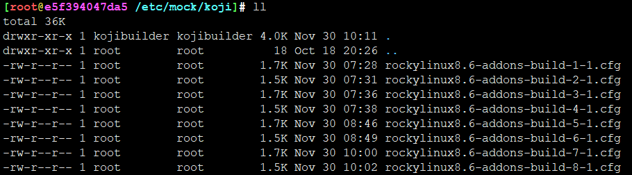
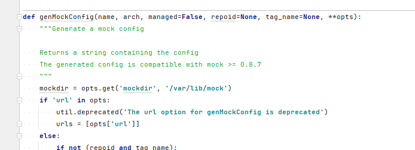
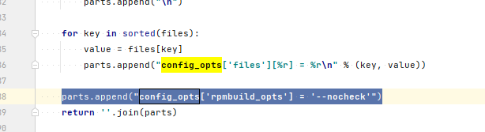
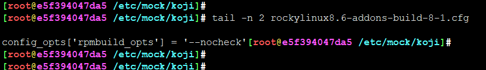
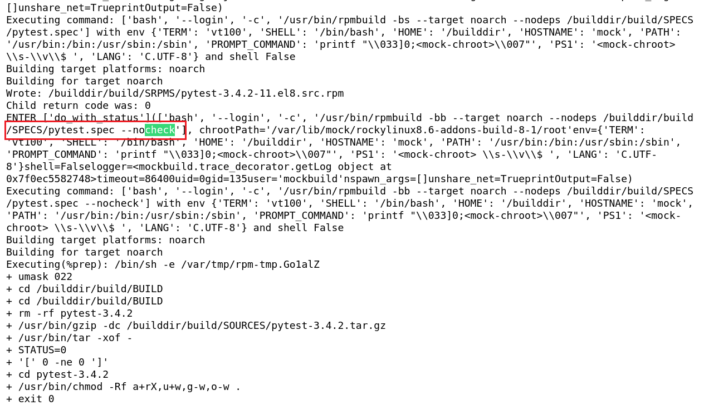
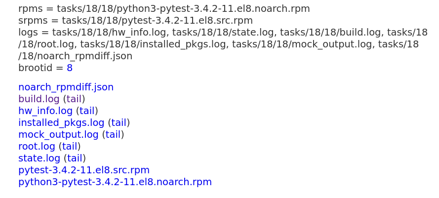

# 跳过rpm check阶段

## 题

rpm包规范中定义要求每个包都需要撰写必要的test脚本，但实际使用，强依赖环境的包，测试肯定要炸锅，那这时候针对这类包，有没有可能不做测试


** 没有测试的包，你敢用？线上环境谨慎使用，但这里只是玩玩而已 **


那么问题来了，koji编译，如果跳过包测试？


## 解

koji对于mock配置，每次编译都会自动生成，放在



生成方式是，调用genMockConfig处理

```
vi /usr/lib/python3.6/site-packages/koji/__init__.py
```




但是并没有发现nocheck（nocheck是rpmbuild参数绕过校验的参数，help一下你就知道）

那就干脆，自己手动添加






测试，koji日志输出，可以看到已经添加到rpmbuild命令行中



完美绕过，成功编译



当然，举一反三，其他mock参数也可以用这个办法

不过，这方法简单粗暴，如果要二次开发，其实研究一下参数传递，写到配置里，就更标准了。基于玩耍目的，点到为止。


---
