<!-- MDTOC maxdepth:6 firsth1:1 numbering:0 flatten:0 bullets:1 updateOnSave:1 -->

- [kojihub如何连接PostgreSQL](#kojihub如何连接postgresql)   
   - [问题分析](#问题分析)   
   - [代码跟踪](#代码跟踪)   
   - [总结](#总结)   

<!-- /MDTOC -->

# kojihub如何连接PostgreSQL


## 问题分析

构造一个空的POST请求：

```
curl -X POST -d '' http://192.168.33.61/kojihub
```

直接爆炸，为什么，SQL没有up


查看日志

```
==> error_log <==
[Wed Aug 10 21:04:35.481092 2022] [wsgi:error] [pid 16781:tid 139642800170752] [client 192.168.33.61:59796] debug application
[Wed Aug 10 21:04:35.517439 2022] [wsgi:error] [pid 16781:tid 139642800170752] [client 192.168.33.61:59796] 2022-08-10 21:04:35,510 [ERROR] SETUP p=16781 koji.db: Traceback (most recent call last):
[Wed Aug 10 21:04:35.517483 2022] [wsgi:error] [pid 16781:tid 139642800170752] [client 192.168.33.61:59796]   File "/usr/lib/python3.6/site-packages/koji/db.py", line 195, in connect
[Wed Aug 10 21:04:35.517489 2022] [wsgi:error] [pid 16781:tid 139642800170752] [client 192.168.33.61:59796]     conn = psycopg2.connect(**opts)
[Wed Aug 10 21:04:35.517493 2022] [wsgi:error] [pid 16781:tid 139642800170752] [client 192.168.33.61:59796]   File "/usr/lib64/python3.6/site-packages/psycopg2/__init__.py", line 130, in connect
[Wed Aug 10 21:04:35.517502 2022] [wsgi:error] [pid 16781:tid 139642800170752] [client 192.168.33.61:59796]     conn = _connect(dsn, connection_factory=connection_factory, **kwasync)
[Wed Aug 10 21:04:35.517505 2022] [wsgi:error] [pid 16781:tid 139642800170752] [client 192.168.33.61:59796] psycopg2.OperationalError: could not connect to server: No such file or directory
[Wed Aug 10 21:04:35.517509 2022] [wsgi:error] [pid 16781:tid 139642800170752] [client 192.168.33.61:59796] \tIs the server running locally and accepting
[Wed Aug 10 21:04:35.517512 2022] [wsgi:error] [pid 16781:tid 139642800170752] [client 192.168.33.61:59796] \tconnections on Unix domain socket "/var/run/postgresql/.s.PGSQL.5432"?
[Wed Aug 10 21:04:35.517521 2022] [wsgi:error] [pid 16781:tid 139642800170752] [client 192.168.33.61:59796]
[Wed Aug 10 21:04:35.517529 2022] [wsgi:error] [pid 16781:tid 139642800170752] [client 192.168.33.61:59796]
[Wed Aug 10 21:04:35.518246 2022] [wsgi:error] [pid 16781:tid 139642800170752] [client 192.168.33.61:59796] 2022-08-10 21:04:35,510 [ERROR] m=None u=None p=16781 r=192.168.33.61:59796 koji.db: Traceback (most recent call last):
[Wed Aug 10 21:04:35.518270 2022] [wsgi:error] [pid 16781:tid 139642800170752] [client 192.168.33.61:59796]   File "/usr/lib/python3.6/site-packages/koji/db.py", line 195, in connect
[Wed Aug 10 21:04:35.518275 2022] [wsgi:error] [pid 16781:tid 139642800170752] [client 192.168.33.61:59796]     conn = psycopg2.connect(**opts)
[Wed Aug 10 21:04:35.518279 2022] [wsgi:error] [pid 16781:tid 139642800170752] [client 192.168.33.61:59796]   File "/usr/lib64/python3.6/site-packages/psycopg2/__init__.py", line 130, in connect
[Wed Aug 10 21:04:35.518282 2022] [wsgi:error] [pid 16781:tid 139642800170752] [client 192.168.33.61:59796]     conn = _connect(dsn, connection_factory=connection_factory, **kwasync)
[Wed Aug 10 21:04:35.518285 2022] [wsgi:error] [pid 16781:tid 139642800170752] [client 192.168.33.61:59796] psycopg2.OperationalError: could not connect to server: No such file or directory
[Wed Aug 10 21:04:35.518289 2022] [wsgi:error] [pid 16781:tid 139642800170752] [client 192.168.33.61:59796] \tIs the server running locally and accepting
[Wed Aug 10 21:04:35.518292 2022] [wsgi:error] [pid 16781:tid 139642800170752] [client 192.168.33.61:59796] \tconnections on Unix domain socket "/var/run/postgresql/.s.PGSQL.5432"?
[Wed Aug 10 21:04:35.518295 2022] [wsgi:error] [pid 16781:tid 139642800170752] [client 192.168.33.61:59796]
[Wed Aug 10 21:04:35.518302 2022] [wsgi:error] [pid 16781:tid 139642800170752] [client 192.168.33.61:59796]
[Wed Aug 10 21:04:35.518377 2022] [wsgi:error] [pid 16781:tid 139642800170752] [client 192.168.33.61:59796] 2022-08-10 21:04:35,510 [ERROR] m=None u=None p=16781 r=192.168.33.61:59796 koji.db: Traceback (most recent call last):
[Wed Aug 10 21:04:35.518401 2022] [wsgi:error] [pid 16781:tid 139642800170752] [client 192.168.33.61:59796]   File "/usr/lib/python3.6/site-packages/koji/db.py", line 195, in connect
[Wed Aug 10 21:04:35.518411 2022] [wsgi:error] [pid 16781:tid 139642800170752] [client 192.168.33.61:59796]     conn = psycopg2.connect(**opts)
[Wed Aug 10 21:04:35.518416 2022] [wsgi:error] [pid 16781:tid 139642800170752] [client 192.168.33.61:59796]   File "/usr/lib64/python3.6/site-packages/psycopg2/__init__.py", line 130, in connect
[Wed Aug 10 21:04:35.518420 2022] [wsgi:error] [pid 16781:tid 139642800170752] [client 192.168.33.61:59796]     conn = _connect(dsn, connection_factory=connection_factory, **kwasync)
[Wed Aug 10 21:04:35.518423 2022] [wsgi:error] [pid 16781:tid 139642800170752] [client 192.168.33.61:59796] psycopg2.OperationalError: could not connect to server: No such file or directory
[Wed Aug 10 21:04:35.518426 2022] [wsgi:error] [pid 16781:tid 139642800170752] [client 192.168.33.61:59796] \tIs the server running locally and accepting
[Wed Aug 10 21:04:35.518429 2022] [wsgi:error] [pid 16781:tid 139642800170752] [client 192.168.33.61:59796] \tconnections on Unix domain socket "/var/run/postgresql/.s.PGSQL.5432"?
[Wed Aug 10 21:04:35.518433 2022] [wsgi:error] [pid 16781:tid 139642800170752] [client 192.168.33.61:59796]
[Wed Aug 10 21:04:35.518557 2022] [wsgi:error] [pid 16781:tid 139642800170752] [client 192.168.33.61:59796]
[Wed Aug 10 21:04:35.518628 2022] [wsgi:error] [pid 16781:tid 139642800170752] [client 192.168.33.61:59796] 2022-08-10 21:04:35,510 [ERROR] m=None u=None p=16781 r=192.168.33.61:59796 koji.db: Traceback (most recent call last):
[Wed Aug 10 21:04:35.518641 2022] [wsgi:error] [pid 16781:tid 139642800170752] [client 192.168.33.61:59796]   File "/usr/lib/python3.6/site-packages/koji/db.py", line 195, in connect
[Wed Aug 10 21:04:35.518645 2022] [wsgi:error] [pid 16781:tid 139642800170752] [client 192.168.33.61:59796]     conn = psycopg2.connect(**opts)
[Wed Aug 10 21:04:35.518648 2022] [wsgi:error] [pid 16781:tid 139642800170752] [client 192.168.33.61:59796]   File "/usr/lib64/python3.6/site-packages/psycopg2/__init__.py", line 130, in connect
[Wed Aug 10 21:04:35.518651 2022] [wsgi:error] [pid 16781:tid 139642800170752] [client 192.168.33.61:59796]     conn = _connect(dsn, connection_factory=connection_factory, **kwasync)
[Wed Aug 10 21:04:35.518655 2022] [wsgi:error] [pid 16781:tid 139642800170752] [client 192.168.33.61:59796] psycopg2.OperationalError: could not connect to server: No such file or directory
[Wed Aug 10 21:04:35.518658 2022] [wsgi:error] [pid 16781:tid 139642800170752] [client 192.168.33.61:59796] \tIs the server running locally and accepting
[Wed Aug 10 21:04:35.518661 2022] [wsgi:error] [pid 16781:tid 139642800170752] [client 192.168.33.61:59796] \tconnections on Unix domain socket "/var/run/postgresql/.s.PGSQL.5432"?
[Wed Aug 10 21:04:35.518665 2022] [wsgi:error] [pid 16781:tid 139642800170752] [client 192.168.33.61:59796]
[Wed Aug 10 21:04:35.518746 2022] [wsgi:error] [pid 16781:tid 139642800170752] [client 192.168.33.61:59796]

==> access_log <==
192.168.33.61 - - [10/Aug/2022:21:04:35 +0800] "POST /kojihub HTTP/1.1" 200 273 "-" "curl/7.61.1"

```


跟踪一下代码

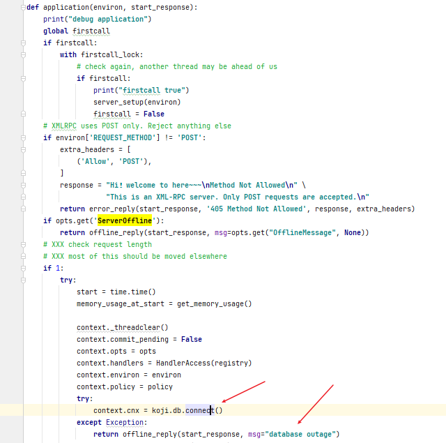


dsn是什么？

```
Data Source Name (DSN)的PDO命名惯例为：PDO驱动程序的名称，后面为一个冒号，再后面是可选的驱动程序连接数据库变量信息，如主机名、端口和数据库名。
```

dsn其实就是有规则的字符串参数

以MySQL为例：```mysql:host=localhost;dbname=testdb```


这里很明确，没有用dsn，并且与SQL没有建立通信


把SQL服务配置好


```
yum install postgresql-server -y
systemctl enable postgresql --now

su postgres
cd
export PGDATA=`pwd`
postgresql_data initdb
```
完成postgre初始化，再然后创建koji账户

```
[root@os1 ~]# useradd koji
[root@os1 ~]# passwd -d koji
[root@os1 ~]# su - postgres
-bash-4.1$ createuser koji    #当询问到y/n，全部选n
-bash-4.1$ createdb -O koji koji  #创建一个名为koji的数据库，并由koji用户来管理，删除用dropdb
-bash-4.1$ exit
[root@os1 ~]# su - koji
[koji@os1 ~]# psql koji koji < /root/rpmbuild/BUILD/koji-1.29.1/docs/schema.sql
[koji@os1 ~]# exit

```

好了，SQL连接上了

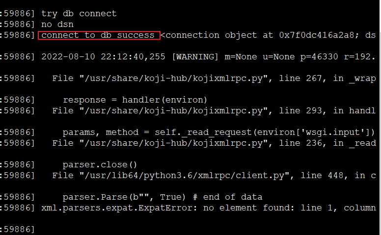

记录一下连接SQL的参数


再来一个一个新的脚本，获取登陆用户

```
curl -X POST -d "<?xml version='1.0'?><methodCall><methodName>sslLogin</methodName><params><param><value><struct><member><name>proxyuser</name><value><nil/></value></member><member><name>__starstar</name><value><boolean>1</boolean></value></member></struct></value></param></params></methodCall>" http://192.168.33.61/kojihub
```

其实就是hello请求

```
koji hello
```


请求SQL数据库和用户名，为什么没有密码？


一定要通过SSL才能访问么？http我并没有配置SSL哟


## 代码跟踪

每个请求都会获取SQL句柄

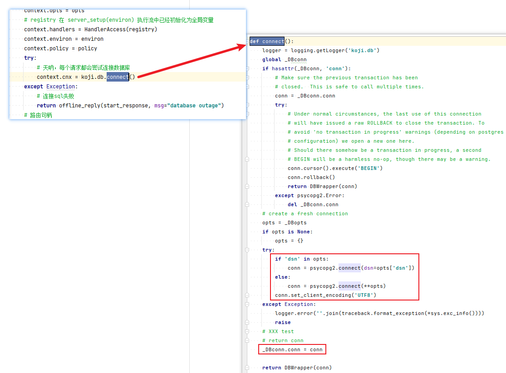

psycopg2库是python用来操作postgreSQL 数据库的第三方库。

* <https://blog.csdn.net/weixin_42475060/article/details/122945521>

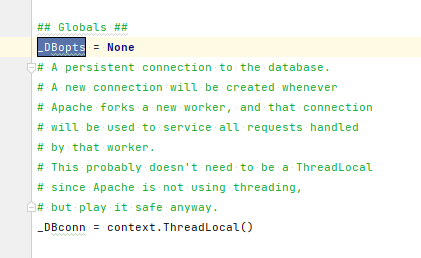

SQL参数和连接都是全局，尤其是连接必须是线程独立的

SQL参数从哪里来，该函数初始化了_DBopts

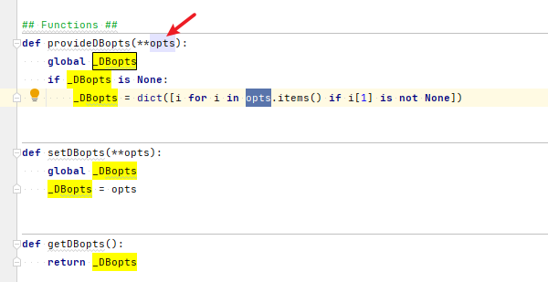


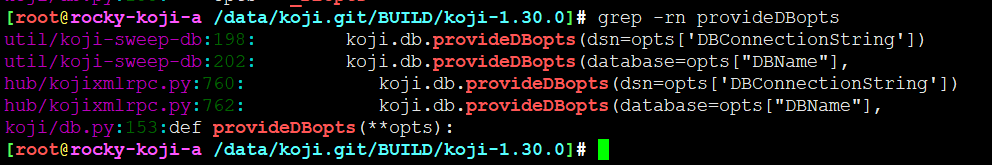

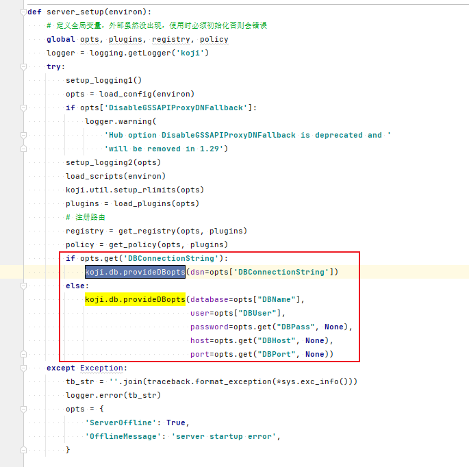

```
opts = load_config(environ)
```

毫无疑问，调用到hub核心服务初始化过程中加载配置

这里时时刻刻都关联到environ中，之前讲过 environ是一个包含所有HTTP请求信息的dict对象

代码里写死了配置地址在 /etc/koji-hub/hub.conf、/etc/koji-hub/hub.conf.d


```

def load_config(environ):
    """Load configuration options

    Options are read from a config file. The config file location is
    controlled by the koji.hub.ConfigFile environment variable
    in the httpd config. To override this (for example):

      SetEnv koji.hub.ConfigFile /home/developer/koji/hub/hub.conf

    Backwards compatibility:
        - if ConfigFile is not set, opts are loaded from http config
        - if ConfigFile is set, then the http config must not provide Koji options
        - In a future version we will load the default hub config regardless
        - all PythonOptions (except ConfigFile) are now deprecated and support for them
          will disappear in a future version of Koji
    """
    # get our config file(s)
    cf = environ.get('koji.hub.ConfigFile', '/etc/koji-hub/hub.conf') # dict.get(key[, value])  value -- 可选，如果指定键的值不存在时，返回该默认值
    cfdir = environ.get('koji.hub.ConfigDir', '/etc/koji-hub/hub.conf.d')
    # 加载配置  /etc/koji-hub/hub.conf、/etc/koji-hub/hub.conf.d
    config = koji.read_config_files([cfdir, (cf, True)], raw=True)

    cfgmap = [
        # option, type, default 设置默认值
        ['DBName', 'string', None],
        ['DBUser', 'string', None],
        ['DBHost', 'string', None],
        ['DBhost', 'string', None],  # alias for backwards compatibility
        ['DBPort', 'integer', None],
        ['DBPass', 'string', None],
        ['DBConnectionString', 'string', None],
        ['KojiDir', 'string', None],

        ['AuthPrincipal', 'string', None],
        ['AuthKeytab', 'string', None],
        ['ProxyPrincipals', 'string', ''],
        ['HostPrincipalFormat', 'string', None],
        ['AllowedKrbRealms', 'string', '*'],
        # TODO: this option should be removed in future release
        ['DisableGSSAPIProxyDNFallback', 'boolean', False],

        ['DNUsernameComponent', 'string', 'CN'],
        ['ProxyDNs', 'string', ''],

        ['CheckClientIP', 'boolean', True],

        ['LoginCreatesUser', 'boolean', True],
        ['AllowProxyAuthType', 'boolean', False],
        ['KojiWebURL', 'string', 'http://localhost.localdomain/koji'],
        ['EmailDomain', 'string', None],
        ['NotifyOnSuccess', 'boolean', True],
        ['DisableNotifications', 'boolean', False],

        ['Plugins', 'string', ''],
        ['PluginPath', 'string', '/usr/lib/koji-hub-plugins'],

        ['KojiDebug', 'boolean', False],
        ['KojiTraceback', 'string', None],
        ['VerbosePolicy', 'boolean', False],

        ['LogLevel', 'string', 'WARNING'],
        ['LogFormat', 'string',
         '%(asctime)s [%(levelname)s] m=%(method)s u=%(user_name)s p=%(process)s r=%(remoteaddr)s '
         '%(name)s: %(message)s'],

        ['MissingPolicyOk', 'boolean', True],
        ['EnableMaven', 'boolean', False],
        ['EnableWin', 'boolean', False],

        ['RLIMIT_AS', 'string', None],
        ['RLIMIT_CORE', 'string', None],
        ['RLIMIT_CPU', 'string', None],
        ['RLIMIT_DATA', 'string', None],
        ['RLIMIT_FSIZE', 'string', None],
        ['RLIMIT_MEMLOCK', 'string', None],
        ['RLIMIT_NOFILE', 'string', None],
        ['RLIMIT_NPROC', 'string', None],
        ['RLIMIT_OFILE', 'string', None],  # alias for RLIMIT_NOFILE
        ['RLIMIT_RSS', 'string', None],
        ['RLIMIT_STACK', 'string', None],

        ['MemoryWarnThreshold', 'integer', 5000],
        ['MaxRequestLength', 'integer', 4194304],

        ['LockOut', 'boolean', False],
        ['ServerOffline', 'boolean', False],
        ['OfflineMessage', 'string', None],

        ['MaxNameLengthInternal', 'integer', 256],
        ['RegexNameInternal', 'string', r'^[A-Za-z0-9/_.+-]+$'],
        ['RegexUserName', 'string', r'^[A-Za-z0-9/_.@-]+$']
    ]
    opts = {}
    for name, dtype, default in cfgmap:
        key = ('hub', name)
        if config and config.has_option(*key):
            if dtype == 'integer':
                opts[name] = config.getint(*key)
            elif dtype == 'boolean':
                opts[name] = config.getboolean(*key)
            else:
                opts[name] = config.get(*key)
            continue
        opts[name] = default
    if opts['DBHost'] is None:
        opts['DBHost'] = opts['DBhost']
    if opts['RLIMIT_NOFILE'] is None:
        opts['RLIMIT_NOFILE'] = opts['RLIMIT_OFILE']
    # load policies
    # (only from config file)
    if config and config.has_section('policy'):
        # for the moment, we simply transfer the policy conf to opts
        opts['policy'] = dict(config.items('policy'))
    else:
        opts['policy'] = {}
    for pname, text in _default_policies.items():
        opts['policy'].setdefault(pname, text)
    # use configured KojiDir
    if opts.get('KojiDir') is not None:
        koji.BASEDIR = opts['KojiDir']
        koji.pathinfo.topdir = opts['KojiDir']
    if opts['RegexNameInternal'] != '':
        opts['RegexNameInternal.compiled'] = re.compile(opts['RegexNameInternal'])
    if opts['RegexUserName'] != '':
        opts['RegexUserName.compiled'] = re.compile(opts['RegexUserName'])
    return opts
```


在读取```config = koji.read_config_files([cfdir, (cf, True)], raw=True)```中有逻辑

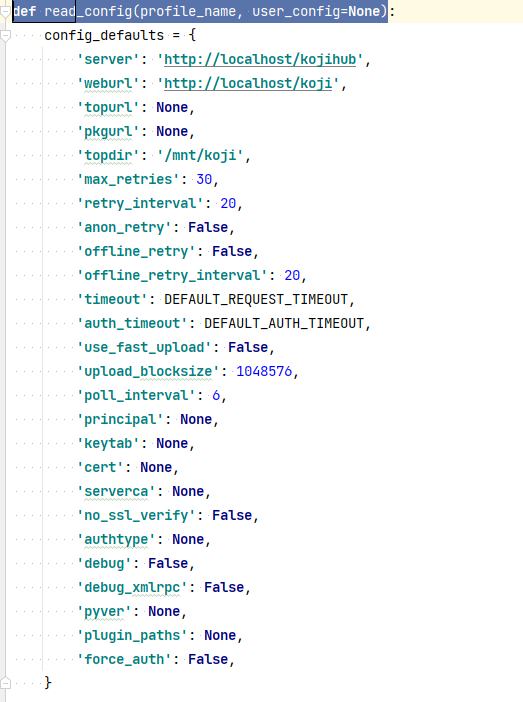


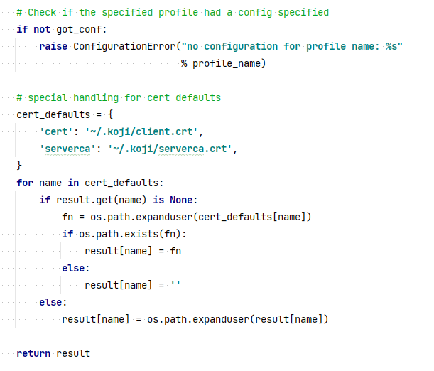

可选用户配置，

最终读配置在这里

```
def read_config_files(config_files, raw=False):
```

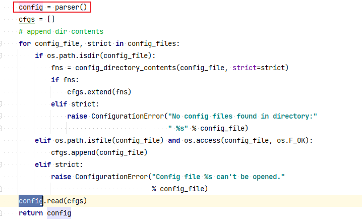

是基于configparser来读取配置的


绕回来，所有配置都在opts中


在看下配置，没错，就是这个

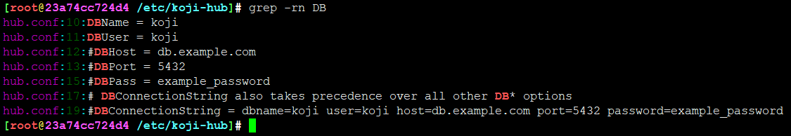

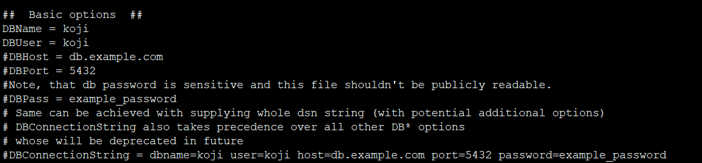


## 总结

1. configparser解析参数，读取/etc/koji-hub/hub.conf，获取SQL相关参数
2. 使用psycopg2连接postgresql，返回句柄


---
