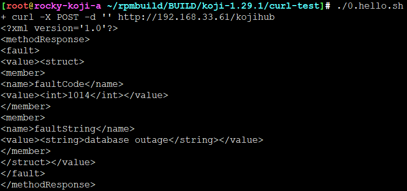
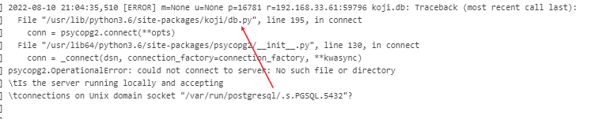
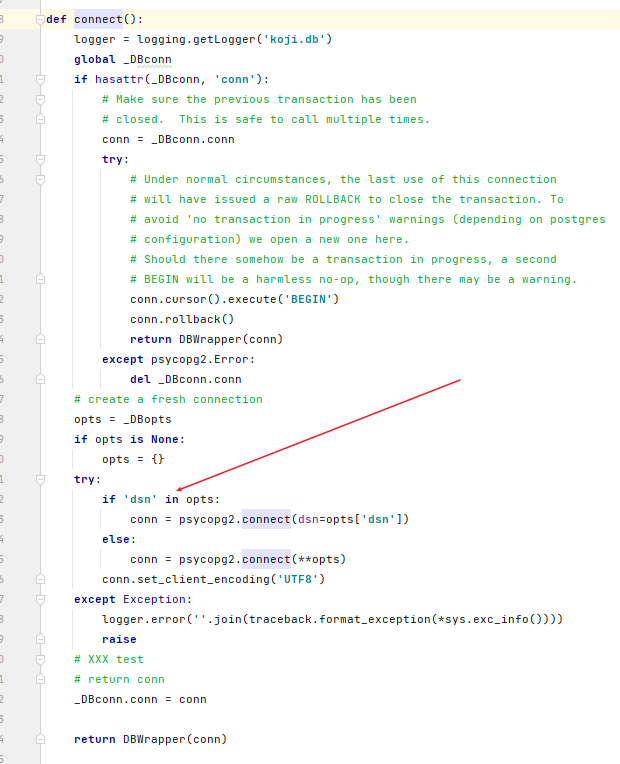
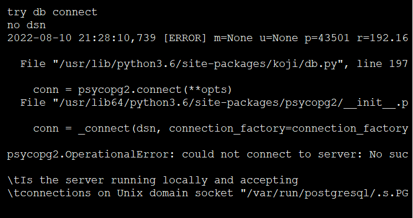
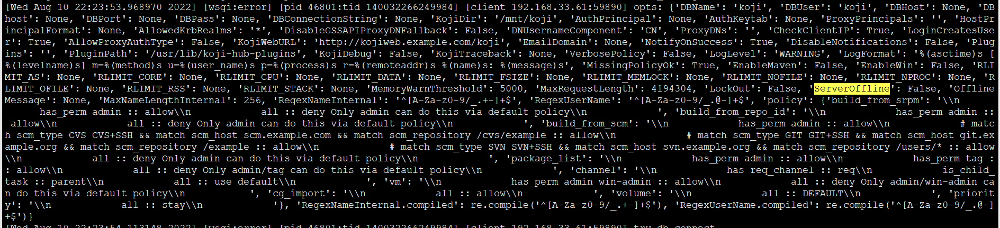
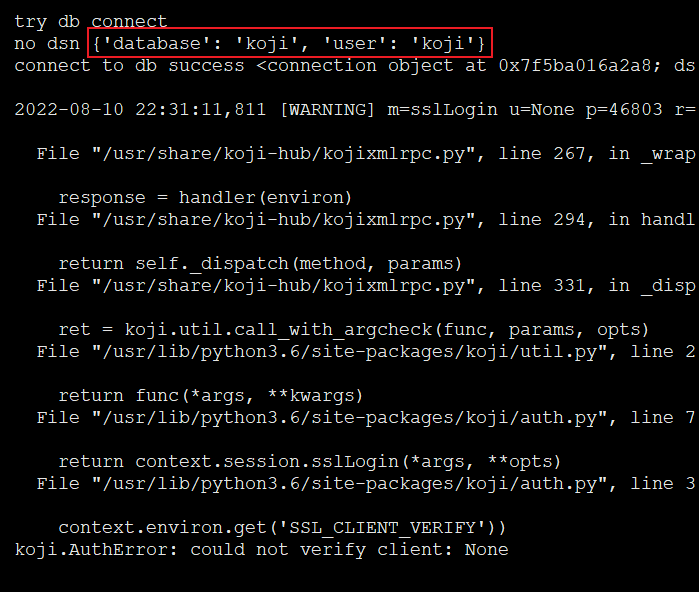
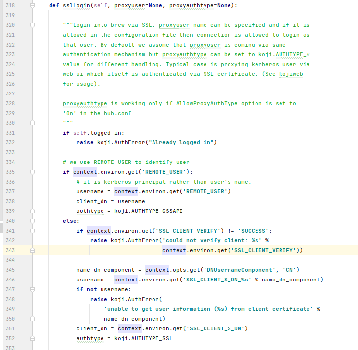

# kojihub如何连接PostgreSQL


构造一个空的POST请求：

```
curl -X POST -d '' http://192.168.33.61/kojihub
```

直接爆炸，为什么，SQL没有up



查看日志

```
==> error_log <==
[Wed Aug 10 21:04:35.481092 2022] [wsgi:error] [pid 16781:tid 139642800170752] [client 192.168.33.61:59796] debug application
[Wed Aug 10 21:04:35.517439 2022] [wsgi:error] [pid 16781:tid 139642800170752] [client 192.168.33.61:59796] 2022-08-10 21:04:35,510 [ERROR] SETUP p=16781 koji.db: Traceback (most recent call last):
[Wed Aug 10 21:04:35.517483 2022] [wsgi:error] [pid 16781:tid 139642800170752] [client 192.168.33.61:59796]   File "/usr/lib/python3.6/site-packages/koji/db.py", line 195, in connect
[Wed Aug 10 21:04:35.517489 2022] [wsgi:error] [pid 16781:tid 139642800170752] [client 192.168.33.61:59796]     conn = psycopg2.connect(**opts)
[Wed Aug 10 21:04:35.517493 2022] [wsgi:error] [pid 16781:tid 139642800170752] [client 192.168.33.61:59796]   File "/usr/lib64/python3.6/site-packages/psycopg2/__init__.py", line 130, in connect
[Wed Aug 10 21:04:35.517502 2022] [wsgi:error] [pid 16781:tid 139642800170752] [client 192.168.33.61:59796]     conn = _connect(dsn, connection_factory=connection_factory, **kwasync)
[Wed Aug 10 21:04:35.517505 2022] [wsgi:error] [pid 16781:tid 139642800170752] [client 192.168.33.61:59796] psycopg2.OperationalError: could not connect to server: No such file or directory
[Wed Aug 10 21:04:35.517509 2022] [wsgi:error] [pid 16781:tid 139642800170752] [client 192.168.33.61:59796] \tIs the server running locally and accepting
[Wed Aug 10 21:04:35.517512 2022] [wsgi:error] [pid 16781:tid 139642800170752] [client 192.168.33.61:59796] \tconnections on Unix domain socket "/var/run/postgresql/.s.PGSQL.5432"?
[Wed Aug 10 21:04:35.517521 2022] [wsgi:error] [pid 16781:tid 139642800170752] [client 192.168.33.61:59796]
[Wed Aug 10 21:04:35.517529 2022] [wsgi:error] [pid 16781:tid 139642800170752] [client 192.168.33.61:59796]
[Wed Aug 10 21:04:35.518246 2022] [wsgi:error] [pid 16781:tid 139642800170752] [client 192.168.33.61:59796] 2022-08-10 21:04:35,510 [ERROR] m=None u=None p=16781 r=192.168.33.61:59796 koji.db: Traceback (most recent call last):
[Wed Aug 10 21:04:35.518270 2022] [wsgi:error] [pid 16781:tid 139642800170752] [client 192.168.33.61:59796]   File "/usr/lib/python3.6/site-packages/koji/db.py", line 195, in connect
[Wed Aug 10 21:04:35.518275 2022] [wsgi:error] [pid 16781:tid 139642800170752] [client 192.168.33.61:59796]     conn = psycopg2.connect(**opts)
[Wed Aug 10 21:04:35.518279 2022] [wsgi:error] [pid 16781:tid 139642800170752] [client 192.168.33.61:59796]   File "/usr/lib64/python3.6/site-packages/psycopg2/__init__.py", line 130, in connect
[Wed Aug 10 21:04:35.518282 2022] [wsgi:error] [pid 16781:tid 139642800170752] [client 192.168.33.61:59796]     conn = _connect(dsn, connection_factory=connection_factory, **kwasync)
[Wed Aug 10 21:04:35.518285 2022] [wsgi:error] [pid 16781:tid 139642800170752] [client 192.168.33.61:59796] psycopg2.OperationalError: could not connect to server: No such file or directory
[Wed Aug 10 21:04:35.518289 2022] [wsgi:error] [pid 16781:tid 139642800170752] [client 192.168.33.61:59796] \tIs the server running locally and accepting
[Wed Aug 10 21:04:35.518292 2022] [wsgi:error] [pid 16781:tid 139642800170752] [client 192.168.33.61:59796] \tconnections on Unix domain socket "/var/run/postgresql/.s.PGSQL.5432"?
[Wed Aug 10 21:04:35.518295 2022] [wsgi:error] [pid 16781:tid 139642800170752] [client 192.168.33.61:59796]
[Wed Aug 10 21:04:35.518302 2022] [wsgi:error] [pid 16781:tid 139642800170752] [client 192.168.33.61:59796]
[Wed Aug 10 21:04:35.518377 2022] [wsgi:error] [pid 16781:tid 139642800170752] [client 192.168.33.61:59796] 2022-08-10 21:04:35,510 [ERROR] m=None u=None p=16781 r=192.168.33.61:59796 koji.db: Traceback (most recent call last):
[Wed Aug 10 21:04:35.518401 2022] [wsgi:error] [pid 16781:tid 139642800170752] [client 192.168.33.61:59796]   File "/usr/lib/python3.6/site-packages/koji/db.py", line 195, in connect
[Wed Aug 10 21:04:35.518411 2022] [wsgi:error] [pid 16781:tid 139642800170752] [client 192.168.33.61:59796]     conn = psycopg2.connect(**opts)
[Wed Aug 10 21:04:35.518416 2022] [wsgi:error] [pid 16781:tid 139642800170752] [client 192.168.33.61:59796]   File "/usr/lib64/python3.6/site-packages/psycopg2/__init__.py", line 130, in connect
[Wed Aug 10 21:04:35.518420 2022] [wsgi:error] [pid 16781:tid 139642800170752] [client 192.168.33.61:59796]     conn = _connect(dsn, connection_factory=connection_factory, **kwasync)
[Wed Aug 10 21:04:35.518423 2022] [wsgi:error] [pid 16781:tid 139642800170752] [client 192.168.33.61:59796] psycopg2.OperationalError: could not connect to server: No such file or directory
[Wed Aug 10 21:04:35.518426 2022] [wsgi:error] [pid 16781:tid 139642800170752] [client 192.168.33.61:59796] \tIs the server running locally and accepting
[Wed Aug 10 21:04:35.518429 2022] [wsgi:error] [pid 16781:tid 139642800170752] [client 192.168.33.61:59796] \tconnections on Unix domain socket "/var/run/postgresql/.s.PGSQL.5432"?
[Wed Aug 10 21:04:35.518433 2022] [wsgi:error] [pid 16781:tid 139642800170752] [client 192.168.33.61:59796]
[Wed Aug 10 21:04:35.518557 2022] [wsgi:error] [pid 16781:tid 139642800170752] [client 192.168.33.61:59796]
[Wed Aug 10 21:04:35.518628 2022] [wsgi:error] [pid 16781:tid 139642800170752] [client 192.168.33.61:59796] 2022-08-10 21:04:35,510 [ERROR] m=None u=None p=16781 r=192.168.33.61:59796 koji.db: Traceback (most recent call last):
[Wed Aug 10 21:04:35.518641 2022] [wsgi:error] [pid 16781:tid 139642800170752] [client 192.168.33.61:59796]   File "/usr/lib/python3.6/site-packages/koji/db.py", line 195, in connect
[Wed Aug 10 21:04:35.518645 2022] [wsgi:error] [pid 16781:tid 139642800170752] [client 192.168.33.61:59796]     conn = psycopg2.connect(**opts)
[Wed Aug 10 21:04:35.518648 2022] [wsgi:error] [pid 16781:tid 139642800170752] [client 192.168.33.61:59796]   File "/usr/lib64/python3.6/site-packages/psycopg2/__init__.py", line 130, in connect
[Wed Aug 10 21:04:35.518651 2022] [wsgi:error] [pid 16781:tid 139642800170752] [client 192.168.33.61:59796]     conn = _connect(dsn, connection_factory=connection_factory, **kwasync)
[Wed Aug 10 21:04:35.518655 2022] [wsgi:error] [pid 16781:tid 139642800170752] [client 192.168.33.61:59796] psycopg2.OperationalError: could not connect to server: No such file or directory
[Wed Aug 10 21:04:35.518658 2022] [wsgi:error] [pid 16781:tid 139642800170752] [client 192.168.33.61:59796] \tIs the server running locally and accepting
[Wed Aug 10 21:04:35.518661 2022] [wsgi:error] [pid 16781:tid 139642800170752] [client 192.168.33.61:59796] \tconnections on Unix domain socket "/var/run/postgresql/.s.PGSQL.5432"?
[Wed Aug 10 21:04:35.518665 2022] [wsgi:error] [pid 16781:tid 139642800170752] [client 192.168.33.61:59796]
[Wed Aug 10 21:04:35.518746 2022] [wsgi:error] [pid 16781:tid 139642800170752] [client 192.168.33.61:59796]

==> access_log <==
192.168.33.61 - - [10/Aug/2022:21:04:35 +0800] "POST /kojihub HTTP/1.1" 200 273 "-" "curl/7.61.1"

```




跟踪一下代码




dsn是什么？

```
Data Source Name (DSN)的PDO命名惯例为：PDO驱动程序的名称，后面为一个冒号，再后面是可选的驱动程序连接数据库变量信息，如主机名、端口和数据库名。
```

dsn其实就是有规则的字符串参数

以MySQL为例：```mysql:host=localhost;dbname=testdb```



这里很明确，没有用dsn，并且与SQL没有建立通信


把SQL服务配置好


```
yum install postgresql-server -y
systemctl enable postgresql --now

su postgres
cd
export PGDATA=`pwd`postgresql_data
initdb
完成postgre初始化，再然后创建koji账户


[root@os1 ~]# useradd koji
[root@os1 ~]# passwd -d koji
[root@os1 ~]# su - postgres
-bash-4.1$ createuser koji    #当询问到y/n，全部选n
-bash-4.1$ createdb -O koji koji  #创建一个名为koji的数据库，并由koji用户来管理，删除用dropdb
-bash-4.1$ exit
[root@os1 ~]# su - koji
[koji@os1 ~]# psql koji koji < /root/rpmbuild/BUILD/koji-1.29.1/docs/schema.sql
[koji@os1 ~]# exit

```

好了，SQL连接上了


记录一下连接SQL的参数




再来一个一个新的脚本，获取登陆用户

```
curl -X POST -d "<?xml version='1.0'?><methodCall><methodName>sslLogin</methodName><params><param><value><struct><member><name>proxyuser</name><value><nil/></value></member><member><name>__starstar</name><value><boolean>1</boolean></value></member></struct></value></param></params></methodCall>" http://192.168.33.61/kojihub
```

其实就是hello请求

```
koji hello
```




请求SQL数据库和用户名，为什么没有密码？



一定要通过SSL才能访问么？http我并没有配置SSL哟


---
