# koji如何通过krb5鉴权

* <https://docs.pagure.org/koji/kerberos_gssapi_debug/>

根据这里的描述

需要使用Kerberos鉴权，需要有krb5工具。但是这个工具并非koji直接依赖，也没有推荐安装。
毕竟是作为可选的鉴权方式之一


```
[root@92c64f170184 tmp]# kinit yifengyou@FEDORAPROJECT.ORG
Password for yifengyou@FEDORAPROJECT.ORG:

[root@92c64f170184 tmp]# koji hello
back to work, yifengyou!

You are using the hub at https://koji.fedoraproject.org/kojihub
Authenticated via GSSAPI
```

那么，这个账号在哪里注册? <https://accounts.fedoraproject.org/>

上面例子就是登陆，kinit是krb5-workstation的工具，然后才是koji。koji通过krb5完成鉴权。

另外，这里的server端，在哪里指定？ ```/etc/koji.conf```


可以用调试模式：

```
[root@92c64f170184 tmp]#  KRB5_TRACE=/dev/stdout koji -d hello
2022-08-07 02:27:51,653 [DEBUG] koji: Opening new requests session
2022-08-07 02:27:51,653 [DEBUG] koji: Opening new requests session
[404] 1659839273.694903: ccselect module realm chose cache KEYRING:persistent:0:0 with client principal yifengyou@FEDORAPROJECT.ORG for server principal HTTP/koji.fedoraproject.org@FEDORAPROJECT.ORG
[404] 1659839273.694904: Getting credentials yifengyou@FEDORAPROJECT.ORG -> HTTP/koji.fedoraproject.org@ using ccache KEYRING:persistent:0:0
[404] 1659839273.694905: Retrieving yifengyou@FEDORAPROJECT.ORG -> krb5_ccache_conf_data/start_realm@X-CACHECONF: from KEYRING:persistent:0:0 with result: -1765328243/Matching credential not found
[404] 1659839273.694906: Retrieving yifengyou@FEDORAPROJECT.ORG -> HTTP/koji.fedoraproject.org@ from KEYRING:persistent:0:0 with result: 0/Success
[404] 1659839273.694908: Creating authenticator for yifengyou@FEDORAPROJECT.ORG -> HTTP/koji.fedoraproject.org@, seqnum 665851148, subkey aes256-cts/1020, session key aes256-cts/9F85
successfully connected to hub
hi, yifengyou!

You are using the hub at https://koji.fedoraproject.org/kojihub
Authenticated via GSSAPI
[root@92c64f170184 tmp]#
```


```
strace -o koji -ff -s 102400 koji hello
```

strace看下输出

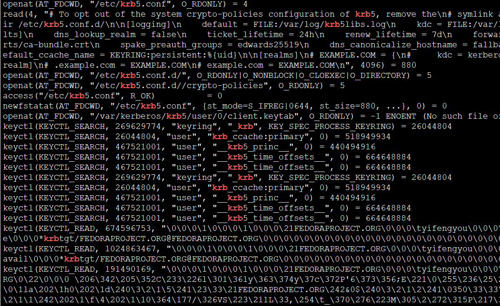

koji调用krb5，krb5使用内核提供的keyctl管理秘钥


其实koji这里有配置，鉴权类型，默认用的是kerberos方式。

koji实际上就是python的分布式系统，如何跟kerberos交互呢？

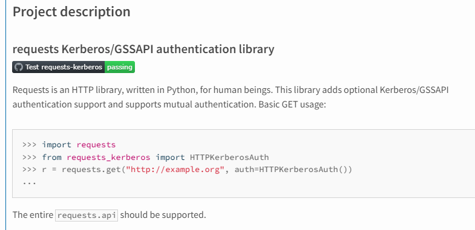


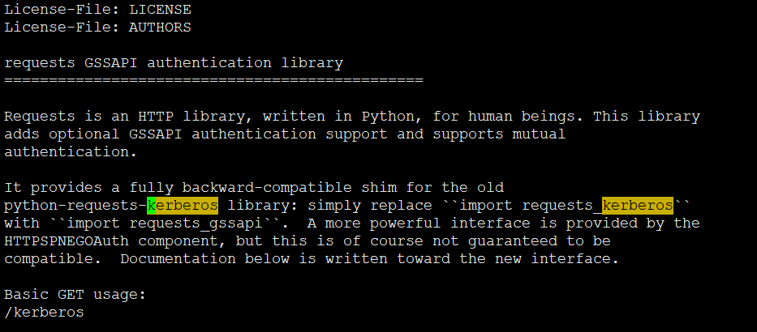

被```requests_gssapi```这个包替代了

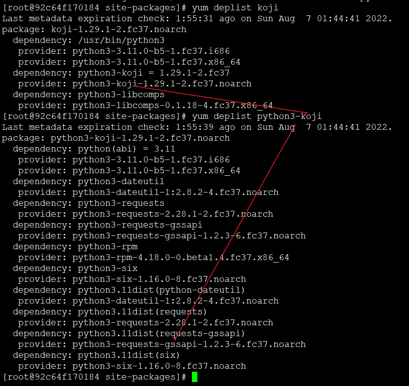

这个调用关系就很明确了，koji调用requests_gssapi去处理kerberos鉴权操作

## 代码走读

首先，koji这个命令，其实就是cli，只是个客户端，没有服务端的客户端等于有飞机没大炮

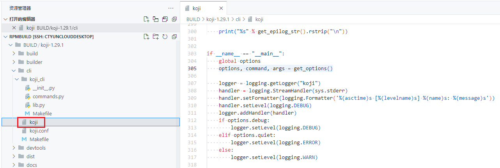

专业的koji，为了以示尊重，我选择用pycharm安排ta


koji目录应该是核心python库，多方都会直接间接依赖它，反正只要是需要鉴权，都得它

这里，根据代码，大概就能知晓。鉴权，需要先创建会话，结束后关闭会话。这个会话就是底层krb5根据协议实现加密规范以及鉴权逻辑，并且将机密数据用keyctl存到内核保险箱中。

走读代码

以hello为例，这个命令，毫无疑问，也是要调用server端的

```
koji hello
```

首先，参数解析

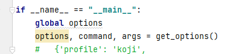

然后根据参数调用具体命令

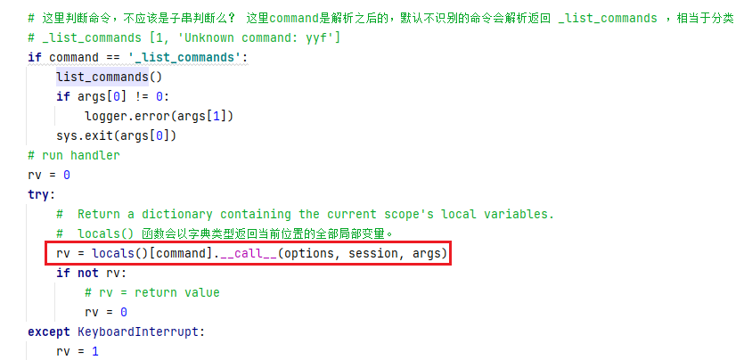

这里，hello也可以是多国的问候语，不过最终command是moshimoshi


moshimoshi会被包一个前缀


然后就跳转到moshimoshi具体执行


先激活会话，然后获取登陆用户信息

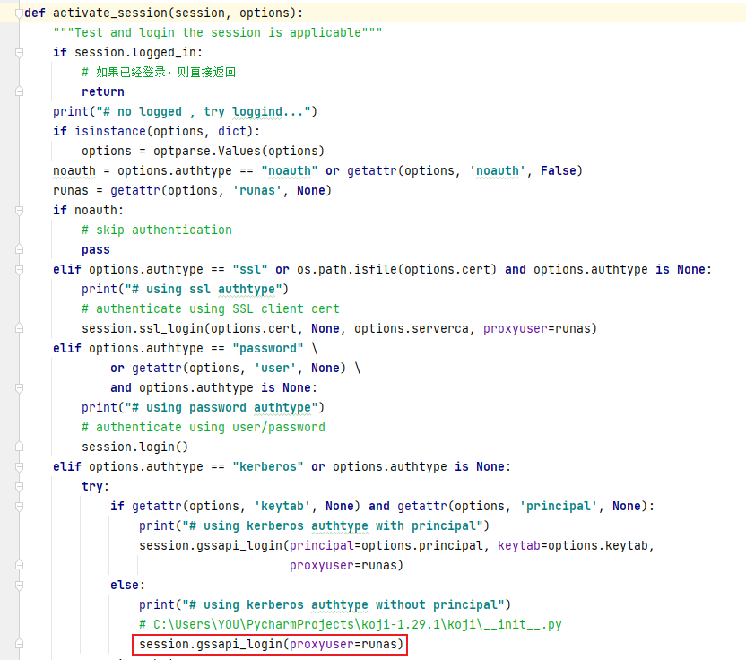


参数传递，gssapi_login登陆


还有重试

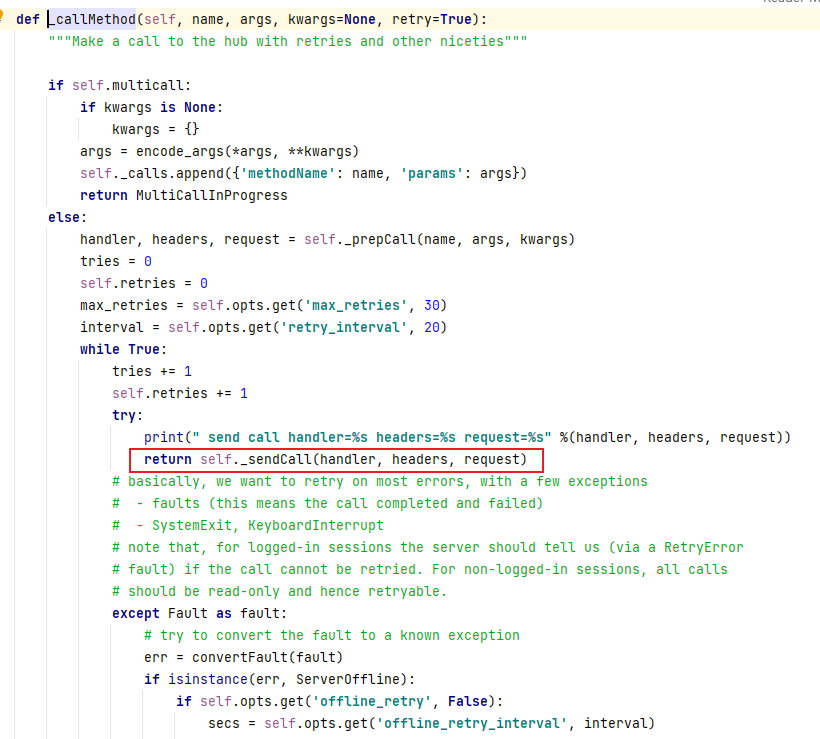

再包一层异常捕获


再包一层发送请求。到底了，借用request建立的session，发送post请求


请求内容都是啥？

在参数传递过程中加print，就能看到了，完美


果然，这个就是xml格式的，koji居然用xml，其实现在json跟主流。xml少见

另外，请求用request包，发送post请求。另外这里的key是怎么获取到的？


```
import requests_gssapi as reqgssapi
```


还需要继续深挖的话，就得看 requests_gssapi 包的玩法


当然也可能是另一个包，都一样，无所谓


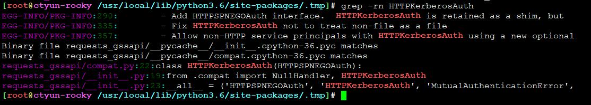


参数都是空的，默认值


HTTPSPNEGOAuth


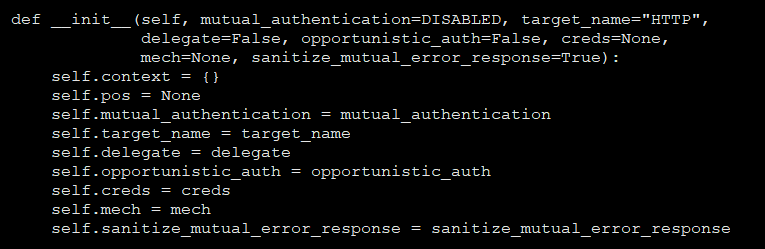

可以看到，这个类处理请求相关内容


毫无疑问，跟这个是有一腿的，后端肯定是调用这里来处理请求参数，以及从内核获取秘钥

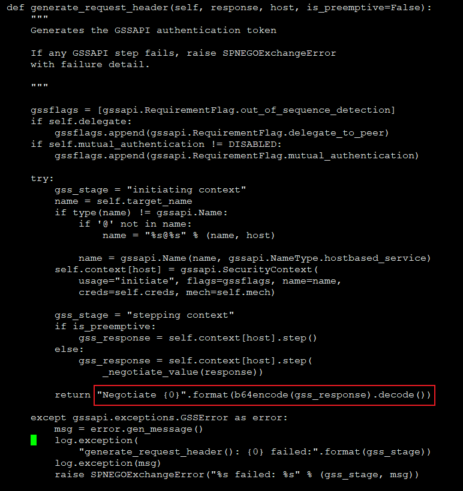

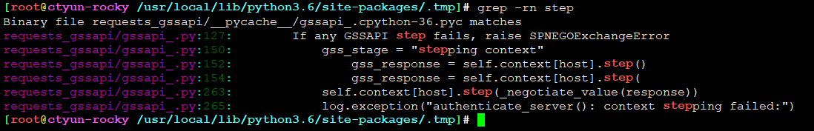


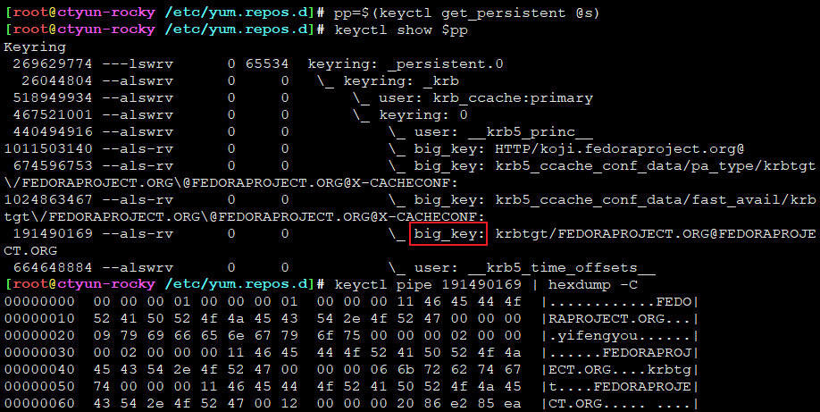

这里肯定是加密的哟，请求发送的肯定不会带明文滴


不过这里 step() 调用的是啥？


```
import gssapi

Python-GSSAPI provides both low-level and high level wrappers around the GSSAPI C libraries. While it focuses on the Kerberos mechanism, it should also be useable with other GSSAPI mechanisms.

通用安全服务应用程序接口(GSSAPI) 是为了让程序能够访问安全服务的一个应用程序接口。The Generic Security Services Application Program Interface (GSSAPI, also GSS-API) is an application programming interface for programs to access security services.The GSSAPI is an IETF standard that addresses the problem of many similar but incompatible security services in use today.
```


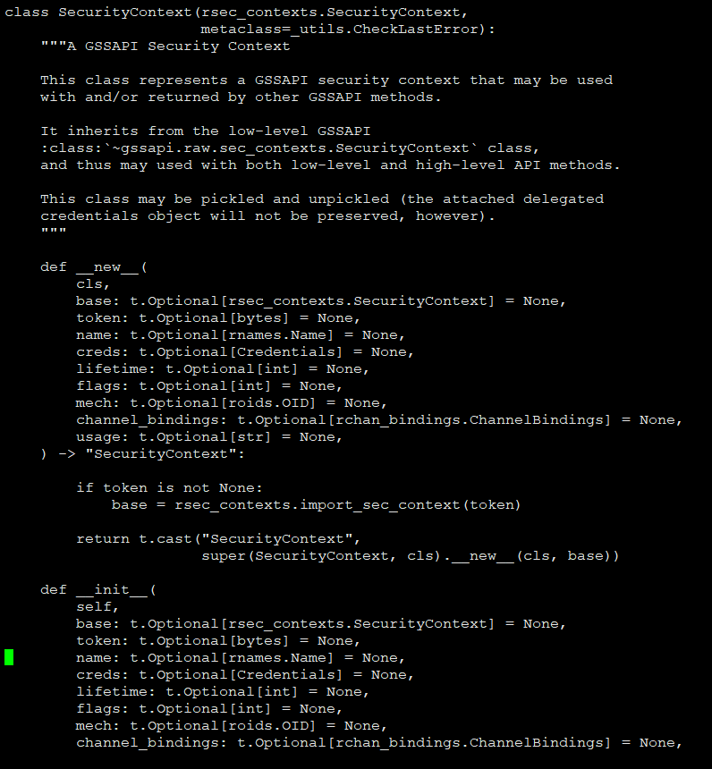


step() 才是真正开始获取key的操作

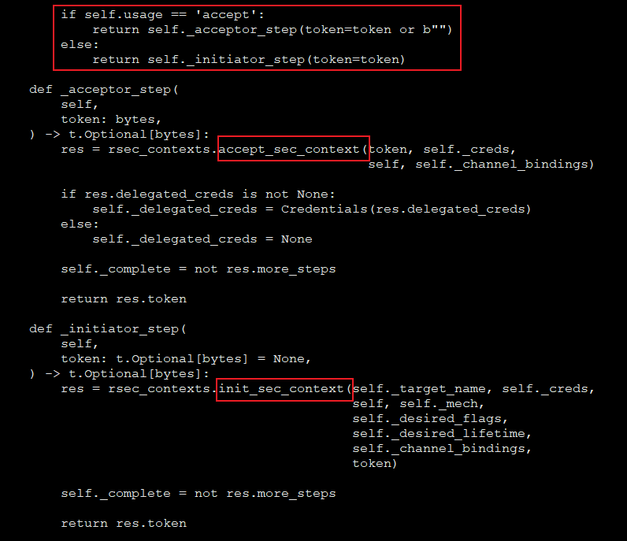

又分为两种情况

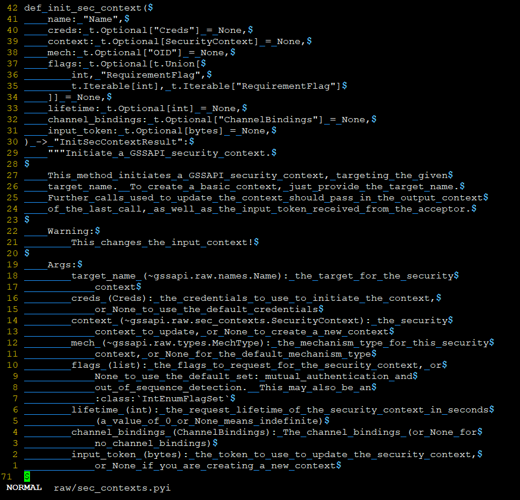

 


---
