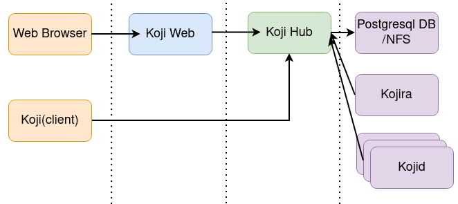
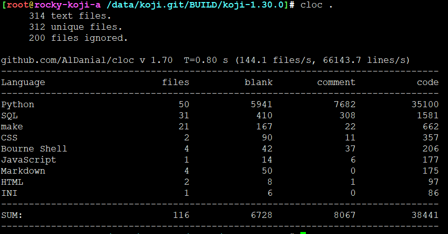

# koji相关rpm包

```
koji.noarch : Build system tools
koji-builder.noarch : Koji RPM builder daemon
koji-builder-plugins.noarch : Koji builder plugins
koji-hub.noarch : Koji XMLRPC interface
koji-hub-plugins.noarch : Koji hub plugins
koji-utils.noarch : Koji Utilities
koji-vm.noarch : Koji virtual machine management daemon
koji-web.noarch : Koji Web UI
python3-koji.noarch : Build system tools python library
python3-koji-cli-plugins.noarch : Koji client plugins
python3-koji-hub.noarch : Koji XMLRPC interface
python3-koji-hub-plugins.noarch : Koji hub plugins
python3-koji-web.noarch : Koji Web UI
supybot-koji.noarch : Plugin for Supybot to interact with Koji instances
```





## 代码量

移除test目录，还有大概3.5W行的python代码




测试代码比工程代码多，是个练家子


---
