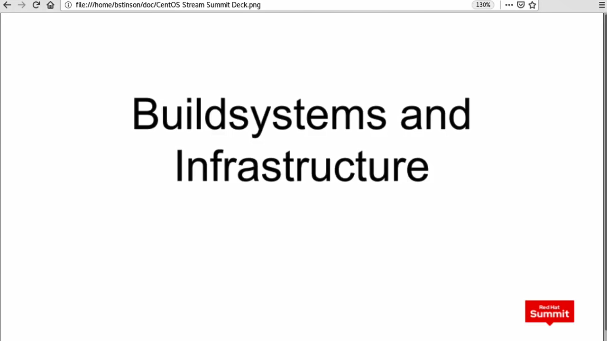
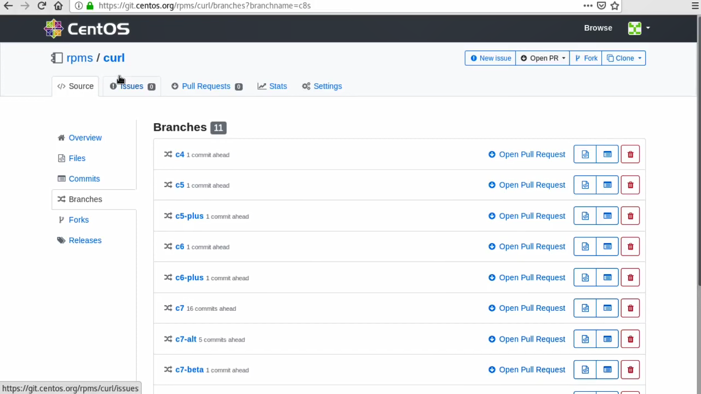
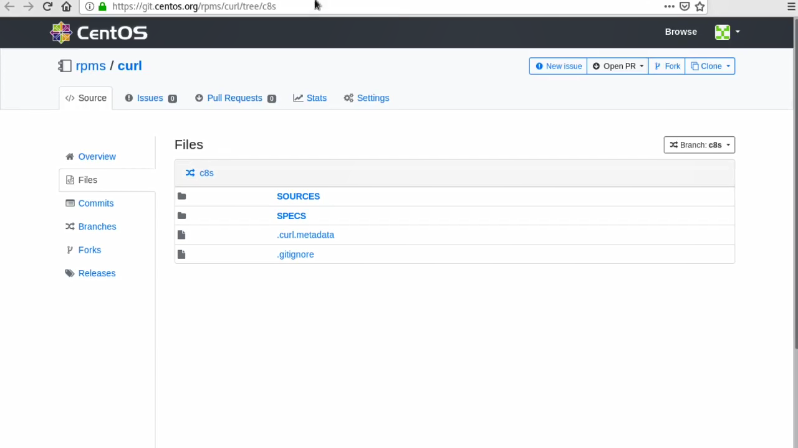
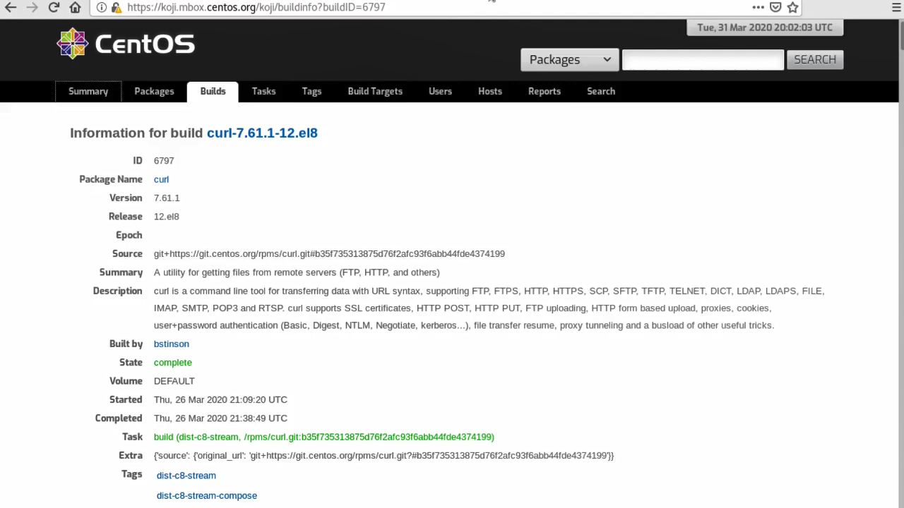
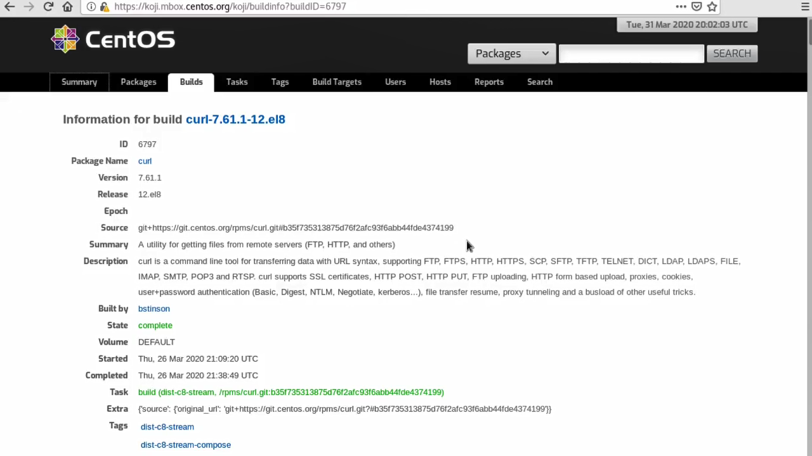
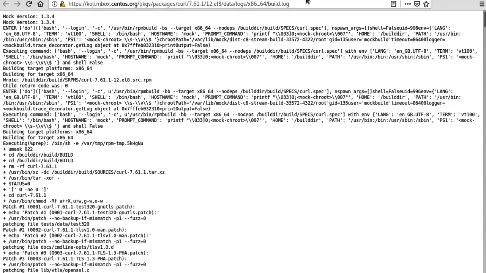
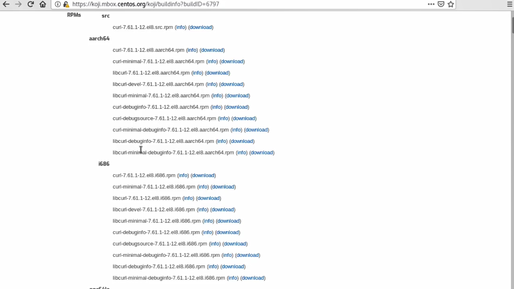
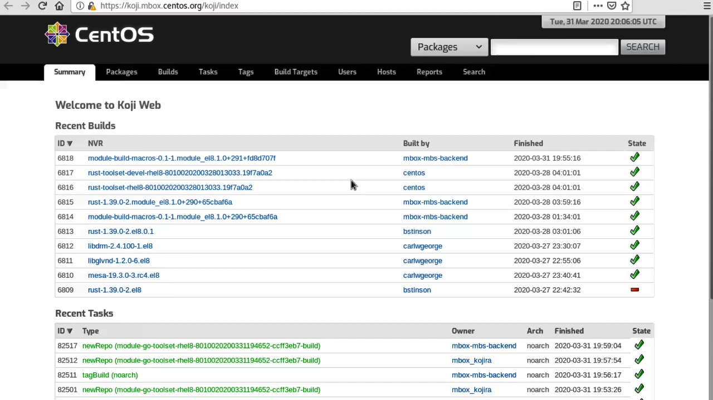

# CentOS Buildsystems and infrastructure

* 国内地址：<https://www.bilibili.com/video/BV1F14y1n7iX/>
* 国外地址: <https://www.youtube.com/watch?v=8VqbcNlDOHM&ab_channel=TheCentOSProject>

* <https://git.centos.org/rpms/curl>

* <https://koji.mbox.centos.org/koji>

* <https://msync.centos.org/centos/8-stream>

---
