<!-- MDTOC maxdepth:6 firsth1:1 numbering:0 flatten:0 bullets:1 updateOnSave:1 -->

- [PostgreSQL入门到入土](#postgresql入门到入土)   
   - [简介](#简介)   
   - [对比MySQL](#对比mysql)   
   - [安装](#安装)   
   - [PostgreSQL角色和身份认证方法](#postgresql角色和身份认证方法)   
   - [修改服务监听范围](#修改服务监听范围)   
   - [访问权限修改](#访问权限修改)   

<!-- /MDTOC -->

# PostgreSQL入门到入土

## 简介

* PostgreSQL 是一个免费的对象-关系数据库服务器(ORDBMS)，在灵活的BSD许可证下发行。
* PostgreSQL 开发者把它念作 post-gress-Q-L。
* PostgreSQL 的 Slogan 是 "世界上最先进的开源关系型数据库"。

## 对比MySQL

* <https://blog.csdn.net/weixin_40983094/article/details/119027700>


## 安装

```
yum install -y postgresql-server
```


安装完毕后，系统会创建一个数据库超级用户 postgres，密码为空。

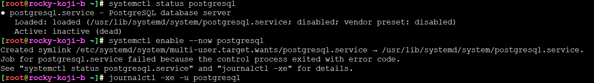

服务启动炸了，为什么呢？因为需要做初始化

```
sudo postresql-setup initdb
```


获取版本号信息。登陆SQL终端


## PostgreSQL角色和身份认证方法


PostgreSQL 支持多种身份认证方法。最常用的方法如下：

* Trust - 只要满足pg_hba.conf定义的条件，一个角色就可以不使用密码就能连接服务器
* Password - 通过密码，一个角色可以连接服务器。密码可以被存储为 scram-sha-256, md5, 和 password(明文)。
* Ident - 仅仅支持 TCP/IP 连接。它通常通过一个可选的用户名映射表，获取客户端操作系统用户名。
* Peer - 和 Ident 一样，仅仅支持本地连接。


PostgreSQL 客户端身份验证通常被定义在```pg_hba.conf```文件中。


```
/var/lib/pgsql/data/pg_hba.conf

local   all             all                                     peer
host    all             all             127.0.0.1/32            ident
host    all             all             ::1/128                 ident
local   replication     all                                     peer
host    replication     all             127.0.0.1/32            ident
host    replication     all             ::1/128                 ident


```


* 默认情况下，对于本地连接，PostgreSQL 被设置成身份认证防范 peer。
* 必须切换用户才能使用psql工具访问 PostgreSQL


通常，postgres用户仅仅在本地被使用。

## 修改服务监听范围

端口号用的5432


默认只能本地访问，修改参数，扩大访问范围


## 访问权限修改

```
最后一步是，通过编辑pg_hba.conf文件，配置服务器去接受远程连接。

下面是一些例子，展示了不同的用户示例：

# TYPE  DATABASE        USER            ADDRESS                 METHOD

# koji 用户赋予所有访问权限
host    all             koji            0.0.0.0/0               trust

# The user jane can access all databases from all locations using an md5 password
host    all             jane            0.0.0.0/0                md5

# The user jane can access only the janedb database from all locations using an md5 password
host    janedb          jane            0.0.0.0/0                md5

host    all             jane            192.168.1.134            trust
# The user jane can access all databases from a trusted location (192.168.1.134) without a password
```


## 打开局域网访问权限


编辑```/var/lib/pgsql/data/pg_hba.conf```


ADDRESS修改为全0，同时防火墙配置一下，我上去就直接关闭防火墙，你服不服

```
systemctl disable --now firewalld
```


## 添加

```
insert into users (name, password, status, usertype) values ('kojira', 'kojira', 0, 1);
```


## SQL连接数


```
psql: FATAL:  remaining connection slots are reserved for non-replication superuser connections
```


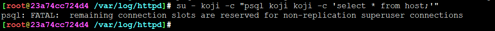


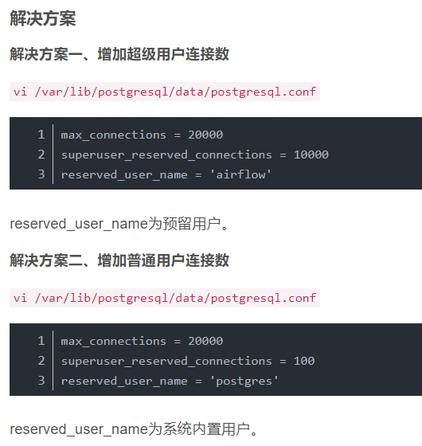

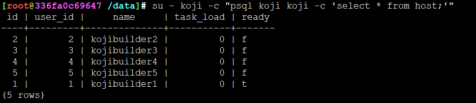


## 配置外部访问5432

监听地址改为*

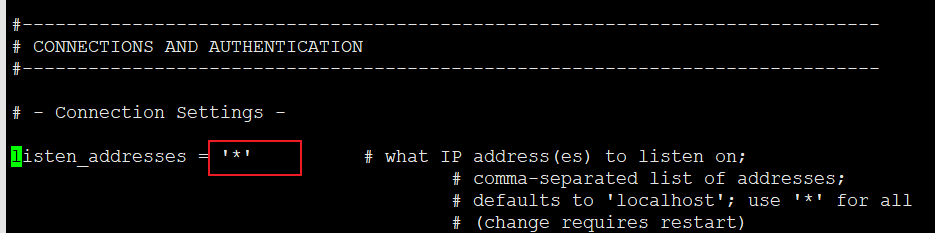

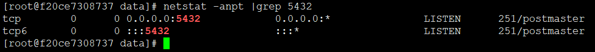

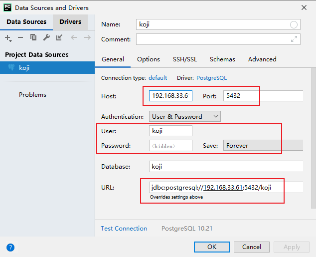

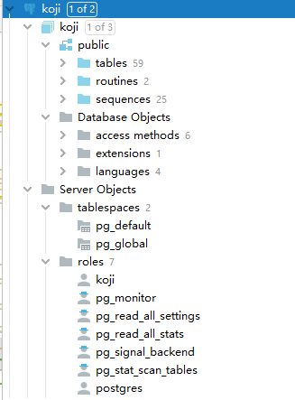

## navicat访问postgresql


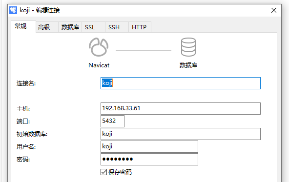

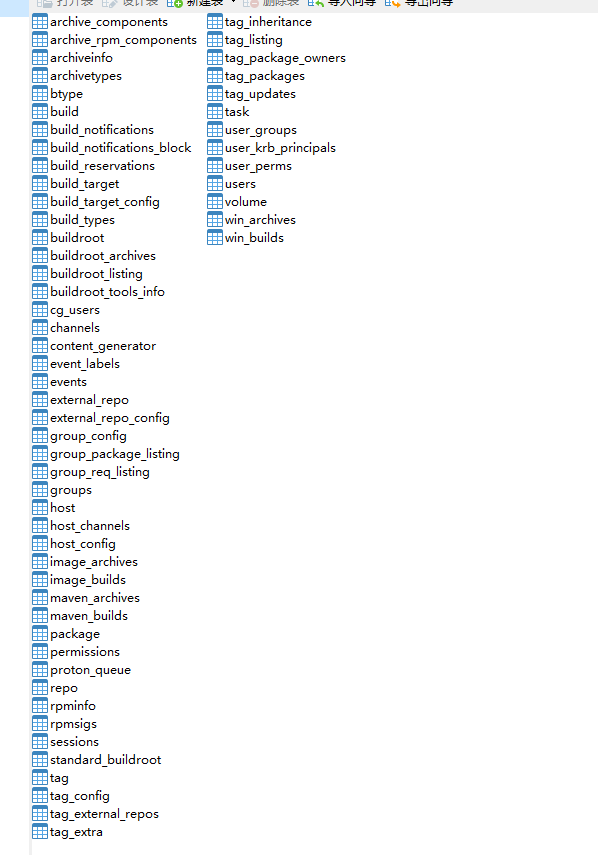

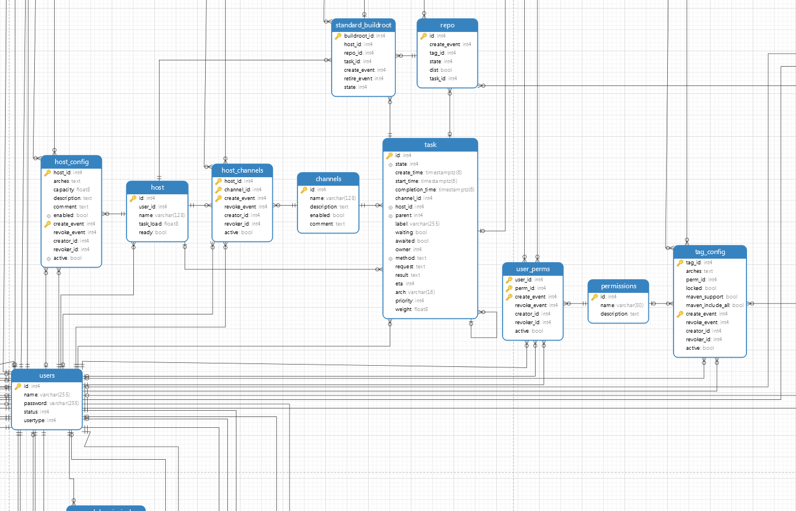

 


---
